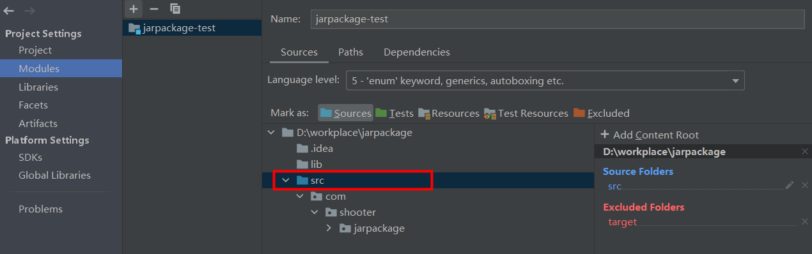
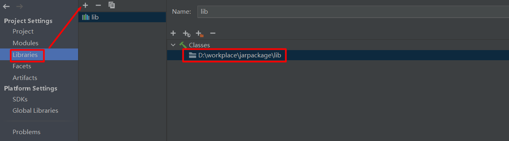
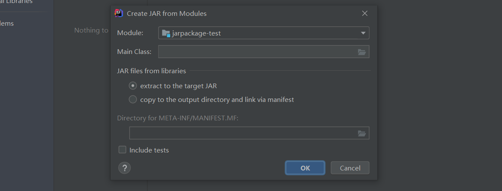
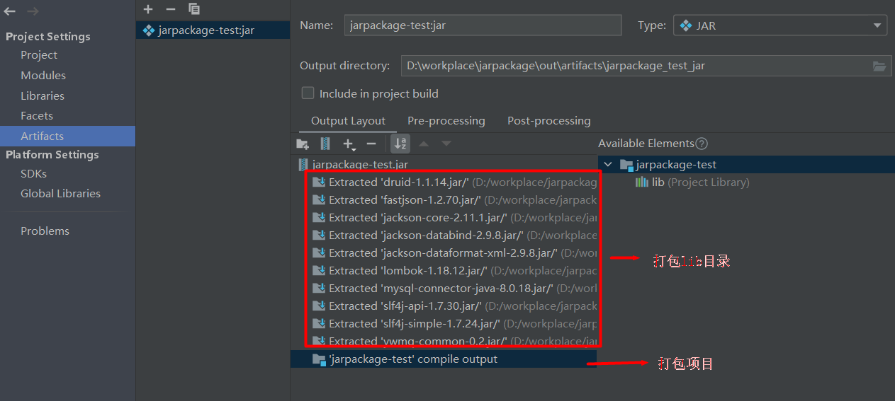
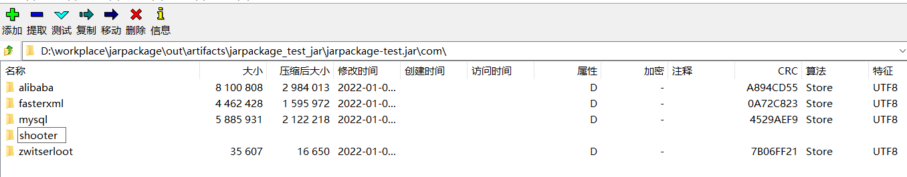
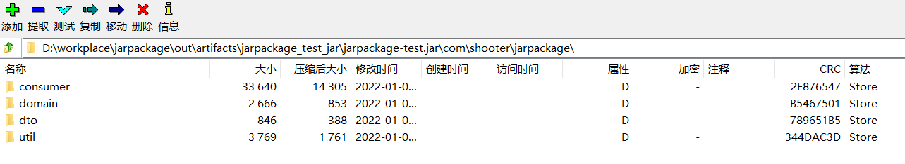

# 在jar包中打包lib目录

​	　若需要将**第三方jar包**打到**自己开发的jar包**中，需要配置`Project Structure`中的`Artifacts`打包目录才可以实现。

## Project Structure

​	　首先，打开`Project Structure`，在`Modules`中标记`Sources`、`Resources`等目录，然后，点击`apply`按钮保存更改。

​	　接着，在`Libraries`中配置`lib`的位置。

​	　然后，在`Artifacts`中选择`JAR` ->  `From modules with dependencies`。

​	　此处，需要配置项目的`Main class`，若没有，直接点击`OK`按钮。

​	　最后，即可看到项目的打包结构已经配置完毕了。若缺少打包`lib`目录，请检查`Libraries`中`lib`是否未配置；若缺少`compile output`，请检查`Modules`中目录是否已标记。

## 测试打包

​	　在`Build -> Build Artifacts` 中，选择Rebuild，即可完成构建。构建效果如下：

（1）lib中的jar包已经正确被打包

（2）项目也可以正确被打包了

