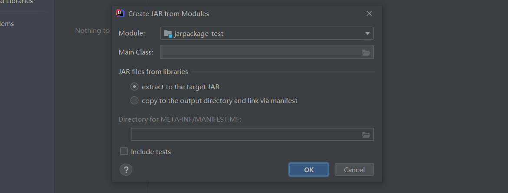

## 在jar包中打包lib目录

###  配置Jar项目

​	　首先，打开 `Project Structure` ，在 `Modules` 中标记 `Sources` 、 `Resources` 等目录，然后，在 `Libraries` 中配置 `lib目录` 的位置。

​	　接着，在 `Artifacts` 中选择 `JAR -> From modules with dependencies` ，并配置项目的 `Main class`类 ，若没有，直接点击 OK 按钮。

​	　至此，即可看到项目的打包结构已经配置完毕了。若缺少打包 `lib 目录`，请检查 `Libraries` 中 `lib目录` 是否未配置；若缺少 `compile output` ，请检查 Modules 中目录是否已标记。

### 测试打包 

​	　在 `Build -> Build Artifacts` 中，选择`Rebuild`，即可完成构建。构建效果如下： 

