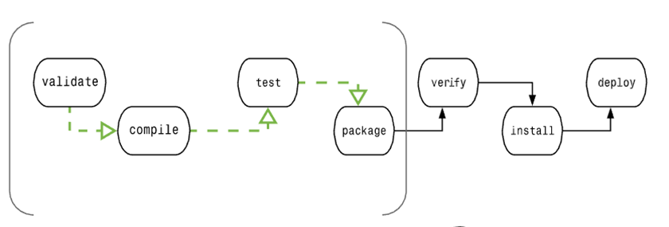

# Maven

​	　 Maven由Apache公司采用Java语言编写，是一个**项目管理和综合工具**，提供了可以构建一个完整的**生命周期**框架。Maven 使用**标准的目录结构**和**默认构建生命周期**，**简化**和**标准化**项目**自动构建过程**，增加`可重用性`并负责建立相关的任务，使编译、分配、文档、团队协作和其他任务可以无缝连接。


## 快速开始

::: warning 环境准备
确保JDK 为1.8 及以上版本，并已设置JAVA_HOME 环境变量
:::

​	　 首先在[maven官网](https://maven.apache.org/download.cgi)下载 Maven 的 `zip` 文件，然后解压到安装目录后，在`config/settings.xml`配置文件中修改`localRepository`元素值(可选)，来自定义Maven本地仓库路径。

```xml
 <localRepository>F:/Reference/mave/Respository</localRepository>
```

​	　 接着，找到`mirrors`元素， 在它里面添加子元素`mirror`，设置Maven镜像为阿里云镜像，从而加快从中央仓库下载`Jar`包的速率。

```xml
<!-- 阿里云中央仓库 -->
<mirror>
    <id>nexus-aliyun</id>
    <mirrorOf>central</mirrorOf>
    <name>Nexus aliyun</name>
    <url>http://maven.aliyun.com/nexus/content/groups/public</url>
</mirror>
```

​	　 最后，在环境变量中新增`MAVEN_HOME`值为Maven安装路径（如：E:\Server\apache-maven-3.5.3），然后**追加**`%MAVEN_HOME%\bin`到`path`中即可。配置完成后，可以在cmd中运行`mvn -version`命令验证是否已经安装成功。

```
C:\Users\User>mvn -version
Apache Maven 3.5.3 (3383c37e1f9eff9f295297; 2018-02-25T03:49:05+08:00)
Maven home: E:\Server\apache-maven-3.5.3\bin\..
Java version: 1.8.0_161, vendor: Oracle Corporation
Java home: E:\JDK\JDK8\jre
Default locale: zh_CN, platform encoding: GBK
OS name: "windows 10", version: "10.0", arch: "amd64", family: "windows"
```


## Maven语法

### POM对象

​	　POM（**项目对象模型**）位于**项目的基本目录**中，是 Maven 工作的**基本单位**。每个项目只有**一个** POM 文件，POM以`XML`方式配置`Jar`包、插件等的坐标信息。

（1）POM主要节点

​	　POM的根元素[`project`]，由`groupId`**，**`artifactId`和`version`三个主要节点（必填）组成，这三个属性是项目仓库的唯一标识，项目在仓库中的项目符号由`groupId:artifactId:version`表示。 

- groupId：由`公司域名反转.项目组名称` 组成，全球唯一
- artifactId：表示唯一的项目名称
- version：表示项目版本号，用于将不同的版本彼此分离

```xml
<!--pom.xml 基本构成-->
<project xmlns="http://maven.apache.org/POM/4.0.0"
   xmlns:xsi="http://www.w3.org/2001/XMLSchema-instance"
   xsi:schemaLocation="http://maven.apache.org/POM/4.0.0
   http://maven.apache.org/xsd/maven-4.0.0.xsd">
   
   <modelVersion>4.0.0</modelVersion>
   <groupId>com.company.group</groupId>
   <artifactId>test</artifactId>
   <version>1.0.0</version>
  
<project>
```


（2）POM其他节点

​	　此外，POM的根元素是[**project**]下还有`packaging`（打包格式）、`name`（表示项目名称）、`description`（项目描述信息）、`dependencies`（项目依赖配置）和`properties` (自定义属性)等节点信息。

```xml
<packaging>war</packaging>
<name>transport</name>
<description>运输系统</description>
```

​	　　`dependencies`节点是项目依赖配置，整个项目生命周期中所需的依赖都在这里配置。`dependency`中`jar`包坐标由`groupId`、`artifactId`、`version`组成，如下所示：

```xml
<dependencies>
    <dependency>
        <groupId>de.codecentric</groupId>
        <artifactId>spring-boot-admin-starter-client</artifactId>
        <version>${spring-boot.version}</version>
    </dependency>
</dependencies>
```

​	　`properties` 节点可以配置**自定义属性**，通过`${spring-boot.version}`可以在version中灵活的指定各个关联jar包的版本。

```xml
<properties>
    <project.build.sourceEncoding>utf-8</project.build.sourceEncoding>
    <jdk.version>1.8</jdk.version>
    <spring-boot.version>1.8</spring-boot.version>
</properties>
```


（3）语义化版本规范

​	　Java版本号常使用**语义化版本规范**或者**逢十进一**的方式，建议使用语义化版本规范。如初始版本号为`1.0.0` ，接下来版本命名方式如下：

```text
1.0.1 在第一个版本上修复BUG
1.1.0 在第一个版本上新增功能
2.0.0 结构发生变更
```


### Maven快照

​	　若`pom.xml`中设置项目版本是 `data-service:1.0`，Maven是永远不会尝试下载已经更新的版本 `1.1 `的，要下载最新更新的代码，`data-service` 的版本**必须要升级到 1.1**。这样需要数据服务团在发布更新时每次都要告诉应用程序 UI 团队，请UI 团队更新一下 `pom.xml` 以获得更新应用的版本。为了处理这类情况，引入快照的概念。

​	　Maven版本与发行版和快照版两种。 **发行版**是**稳定的版本**，类和方法在命名、参数列表、功能上不会发生变更。**快照（SNAPSHOT）**是一个**特殊版本**，指出**目前开发拷贝**，快照不同于常规版本，Maven会在数据服务团队发布代码后更新快照存储库，使用新生成的快照来替换旧的快照，在UI 团队使用快照时 **自动获取最新的快照版本**。

```text
# 发行版
1.0.0-RELEASE
# 快照版(SNAPSHOT指代最新的快照版本号)
1.0.1-SNAPSHOT  -> 编译后动态生成后缀 1.0.1-20190310676786867
```


### Maven仓库

​	　 Maven在**依赖机制**的帮助下会根据`pom.xml` 文件中的`坐标信息`，在`maven仓库`中自动下载、更新所有必需的依赖库，并保持版本升级。

​	　 Maven 的本地仓库是用来存储所有项目的依赖关系(插件 Jar 和其他文件)， Maven首先从**本地Maven仓库**获取依赖，如果没有找到，会从[Maven中央存储库](http://repo1.maven.org/maven2/) 查找下载到本地仓库中。此外，如果在 `pom.xml` 中定义了远程仓库，最后还会在 **Maven 远程仓库**搜索。

::: tip 提示
可以使用 [MVNrepository](https://mvnrepository.com/) 查询Maven中央仓库中包含的依赖
:::

​	　特别的，需要定期清理Maven本地仓库中的`.last`后缀的文件 和 `unknow`文件夹，这些都是更新失败的缓存，会导致无法再从Maven中央仓库中获取最新的依赖。


### Maven命令

​	　Maven 是一个**执行插件**的框架，每一个任务实际上是由插件完成的。Maven插件分为 **构建插件** 和 **报告插件** 两种类型插件，构建插件是在**生成过程中执行**，报告插件在**网站生成期间执行**。Maven插件首先需要在 `pom.xml` 中的 元素进行配置，才能使用。

```shell
# 语法格式
mvn [plugin-name]:[goal-name]

# 详细命令
mvn clean：调用maven-clean-plugin，删除根目录下target目录
mvn compile：调用maven-compile-plugin编译源码到target目录下
mvn compiler:compile ：编译目标
mvn test：执行src/test/java目录下类名为*Test.java的单元测试类
mvn package：打包根目录下的目录，web project打成war包，java project打成jar包
mvn install：打包到本地仓库，解决本地多个项目公用一个jar包的问题
mvn package -Dmaven.test.skip=true：只打包不测试（跳过测试）
mvn source:jar：源码打包
mvn source:jar-no-fork：源码打包
mvn tomcat:run	通过maven命令将web项目发布到Tomcat
```


### Maven生命周期

​	　 Maven有三类生命周期：用于生成描述项目`javadoc`文档的`siteLifeCycle`（站点生命周期）、用于构建项目应用的`defaultLifeCycle`（默认生命周期)、用于项目清理的`cleanLifeCycle`（清理生命周期）

​	　 这三类生命周期间相互独立、互不影响，在一类生命周期之内，执行后面的命令，前面的操作也会自动执行。特别的，`defaultLifeCycle`生命周期由以下几个阶段组成：



