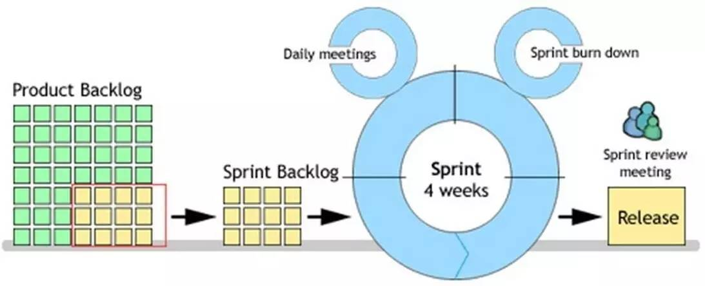
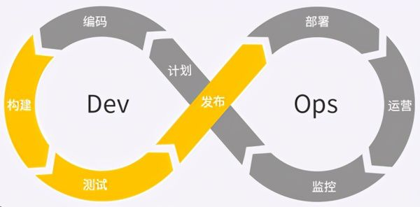

# 互联网全栈工程师

​	　互联网全栈工程师指可以独立完成产品的需求分析、开发、运营的软件工程师，需要掌握云计算、微服务、前后端分离、大数据、人工智能和区块链等必不可少的技术。

## 课程安排

### 走进单体地狱

​	　本阶段课程对应千锋 Java 的第三阶段的学习内容，经过本轮学习，我们会掌握 Intellij IDEA、Maven、Bootstrap、Spring、Spring MVC、MyBatis、HttpClient 等工具与框架的使用，并开始引入架构的概念，为“微服务架构”阶段打下坚实的基础。

### 微服务架构

​	　互联网开发真正需要的技术，也是我们高薪就业的保证，经过本轮学习，我们会掌握从底层 Linux 的安装到最终 DevOps 的所需技能。包括但不限于 Spring Boot、Spring Cloud、Spring Cloud Alibaba、Dubbo、Zookeeper、Redis、ELK、RabbitMQ、Ubuntu、Docker、Kubernetes、Jenkins 等全栈技能。

### 走进价值互联网

​	　当下我们尚处在 “信息互联网” 时代，区块链技术的不断发展壮大为我们带来了 “价值互联网” 时代的新理念。为了不被时代淘汰，为了能够顺利进入 “价值互联网”、“工业革命 4.0” 时代，区块链的学习势在必行。课程整理中，敬请期待···


## 如何学习编程

### 编程到底学什么

**1、站在更高的角度思考问题**

​	　尽量站在老板的角度（**全局角度**）思考问题，不要站在员工的角度思考问题，需要从`决策层` -> `管理层` -> `执行层` 分析问题。

> 不要总是埋头种地，也要抬头看天；人只能接受教训，不能接受经验


**2、企业的本质**

​	　企业的本质是先**满足用户的需求**，最后才能产生盈利。用户需求并不是用户的主诉需求，通过市场调研很难获取正确的需求，需要自己体会市场**深挖需求**，然后根据市场反馈意见优化产品。


**3、一个思想两个能力**

① 批判性思维（编程思想）

​	　批判性思维是一种思维习惯，是“对思考的思考”。21天可以养成一个行为习惯，三个月可以养成一个身体习惯，但是思维习惯是需要长期坚持才能养成的。

② 自主学习能力 + 独立解决问题的能力

​	　不能总是使用相同的行为期望得到不同的结果，需要根据市场需要，选择性升级自己的技术栈，投入新技术的学习中。


**4、XP极限编程**

​	　由于自身知识面受限，会遇到很多的不清楚的知识点时，无需过多阻塞，只需一直学习下去，后面的知识很可能就能解释当前的问题。


### 技术选型要求

1、搜索量，指数 （百度指数）<br/>
2、社区活跃度，需要文档完备性<br/>
3、是否开源<br/>
4、可以**参考国外网站TOP10** 或者 **论文** 获取项目<br/>


### 软件开发思想

**1、面向对象编程**

​	　面向对象编程有**封装**、**继承**、**多态**三种思想。

- 封装：将对象的`属性`和`行为`抽象出来包装到类中
- 继承：将具有**相同属性和行为**的对象**抽象**出来并包装到一个父类中
- 多态：相同的属性和行为具有**不同的表现方式**

**2、面向接口开发**

​	　接口是为了处理各个对象之间的协作关系，是系统设计的关键组成部分，主要作用是为了将**定义**和**实现**分离，从而实现**解耦**的目的。在系统设计之初，我们需要为抽象类建立行为模型。

**说明：`get`与`post`的区别：**

① 语义区别 ， `GET`只用于获取数据  `POST`只用于提交数据

② `POST`方法请求服务器会请求两次，第一次询问服务器能否传输数据，第二次才会传输数据，而`GET`方法只请求一次。

③ `HTTP GET` 方法用于获取资源，具有**幂等性**，不管调用多少次接口，结果不会改变。

**3、面向对象设计原则**

- 开：面向扩展开发、面向修改关闭
- 口：接口隔离原则
- 合：组合/聚合原则
- 里：里氏替换原则
- 最：最少知识原则（迪米特法则）
- 单：单一职责原则
- 依：依赖倒置原则

> 补充：重构原则：事不过三，三则重构

**4、产品创新思维**

- 看山是山：学会借用，看的是山的现象
- 看山不是山：学会遗忘，看的是山背后道理的本质
- 看山还是山：学会学习，看的是现象和本质的统一，是融会贯通


## 敏捷开发

​	　敏捷开发（Agile）是一种以人为核心、迭代、循序渐进的开发方法。在敏捷开发中，软件项目的构建被切分成多个子项目，**各个子项目的成果都经过测试，具备集成和可运行的特征**。

​	　敏捷开发并不追求前期完美的设计、完美编码，而是力求在**很短的周期内开发出产品的核心功能**，尽早发布出可用的版本。然后在后续的生产周期内，按照新需求不断迭代升级，完善产品。

​	　敏捷开发的实现主要包括 `SCRUM`、`XP`（极限编程）、Crystal Methods、FDD（特性驱动开发）等。其中 SCRUM 与 XP 最为流行。


### SCRUM

​	　SCRUM 是一种开发流程框架，SCRUM 框架中包含三个角色，三个工件，四个会议，听起来很复杂，其目的是为了**有效地完成每一次迭代周期的工作**。

​	　在项目启动之前，会由团队的产品负责人（Product owner）按照需求优先级来明确出一份项目的整体需求`Product Backlog`（ 项目的整体需求），为项目做出整体排期。

​	　随后在每一个小的迭代周期里，团队会根据计划（Sprint Plan Meeting）确定本周期的`Sprint Backlog`（需求列表），再细化成一个个`Task`（ 具体开发任务），分配给团队成员，进行具体开发工作。每一天团队成员都会进行 `Daily meeting` （监控项目进度），根据情况更新自己的 Task 状态，整个团队更新 `Sprint burn down chart`（冲刺燃尽图），记录当前周期的需求完成情况。

​	　当这一周期的 `Sprint backlog`（冲刺周期内的需求） 全部完成，团队会进行 `Spring review meeting`（冲刺评审会议），让团队成员们演示成果。一切顺利的话，会发布出这一版本的 `Release`（新的可用版本），并且进行 Sprint 回顾会议（Sprint Retrospective Meeting）。



### XP 极限编程

​	　XP 由价值观、原则、实践和行为四个部分组成，它们彼此相互依赖、关联， 并通过行为贯穿于整个生命期。XP四大价值观是沟通（Communication）、简单（Simplicity）、反馈（Feedback）、勇气（Courage）以及谦逊（Modesty）。五个原则是快速反馈、简单性假设、逐步修改、提倡更改、优质工作。

​	　XP 极限编程的最佳实践有，**客户负责业务决策，开发团队负责技术决策**；秉承**持续集成，小步快走**的哲学；侧重于**实践**，使用**测试先行** 或者 **结对编程**保证代码质量；强调**简单设计**、**够用就好**的价值观，使用**单一职责原则**、**最少知识原则**设计模式开发，使得代码保持**良好的可扩展性**以及**重构**的可能。


### DevOps

​	　DevOps 是 `Development` 和 `Operations` 的合成词，其目标是要**加强开发人员、测试人员、运维人员之间的沟通协调**。Docker 容器为 DevOps 提供了**统一的运行环境**，真正实现了**一次构建，到处运行**的部署方式；`Jenkins`、`GitLab Runner`提供了**持续集成与部署**的解决方案。

​	　**持续集成**（`Continuous integration`，简称 `CI`）是指频繁地（一天多次）将代码集成到主干；**持续交付**（`Continuous delivery`，简称 `CD`）是指是，频繁地将软件的新版本，交付给质量团队或者用户以供评审，如果评审通过，代码就进入生产阶段。




## 开发技术栈

### 效率栈

```
-- 开发环境
----硬件平台：Ubuntu、Linux、阿里云
----脚本：shell
----容器化引擎：Docker
----虚拟机：VMware
----IDE&开发工具：Intellij IDEA

-- 敏捷开发工具
----协同工具：Git
----持续集成：GitLab、Jenkins
----敏捷流程：JIRA、禅道、Redmine
----质量工具：Robot Framework

-- 业务与代码
----知识管理：MarkDown
----代码规范：阿里谷歌代码规范
----意图导向：Visio、亿图图标
----单元测试：Junit4
```


### 技能栈

```
-- 框架与库
----Java开发：Spring Boot + Spring Cloud
----对象关系映射：Mybatis、Hibernate
----权限管理：Shiro
----各种库：POI、HTTP Client、Jackson
----依赖管理：Maven、Gradle
----配置语言：YAML、JSON

-- 微服务
----服务治理：Spring CLoud、Dubbo
----服务注册与发现/分布式协调技术：Euraka、Zookeeper
----云计算服务：Iaas、Pass、Sass、Bass
----消息队列：ZeroMq、RabbitMQ、Kafka

-- Web开发
----UI/UE: HTML5、CSS3、JavaScript
----前端框架：BootStrap、Vue、React
----网络协议：HTTP、Socket、WebSocket
----内容分发网络：CDN
----反向代理：Nginx

-- 数据存储
----关系型数据库：MySQL
----NoSQL: Redis
----数据库连接池：Druid
----数据库缓存：Redis
----应用级缓存：EhCache
----日志分析：ELK
----搜索引擎：ElasticSearch、Solr
----文件存储：FastDFS（内部）、OSS(外部，阿里云)
```

