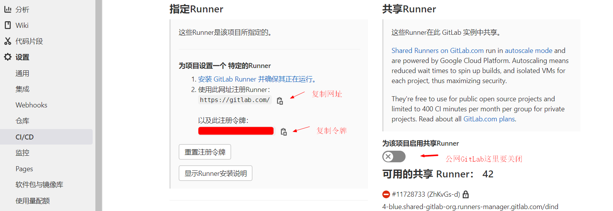
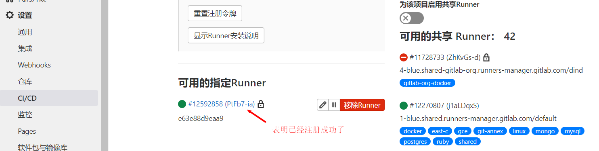
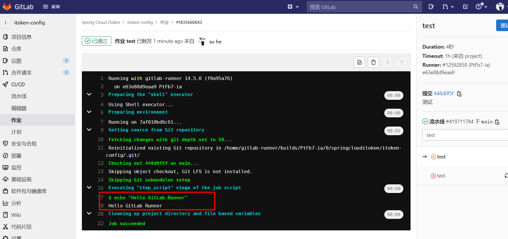

# CI/CD

​	　**持续集成**（`Continuous integration`，简称 `CI`）是指频繁地（一天多次）将代码集成到主干。开发人员提交了新代码之后，**自动进行构建、（单元）测试**，这样可以**快速发现错误**，并**防止分支大幅偏离主干**。`GitLab Runner`提供了持续集成的解决方案（开发使用）。

​	　**持续交付**（`Continuous delivery`，简称 `CD`）是指是频繁地将软件的新版本，自动部署到**预生产环境**，交付给质量团队或者用户以供评审，如果评审通过，代码就进入生产阶段。持续交付可以看作持续集成的下一步，强调代码不管怎么更新，**软件是随时可以交付的**。

​	　**持续部署**（Continuous deployment）是指代码通过评审以后，自动部署到**生产环境**。持续部署可以看作持续交付的下一步，强调代码**随时都可部署到生产环境**的。持续部署的前提是能**自动化完成测试、构建、部署**等步骤。`Jenkins`提供了持续交付与部署的解决方案（运维使用）。

<div align="center">
    
</div>


**参考资料：**

- <a href="../project/itoken-springcloudnetflix.html#v1-0-服务远程部署" target="_blank">手动部署服务到远程</a>


## 简介

​	　DevOps 是 `Development` 和 `Operations` 的合成词，其目标是要**加强开发人员、测试人员、运维人员之间的沟通协调**。Docker 容器为 DevOps 提供了**统一的运行环境**，真正实现了**一次构建，到处运行**的部署方式。

<div align="center">
    
</div>


### 敏捷开发论

​	　敏捷开发（Agile）是一种以人为核心、迭代、循序渐进的开发方法。在敏捷开发中，软件项目的构建被切分成多个子项目，**各个子项目的成果都经过测试，具备集成和可运行的特征**。

​	　敏捷开发并不追求前期完美的设计、完美编码，而是力求在**很短的周期内开发出产品的核心功能**，尽早发布出可用的版本。然后在后续的生产周期内，按照新需求不断迭代升级，完善产品。

​	　敏捷开发的实现主要包括 `SCRUM`、`XP`（极限编程）、Crystal Methods、FDD（特性驱动开发）等。其中 SCRUM 与 XP 最为流行。


（1）SCRUM

​	　SCRUM 是一种开发流程框架，SCRUM 框架中包含三个角色，三个工件，四个会议，听起来很复杂，其目的是为了**有效地完成每一次迭代周期的工作**。

​	　在项目启动之前，会由团队的产品负责人（Product owner）按照需求优先级来明确出一份项目的整体需求`Product Backlog`（ 项目的整体需求），为项目做出整体排期。

​	　随后在每一个小的迭代周期里，团队会根据计划（Sprint Plan Meeting）确定本周期的`Sprint Backlog`（需求列表），再细化成一个个`Task`（ 具体开发任务），分配给团队成员，进行具体开发工作。每一天团队成员都会进行 `Daily meeting` （监控项目进度），根据情况更新自己的 Task 状态，整个团队更新 `Sprint burn down chart`（冲刺燃尽图），记录当前周期的需求完成情况。

​	　当这一周期的 `Sprint backlog`（冲刺周期内的需求） 全部完成，团队会进行 `Spring review meeting`（冲刺评审会议），让团队成员们演示成果。一切顺利的话，会发布出这一版本的 `Release`（新的可用版本），并且进行 Sprint 回顾会议（Sprint Retrospective Meeting）。


（2）XP 极限编程

​	　XP 由价值观、原则、实践和行为四个部分组成，它们彼此相互依赖、关联， 并通过行为贯穿于整个生命期。XP四大价值观是沟通、简单、反馈、勇气以及谦逊。五个原则是**快速反馈**、**简单性假设**、**逐步修改**、**提倡更改**、**优质工作**。

​	　XP 极限编程的最佳实践有，**客户负责业务决策，开发团队负责技术决策**；秉承**持续集成，小步快走**的哲学；侧重于**实践**，使用**测试先行** 或者 **结对编程**保证代码质量；强调**简单设计**、**够用就好**的价值观，使用**单一职责原则**、**最少知识原则**设计模式开发，使得代码保持**良好的可扩展性**以及**重构**的可能。

<div align="center">
    
</div>


### CI/CD流程

​	　根据持续集成的设计，代码从提交到生产，有代码**提交**、**第一轮测试**、**构建**、**第二轮测试**、**部署**、**回滚**等阶段。


​	　开发者向代码仓库**提交**代码；代码仓库对 commit 操作配置了钩子（hook），只要提交代码或者合并进主干（develop），就会进行**第一轮测试**（单元测试）。

​	　通过第一轮测试，代码就可以合并进主干（release）进行交付。首先，对主干进行**构建**（build），如安装依赖、配置各种资源（样式表、JS脚本、图片）等；构建完成后，即可进行**第二轮全面测试**（单元测试+集成测试+端对端测试）。`Jenkins`可以将构建和测试在一次运行中执行完成。

​	　通过了第二轮测试，当前代码（master）就是一个可以直接**部署**的版本（artifact）。将这个版本的所有文件打包存档，发送到生产服务器。生产服务器将打包文件，解包成本地的一个目录，再将运行路径的符号链接（symlink）指向这个目录，然后重新启动应用。

​	　一旦当前版本发生问题，就要**回滚**到上一个版本的构建结果。可以通过`Dokcer`或者`ln软连接指向上一个版本的目录`，实现妙级回滚。

​	　特别的，所有测试都以自动化为主，新版本的每一个更新点都必须测试到。少数无法自动化的测试用例，就要人工跑；如果测试的覆盖率不高，进入后面的部署阶段后，很可能会出现严重的问题。


## GitLab CI

​	　`GitLab CI` 用于管理各个项目的构建状态；`GitLab Runner`用于执行持续构建，可以安装到不同的机器上，使得构建任务运行期间并不会影响到 GitLab 的性能。


### GitLab Runnber

​	　使用Docker安装`GitLab Runnber`。首先，按照如下结构新建文件及目录。

```shell
--/usr/local/docker
---- runner                           # 工作目录
------ environment                    # 构建目录
--------- Dockerfile                  # 定制GitLab Runnber镜像
--------- daemon.json                 # 配置加速器和仓库地址
--------- jdk-8u311-linux-x64.tar.gz  # 搭建Java部署环境
--------- apache-maven-3.5.3-bin.tar  # 搭建Java部署环境
--------- settings.xml                # maven配置文件,若有私服必须配置
------ docker-compose.yml             # 定制Runnber镜像启动脚本
```


（1）Dockerfile

​	　`GitLab Runnber`是为所有项目提供持续集成服务的，所有，我们需要以`gitlab-runner`为基础，定制可以构建Java项目的`Runnber`镜像。

```dockerfile
# gitlab-runner的版本要和GitLab的版本一致
FROM gitlab/gitlab-runner

# 安装 Docker
RUN curl -sSL https://get.daocloud.io/docker | sh
COPY daemon.json /etc/docker/daemon.json

# 安装 Docker Compose
WORKDIR /usr/local/bin
RUN curl -L https://get.daocloud.io/docker/compose/releases/download/v2.1.1/docker-compose-`uname -s`-`uname -m` > /usr/local/bin/docker-compose
RUN chmod +x docker-compose

# 安装 Java
RUN mkdir -p /usr/local/java
WORKDIR /usr/local/java
COPY jdk-8u311-linux-x64.tar.gz /usr/local/java
RUN tar -zxvf jdk-8u311-linux-x64.tar.gz && \
    rm -fr jdk-8u311-linux-x64.tar.gz

# 安装 Maven
RUN mkdir -p /usr/local/maven
WORKDIR /usr/local/maven
COPY apache-maven-3.5.3-bin.tar.gz /usr/local/maven
RUN tar -zxvf apache-maven-3.5.3-bin.tar.gz && \
    rm -fr apache-maven-3.5.3-bin.tar.gz
COPY settings.xml /usr/local/maven/apache-maven-3.5.3/conf/settings.xml

# 配置环境变量
ENV JAVA_HOME /usr/local/java/jdk1.8.0_311
ENV MAVEN_HOME /usr/local/maven/apache-maven-3.5.3
ENV PATH $PATH:$JAVA_HOME/bin:$MAVEN_HOME/bin

WORKDIR /
```


（2） daemon.json

​	　Docker仓库的地址`insecure-registries`，请按真实情况配置。

```json
{
  "registry-mirrors": [
    "https://registry.docker-cn.com"
  ],
  "insecure-registries": [
    "192.168.75.131:5000"
  ]
}
```


（3）docker-compose.yml

```yaml
version: '3.1'
services:
  gitlab-runner:
    build: environment
    restart: always
    container_name: gitlab-runner
    # 以真正root管理员的角色操作容器
    privileged: true
    volumes:
      - /usr/local/docker/runner/config:/etc/gitlab-runner
      - /var/run/docker.sock:/var/run/docker.sock
```

​	　最后，运行`docker-compose up -d` 安装GitLab Runner。


### 注册Runner

​	　首先， 以交互的方式进入`gitlab-runner`，并执行`gitlab-runner`命令进行注册，`register`是命令参数。

```shell
docker exec -it gitlab-runner gitlab-runner register
```

​	　然后，在GitLab中，在`设置` -> `CI/CD`  中，查看Runner的注册`网站`和`令牌`信息。特别的，若采用的是公网GitLab，这里共享Runner是需要关闭的，否则会和刚才自己安装Runner的引起冲突的。



​	　在`shell`中依次输入`网站`和`令牌`，并设定触发CI的事件。

```shell{3,7,11,15,19}
# 输入 GitLab 地址
Please enter the gitlab-ci coordinator URL (e.g. https://gitlab.com/):
https://gitlab.com/

# 输入 GitLab Token
Please enter the gitlab-ci token for this runner:
令牌

# 输入 Runner 的说明
Please enter the gitlab-ci description for this runner:
可以为空

# 设置 Tag，可以用于指定在构建规定的 tag 时触发 ci
Please enter the gitlab-ci tags for this runner (comma separated):
可以为空  # 表示只要提交代码就触发 ci
# deploy  # 只有标记deploy才会触发 ci

# 选择 runner 执行器，这里我们选择的是 shell
Please enter the executor: virtualbox, docker+machine, parallels, shell, ssh, docker-ssh+machine, kubernetes, docker, docker-ssh:
shell
```

​	　刷新页面，可以看到Runner已经注册完成了。运行`cat config/config.toml`命令即可查看刚才注册信息。




### 流水线脚本

​	　一个`.gitlab-ci.yml`就代表一个流水线。首先，在项目根目录下新建`.gitlab-ci.yml`配置文件，并编写如下测试用例。

```yaml
stages:
  - test

# 运行测试用例
test:
  stage: test
  script:
    - echo "Hello GitLab Runner"
```

​	　将测试脚本提交到GitLab，稍等片刻，即可查看运行结果。每次触发`CI`的时候，`GitLab Runner`都会拉取最新代码到项目部署目录下。




::: details gitlab-ci模板脚本

```yaml
stages:
  - install_deps
  - test
  - build
  - deploy_test
  - deploy_production

cache:
  key: ${CI_BUILD_REF_NAME}
  paths:
    - node_modules/
    - dist/

# 安装依赖
install_deps:
  stage: install_deps
  only:
    - develop
    - master
  script:
    - npm install

# 运行测试用例
test:
  stage: test
  only:
    - develop
    - master
  script:
    - npm run test

# 编译
build:
  stage: build
  only:
    - develop
    - master
  script:
    - npm run clean
    - npm run build:client
    - npm run build:server

# 部署测试服务器
deploy_test:
  stage: deploy_test
  only:
    - develop
  script:
    - pm2 delete app || true
    - pm2 start app.js --name app

# 部署生产服务器
deploy_production:
  stage: deploy_production
  only:
    - master
  script:
    - bash scripts/deploy/deploy.sh
```

::: 


## Runnber实践

​	　`GitLab CI`部署目录文件结构如下。

```shell
--Project
---- docker                    # 部署目录
-------- Dockerfile            # 定制项目镜像
---------docker-compose.yml    # 启动项目
-----.gitlab-ci.yml            # 流水线脚本
```


### .gitlab-ci.yml

```yaml
stages:
  - build
  - push
  - run
  - clean

# 构建镜像
build:
  stage: build
  script:
    - /usr/local/maven/apache-maven-3.5.3/bin/mvn clean package
    - cp target/itoken-config-1.0.0-SNAPSHOT.jar docker
    - cd docker
    - docker build -t sh086/itoken-config .

# 推送镜像
push:
  stage: push
  script:
    - docker login -u sh086 -p 密码
    - docker push sh086/itoken-config

# 运行镜像
run:
  stage: run
  script:
    - cd docker
    - docker-compose down
    - docker-compose up -d

# 清理
clean:
  stage: clean
  script:
    - docker rmi $(docker images -q -f dangling=true)
    - docker rm $(docker ps -a -q)
```


### Dockerfile

（1）不依赖其他项目

```dockerfile
FROM openjdk:8-jre

ENV APP_VERSION 1.0.0-SNAPSHOT

RUN mkdir /app
COPY itoken-config-$APP_VERSION.jar /app/app.jar
ENTRYPOINT ["java", "-Djava.security.egd=file:/dev/./urandom", "-jar", "/app/app.jar", "--spring.profiles.active=prod"]
EXPOSE 8888
```


（2）依赖其他项目

```dockerfile
FROM openjdk:8-jre

ENV APP_VERSION 1.0.0-SNAPSHOT
ENV DOCKERIZE_VERSION v0.6.1

# Dockerize会等到服务可以访问的时候才会启动后续命令
# depends_on这个只是声明启动服务的先后顺序，不能确保在服务A启动成功后，才启动服务B
RUN wget https://github.com/jwilder/dockerize/releases/download/$DOCKERIZE_VERSION/dockerize-linux-amd64-$DOCKERIZE_VERSION.tar.gz \
    && tar -C /usr/local/bin -xzvf dockerize-linux-amd64-$DOCKERIZE_VERSION.tar.gz \
    && rm dockerize-linux-amd64-$DOCKERIZE_VERSION.tar.gz

RUN mkdir /app

COPY itoken-eureka-$APP_VERSION.jar /app/app.jar

# 等192.168.75.128:8888可以访问的时候，再启动项目，最多等待5分支
ENTRYPOINT ["dockerize", "-timeout", "5m", "-wait", "tcp://192.168.75.128:8888", "java", "-Djava.security.egd=file:/dev/./urandom", "-jar", "/app/app.jar", "--spring.profiles.active=prod"]

EXPOSE 8761
```


### docker-compose.yml

```yaml
version: '3.1'
services:
  itoken-config:
    image: sh086/itoken-config
    restart: always
    container_name: itoken_config
    ports:
      - 8888:8888
    networks:
      - config_network

# 需要指定默认网络，否则
networks:
  config_network:
```


## Jenkins

### Docker安装


### Jenkins实践


## 附录

### Linux Runnber

```shell
# Ubuntu 安装脚本
curl -L https://packages.gitlab.com/install/repositories/runner/gitlab-ci-multi-runner/script.deb.sh | sudo bash
sudo apt-get update
sudo apt-get install gitlab-ci-multi-runner
```

