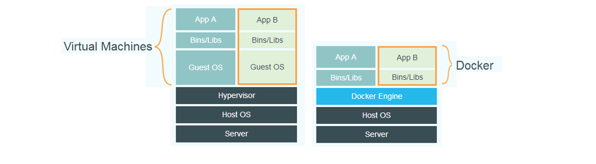
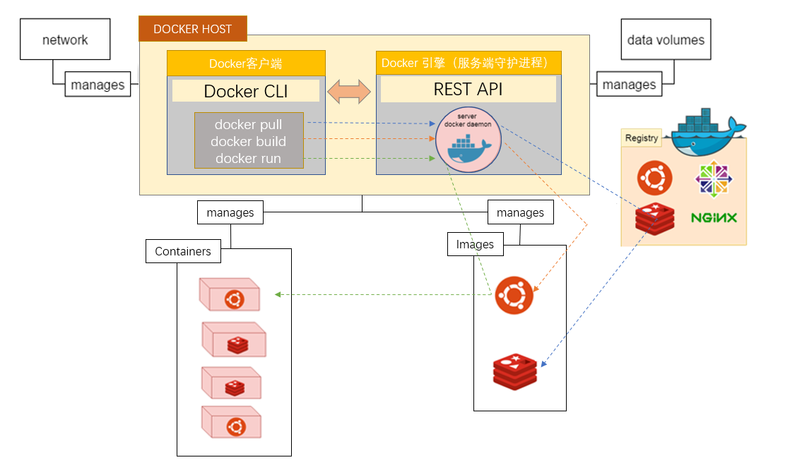

# Docker

**参考资料：**

- [Docker 官方 Ubuntu 安装文档](https://docs.docker.com/engine/installation/linux/docker-ce/ubuntu/)
- [DaoCloud镜像服务](https://www.daocloud.io/mirror#accelerator-doc)
- [Docker 极速下载](https://get.daocloud.io/)


## 简介

​	　Docker容器基于操作系统层面的虚拟化技术，对**进程进行封装隔离**，使得隔离的进程独立于宿主和其它的隔离的进程；在容器的基础上，还进行了进一步的封装，从文件系统、网络互联到进程隔离等等，极大的简化了容器的创建和维护，使得 Docker 技术比虚拟机技术更为轻便、快捷。

​	　传统虚拟机技术是虚拟出一套硬件后，在其上运行一个完整操作系统，在该系统上再运行所需应用进程；而Docker 不是虚拟机，容器就是为容器内的应用提供隔离环境的进程，容器内的应用进程直接运行于宿主的内核，容器内没有自己的内核，而且也没有进行硬件虚拟。




​	　Docker 跟传统的虚拟化方式相比，Docker容器具有**更高效的利用系统资源**、**更快速的启动时间**、**一致的运行环境**、**持续交付和部署**、**更轻松的迁移**、**更轻松的维护和扩展**。

​	　Docker 使用**客户端-服务器 (C/S)** 架构模式，**Docker 引擎（服务端守护进程）**是一个**长时间运行**并**守护进程**的客户端服务器应用程序，**Docker客户端**可以通过**命令行界面 (CLI) 工具**调用 **远程 API**  与**守护进程通讯**。客户端执行各种Docker命令都是使用的远程调用形式在服务端完成的。


## 快速开始

​	　可以执行Docker官方提供的安装脚本快速安装Docker。

```shell
# 阿里云一键安装命令
curl -fsSL https://get.docker.com | bash -s docker --mirror Aliyun
# daocloud一键安装命令
curl -sSL https://get.daocloud.io/docker | sh

# 启动Docker
service docker start
# 运行 hello-world镜像，则表明安装成功
docker run hello-world
# 查看docker版本
docker version
```

​	　只有 `root` 用户和 `docker` 组的用户才可以访问 Docker 引擎，出于安全考虑，一般 Linux 系统上不会直接使用 `root` 用户，因此，更好地做法是将需要使用 `docker` 的用户加入 `docker` 用户组。

```shell
# 建立 docker 用户组
sudo groupadd docker
# 将当前用户加入docker组
sudo usermod -aG docker $USER
```

​	　国内从 DockerHub 拉取镜像有时会遇到困难，此时可以配置镜像加速器。Docker 官方和国内很多云服务商都提供了国内加速器服务，例如：

```
- 科大镜像：https://docker.mirrors.ustc.edu.cn/
- 网易：https://hub-mirror.c.163.com/
- 阿里云：https://<你的ID>.mirror.aliyuncs.com
- Docker官方加速器：https://registry.docker-cn.com
```

（1）Ubuntu 14.04、Debian 7 Wheezy

```shell
# 类型一：Ubuntu 14.04、Debian 7 Wheezy
# 编辑 /etc/default/docker 文件
vi /etc/default/docker
# 在其中的 `DOCKER_OPTS` 中配置加速器地址
DOCKER_OPTS="--registry-mirror=https://registry.docker-cn.com"
# 重启服务
sudo service docker restart
```

（2）Ubuntu 16.04+、Debian 8+、CentOS 7

```shell
# 类型二：Ubuntu 16.04+、Debian 8+、CentOS 7
# 编辑 /etc/docker/daemon.json 文件
vi /etc/docker/daemon.json
# 在daemon.json中添加加速器
{
  "registry-mirrors": [
    "https://registry.docker-cn.com"
  ]
}
# 重启服务
sudo systemctl daemon-reload
sudo systemctl restart docker
```

​	　配置完成后，可以通过`docker info`命令查看加速器是否生效。若从结果中看到了如下内容，说明配置成功。

```yml
Registry Mirrors:
 https://registry.docker-cn.com/
```


## Docker镜像

​	　Docker镜像(Images)是一个**特殊的文件系统**，用于创建 Docker 容器的模板，除了提供容器运行时所需的程序、库、资源、配置等文件外，还包含了一些为运行时准备的一些配置参数（如匿名卷、环境变量、用户等）。在Linux内核启动后，会挂载Docker镜像为其提供用户空间支持。

​	　镜像采用**分层存储**的架构，镜像并非由一个文件组成，而是由**多层文件**系统联合组成。**镜像不包含任何动态数据，其内容在构建之后也不会被改变**。

​	　镜像构建时会一层层构建，前一层是后一层的基础，每一层构建完就不会再发生改变，后一层上的任何改变只发生在自己这一层。Docker 使用的分层存储以及镜像的技术，使得应用重复部分的**复用**更为容易、应用的**维护更新**更加简单、基于基础镜像**定制镜像**也成为可能。


### 顶层镜像

（1）拉取镜像

​	　一个 Docker仓库中可以包含多个**仓库**（Repository）；每个仓库可以包含多个**标签**（Tag）；每个标签对应一个镜像。**镜像 ID和摘要是镜像的唯一标识**，而一个镜像可以对应多个**标签**。

```shell
# 语法格式
docker pull [选项] [Docker Registry 地址[:端口号]/]仓库名[:标签]

# 从DockerHub官方拉取镜像，不需要指定IP、Port、用户名（默认用户名为library）
# 从DockerHub个人拉取、推送镜像，不需要指定IP、Port，但是要指定用户名
# 从Docker私服拉取、推送镜像，需要指定IP、Port
```

​	　Docker 镜像仓库地址的格式一般是 `<域名/IP>[:端口号]`，默认地址是 `Docker Hub`；仓库名格式是 `<用户名>/<软件名>`，对于 Docker Hub，如果不给出用户名，则默认为 `library`，也就是官方镜像。

```shell
# 查找官方仓库中的镜像
docker search ubuntu
# 拉取镜像
docker pull ubuntu:16.04  # 指定版本
docker pull ubuntu:latest # 最新版本
docker pull ubuntu # 默认，最新版本

# 运行结果
16.04: Pulling from library/ubuntu
bf5d46315322: Pull complete
9f13e0ac480c: Pull complete
e8988b5b3097: Pull complete
40af181810e7: Pull complete
e6f7c7e5c03e: Pull complete
Digest: sha256:147913621d9cdea08853f6ba9116c2e27a3ceffecf3b492983ae97c3d643fbbe
Status: Downloaded newer image for ubuntu:16.04
```

​	　镜像是**由多层存储所构成**，下载也是一层层的去下载，下载过程中给出了每一层的 ID 的前 12 位，并与该层最新的镜像ID比对，若该层镜像未发生变动，则无需再次下载，否则下载该层镜像。下载结束后，给出该镜像完整的 `sha256` 的摘要，以确保下载一致性。


（2）列出镜像

```shell
# 列出全部顶层镜像
docker image ls
# 列出全部顶层镜像
docker images
# 显示包括中间层镜像、虚悬镜像、顶层镜像在内的所有镜像
docker image ls -a
# 查询镜像摘要
docker image ls --digests

# 根据仓库名列出镜像
docker image ls ubuntu
# 指定仓库名和标签，列出特定的某个镜像
docker image ls ubuntu:16.04

# 列出 ubuntu:16.04 之后建立的镜像
docker image ls -f since=ubuntu:16.04
# 列出 ubuntu:16.04 之前建立的镜像
docker image ls -f before=ubuntu:16.04
# 如果镜像构建时，定义了 LABEL，还可以通过 LABEL 来过滤
docker image ls -f label=com.example.version=0.1
```

​	　查询出的列表包含了 `仓库名`、`标签`、`镜像 ID`、`创建时间` 以及 `所占用的空间`。

```shell
REPOSITORY         TAG              IMAGE ID           CREATED            SIZE
ubuntu             16.04            f753707788c5       4 weeks ago        127 MB
```

​	　Docker Hub 中显示的是**镜像压缩后的大小**，`docker image ls`显示的是镜像**展开后的各层所占空间的总和**，但是，镜像体积总和并非是所有镜像实际硬盘消耗，由于 Docker 镜像是多层存储结构，并且可以继承、复用，因此不同镜像可能会因为使用相同的基础镜像，从而拥有共同的层，相同的层只需要保存一份即可，因此实际镜像硬盘占用空间很可能要比这个列表镜像大小的总和要小的多。

```shell
# 查看镜像、容器、数据卷所占用的空间
docker system df

# 运行实例
TYPE                TOTAL       ACTIVE      SIZE                RECLAIMABLE
Images              11          7           2.444 GB            1.363 GB (55%)
Containers          11          5           314.5 MB            306.5 MB (97%)
Local Volumes       0           0           0 B                 0 B
```

​	　另外，还可以通过 [Go 的模板语法](https://gohugo.io/templates/go-templates/)自定义输出的表格结构。

```shell
# 只包含镜像ID
docker image ls -q
# 只包含镜像ID和仓库名
docker image ls --format "{{.ID}}: {{.Repository}}"
# 表格等距显示
docker image ls --format "table {{.ID}}\t{{.Repository}}\t{{.Tag}}
```


（3）标记镜像

```shell
# 通过tag标记已有版本号
# 语法格式
docker tag IMAGE[:TAG] [REGISTRY_HOST[:REGISTRY_PORT]/]REPOSITORY[:TAG]

# 示例
# 将镜像 ubuntu:17.10 标记为  ubuntu:latest
docker tag ubuntu:17.10 ubuntu
```


（4）删除镜像

​	　执行删除镜像命令时，由于镜像是多层存储结构，因此在删除的时候也是从上层向基础层方向依次进行判断删除。首先，需要将满足要求的所有镜像标签都删除，即`Untagged`删除行为.

​	　但一个镜像可以有多个标签，当我们删除了所指定的标签后，可能还有别的标签指向了这个镜像，**当没有任何层依赖当前层时**，就会触发`Deleted`删除行为。

​	　另外，由于容器是以镜像为基础，再加一层容器存储层，组成这样的多层存储结构去运行的，所以，该镜像是被这个容器所依赖的，即使容器未运行，也不可以删除这个镜像；应先删除容器，再删除镜像。

```shell
# 语法格式
# <镜像> 可以是 镜像短 ID、镜像长 ID、镜像名 或者 镜像摘要
docker image rm [选项] <镜像1> [<镜像2> ...]

# 使用 长 ID 删除镜像
docker image rm 501ad78535f0
# 使用 短 ID 删除镜像
docker image rm 501
# 使用镜像名<仓库名>:<标签> 删除镜像
docker image rm centos

# 删除所有仓库名为 redis 的镜像
docker image rm $(docker image ls -q redis)
# 删除所有在 mongo:3.2 之前的镜像
docker image rm $(docker image ls -q -f before=mongo:3.2)

# 删除一个镜像
docker rmi [image ID or NAMES]
# 删除所有没有容器运行的镜像
docker rmi $(docker images -q)
# 强制删除所有没有容器运行的镜像
docker rmi -r $(docker images -q)
# 删除所有虚悬镜像
docker rmi $(docker images -q -f dangling=true)
```


### 无标签镜像

（1）虚悬镜像

​	　在镜像维护或者版本更新时，都会**以原来的标签发布新版本**，由于新旧镜像同名，旧镜像名称被取消，从而出现仓库名、标签均为 `<none>` 的镜像，这类无标签镜像也被称为 **虚悬镜像** 。

```shell
# docker pull 和 docker build 操作可能会导致出现虚悬镜像

# 拉取最新的nginx，若nginx:latest有维护，还是会以原来的标签发布新版本的
# 这就导致pull操作h，原来的nginx:latest就成了虚悬镜像
docker pull nginx

# 重新构建nginx:latest,就会导致上一个nginx最新版变成虚悬镜像
docker build -t nginx .
```

​	　`docker pull`和`docker build`都有可能出现这种情况。一般来说，虚悬镜像已经失去了存在的价值，是可以随意删除的。

```bash
# 查看虚悬镜像镜像
docker image ls -f dangling=true

# 虚悬镜像列表
REPOSITORY     TAG          IMAGE ID            CREATED             SIZE
<none>         <none>       00285df0df87        5 days ago          342 MB

# 清理虚悬镜像（会有交互）
docker image prune
# 删除所有虚悬镜像
docker rmi $(docker images -q -f dangling=true)
```


（2）中间层镜像

​	　除了虚悬镜像外的无标签的镜像都是被其他镜像所依赖的**中间层镜像**，一般用于加速镜像构建、重复利用资源等。中间层镜像不应该被手动删除，否则会导致上层镜像因为依赖丢失而出错；**只要删除那些依赖它们的镜像后，这些依赖的中间层镜像也会被连带删除**。

```shell
# 显示包括所有镜像
docker image ls -a

REPOSITORY      TAG         IMAGE ID           CREATED             SIZE
<none>          <none>      40eea04b120        16 hours ago        634 MB

# 中间层镜像不建议被删除
docker image rm 440eea04b120 
Error response from daemon: conflict: unable to delete 440eea04b120 ...
```


## 定制应用镜像

​	　镜像的定制实际上就是**定制每一层所添加的配置、文件**。开发人员 可以通过`Dockerfile`定制应用镜像，运维人员可以在生产环境中快速部署该镜像，从而实现应用的持续集成、持续交付、部署。

​	　Dockerfile 是一个文本文件，其内包含了一条条的**指令(Instruction)**，每一条指令构建一层，因此每一条指令的内容，就是描述该层应当如何构建。

​	　镜像是分层存储，每一层的东西并不会在下一层被删除，会一直跟随着镜像，因此镜像构建时，要确保**每一层构建后清理掉无关文件**，以及**减少构建层数**。


### Dockerfile命令

（1）FROM指令

​	　 `FROM` 指令是用来指定基础镜像，**必须是第一条指令**。基础镜像可以是服务类的镜像、系统镜像、`scratch`空白镜像。

```dockerfile
FROM nginx
```


（2）RUN指令

​	　`RUN` 指令是用来执行`命令行`命令的，每一个 `RUN` 都是启动一个容器、执行命令、然后提交存储层文件变更。

```shell
# 语法格式
RUN <命令> # shel格式
RUN ["可执行文件", "参数1", "参数2"] # exec格式

# 示例
RUN echo '<h1>Hello, Docker!</h1>' > /usr/share/nginx/html/index.html
```

​	　特别的，**镜像构建层数是有最大层数限制的**。比如， AUFS不得超过 127 层。所以，需要对同一指令的行为需要使用 `&&` 将各个所需命令串联起来。

```dockerfile
RUN rm redis.tar.gz \
    && rm -r /usr/src/redis
```


（3）WORKDIR指令

​	　 `WORKDIR` 指令是用来指定**各层工作目录**位置，如该目录不存在，则自动新建。

```dockerfile
# 语法格式
WORKDIR <工作目录路径>
```

​	　 两行 `RUN` 命令是两个相互隔离的容器，第一层的执行仅仅是当前进程的工作目录变更，而第二层启动的是一个全新的容器，跟第一层的容器完全没关系，不会继承前一层构建过程中的内存变化。

```dockerfile
# 错误构建方式
RUN cd /app
# 构建镜像运行后，会发现找不到 /app/world.txt 文件
RUN echo "hello" > world.txt

# 正确构建方式
WORKDIR cd /app
RUN echo "hello" > world.txt
```


（4）COPY指令

​	　`COPY` 指令用来从构建**上下文目录中**，源路径的文件目录复制到新的一层的镜像内的目标路径位置。源路径可以是多个，甚至可以是通配符，其通配符规则要满足 Go 的 [filepath.Match](https://golang.org/pkg/path/filepath/#Match) 规则。使用 `COPY` 指令，源文件的各种元数据都会保留，比如读、写、执行权限、文件变更时间等。

```dockerfile
# 语法格式
COPY <源路径>... <目标路径> # shel格式
COPY ["<源路径1>",... "<目标路径>"] # 函数调用格式

# 示例
COPY package.json /usr/src/app/
COPY hom* /mydir/
COPY hom?.txt /mydir/
```


（5）ADD指令

​	　`ADD` 指令若源路径是`URL`，Docker 引擎会**自动下载链接的文件放到目标路径**，下载后的文件权限自动设置为 `600`；若源路径是压缩文件，Docker 引擎会**自动解压到目标路径**。

​	　`ADD` 指令仅适用于自动解压缩的场合，文件复制建议还是使用语义更加明确的`COPY` 指令。特别的，`ADD` 指令会令镜像构建缓存失效，从而可能会令镜像构建变得比较缓慢。

```dockerfile
# 语法格式
ADD <源路径>... <目标路径> # shel格式

# 示例
ADD ubuntu.tar.gz /
```


（6）EXPOSE指令

​	　`EXPOSE` 指令是**声明**运行时容器提供服务端口。注意，这只是一个声明，在运行时并不会因为这个声明应用就会开启这个端口的服务 （端口服务通过run运行） 或者 自动在宿主进行端口映射（端口映射通过-p或者-P实现）。

​	　EXPOSE指令首先可以帮助开发者明确镜像服务的守护端口，以方便配置映射；另外，在运行时使用随机端口映射时，会自动随机映射EXPOSE的端口。

```dockerfile
# 语法格式
EXPOSE <端口1> [<端口2>...]
```


（7）VOLUME指令

​	　数据库文件应该保存于卷(volume)中，为了防止运行时用户忘记将动态文件所保存目录挂载为卷，可以通过`VOLUME`指令**事先指定某些目录挂载为匿名卷**，这样在运行时如果用户不指定挂载，其应用也可以正常运行，不会向容器存储层写入大量数据。

```dockerfile
# 语法格式
VOLUME ["<路径1>", "<路径2>"...]
VOLUME <路径>

# 示例
VOLUME /data
```

​	　 `/data` 目录就会在运行时自动挂载为匿名卷，任何向 `/data` 中写入的信息都不会记录进容器存储层，从而保证了容器存储层的无状态化。另外，在运行时还可通过`-v`重写这个挂载设置。

```sh
# mydata目录挂载到了/data, 替代了Dockerfile中定义的匿名卷的挂载配置
docker run -d -v mydata:/data mysql
```


（8）CMD指令

​	　`CMD` 指令用于指定**容器主进程的启动命令以及参数格式**。容器是隔离的进程，**启动容器就是启动主进程**，**容器内的应用都是在前台执行**，没有后台服务的概念，若容器主进程退出，则容器就会退出。

```dockerfile
# 语法格式
CMD <命令> # shel格式
CMD ["可执行文件", "参数1", "参数2"...] # exec格式
```

​	　`shell格式`，容器主进程的启动命令默认为`sh`命令。实际的命令会被包装为 `sh -c` 的参数的形式进行执行。

```dockerfile
# 示例一
CMD echo $HOME
# 在实际执行中，会将其变更为
CMD [ "sh", "-c", "echo $HOME" ]

# 示例二
CMD java -jar ./project.jar
# 在实际执行中，会将其变更为
CMD [ "sh", "-c", "java -jar ./project.jar" ]

# 错误写法（容器内的应用都是在前台执行）
CMD service nginx start
# 主进程是 sh，当 service nginx start 命令结束后 sh 作为主进程退出了，容器自然就会退出
# 该方式无法实现在后台运行nginx，只能通过 exec格式 将nginx作为主程序 前台启动
CMD [ "sh", "-c", "service nginx start"]
```

​	　`exec 格式`，可以**自定义设定容器主进程的启动命令**，注意，命令会被解析为JSON数组，因此一定要使用双引号 `"`，而不要使用单引号

```dockerfile
# 主进程是nginx，前台形式运行
CMD ["nginx", "-g", "daemon off;"]
# 主进程是catalina.sh，前台形式运行
CMD ["catalina.sh","run"]
```

​	　另外，在运行时也可以指定新的命令来替代镜像设置中的这个默认命令。

```shell
# 原来：ubuntu 镜像默认的 CMD 是 /bin/bash，直接进入bash
docker run -it ubuntu

# 现在：镜像名后面的 cat /etc/os-release 命令替换了CMD默认的 /bin/bash 命令作为主进程
docker run -it ubuntu cat /etc/os-release # 输出系统版本信息
```


（9）ENTRYPOINT指令

​	　`ENTRYPOINT` 指令和 `CMD` 一样，都是**指定容器启动程序及参数**，但是ENTRYPOINT指令不是直接的运行其命令，而是将 CMD 的内容作为参数传给 ENTRYPOINT指令。

```dockerfile
# 语法格式,支持exec 格式和 shell 格式
<ENTRYPOINT> "<CMD>"
```

​	　场景一，让镜像变成像命令一样使用。

```dockerfile
# 示例一
# docker run myip -i ==> ENTRYPOINT 解析成 curl -s http://ip.cn -i，正确
ENTRYPOINT [ "curl", "-s", "http://ip.cn" ]

# docker run myip -i ==> CMD 会将 -i 替换默认命令执行，直接执行 -i ,引发执行文件找不到错误
CMD [ "curl", "-s", "http://ip.cn" ]

# 示例二
# 在Dockerfile中CMD和ENTRYPOINT都只能出现一次,但有时需要在Dockerfile中执行多个脚本进行初始化，这时候只能使用ENTRYPOINT
ENTRYPOINT ["dockerize", "-timeout", "5m", "-wait", "tcp://192.168.75.128:8888", "java", "-jar", "/app/app.jar", "--spring.profiles.active=prod"]
```

​	　场景二，处理应用运行前和容器 `CMD` 无关的预处理工作。

```dockerfile
# 执行自定义脚本，脚本可以根据传入的参数执行不同的操作
ENTRYPOINT ["docker-entrypoint.sh"]
# 传入参数id
docker run -it redis id
```


（10）ENV指令

​	　`ENV`指令用于定义环境变量，在后续的指令中，可以直接使用ENV指令定义的环境变量。通过环境变量，我们可以让一份 `Dockerfile` 制作更多的镜像，只需使用不同的环境变量即可。

​	　下列指令可以支持环境变量展开： `ADD`、`COPY`、`ENV`、`EXPOSE`、`LABEL`、`USER`、`WORKDIR`、`VOLUME`、`STOPSIGNAL`、`ONBUILD`。

```dockerfile
# 语法格式
ENV <key> <value>
ENV <key1>=<value1> <key2>=<value2>...

# 示例
ENV NODE_VERSION=1.0 OS_VERSION=x64"
RUN tar -xJf "node-v$NODE_VERSION-linux-$OS_VERSION.tar.xz" -C /usr/local
```


### 构建镜像

```shell
# 语法格式
docker build [选项] <上下文路径/URL/->

# 示例
# 构建镜像名称为: nginx:v3 
# 上下文路径为： .
docker build -t nginx:v3 .

# 执行结果
Sending build context to Docker daemon 2.048 kB # 发送给Docker引擎
Step 1 : FROM nginx
 ---> e43d811ce2f4 # 构建第一层 e43d811ce2f4
Step 2 : RUN echo '<h1>Hello, Docker!</h1>' > /usr/share/nginx/html/index.html
 ---> Running in 9cdc27646c7b # RUN 指令启动了一个容器 9cdc27646c7b
 ---> 44aa4490ce2c # 构建第二 44aa4490ce2c
Removing intermediate container 9cdc27646c7b # 删除了所用到的容器 9cdc27646c7b
Successfully built 44aa4490ce2c
```

（1）镜像上下文路径

​	　 `docker build` 命令构建镜像，其实是在 Docker 引擎中构建的。当构建的时候，用户要指定构建镜像上下文的路径，`docker build` 命令会将上下文路径下的所有内容打包，然后上传给 Docker 引擎。这样 Docker 引擎收到这个上下文包后，展开就会获得构建镜像所需的一切文件。

​	　因此，`COPY` 这类指令中的源文件的路径都是相对路径，否则，就会因为超出了上下文的范围，使得Docker 引擎无法获得这些位置的文件，最终导致构建失败。如果真的需要那些文件，应该将它们复制到上下文目录中去。

```dockerfile
# 复制 上下文（context） 目录下的 package.json 到 /app/
COPY ./package.json /app/

# 错误示例，路径已经超出了上下文的范围，Docker 引擎无法获得这些位置的文件
COPY ../package.json /app 
COPY /opt/xxxx /app
```

​	　如果目录下有些东西确实不希望构建时传给 Docker 引擎，那么可以用 `.gitignore` 一样的语法写一个 `.dockerignore`，该文件是用于剔除不需要作为上下文传递给 Docker 引擎的。

​	　构建时默认将上下文目录下的名为 `Dockerfile` 的文件作为 Dockerfile。也可通过`-f`参数自定义Dockerfile文件位置，但是，一般大家习惯性的会使用默认的文件名 `Dockerfile`，以及会将其置于镜像构建上下文目录中。

```shell
# 不建议自定义Dockerfile路径
docker build -t nginx:v3 . -f ../Dockerfile.php
```


（2）特殊的构建方法

```shell
# 直接用 Git repo 进行构建
docker build https://github.com/twang2218/gitlab-ce-zh.git#:8.14
```

​	　这行命令指定了构建所需的 Git repo，并且指定默认的 `master` 分支，构建目录为 `/8.14/`，然后 Docker 就会自己去 `git clone` 这个项目、切换到指定分支、并进入到指定目录后开始构建。

```shell
# 用给定的 tar 压缩包构建
docker build http://server/context.tar.gz
```

​	　这行命令指定了构建所需的`tar` 压缩包，那么 Docker 引擎会下载这个包，并自动解压缩，以其作为上下文，开始构建。

```shell
# 从标准输入中读取 Dockerfile 进行构建
docker build - < Dockerfile 		# 写法一
cat Dockerfile | docker build -	 	# 写法二
```

​	　如果标准输入传入的是文本文件，则将其视为 `Dockerfile`，并开始构建。这种形式由于直接从标准输入中读取 Dockerfile 的内容，它没有上下文，因此不可以像其他方法那样可以将本地文件 `COPY` 进镜像之类的事情。

```shell
# 从标准输入中读取上下文压缩包进行构建
docker build - < context.tar.gz
```

​	　如果发现标准输入的文件格式是 `gzip`、`bzip2` 以及 `xz` 的话，将会使其为上下文压缩包，直接将其展开，将里面视为上下文，并开始构建。


## Docker容器

​	　容器(Container)是镜像运行时的实体。启动容器实质就是在**独立的命名空间**中以**前台运行**的方式**启动容器主进程**。容器主进程运行于隔离的环境，拥有独立的 `root` 文件系统、网络配置、进程空间等，就像是在一个独立于宿主的系统下运行一样。

​	　每一个容器运行时，是以镜像为基础层，在其上创建一个为容器运行时读写而准备的存储层为**容器存储层**。容器存储层是无状态化的，生存周期和容器一样，任何保存于容器存储层的信息都会随容器删除而丢失。


### 操作容器命令

（1）启动容器

​	　启动容器有**基于镜像新建一个容器**并启动 和 将在终止状态（`stopped`）的容器**重新启动** 两种启动方式。

```shell
# 示例一：前台运行、交互式终端方式启动
docker run -it --rm ubuntu:16.04 bash
# 参数说明
-it 以交互式终端方式启动（-i交互式操作，-t 终端）
	-t: 让Docker分配一个伪终端并绑定到容器的标准输入上
	-i：让容器的标准输入保持打开。只用 -i 参数时,虽没有终端,但命令执行结果仍然可以返回
--rm：容器退出后删除，默认情况下，退出的容器并不会立即删
bash：放在镜像名后的是命令，这里我们希望有个交互式 Shell，因此用的是 bash

# 示例二：以以守护态运行
docker run -d \
	-e TZ=Asia/Shanghai   \
	--restart always   \
	--name ubuntu   \
	-p 8080:8080  \
	ubuntu:16.04
# 参数说明
-d: 以守护态运行
-e: 设定启动参数，时区为中国时区
--restart: 发生异常时自动重启容器
--name : 设定容器名称
-p <宿主端口>:<容器端口>: 映射宿主端口和容器端口，将容器的对应端口服务公开给外界访问

# docker run创建容器时，Docker 在后台运行的标准操作包括
- 检查本地是否存在指定的镜像，不存在就从公有仓库下载
- 利用镜像创建并启动一个容器
- 分配一个文件系统，并在只读的镜像层外面挂载一层可读写层
- 从宿主主机配置的网桥接口中桥接一个虚拟接口到容器中去
- 从地址池配置一个 ip 地址给容器
- 执行用户指定的应用程序
- 执行完毕后容器被终止
```


（2）进入容器

```shell
# 进入以守护态运行的容器

# 方法一（推荐）
# 以交互的方式进入容器，可以执行容器的环境变量中的所有命令，如bash
# 示例一，执行环境变量中的命令bash
docker exec -it [container ID or NAMES] bash
# 示例一，执行环境变量中的命令gitlab-runner，register是参数
docker exec -it gitlab-runner gitlab-runner register

# 方法二（不建议）
# Docker自带的命令，进入容器在stdin中输入exit，会导致容器的停止
docker attach [container ID or NAMES]
```


（3）查看容器信息

```shell
# 查看正在运行的容器信息
docker container ls （docker ps）
# 查看全部容器信息（包括终止状态态容器）
docker container ls -a （docker ps -a）
# 查看最近的运行容器
docker container ls -l （docker ps -l）

# 查看日志
docker logs [container ID or NAMES]
```


（4）操作容器命令

```shell
# 启动已终止容器
docker start [container ID or NAMES]
# 重启正则运行状态容器
docker restart [container ID or NAMES]

# 终止容器
docker stop [container ID or NAMES]

# 删除容器
docker rm [container ID or NAMES]
# 删除所有未正在运行的容器（正在运行的容器s）
docker rm $(docker ps -a -q)
```


### 数据卷

​	　数据卷（Volume）跳过容器存储层，**直接对宿主（或网络存储）发生读写**，性能和稳定性更高；数据卷**生存周期独立于容器**，Docker 不会在容器被删除后自动删除数据卷。

​	　数据卷可以在容器之间共享和重用；对数据卷的修改会立马生效；对数据卷的更新，不会影响镜像。所有的文件写入操作，都应该使用数据卷。

```shell{18,25}
# 创建一个数据卷
docker volume create [volume_name]
# 查看所有的数据卷
docker volume ls
# 查看指定数据 的信息
docker volume inspect [volume_name]
# 删除数据卷
docker volume rm [volume_name]
# 清理无任何容器引用的数据卷
docker volume prune
# 删除所有未关联的数据卷
docker volume rm $(docker volume ls -qf dangling=true)

# 方式一：使用 --mount 参数器
# 创建一个名为 web 的容器，并挂载 数据卷 到容器的 /webapp 目录
docker run -d -P \
    --name web \
    --mount source=[volume_name],target=/webapp \
    training/webapp \
    python app.py

# 方式二：使用 -v 或者 --volume 参数
docker run -d -P \
    --name web \
    -v [volume_name]:/wepapp \
    training/webapp \
    python app.py

# 查看 web 容器的信息
docker inspect web
```


## Docker仓库

​	　Docker 仓库（Docker Registry）是一个**集中的存储、分发镜像**的服务，默认的**公有Docker 仓库**是官方的 [Docker Hub](https://hub.docker.com/)。

### Docker Hub

​	　根据是否是官方提供，可将镜像资源分为两类。一种是类似 `centos` 这样的镜像，被称为基础镜像或根镜像。这些基础镜像由 Docker 公司创建、验证、支持、提供，这样的镜像往往使用单个单词作为名字。

```shell
# 查找官方仓库中的镜像
docker search centos
# 仅显示收藏数量为 N 以上的镜像
docker search --filter=stars=N centos
```

​	　还有一种类型，比如 `tianon/centos` 镜像，它是由 Docker 的用户创建并维护的，往往带有用户名称前缀。可以通过前缀 `username/` 来指定使用某个用户提供的镜像。首先，[注册](https://cloud.docker.com)一个 Docker 账号，然后在命令行页面输入用户名及密码登录 `Docker Hub`。

```shell
# 登录
docker login -u 用户名 -p 密码
# 注销
docker logout

# 标记本地镜像并指向目标仓库
# 方式一：在构建的时候标记 (建议) 
docker build -t username/ubuntu .
# 方式二：通过tag指向目标仓库
docker tag ubuntu:17.10 username/ubuntu:17.10

# 将标记的镜像上传到 Docker Hub
docker push username/ubuntu:17.10

# 查询username下的仓库，判断是否推送成功
docker search username
```

​	　**自动创建**允许用户通过 Docker Hub 指定跟踪一个目标网站（目前支持 [GitHub](https://github.com/) 或 [BitBucket](https://bitbucket.org/)）上的项目，一旦项目发生新的提交或者创建新的标签（tag），Docker Hub 会自动构建镜像并推送到 Docker Hub 中。自动创建配置完成后，可以在 Docker Hub 的 [自动创建页面](https://registry.hub.docker.com/builds/) 中跟踪每次创建的状态。

```shell
# 自动创建配置步骤
- 创建并登录 Docker Hub，以及目标网站；
- 在目标网站中连接帐户到 Docker Hub；
- 在 Docker Hub 中 配置一个自动创建；
- 选取一个目标网站中的项目（需要含 Dockerfile）和分支；
- 指定 Dockerfile 的位置，并提交创建。
```


### 私有仓库

​	　用户还可以通过官方提供了 [Docker Registry](https://store.docker.com/images/registry/) 镜像 或者 通过第三方软件实现的[VMWare Harbor](https://github.com/vmware/harbor) 镜像和 [Sonatype Nexus](https://www.sonatype.com/docker) 镜像来搭建**私有 Docker 仓库**。

```shell
# 安装运行 docker-registry
docker run -d \
    -p 5000:5000 \
    -v /opt/data/registry:/var/lib/registry \
    registry

# 标记本地镜像并指向目标仓库
# 方式一：在构建的时候标记 (建议) 
docker build -t 127.0.0.1:5000/ubuntu .
# 方式二：通过tag标记已有版本号
# ip:port/ubuntu 默认最新版 <==>  ip:port/ubuntu:latest 
docker tag ubuntu 127.0.0.1:5000/ubuntu

# 上传标记的镜像
docker push 127.0.0.1:5000/ubuntu

# 查看仓库中的镜像
curl 127.0.0.1:5000/v2/_catalog
# 查看指定镜像
curl 127.0.0.1:5000/v2/ubuntu/tags/list

# 拉取镜像
docker pull 127.0.0.1:5000/ubuntu
```

​	　若内网地址作为私有仓库地址（非127.0.0.1本地地址），Docker 是默认不允许以非 `HTTPS` 方式推送镜像，可以通过 Docker 的配置选项来取消这个限制。

```shell
# 类型一：Ubuntu 14.04, Debian 7 Wheezy
# 编辑 /etc/default/docker 文件，在 DOCKER_OPTS 中增加如下内容
DOCKER_OPTS="--registry-mirror=https://registry.docker-cn.com 
			 --insecure-registries=192.168.199.100:5000"
# 重启服务
sudo service docker restart

# 类型二：Ubuntu 16.04+, Debian 8+, centos 7
# /etc/docker/daemon.json 中写入如下内容（如果文件不存在请新建该文件）
{
  "registry-mirrors": [
    "https://registry.docker-cn.com"
  ],
  "insecure-registries": [
    "192.168.199.100:5000"
  ]
}

# 类型三：对于 Docker for Windows 、 Docker for Mac 
# 在设置中编辑 daemon.json 增加和上边一样的字符串即可
```


## Docker实践

### SpringBoot应用

（1）使用`ENTRYPOINT`作为启动命令（推荐）

​	　使用`ENTRYPOINT`作为启动命令，可以在`docker run`命令中**动态设定**启动参数。

```dockerfile
FROM openjdk:8-jre
WORKDIR /app
COPY project-1.0.0.jar .
# 不建议写死
# ENTRYPOINT ["java", "-jar", "project-1.0.0.jar", "--spring.profiles.active=dev"]
# ENTRYPOINT ["java", "-jar","-Dspring.profiles.active=dev" ,"project-1.0.0.jar"]
ENTRYPOINT ["java", "-jar", "project-1.0.0.jar"]
EXPOSE 8080
```

​	　然后，执行构建命令，构建镜像名称为`App`。

```
docker build -t app .
```

​	　执行启动命令如下，`spring.profiles.active`可动态传入。

```shell{5,13}
# 写法一，传递环境变量，就是系统的环境变量
docker run --name App -p 8080:8080 \
	--restart always  \
	-e TZ=Asia/Shanghai  \
	-e spring.profiles.active=dev
	-d App

# 写法二，追加的参数
docker run --name App -p 8080:8080 \
	--restart always  \
	-e TZ=Asia/Shanghai  \
	-d App \
	--spring.profiles.active=dev
```


（2）使用CMD作为启动命令

​	　使用`CMD`作为启动命令，只能在`Dockerfile`中设置启动时的**固定参数**。

```dockerfile
FROM openjdk:8-jre
WORKDIR /app
COPY project-1.0.0.jar .
# CMD java -jar -Dspring.profiles.active=dev project-1.0.0.jar
CMD java -jar project-1.0.0.jar --spring.profiles.active=dev
EXPOSE 8080
```

​	　然后，执行构建命令，构建镜像名称为`App`。

```
docker build -t app .
```

​	　执行启动命令如下。

```shell
docker run --name App \
    -p 8080:8080 \
	--restart always  \
	-e TZ=Asia/Shanghai  \ 
	-d App
```


### Tomcat应用

​	　可以通过Dockerfile将**项目定制为镜像**的方式进行项目部署。但是，这里建议采用**数据卷**的方式来运行项目。

（1）通过数据卷部署应用

```shell
docker run --name tomcat \
    -p 8080:8080 \
	--restart always  \
	-e TZ=Asia/Shanghai  \ 
	# 挂载webapps部署目录
	-v /usr/local/docker/tomcat/webapps/ROOT:/usr/local/tomcat/webapps/ROOT
	# 挂载API部署目录
	-v /usr/local/docker/tomcat/api/:/usr/local/tomcat/api/
	# 设置生效的profiles
	-e JAVA_OPTS='-Dspring.profiles.active=dev' \
	-d tomcat:8.5.32
```

（2）定制Tomcat应用镜像

​	　使用`CMD`作为启动命令，可以通过`Tomcat`设置`JAVA_OPTS`动态传入参数。但是，仍推荐使用`ENTRYPOINT`作为启动命令。

```dockerfile
FROM tomcat:8.5.32
WORKDIR /usr/local/tomcat/webapps/
RUN rm -rf *
COPY project-1.0.0.war .
RUN mkdir ROOT \
	&& unzip -o project-1.0.0.war -d api \
	&& rm -rf project-1.0.0.war
CMD ["catalina.sh","run"]
EXPOSE 8080
```

​	　执行启动命令如下。

```shell
docker run --name tomcat \
    -p 8080:8080 \
	--restart always  \
	-e TZ=Asia/Shanghai  \ 
	# 将当前目录下的test挂载到/usr/local/tomcat/webapps/test
	-v $PWD/test:/usr/local/tomcat/webapps/test \
	# -e JAVA_OPTS='-Denable.scheduled=true' \
	-e JAVA_OPTS='-Dspring.profiles.active=dev' \
	-d tomcat
```


### Mysql应用

```shell
docker run -p 3306:3306 --name mysql \
	--restart always  \
	# 将主机当前目录下的 conf 挂载到容器的 /etc/mysql
	-v /usr/local/docker/mysql/conf:/etc/mysql \
	-v /usr/local/docker/mysql/logs:/var/log/mysql \
	-v /usr/local/docker/mysql/data:/var/lib/mysql \
	-e MYSQL_ROOT_PASSWORD=123456 \ # 初始化root用户的密码
	-d mysql
```


## 附录

（1）传输文件

```shell
# 从容器复制文件到主机
sudo docker cp containerID:container_path host_path
# 从主机复制文件到容器
sudo docker cp host_path containerID:container_path

# 示例，复制canal容器中/home/admin/canal-server/conf/canal.properties到/home/canal
docker cp canal:/home/admin/canal-server/conf/canal.properties /home/canal
docker cp canal:/home/admin/canal-server/conf/example/instance.properties /home/canal
```

