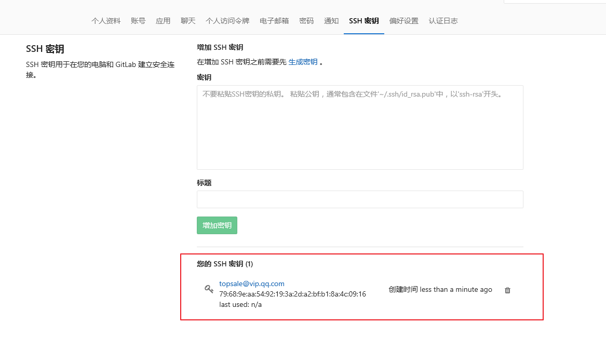

# GitLab

​	　GitLab是一个开源的**项目和代码托管平台**，可通过 Web 界面浏览源代码，**管理缺陷和注释**，以及管理团队对仓库的访问，另外，也非常易于浏览提交过的版本并提供一个文件历史库。


## 快速开始

​	　通过Docker 来安装和运行 GitLab 中文版，首先，编辑`docker-compose.yml`文件。

```yaml
version: '3'
services:
    web:
      image: 'twang2218/gitlab-ce-zh:10.5'
      restart: always
      hostname: '192.168.75.145'
      environment:
        TZ: 'Asia/Shanghai'
        GITLAB_OMNIBUS_CONFIG: |
          external_url 'http://192.168.75.145:8080'
          gitlab_rails['gitlab_shell_ssh_port'] = 2222
          unicorn['port'] = 8888
          nginx['listen_port'] = 8080
      ports:
        - '8080:8080'
        - '8443:443'
        - '2222:22'
      volumes:
        - /usr/local/docker/gitlab/config:/etc/gitlab
        - /usr/local/docker/gitlab/data:/var/opt/gitlab
        - /usr/local/docker/gitlab/logs:/var/log/gitlab
```

​	　接着，运行启动命令`docker compose up -d`，执行完成后，再访问`http://ip:8080`即可进入GitLab页面，设置完管理员初始密码后，就可通过`root`账号登录了。

​	　但是使用时请不要直接通过 root 用户操作，需要先创建用户，然后**通过创建的用户操作**，如果你是管理员还需要为其他开发人员分配账户。

​	　特别的，若是**内部代码托管服务器**，需要直接**关闭注册功能**，然后由管理员统一创建用户；新建的项目也要设定为**私有项目**。


## GitLab配置

### SHH免密登录

​	　首先，在 Git 安装目录下，使用 `ssh-keygen` 工具生成`SSH KEY`。

```shell
ssh-keygen -t rsa -C "your_email@example.com"
```

​	　将生成的秘钥文件`C:\Users\你的用户名\.ssh\id_rsa.pub` 里面的内容复制。然后，点击GitLab中的“用户头像”-->“设置”-->“SSH 密钥”，并将复制的密钥增加到这里即可。



### .gitignore文件

​	　 `.gitignore` 是过滤配置文件，主要作用是过滤不需要上传的文件，如IDE 生成的工程文件、编译后的 class 文件等。在工程目录下，新建 `.gitignore` 文件，并填入如下配置：

```
.gradle
*.sw?
.#*
*#
*~
/build
/code
.classpath
.project
.settings
.metadata
.factorypath
.recommenders
bin
build
target
.factorypath
.springBeans
interpolated*.xml
dependency-reduced-pom.xml
build.log
_site/
.*.md.html
manifest.yml
MANIFEST.MF
settings.xml
activemq-data
overridedb.*
*.iml
*.ipr
*.iws
.idea
.DS_Store
.factorypath
dump.rdb
transaction-logs
**/overlays/
**/logs/
**/temp/
**/classes/
```

