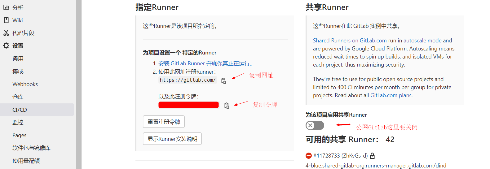
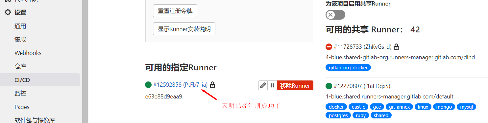
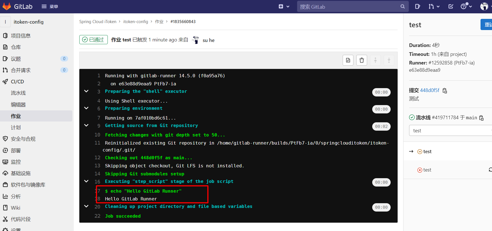

# GitLab CI

## 简介

​	　一次 `Pipeline` 相当于**一次构建任务**，里面可以包含多个流程，如安装依赖、运行测试、编译、部署测试服务器、部署生产服务器等流程。任何提交或者 Merge Request 的合并都可以触发 Pipeline。

```text
+------------------+  trigger  +----------------+
|   Commit / MR    +---------->+    Pipeline    |
+------------------+           +----------------+
```

​	　`Stages` 表示**构建阶段**，一次 Pipeline 可以定义多个 Stages，**所有 Stages 会按照顺序运行**，即当一个 Stage 完成后，下一个 Stage 才会开始；只有当所有 Stages 完成后，该构建任务 (Pipeline) 才会成功；如果任何一个 Stage 失败，那么后面的 Stages 不会执行，该构建任务 (Pipeline) 失败。

```text
+--------------------------------------------------------+
|  Pipeline                                              |
|                                                        |
|  +-----------+     +------------+      +------------+  |
|  |  Stage 1  |---->|   Stage 2  |----->|   Stage 3  |  |
|  +-----------+     +------------+      +------------+  |
+--------------------------------------------------------+
```

​	　`Jobs` 表示构建工作，表示**某个 Stage 里面执行的工作**。我们可以在 Stages 里面定义多个 Jobs，**同 Stage 中的 Jobs 会并行执行**；相同 Stage 中的 Jobs 都执行成功时，该 Stage 才会成功；如果任何一个 Job 失败，那么该 Stage 失败，即该构建任务 (Pipeline) 失败。

```text
+------------------------------------------+
|  Stage 1                                 |
|                                          |
|  +---------+  +---------+  +---------+   |
|  |  Job 1  |  |  Job 2  |  |  Job 3  |   |
|  +---------+  +---------+  +---------+   |
+------------------------------------------+
```


## 快速开始

​	　`GitLab CI` 用于管理各个项目的构建状态；`GitLab Runner`用于执行持续构建，可以安装到不同的机器上，使得构建任务运行期间并不会影响到 GitLab 的性能。


### Runnber Docker

​	　在此，我们使用Docker安装`GitLab Runnber`。首先，按照如下结构新建文件及目录。

```shell
--/usr/local/docker
---- runner                           # 工作目录
------ environment                    # 构建目录
--------- Dockerfile                  # 定制GitLab Runnber镜像
--------- daemon.json                 # 配置加速器和仓库地址
--------- jdk-8u311-linux-x64.tar.gz  # 搭建Java部署环境
--------- apache-maven-3.5.3-bin.tar  # 搭建Java部署环境
--------- settings.xml                # maven配置文件,若有私服必须配置
------ docker-compose.yml             # 定制Runnber镜像启动脚本
```


（1）Dockerfile

​	　`GitLab Runnber`是为所有项目提供持续集成服务的，所有，我们需要以`gitlab-runner`为基础，定制可以构建Java项目的`Runnber`镜像。

```dockerfile
# gitlab-runner的版本要和GitLab的版本一致
FROM gitlab/gitlab-runner

# 安装 Docker
RUN curl -sSL https://get.daocloud.io/docker | sh
COPY daemon.json /etc/docker/daemon.json

# 安装 Docker Compose
WORKDIR /usr/local/bin
RUN curl -L https://get.daocloud.io/docker/compose/releases/download/v2.1.1/docker-compose-`uname -s`-`uname -m` > /usr/local/bin/docker-compose
RUN chmod +x docker-compose

# 安装 Java
RUN mkdir -p /usr/local/java
WORKDIR /usr/local/java
COPY jdk-8u311-linux-x64.tar.gz /usr/local/java
RUN tar -zxvf jdk-8u311-linux-x64.tar.gz && \
    rm -fr jdk-8u311-linux-x64.tar.gz

# 安装 Maven
RUN mkdir -p /usr/local/maven
WORKDIR /usr/local/maven
COPY apache-maven-3.5.3-bin.tar.gz /usr/local/maven
RUN tar -zxvf apache-maven-3.5.3-bin.tar.gz && \
    rm -fr apache-maven-3.5.3-bin.tar.gz
COPY settings.xml /usr/local/maven/apache-maven-3.5.3/conf/settings.xml

# 配置环境变量
ENV JAVA_HOME /usr/local/java/jdk1.8.0_311
ENV MAVEN_HOME /usr/local/maven/apache-maven-3.5.3
ENV PATH $PATH:$JAVA_HOME/bin:$MAVEN_HOME/bin

WORKDIR /
```


（2） daemon.json

​	　Docker仓库的地址`insecure-registries`，请按真实情况配置。

```json
{
  "registry-mirrors": [
    "https://registry.docker-cn.com"
  ],
  "insecure-registries": [
    "192.168.75.131:5000"
  ]
}
```


（3）docker-compose.yml

```yaml
version: '3.1'
services:
  gitlab-runner:
    build: environment
    restart: always
    container_name: gitlab-runner
    # 以真正root管理员的角色操作容器
    privileged: true
    volumes:
      - /usr/local/docker/runner/config:/etc/gitlab-runner
      - /var/run/docker.sock:/var/run/docker.sock
```

​	　最后，运行`docker-compose up -d` 安装GitLab Runner。


### 注册Runner

​	　首先， 以交互的方式进入`gitlab-runner`，并执行`gitlab-runner`命令进行注册，`register`是命令参数。

```shell
docker exec -it gitlab-runner gitlab-runner register
```

​	　然后，在GitLab中，在`设置` -> `CI/CD`  中，查看Runner的注册`网站`和`令牌`信息。特别的，若采用的是公网GitLab，这里共享Runner是需要关闭的，否则会和刚才自己安装Runner的引起冲突的。



​	　在`shell`中依次输入`网站`和`令牌`，并设定触发CI的事件。

```shell{3,7,11,15,19}
# 输入 GitLab 地址
Please enter the gitlab-ci coordinator URL (e.g. https://gitlab.com/):
https://gitlab.com/

# 输入 GitLab Token
Please enter the gitlab-ci token for this runner:
令牌

# 输入 Runner 的说明
Please enter the gitlab-ci description for this runner:
可以为空

# 设置 Tag，可以用于指定在构建规定的 tag 时触发 ci
Please enter the gitlab-ci tags for this runner (comma separated):
可以为空  # 表示只要提交代码就触发 ci
# deploy  # 只有标记deploy才会触发 ci

# 选择 runner 执行器，这里我们选择的是 shell
Please enter the executor: virtualbox, docker+machine, parallels, shell, ssh, docker-ssh+machine, kubernetes, docker, docker-ssh:
shell
```

​	　刷新页面，可以看到Runner已经注册完成了。运行`cat config/config.toml`命令即可查看刚才注册信息。



​	　进入`gitlab-ci`容器后，还可以运行如下命令，查询相关信息。

```shell
# 删除注册信息
gitlab-ci-multi-runner unregister --name "名称"
# 查看注册列表
gitlab-ci-multi-runner list
```

​	　另外，为保证能够正常集成，可能还需要新增`ssh密钥`、将`gitlab-runner` 账户加入 `root 组`等操作。

```shell
# 安装完 GitLab Runner 后系统会增加一个 gitlab-runner 账户，需要将它加进 root 组
gpasswd -a gitlab-runner root
# 新增ssh密钥
ssh-keygen -t rsa -C "你在 GitLab 上的邮箱地址"
```


### 流水线脚本

​	　一个`.gitlab-ci.yml`就代表一个流水线。首先，在项目根目录下新建`.gitlab-ci.yml`配置文件，并编写如下测试用例。

```yaml
stages:
  - test

# 运行测试用例
test:
  stage: test
  script:
    - echo "Hello GitLab Runner"
```

​	　将测试脚本提交到GitLab，稍等片刻，即可查看运行结果。每次触发`CI`的时候，`GitLab Runner`都会拉取最新代码到项目部署目录下。




## 持续集成实践

​	　`GitLab CI`部署目录文件结构如下。

```shell
--Project
---- docker                    # 部署目录
-------- Dockerfile            # 定制项目镜像
---------docker-compose.yml    # 启动项目
-----.gitlab-ci.yml            # 流水线脚本
```


### .gitlab-ci.yml

```yaml
stages:
  - build
  - push
  - run
  - clean

# 构建镜像
build:
  stage: build
  script:
    - /usr/local/maven/apache-maven-3.5.3/bin/mvn clean package
    - cp target/itoken-config-1.0.0-SNAPSHOT.jar docker
    - cd docker
    - docker build -t sh086/itoken-config .

# 推送镜像
push:
  stage: push
  script:
    - docker login -u sh086 -p 密码
    - docker push sh086/itoken-config

# 运行镜像
run:
  stage: run
  script:
    - cd docker
    - docker-compose down
    - docker-compose up -d

# 清理
clean:
  stage: clean
  script:
    - docker rmi $(docker images -q -f dangling=true)
    - docker rm $(docker ps -a -q)
```


### Dockerfile

（1）不依赖其他项目

```dockerfile
FROM openjdk:8-jre

ENV APP_VERSION 1.0.0-SNAPSHOT

RUN mkdir /app
COPY itoken-config-$APP_VERSION.jar /app/app.jar
ENTRYPOINT ["java", "-jar", "/app/app.jar", "--spring.profiles.active=prod"]
EXPOSE 8888
```


（2）依赖其他项目

```dockerfile
FROM openjdk:8-jre

ENV APP_VERSION 1.0.0-SNAPSHOT
ENV DOCKERIZE_VERSION v0.6.1

# Dockerize会等到服务可以访问的时候才会启动后续命令
# depends_on这个只是声明启动服务的先后顺序，不能确保在服务A启动成功后，才启动服务B
RUN wget https://github.com/jwilder/dockerize/releases/download/$DOCKERIZE_VERSION/dockerize-linux-amd64-$DOCKERIZE_VERSION.tar.gz \
    && tar -C /usr/local/bin -xzvf dockerize-linux-amd64-$DOCKERIZE_VERSION.tar.gz \
    && rm dockerize-linux-amd64-$DOCKERIZE_VERSION.tar.gz

RUN mkdir /app

COPY itoken-eureka-$APP_VERSION.jar /app/app.jar

# 等192.168.75.128:8888可以访问的时候，再启动项目，最多等待5分支
ENTRYPOINT ["dockerize", "-timeout", "5m", "-wait", "tcp://192.168.75.128:8888", "java", "-Djava.security.egd=file:/dev/./urandom", "-jar", "/app/app.jar", "--spring.profiles.active=prod"]

EXPOSE 8761
```


### docker-compose.yml

```yaml
version: '3.1'
services:
  itoken-config:
    image: sh086/itoken-config
    restart: always
    container_name: itoken_config
    ports:
      - 8888:8888
    networks:
      - config_network

# 需要指定默认网络，否则在down时，会提示错误
networks:
  config_network:
```


## 附录

### Linux Runnber

```shell
# Ubuntu 安装脚本
curl -L https://packages.gitlab.com/install/repositories/runner/gitlab-ci-multi-runner/script.deb.sh | sudo bash
sudo apt-get update
sudo apt-get install gitlab-ci-multi-runner
```


### gitlab-ci模板

​	　模板中的配置把把一次 `Pipeline` 分成五个阶段，分别是安装依赖(install_deps)、运行测试(test)、编译(build)、部署测试服务器(deploy_test)、部署生产服务器(deploy_production)。

```yaml
# 定义构建阶段，这里只有一个阶段 deploy
stages:
  - install_deps
  - test
  - build
  - deploy_test
  - deploy_production

cache:
  key: ${CI_BUILD_REF_NAME}
  paths:
    - node_modules/
    - dist/

# 安装依赖
install_deps:
  stage: install_deps
  # 只有当 develop 分支有提交的时候才会触发相关的 Jobs
  only:
    - develop
    - master
  # 需要执行的 shell 脚本
  script:
    - npm install

# 运行测试用例
test:
  stage: test
  only:
    - develop
    - master
  script:
    - npm run test

# 编译
build:
  stage: build
  only:
    - develop
    - master
  script:
    - npm run clean
    - npm run build:client
    - npm run build:server

# 部署测试服务器
deploy_test:
  stage: deploy_test
  only:
    - develop
  script:
    - pm2 delete app || true
    - pm2 start app.js --name app

# 部署生产服务器
deploy_production:
  stage: deploy_production
  only:
    - master
  script:
    - bash scripts/deploy/deploy.sh
```

