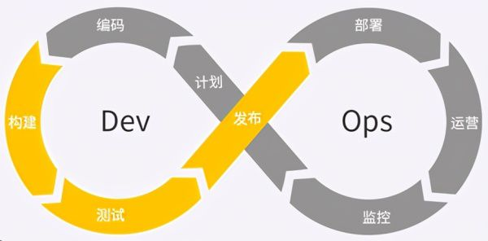
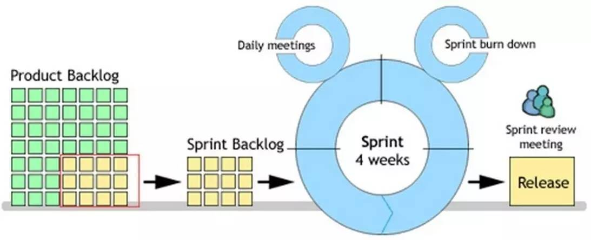
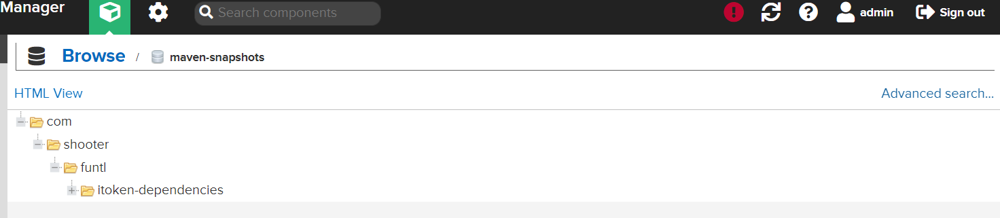
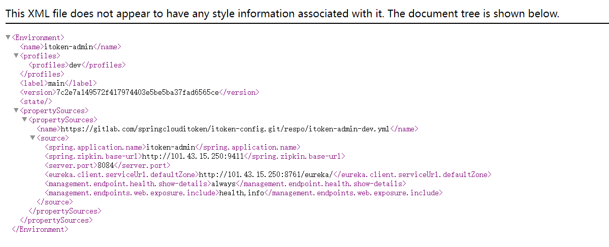

# GitLab CI

## 简介

​	　DevOps 是 `Development` 和 `Operations` 的合成词，其目标是要**加强开发人员、测试人员、运维人员之间的沟通协调**。Docker 容器为 DevOps 提供了**统一的运行环境**，真正实现了**一次构建，到处运行**的部署方式。

<div align="center">
    
</div>


### 敏捷开发论

​	　敏捷开发（Agile）是一种以人为核心、迭代、循序渐进的开发方法。在敏捷开发中，软件项目的构建被切分成多个子项目，**各个子项目的成果都经过测试，具备集成和可运行的特征**。

​	　敏捷开发并不追求前期完美的设计、完美编码，而是力求在**很短的周期内开发出产品的核心功能**，尽早发布出可用的版本。然后在后续的生产周期内，按照新需求不断迭代升级，完善产品。

​	　敏捷开发的实现主要包括 `SCRUM`、`XP`（极限编程）、Crystal Methods、FDD（特性驱动开发）等。其中 SCRUM 与 XP 最为流行。


（1）SCRUM

​	　SCRUM 是一种开发流程框架，SCRUM 框架中包含三个角色，三个工件，四个会议，听起来很复杂，其目的是为了**有效地完成每一次迭代周期的工作**。

​	　在项目启动之前，会由团队的产品负责人（Product owner）按照需求优先级来明确出一份项目的整体需求`Product Backlog`（ 项目的整体需求），为项目做出整体排期。

​	　随后在每一个小的迭代周期里，团队会根据计划（Sprint Plan Meeting）确定本周期的`Sprint Backlog`（需求列表），再细化成一个个`Task`（ 具体开发任务），分配给团队成员，进行具体开发工作。每一天团队成员都会进行 `Daily meeting` （监控项目进度），根据情况更新自己的 Task 状态，整个团队更新 `Sprint burn down chart`（冲刺燃尽图），记录当前周期的需求完成情况。

​	　当这一周期的 `Sprint backlog`（冲刺周期内的需求） 全部完成，团队会进行 `Spring review meeting`（冲刺评审会议），让团队成员们演示成果。一切顺利的话，会发布出这一版本的 `Release`（新的可用版本），并且进行 Sprint 回顾会议（Sprint Retrospective Meeting）。



（2）XP 极限编程

​	　XP 由价值观、原则、实践和行为四个部分组成，它们彼此相互依赖、关联， 并通过行为贯穿于整个生命期。XP四大价值观是沟通、简单、反馈、勇气以及谦逊。五个原则是**快速反馈**、**简单性假设**、**逐步修改**、**提倡更改**、**优质工作**。

​	　XP 极限编程的最佳实践有，**客户负责业务决策，开发团队负责技术决策**；秉承**持续集成，小步快走**的哲学；侧重于**实践**，使用**测试先行** 或者 **结对编程**保证代码质量；强调**简单设计**、**够用就好**的价值观，使用**单一职责原则**、**最少知识原则**设计模式开发，使得代码保持**良好的可扩展性**以及**重构**的可能。

<div align="center">
    
</div>


### 持续集成与交付

​	　**持续集成**（`Continuous integration`，简称 `CI`）是指频繁地（一天多次）将代码集成到主干。开发人员提交了新代码之后，**自动进行构建、（单元）测试**，这样可以**快速发现错误**，并**防止分支大幅偏离主干**。`GitLab Runner`提供了持续集成的解决方案（开发使用）。

​	　**持续交付**（`Continuous delivery`，简称 `CD`）是指是频繁地将软件的新版本，自动部署到**预生产环境**，交付给质量团队或者用户以供评审，如果评审通过，代码就进入生产阶段。持续交付可以看作持续集成的下一步，强调代码不管怎么更新，**软件是随时可以交付的**。

​	　**持续部署**（Continuous deployment）是指代码通过评审以后，自动部署到**生产环境**。持续部署可以看作持续交付的下一步，强调代码**随时都可部署到生产环境**的。持续部署的前提是能**自动化完成测试、构建、部署**等步骤。`Jenkins`提供了持续交付与部署的解决方案（运维使用）。

<div align="center">
    
</div>


​	　根据持续集成的设计，代码从提交到生产，有代码**提交**、**第一轮测试**、**构建**、**第二轮测试**、**部署**、**回滚**等阶段。


​	　开发者向代码仓库**提交**代码；代码仓库对 commit 操作配置了钩子（hook），只要提交代码或者合并进主干（develop），就会进行**第一轮测试**（单元测试）。

​	　通过第一轮测试，代码就可以合并进主干（release）进行交付。首先，对主干进行**构建**（build），如安装依赖、配置各种资源（样式表、JS脚本、图片）等；构建完成后，即可进行**第二轮全面测试**（单元测试+集成测试+端对端测试）。`Jenkins`可以将构建和测试在一次运行中执行完成。

​	　通过了第二轮测试，当前代码（master）就是一个可以直接**部署**的版本（artifact）。将这个版本的所有文件打包存档，发送到生产服务器。生产服务器将打包文件，解包成本地的一个目录，再将运行路径的符号链接（symlink）指向这个目录，然后重新启动应用。

​	　一旦当前版本发生问题，就要**回滚**到上一个版本的构建结果。可以通过`Dokcer`或者`ln软连接指向上一个版本的目录`，实现妙级回滚。

​	　特别的，所有测试都以自动化为主，新版本的每一个更新点都必须测试到。少数无法自动化的测试用例，就要人工跑；如果测试的覆盖率不高，进入后面的部署阶段后，很可能会出现严重的问题。


### 流水线与作业

​	　一次 `Pipeline` 相当于**一次构建任务**，里面可以包含多个流程，如安装依赖、运行测试、编译、部署测试服务器、部署生产服务器等流程。任何提交或者 Merge Request 的合并都可以触发 Pipeline。

```text
+------------------+  trigger  +----------------+
|   Commit / MR    +---------->+    Pipeline    |
+------------------+           +----------------+
```

​	　`Stages` 表示**构建阶段**，一次 Pipeline 可以定义多个 Stages，**所有 Stages 会按照顺序运行**，即当一个 Stage 完成后，下一个 Stage 才会开始；只有当所有 Stages 完成后，该构建任务 (Pipeline) 才会成功；如果任何一个 Stage 失败，那么后面的 Stages 不会执行，该构建任务 (Pipeline) 失败。

```text
+--------------------------------------------------------+
|  Pipeline                                              |
|                                                        |
|  +-----------+     +------------+      +------------+  |
|  |  Stage 1  |---->|   Stage 2  |----->|   Stage 3  |  |
|  +-----------+     +------------+      +------------+  |
+--------------------------------------------------------+
```

​	　`Jobs` 表示构建工作，表示**某个 Stage 里面执行的工作**。我们可以在 Stages 里面定义多个 Jobs，**同 Stage 中的 Jobs 会并行执行**；相同 Stage 中的 Jobs 都执行成功时，该 Stage 才会成功；如果任何一个 Job 失败，那么该 Stage 失败，即该构建任务 (Pipeline) 失败。

```text
+------------------------------------------+
|  Stage 1                                 |
|                                          |
|  +---------+  +---------+  +---------+   |
|  |  Job 1  |  |  Job 2  |  |  Job 3  |   |
|  +---------+  +---------+  +---------+   |
+------------------------------------------+
```


## 快速开始

​	　`GitLab CI` 用于管理各个项目的构建状态；`GitLab Runner`用于执行持续构建，可以安装到不同的机器上，使得构建任务运行期间并不会影响到 GitLab 的性能。


### Runnber Docker

​	　在此，我们使用Docker安装`GitLab Runnber`。首先，按照如下结构新建文件及目录。

```shell
--/usr/local/docker
---- runner                           # 工作目录
------ environment                    # 构建目录
--------- Dockerfile                  # 定制GitLab Runnber镜像
--------- daemon.json                 # 配置加速器和仓库地址
--------- jdk-8u311-linux-x64.tar.gz  # 搭建Java部署环境
--------- apache-maven-3.5.3-bin.tar  # 搭建Java部署环境
--------- settings.xml                # maven配置文件,若有私服必须配置
------ docker-compose.yml             # 定制Runnber镜像启动脚本
```


（1）Dockerfile

​	　`GitLab Runnber`是为所有项目提供持续集成服务的，所有，我们需要以`gitlab-runner`为基础，定制可以构建Java项目的`Runnber`镜像。

```dockerfile
# gitlab-runner的版本要和GitLab的版本一致
FROM gitlab/gitlab-runner

# 安装 Docker
RUN curl -sSL https://get.daocloud.io/docker | sh
COPY daemon.json /etc/docker/daemon.json

# 安装 Docker Compose
WORKDIR /usr/local/bin
RUN curl -L https://get.daocloud.io/docker/compose/releases/download/v2.1.1/docker-compose-`uname -s`-`uname -m` > /usr/local/bin/docker-compose
RUN chmod +x docker-compose

# 安装 Java
RUN mkdir -p /usr/local/java
WORKDIR /usr/local/java
COPY jdk-8u311-linux-x64.tar.gz /usr/local/java
RUN tar -zxvf jdk-8u311-linux-x64.tar.gz && \
    rm -fr jdk-8u311-linux-x64.tar.gz

# 安装 Maven
RUN mkdir -p /usr/local/maven
WORKDIR /usr/local/maven
COPY apache-maven-3.5.3-bin.tar.gz /usr/local/maven
RUN tar -zxvf apache-maven-3.5.3-bin.tar.gz && \
    rm -fr apache-maven-3.5.3-bin.tar.gz
# 注意nexus仓库配置
COPY settings.xml /usr/local/maven/apache-maven-3.5.3/conf/settings.xml

# 配置环境变量
ENV JAVA_HOME /usr/local/java/jdk1.8.0_311
ENV MAVEN_HOME /usr/local/maven/apache-maven-3.5.3
ENV PATH $PATH:$JAVA_HOME/bin:$MAVEN_HOME/bin

WORKDIR /
```


（2） daemon.json

​	　Docker仓库的地址`insecure-registries`，请按真实情况配置。

```json
{
  "registry-mirrors": [
    "https://registry.docker-cn.com"
  ],
  "insecure-registries": [
    "192.168.75.131:5000"
  ]
}
```


（3）docker-compose.yml

```yaml
version: '3.1'
services:
  gitlab-runner:
    build: environment
    restart: always
    container_name: gitlab-runner
    # 以真正root管理员的角色操作容器
    privileged: true
    volumes:
      - /usr/local/docker/runner/config:/etc/gitlab-runner
      - /var/run/docker.sock:/var/run/docker.sock
```

​	　最后，运行`docker-compose up -d` 安装GitLab Runner。并且，还需要给如下文件开发权限。

```
 sudo chmod 666 /var/run/docker.sock
 sudo chmod 666 /usr/local/maven/repo
```


### 注册Runner

​	　首先， 以交互的方式进入`gitlab-runner`，并执行`gitlab-runner`命令进行注册，`register`是命令参数。

```shell
docker exec -it gitlab-runner gitlab-runner register
```

​	　然后，在GitLab中，在`设置` -> `CI/CD`  中，查看Runner的注册`网站`和`令牌`信息。特别的，若采用的是公网GitLab，这里**共享Runner是需要关闭的**，否则会和刚才自己安装Runner的引起冲突的。


​	　在`shell`中依次输入`网站`和`令牌`，并设定触发CI的事件。

```shell{3,7,11,15,19}
# 输入 GitLab 地址
Please enter the gitlab-ci coordinator URL (e.g. https://gitlab.com/):
https://gitlab.com/

# 输入 GitLab Token
Please enter the gitlab-ci token for this runner:
令牌

# 输入 Runner 的说明
Please enter the gitlab-ci description for this runner:
可以为空

# 设置 Tag，可以用于指定在构建规定的 tag 时触发 ci
Please enter the gitlab-ci tags for this runner (comma separated):
可以为空  # 表示只要提交代码就触发 ci
# deploy  # 只有标记deploy才会触发 ci

# 选择 runner 执行器，这里我们选择的是 shell
Please enter the executor: virtualbox, docker+machine, parallels, shell, ssh, docker-ssh+machine, kubernetes, docker, docker-ssh:
shell
```

​	　刷新页面，可以看到Runner已经注册完成了。运行`cat config/config.toml`命令即可查看刚才注册信息。


​	　进入`gitlab-ci`容器后，还可以运行如下命令，查询相关信息。

```shell
# 删除注册信息
gitlab-ci-multi-runner unregister --name "名称"
# 查看注册列表
gitlab-ci-multi-runner list
```

​	　另外，为保证能够正常集成，可能还需要新增`ssh密钥`、将`gitlab-runner` 账户加入 `root 组`等操作。

```shell
# 安装完 GitLab Runner 后系统会增加一个 gitlab-runner 账户，需要将它加进 root 组
gpasswd -a gitlab-runner root
# 新增ssh密钥
ssh-keygen -t rsa -C "你在 GitLab 上的邮箱地址"
```


### 流水线脚本

​	　一个`.gitlab-ci.yml`就代表一个流水线。首先，在项目根目录下新建`.gitlab-ci.yml`配置文件，并编写如下测试用例。

```yaml
stages:
  - test

# 运行测试用例
test:
  stage: test
  script:
    - echo "Hello GitLab Runner"
```

​	　将测试脚本提交到GitLab，稍等片刻，即可查看运行结果。每次触发`CI`的时候，`GitLab Runner`都会拉取最新代码到项目部署目录下。


## 手动部署

​	　要想实现自动部署，首先，就要先了解手动部署的全过程。在此，通过手动部署itoken项目，来表述这一过程。

### itoken-dependencies

​	　首先，需要将`itoken-dependencies`项目**打包到Nexus私服**，在`pom.xml`中新增如下配置，参考<a href="../microservice/nexus.html#打包项目到私服" target="_blank">这里</a>进行配置。

```xml
<!--打包项目到私服-->
<distributionManagement>
     <repository>
         <id>nexus-releases</id>
         <name>Nexus Release Repository</name>
         <url>http://101.43.15.250:8081/repository/maven-releases/</url>
     </repository>
     <snapshotRepository>
         <id>nexus-snapshots</id>
         <name>Nexus Snapshot Repository</name>
         <url>http://101.43.15.250:8081/repository/maven-snapshots/</url>
     </snapshotRepository>
</distributionManagement>
```

​	　然后，**本地**先执行`cd itoken-dependencies`，再使用`mvn deploy`打包，即可将`itoken-dependencies`项目打包到远程仓库中。




（2）itoken-config

​	　首先，在`itoken-config`项目中的`pom.xml`中新增如下配置，用于从`Nexus Repository`下载`itoken-dependencies`等依赖，参考<a href="../microservice/nexus.html#配置代理仓库" target="_blank">这里</a>进行配置，修改完成后将变更提交到Git仓库。特别的，**`itoken`所有的项目都需要这样改动，后面的项目不在赘述**。

```xml
<!--依赖管理-->
<repositories>
    <repository>
        <id>nexus</id>
        <name>Nexus Repository</name>
        <url>http://101.43.15.250:8081/repository/maven-public/</url>
        <snapshots>
            <enabled>true</enabled>
        </snapshots>
        <releases>
            <enabled>true</enabled>
        </releases>
    </repository>
</repositories>
```

​	　接下来，在远程服务器上运行如下命令，并将生成的秘钥增加到GitLab中的`用户头像`->`设置`->`SSH 密钥`中即可。

```shell
# 生成密钥
ssh-keygen -t rsa -C "your_email@example.com"
# 查看密钥
cat /root/.ssh/id_rsa.pub
```


### itoken-config

​	　然后，安装`JDK`和`Maven`环境。接着将`itoken-config`项目都`clone`到远程服务器上，并打包、运行`itoken-config`项目。

```shell
# 新建itoken项目目录
mkdir -p /usr/local/docker/itoken
# 进入itoken项目
cd /usr/local/docker/itoken

# 安装Git命令
yum -y install git
# 克隆itoken-config目录
git clone git@gitlab.com:springclouditoken/itoken-config.git

# 打包itoken-config项目
mvn clean package 

# 进入target目录
cd target
# 新建部署目录
mkdir docker
# 移动jar包到部署目录
mv itoken-config-1.0.0-SNAPSHOT.jar docker
# 进入部署目录
cd docker

# 在docker目录下，编写Dockerfile
vi Dockerfile

FROM openjdk:8-jre
WORKDIR /app
COPY itoken-config-1.0.0-SNAPSHOT.jar .
CMD java -jar itoken-config-1.0.0-SNAPSHOT.jar
EXPOSE 8888

# 构建镜像
docker build -t sh086/itoken-config .
```

​	　编写`itoken-config`项目的`docker-compose.yml`文件，再运行`docker-compose up -d`命令启动项目。

```yaml
version: '3.1'
services:
  itoken-config:
    image: sh086/itoken-config
    restart: always
    container_name: itoken_config
    ports:
      - 8888:8888
    networks:
      - config_network

networks:
  config_network:
```

​	　访问`http://101.43.15.250:8888/itoken-admin/dev/master`，若可以获取配置，则表明`itoken-config`项目已经成功部署了。




### itoken-eureka

​	　由于Eureka采用**集群**部署，所以要先增加`itoken-eureka-dev.yml`配置文件的`defaultZone`节点，完成后提交变更到GitLab。

```yaml{14}
server:
  port: 8761

eureka:
  instance:
    hostname: host
  client:
    # 表示是否将自己注册到Eureka，因为要构建集群环境，需要将自己注册到集群，所以应该开启
    registerWithEureka: true
    # 表示是否从Eureka获取注册信息，如果是单一节点，不需要同步其他Eureka节点，则可以设置为false
    # 但如是Eureka集群，则应该设置为 true
    fetchRegistry: true
    serviceUrl:
      defaultZone: http://${eureka.instance.hostname}:8761/eureka/,http://${eureka.instance.hostname}:8762/eureka/
```

​	　然后，先在`itoken-eureka`项目的`pom.xml`新增`Nexus Repository`配置并提交Git，再根据如下步骤完成`eureka`镜像定制。

```shell
# 进入itoken目录
cd /usr/local/docker/itoken
# 拉取代码
git clone git@gitlab.com:springclouditoken/itoken-eureka.git
# 进入itoken-eureka项目
cd itoken-eureka
# 打包
mvn clean package

# 进入打包目录
cd target
# 新建部署目录
mkdir docker
# 移动jar包到部署目录
mv itoken-eureka-1.0.0-SNAPSHOT.jar docker
# 进入部署目录
cd docker

# 在docker目录下，编写Dockerfile
vi Dockerfile

FROM openjdk:8-jre
WORKDIR /app
COPY itoken-eureka-1.0.0-SNAPSHOT.jar .
CMD java -jar itoken-eureka-1.0.0-SNAPSHOT.jar
EXPOSE 8761

# 构建镜像
docker build -t sh086/itoken-eureka .
```

​	　接下来，编写`itoken-eureka`项目的`docker-compose.yml`文件。

```yaml
version: '3.1'
services:
  itoken-eureka-1:
    image: sh086/itoken-eureka
    restart: always
    container_name: itoken-eureka-1
    ports:
      - 8761:8761
    networks:
      - eureka_network

  itoken-eureka-2:
    image: sh086/itoken-eureka
    restart: always
    container_name: itoken-eureka-2
    ports:
      - 8762:8761
    networks:
      - eureka_network

# 需要指定默认网络，否则在down时，会提示错误
networks:
  eureka_network:
```

​	　最后，启动`itoken-eureka`项目，启动成功后，访问`8761`端口或者`8762`端口，都可正常访问Eureka。特别的，由于Eureka是集群模式，故端口展示的都是`8761`。


## 持续集成实践

​	　`GitLab CI`部署目录文件结构如下，若构建中出现问题，可以进入GitLab Runner查看一下问题原因。

```shell
--Project
---- docker                    # 部署目录
-------- Dockerfile            # 定制项目镜像
---------docker-compose.yml    # 启动项目
-----.gitlab-ci.yml            # 流水线脚本
```

​	　注意，若通过`docker exec -it bash`进入容器后，手动在`Runner`容器中`build`应用，应该在构建完成后，要清除刚才手动构建生成的目录，否则可能会产生权限问题。

```shell
# 清除target
rm -rf target/
```


### .gitlab-ci.yml

```yaml
stages:
  - build
  - push
  - run
  - clean

# 构建镜像
build:
  stage: build
  script:
    - /usr/local/maven/apache-maven-3.5.3/bin/mvn clean package
    - cp target/itoken-config-1.0.0-SNAPSHOT.jar docker
    - cd docker
    - docker build -t sh086/itoken-config .

# 推送镜像
push:
  stage: push
  script:
    - docker login -u sh086 -p 密码
    - docker push sh086/itoken-config

# 运行镜像
run:
  stage: run
  script:
    - cd docker
    # - docker-compose down
    - docker-compose up -d --build

# 清理
clean:
  stage: clean
  script:
    - docker rmi $(docker images -q -f dangling=true)
    # - docker rm $(docker ps -a -q)
```

​	　注意，虽然在`docker-compose.yml`中设置了`networks`，但是，在`down`项目`itoken-eureka`时，还是会提示使用了`docker_itoken_network`的网络，不知道为什么？


### Dockerfile

（1）不依赖其他项目

```dockerfile
FROM openjdk:8-jre

ENV APP_VERSION 1.0.0-SNAPSHOT

WORKDIR /app
COPY itoken-config-$APP_VERSION.jar ./app.jar
ENTRYPOINT ["java", "-Djava.security.egd=file:/dev/./urandom", "-jar", "./app.jar"]
EXPOSE 8888
```


（2）依赖其他项目

​	　建议直接将`Dockerize`打入`Runner`的`Docker`安装包中。

```dockerfile
FROM openjdk:8-jre

ENV APP_VERSION 1.0.0-SNAPSHOT
ENV DOCKERIZE_VERSION v0.6.1

# Dockerize会等到服务可以访问的时候才会启动后续命令
# depends_on这个只是声明启动服务的先后顺序，不能确保在服务A启动成功后，才启动服务B
RUN wget https://github.com/jwilder/dockerize/releases/download/$DOCKERIZE_VERSION/dockerize-linux-amd64-$DOCKERIZE_VERSION.tar.gz \
    && tar -C /usr/local/bin -xzvf dockerize-linux-amd64-$DOCKERIZE_VERSION.tar.gz \
    && rm dockerize-linux-amd64-$DOCKERIZE_VERSION.tar.gz

WORKDIR /app
COPY itoken-eureka-$APP_VERSION.jar ./app.jar

# 等101.53.15.240:8888可以访问的时候，再启动项目，最多等待5分支2
ENTRYPOINT ["dockerize", "-timeout", "5m", "-wait", "tcp://101.53.15.240:8888", "java", "-Djava.security.egd=file:/dev/./urandom", "-jar", "./app.jar"]

EXPOSE 8761
```


### docker-compose.yml

​	　此处以`itoken-config`项目的`docker-compose.yml`文件为例。

```yaml
version: '3.1'
services:
  itoken-config:
    image: sh086/itoken-config
    restart: always
    container_name: itoken_config
    ports:
      - 8888:8888
    environment:
      TZ: Asia/Shanghai
      SPRING_PROFILES_ACTIVE: dev
    networks:
      - config_network:

# 需要指定专门的网络，否则在多实例在down时，会提示错误
networks:
  config_network:
```


### 测试运行

​	　以`itoken-config`为例，提交代码到分支上，`GitLab CI`就会自动进行构建，稍等一会，构建成功结果如下。访问`http://101.43.15.250:8888/itoken-admin/dev/master`，若可以获取配置，则表明`itoken-config`项目已经成功部署了。


## 附录

### Linux Runnber

```shell
# Ubuntu 安装脚本
curl -L https://packages.gitlab.com/install/repositories/runner/gitlab-ci-multi-runner/script.deb.sh | sudo bash
sudo apt-get update
sudo apt-get install gitlab-ci-multi-runner
```


### gitlab-ci模板

​	　模板中的配置把把一次 `Pipeline` 分成五个阶段，分别是安装依赖(install_deps)、运行测试(test)、编译(build)、部署测试服务器(deploy_test)、部署生产服务器(deploy_production)。

```yaml
# 定义构建阶段，这里只有一个阶段 deploy
stages:
  - install_deps
  - test
  - build
  - deploy_test
  - deploy_production

cache:
  key: ${CI_BUILD_REF_NAME}
  paths:
    - node_modules/
    - dist/

# 安装依赖
install_deps:
  stage: install_deps
  # 只有当 develop 分支有提交的时候才会触发相关的 Jobs
  only:
    - develop
    - master
  # 需要执行的 shell 脚本
  script:
    - npm install

# 运行测试用例
test:
  stage: test
  only:
    - develop
    - master
  script:
    - npm run test

# 编译
build:
  stage: build
  only:
    - develop
    - master
  script:
    - npm run clean
    - npm run build:client
    - npm run build:server

# 部署测试服务器
deploy_test:
  stage: deploy_test
  only:
    - develop
  script:
    - pm2 delete app || true
    - pm2 start app.js --name app

# 部署生产服务器
deploy_production:
  stage: deploy_production
  only:
    - master
  script:
    - bash scripts/deploy/deploy.sh
```

