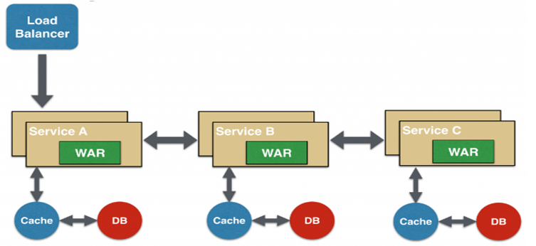

# 微服务简介

## 微服务模式

### 走进单体地狱

​	　单体应用多用于 **项目规模较小、用户较少** 或者 **企业内部** 使用的应用，不适合开发具有高可用、高并发、高性能特性的互联网应用。

​	　在项目的早期阶段，使用单体应用开发`互联网应用`也可以良好运作。开发者可以快速通过IDEA，开发风格类似的单体应用模型。通过简单地启动并使用如`Selenium`测试包来测试`UI`，以轻松地实现**端到端 (end-to-end) 测试**。

​	　此外，应用程序被作为一个单体易于打包和部署，只需将拷贝打包好的应用程序上传到服务器上运行即可。通过运行**多个副本**和结合**负载均衡器**，可以很方便的扩展单体应用。


​	　但是，随着时间推移，小而简单的应用将会逐渐成长成一个**庞大**、**复杂**的单体，应用程序变得难以扩展，不可靠。敏捷开发和交付的任何一次尝试都将原地徘徊，正确修复 bug 和实现新功能变得非常困难而耗时。

​	　应用启动时间的不断变长和因变更所需要进行的大量测试，导致复杂单体持续部署变得非常困难。当不同模块存在资源（CPU密集型和内存密集型）需求冲突时，单体应用可能难以扩展。

​	　任何模块的一个bug都可能会拖垮整个进程，影响到整个应用的可用性。单体应用也使得采用新框架和语言变得非常困难。


### 微服务解决复杂问题

​	　微服务将单体应用根据业务需求**充分分解**成一套**较小的互连服务**，以实现**松耦合**，达到应用敏捷开发和部署的目的。每个微服务都是实现了一组不同的特性或功能的**自包含**应用，可以根据不同的业务需求选择**相适应业务**的 **数据库模式**  和 **用例部署场景**。

​	　**每个服务可由多个服务实例组成**，每个服务实例是一个Docker容器，为了实现高可用，容器是在多个云虚拟机上运行的。通过**服务发现机制**使得服务能够发现**需要与之通信的任何其他服务的位置**（主机和端口）。

​	　不同的服务用例之间进行跨实例分发请求时，不能直接通过 `REST API` 访问，而是需要通过 **API 网关** (API Gateway) 进行**异步、基于消息的通信**，**API 网关负责负载均衡、缓存、访问控制、 API 计量和监控**， 可以通过使用`NGINX` 来实现。


​	　微服务架构模式强制一定程度的模块化，每个服务都有一个明确定义边界的方式，使得**个体服务能被更快地开发，并更容易理解与维护**。开发者可以自由选择与当前业务需求相适应的技术，使得使用当前技术重写旧服务将变得更加可行。微服务可以实现每个微服务独立部署，使得变更一经测试即可立即部署。微服务架构模式使得每个服务能够独立扩展使用与服务资源要求最匹配的硬件。

​	　但是，微服务架构模式也容易**过多偏向于小型化服务的规模**，而**忽略**充分分解业务需求以方便应用敏捷开发和部署的目标。微服务是一个分布式系统，其使得整体变得复杂，容易出现局部故障。分区数据库架构难以实现分布式事务，**不得不使用基于最终一致性的方法保证数据的一致性**。测试某个微服务的功能时，需要启动该服务及其所依赖的所有服务，实现跨服务需求变更时，需要仔细规划和协调出现的变更至每个服务。

​	　部署基于微服务的应用程序也是相当复杂的，微服务应用程序通常由大量的服务组成，每个服务都有多个运行时实例、还有更多的移动部件需要配置、部署、扩展和监控，因此，要成功部署微服务应用程序，需要求开发人员能**高度控制部署方式**和**高度自动化**。一种自动化方式是使用现成的`PaaS`，如 `Cloud Foundry`；另一个方式是使用`Kubernetes`集群方案开发自己的 `PaaS`。


## 微服务实践

​	　**微服务架构**主要解决了`客户端如何访问这些服务`、`每个服务之间如何通信`、`如何实现如此多的服务`、`如何解决服务挂了`这四个分布式开发时会存在的问题，目前存在三种解决方案：

```shell
Spring Boot + Spring Cloud Alibaba
Spring Boot + Dubbo + Zookeeper 
Spring Boot + Spring Cloud Netflix          # 目前已停止更新，只进行维护
Spring Boot + Spring Cloud Alibaba + Dubbo  # 非主流
```

​	　微服务架构可以更加快速的构建一个稳定、高速的系统，但是目前还不成熟，发展趋势是向**标准化微服务框架**发展，如**ServiceMesh**服务网格化、Istio等。


### 客户端如何访问这些服务

​	　单体式开发的时候，所有的服务都是本地的，UI 可以直接调用；现在按功能拆分成独立的微服务，后台有 N 个服务，前台就需要记住管理 N 个服务，一个服务 **下线**、**更新**、**升级**，前台就要重新部署。

​	　这明显不符合微服务拆分理念，特别当前台是移动应用的时候，通常业务变化的节奏更快。所以，需要为前台（通常是移动应用）提供后台服务的聚合，提供一个统一的服务出口，解除他们之间的耦合。

​	　`API Gateway`提供统一服务入口，让微服务对前台透明；聚合后台的服务，节省流量；对用户登录信息和权限统一维护管理；提升性能；提供安全、过滤、流控等API管理功能。不过 `API Gateway` 也有可能成为 **单点故障** 点或者性能的瓶颈。


### 每个服务之间如何通信

（1）同步调用

​	　同步调用一致性强，但在调用层次多的时候，容易**阻塞**，导致**单点故障**。同步调用具有`REST`和`RPC`两种方式，因为网络中只有字符串可以穿透防火墙，所以一般采用  `对内RPC ` 、` 对外REST` 的策略。

​	　`REST`基于 HTTP，只要封装了 HTTP 的 SDK 就能调用，使用范围较广；`RPC` **远程过程调用**，传输协议更高效，安全更可控， 速度也更快，但是，RPC耦合性很大，服务间具有很大的依赖性。常用的 RPC 框架有 Thrift（跨语言）、Dubbo（只能用于Java）。

```java
// RPC用法，RPCUser是其他服务的类，直接调用即可使用
val use = new RPCUser();

// Thrift示例（跨语言），在JavaScript中通过Java的实例化方式初始化
var user = nre User();
```


（2）异步调用

​	　异步消息的方式在分布式系统中应用广泛，既能**降低调用服务之间的耦合性**，又能成为调用之间的**缓冲**，确保消息积压不会冲垮被调用方；同时能**保证调用方的服务体验**，不至于服务A挂掉导致服务B被后台性能拖慢。不过需要付出的代价是**一致性的减弱**，需要接受数据 **最终一致性**。


​	　还有就是后台服务一般要实现 **幂等性**，因为消息发送，出于性能的考虑一般会有重复（保证消息的**被收到且仅收到一次**对性能是很大的考验）。

​	　常用的消息中间件有`Kafka`、`Notify` 和 `MessageQueue`。特别的， `kafka` 采用**直连**进行异步传输的方式，没有 `Broker` ，若对消息完整性不要求（消息可以被丢失，仅要求速度），可以使用 `kafka` 作为消息中间件，如日志传输。


### 如何实现如此多的服务

​	　在微服务架构中，一般每一个服务都是有多个拷贝，来做负载均衡。一个服务**随时可能下线**，也可能应对临时访问压力增**加新的服务节点**。一般采**用服务注册与发现中心**对分布式服务进行管理，常见的有Zookeeper 、Eureka 等。

​	　当服务上线时，服务提供者将自己的服务信息注册到 `服务注册与发现中心`，并通过心跳维持长链接，实时更新链接信息。服务调用者通过 `服务注册与发现中心`寻址，根据可定制算法，找到一个服务，还可以将服务信息缓存在本地以提高性能。当服务下线时，服`务注册与发现中心` 会发通知给服务客户端。

（1）基于客户端的服务注册与发现


（2）基于服务端的服务注册与发现


### 如何解决服务挂了

​	　分布式最大的特性就是网络是不可靠，**服务调用链**可以采用**重试机制**、**限流**、**熔断机制**、**降级**（本地缓存）等，保证**任一环节出问题都不至于影响整体链路**。


### 单点故障与分布式锁

（1）分布式锁解决Master选举问题

​	　通常分布式系统采用主从模式，就是一个主控机连接多个处理节点。主节点负责分发任务，从节点负责处理任务，当我们的主节点发生故障时，那么整个系统就都瘫痪了，那么我们把这种故障叫作**单点故障**。

​	　传统解决方案是采用一个备用节点，这个备用节点定期给当前主节点发送 ping 包，主节点收到 ping 包以后向备用节点发送回复Ack，当备用节点收到回复的时候就会认为当前主节点还活着，让他继续提供服务。

​	　但若出现网络震荡导致丢包，回复没有及时反馈给备用节点，导致备用节点误以为主节点挂了，然后备用节点将他的Master实例启动起来，就导致了分布式系统中有两个主节点（双主问题）。为了防止分布式系统中的多个进程直接相互干扰，需要实现**分布式锁**来完成**分布式协调调度**。

​	　Zookeeper为了解决分布式锁的问题，所有服务启动时都需要向Zookeeper 注册  ，注册完以后进行选举，**编号最小的节点将在选举中获胜获得锁成为主节点**，**其他节点阻塞成为备用节点**。

​	　当主节点A（编号`master-001`）出现网络震荡问题时，这时候主节点A所注册的节点将被自动删除，Zookeeper 会自动感知节点的变化，然后再次发出选举，这时候主节点B（编号`master-002`）将在选举中获胜，替代主节点A成为主节点。

​	　如果主节点A恢复了，它会再次向 Zookeeper 注册一个新节点（编号`master-003`），Zookeeper 会感知节点的变化再次发动选举，这时候主节点B在选举中会再次获胜继续担任主节点，主节点A会担任备用节点。


（2）分布式锁解决一致性问题

​	　由于分布式系统多线程、多进程并且分布在不同机器上，不仅使得成员变量之间不存在共享、也不具有可见性；也导致了原单机部署情况下的并发控制锁策略失效。

​	　Zookeeper为分布式应用**提供一致性服务**，实现了一个方法或属性在高并发的时候，**同一时间只能被一个实例的一个线程执行**。具有高可用、高性能、非阻塞、可重入特性以及具备琐失效机制，防止死锁。

​	　首先创建一个目录 `MyZookeeper`，线程A想获取锁就在 `MyZookeeper` 目录下创建临时顺序节点，接下来，获取`MyZookecper`目录下所有的子节点，然后获取比自己小的兄弟节点，如果不存在，则说明当前线程顺序号最小。

​	　线程B获取所有节点，判断自己不是最小节点，设置监听比自己次小的节点；线程A处理完，删除自己的节点，线程B监听到变更事件，判断自己是不是最小的节点，如果是则获得锁。


## 微服务架构设计模式

### 聚合器设计模式

​	　聚合器调用多个服务实现应用程序所需的功能。它可以是一个简单的 WEB 页面，将检索到的数据进行处理展示。它也可以是一个更高层次的组合微服务，对检索到的数据增加业务逻辑后进一步发布成一个新的微服务，这符合 **DRY** 原则。

​	　另外，每个服务都有自己的缓存和数据库。如果聚合器是一个组合服务，那么它也有自己的缓存和数据库。聚合器可以沿 `X轴` 和 `Z轴` 独立扩展。


### 链式微服务设计模式

​	　这种模式在接收到请求后会产生一个经过合并的响应，如` 服务A` 接收到请求后会与 `服务B` 进行通信，类似地，`服务B` 会同 `服务C` 进行通信。

​	　所有服务都使用**同步**消息传递，在整个链式调用完成之前，客户端会一直阻塞。因此，**服务调用链不宜过长**，以免客户端长时间等待。




### 分支微服务设计模式

​	　这种模式是聚合器模式的扩展，允许**同时调用多个微服务链**，如下图所示。


### 数据共享设计模式

​	　自治是微服务的设计原则之一，就是说微服务是**全栈式服务**。但在重构现有的`单体应用`时，SQL 数据库反规范化可能会导致数据重复和不一致。因此，在单体应用到微服务架构的过渡阶段，可以使用这种设计模式。

​	　在这种情况下，部分微服务可能会**共享缓存和数据库存储**。不过，这只有在两个服务之间存在强耦合关系时才可以。对于基于微服务的新建应用程序而言，这是一种反模式。


### 异步消息传递设计模式

​	　虽然 REST 设计模式非常流行，但它是同步的，会造成阻塞。因此部分基于微服务的架构可能会选择使用**消息队列**代替 REST 请求/响应，如下图所示。

 


## 附录

（1）开发和交付中的伸缩立方

​	　**X轴：** 运行多个负载均衡器之后的运行实例 **Y轴：** 将应用进一步分解为微服务（分库） **Z轴：** 大数据量时，将服务分区（分表）。

```shell
# 分表，用于存放大量数据
tc_order_00
tc_order_01
....
tc_order_09
# 可根据单号的尾号查询不同的数据库
# select * from tc_order_${no} where id = '#{id}'
```


（2）CAP理论

​	　CAP 理论指一个分布式系统最多只能同时满足**一致性**（Consistency）、**可用性**（Availability）和**分区容错性**（Partition tolerance）这**三项中的两项**。互联网应用常见的是**必须保证C**，P和A可根据业务选择。

```
① 一致性(C)：更新操作成功并返回客户端完成后，所有节点在同一时间的数据完全一致
② 可用性(A)：服务一直可用，而且是正常响应时间
③ 分区容错性(P)：在遇到某节点或网络分区故障时，仍能对外提供满足一致性和可用性的服务
```


（3）SOA 架构与微服务架构

​	　微服务与 SOA 都是为了**减少传统的企业服务总线开发的高复杂性**，不同的是，SOA面向服务架构 采用**中央管理模式来确保各应用能够交互运作**；微服务着**重于分散管理、代码再利用与自动化执行**，可用于解决**高并发**、**高可用**的问题。

​	　SOA 架构注重**重用**，微服务注重**重写**；微服务迁移的时候通常**从耦合度最低的模块或对扩展性要求最高的模块开始**，把它们一个一个剥离出来用敏捷地重写，可以尝试最新的技术和语言和框架，然后 **单独布署**，不依赖其他服务。

​	　SOA 架构注重**水平**服务，微服务注重**垂直**服务。每个微服务通常直接**为用户提供某个功能**，而 SOA 通常会返回一个**大而全**的结果兼顾到所有的客户端的需求。

​	　SOA 架构注重**自上而下**，微服务注重**自下而上**。SOA 架构通常会预先把每个模块服务接口都定义好，而微服务是**快速开发迭代**。
