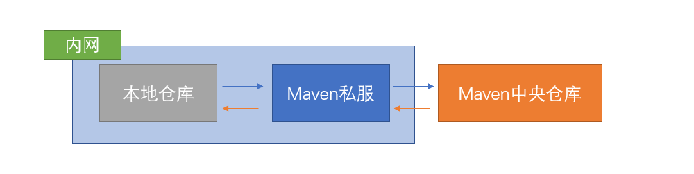

# Nexus

​	　Nexus是一个强大的Maven**依赖管理平台**，极大地简化了内部仓库的维护和外部仓库的访问。通过Nexus可以完全控制访问和部署在你所维护仓库中的每个Artifact。


## 快速开始

​	　通过Docker 来安装和运行 Nexus，首先，编辑`docker-compose.yml`文件。

```yaml
version: '3.1'
services:
  nexus:
    restart: always
    image: sonatype/nexus3
    container_name: nexus
    ports:
      - 8081:8081
    volumes:
      - /usr/local/docker/nexus/data:/nexus-data
```

​	　然后，运行启动命令`docker-compose up -d`，启动成功后，可以通过如下名称查看初始admin用户密码。

```shell
# 查看admin用户密码
cat /usr/local/docker/nexus/data/admin.password
```


## 使用 Maven 私服

​	　**代理仓库**是指第三方仓库；**宿主仓库**是指存储本地上传的组件和资源的；**仓库组**通常包含了多个代理仓库和宿主仓库，在项目中**只要引入仓库组就可以下载到代理仓库和宿主仓库中的包**。

```shell
# 代理仓库（Proxy Repository）
- maven-central
- nuget.org-proxy
# 宿主仓库（Hosted Repository）
- maven-releases
- maven-snapshots
- nuget-hosted
# 仓库组（Repository Group）
- maven-public
- nuget-group
```


### 配置代理仓库

​	　当下载公共依赖时，若本地仓库没有，则会先在Maven私服中查询，若还是没有，Maven私服会从Maven中央仓库中下载更新，这样在下次再次下载时，可以大大加快依赖的下载速度。



​	　首先，在`apache-maven-3.6.1\conf\settings.xml` 配置文件的`servers` 节点下，添加 Nexus 认证信息。

```xml
<servers>
    <!--用于拉取 public 版本-->
	<server>
	  <id>nexus</id>
	  <username>admin</username>
	  <password>SDmz3R46uBcmUm3</password>
	</server>
</servers>
```

​	　然后，在`pom.xml`中新增Maven私服的配置。特别的，ID 名称必须要与 `settings.xml` 中 Servers 配置的 ID 名称保持一致。

```xml
<!--依赖管理-->
<repositories>
    <repository>
        <id>nexus</id>
        <name>Nexus Repository</name>
        <!-- maven-public 公共仓库是发行仓库和快照仓库的映射，从这里可以下载所有类型的依赖-->
        <url>http://127.0.0.1:8081/repository/maven-public/</url>
        <snapshots>
            <!--是否启用快照下载依赖-->
            <enabled>true</enabled>
        </snapshots>
        <releases>
            <!--是否启用releases下载依赖-->
            <enabled>true</enabled>
        </releases>
    </repository>
</repositories>

<!--插件管理-->
<pluginRepositories>
    <pluginRepository>
        <id>nexus</id>
        <name>Nexus Plugin Repository</name>
        <url>http://127.0.0.1:8081/repository/maven-public/</url>
        <snapshots>
            <enabled>true</enabled>
        </snapshots>
        <releases>
            <enabled>true</enabled>
        </releases>
    </pluginRepository>
</pluginRepositories>
```


### 打包项目到私服

​	　首先，在`apache-maven-3.6.1\conf\settings.xml` 配置文件的`servers` 节点下，添加 Nexus 认证信息。

```xml
<servers>
    <!--用于拉取 public 版本-->
	<server>
	  <id>nexus</id>
	  <username>admin</username>
	  <password>SDmz3R46uBcmUm3</password>
	</server>
    
   <!--用于发布 Release 版本-->
	<server>
	  <id>nexus-releases</id>
	  <username>admin</username>
	  <password>SDmz3R46uBcmUm3</password>
	</server>
</servers>
```

​	　然后，在 `pom.xml` 中添加如下配置。特别的，ID 名称必须要与 `settings.xml` 中 Servers 配置的 ID 名称保持一致。

```xml
<distributionManagement>  
  <repository>  
    <!-- 使用nexus-releases配置的用户名密码登录（授权）--->
    <id>nexus-releases</id>  
    <name>Nexus Release Repository</name>  
    <url>http://127.0.0.1:8081/repository/maven-releases/</url>  
  </repository>  
  <snapshotRepository>  
     <!-- 使用nexus-snapshots配置的用户名密码登录（授权）--->
    <id>nexus-snapshots</id>  
    <name>Nexus Snapshot Repository</name>  
    <url>http://127.0.0.1:8081/repository/maven-snapshots/</url>  
  </snapshotRepository>  
</distributionManagement> 
```

​	　最后，执行如下命令部署到仓库。特别的，若项目版本号中有 `SNAPSHOT` 标识的，则会发布到 `Nexus Snapshots Repository`, 否则发布到 `Nexus Release Repository`，并根据 ID 去匹配授权账号。

```shell
mvn deploy
```


### 管理第三方依赖

​	　建议在上传第三方 JAR 包时，创建单独的第三方 JAR 包管理仓库`maven-3rd`，便于管理有维护。

```shell
# 如第三方JAR包：aliyun-sdk-oss-2.2.3.jar
mvn deploy:deploy-file 
  -DgroupId=com.google.code.kaptcha
  -DartifactId=kaptcha
  -Dversion=2.3
  -Dpackaging=jar 
  -Dfile=./libs/kaptcha-2.3.jar
  -Durl=http://127.0.0.1:8081/repository/maven-3rd/ 
  -DrepositoryId=nexus-releases # 使用nexus-releases配置的用户名密码登录nexus（授权）
```


## 附录

### 解决启动问题

（1）数据卷目录权限问题

​	　若启动时，如果出现权限问题，可以赋予数据卷目录可读可写的权限。

```shell
chmod 777 /usr/local/docker/nexus/data
```


（2）启动内存不足问题

​	　`nexus3`默认启动需要`2703M`内存，若内存不足，可修改内存运行，但至少也需要`1G`左右。

```shell
docker run -d \
-e "INSTALL4J_ADD_VM_PARAMS=-Xms128m -Xmx512m \
     -XX:MaxDirectMemorySize=512m \
     -Djava.util.prefs.userRoot=/nexus-data/javaprefs"  \
--name nexus \
-p 8081:8081 \
-v /usr/local/docker/nexus/data:/nexus-data \
sonatype/nexus3
```


（3）访问SonatypeOutreach超时

```shell
com.sonatype.nexus.plugins.outreach.internal.outreach.SonatypeOutreach 
- Could not download page bundle javax.net.ssl.SSLException: Read timed out
```

​	　登录账号，打开 `System` --> `Capabilities` ，将 `Outreach:Management` 禁用即可。


### POM配置

​	　本地运行，只需将仓库依赖都添加到`dependencies`项目即可。

```xml
<!--打包项目到私服-->
<distributionManagement>  
  <repository>  
    <!-- 使用nexus-releases配置的用户名密码登录（授权）--->
    <id>nexus-releases</id>
    <name>Nexus Release Repository</name>  
    <url>http://127.0.0.1:8081/repository/maven-releases/</url>  
  </repository>  
  <snapshotRepository>  
     <!-- 使用nexus-snapshots配置的用户名密码登录（授权）--->
    <id>nexus-snapshots</id>  
    <name>Nexus Snapshot Repository</name>  
    <url>http://127.0.0.1:8081/repository/maven-snapshots/</url>  
  </snapshotRepository>  
</distributionManagement> 

<!--依赖管理-->
<repositories>
    <repository>
        <id>nexus</id>
        <name>Nexus Repository</name>
        <!-- maven-public 公共仓库是发行仓库和快照仓库的映射，从这里可以下载所有类型的依赖-->
        <url>http://127.0.0.1:8081/repository/maven-public/</url>
        <snapshots>
            <!--是否启用快照下载依赖-->
            <enabled>true</enabled>
        </snapshots>
        <releases>
            <!--是否启用releases下载依赖-->
            <enabled>true</enabled>
        </releases>
    </repository>
</repositories>

<!--插件管理-->
<pluginRepositories>
    <pluginRepository>
        <id>nexus</id>
        <name>Nexus Plugin Repository</name>
        <url>http://127.0.0.1:8081/repository/maven-public/</url>
        <snapshots>
            <enabled>true</enabled>
        </snapshots>
        <releases>
            <enabled>true</enabled>
        </releases>
    </pluginRepository>
</pluginRepositories>
```

​	　子项目可以通过`<parent>`继承`dependencies`中的配置。

```xml
<!--继承dependencies中的配置-->
<parent>
    <groupId>com.shooter.funtl</groupId>
    <artifactId>dependencies</artifactId>
    <version>1.0.0-SNAPSHOT</version>
    <relativePath>../itoken-dependencies/pom.xml</relativePath>
</parent>
```

​	　但是，远程部署的时候，往往**子项目和`dependencies`是单独部署**的。所以，需要在子项目中加入`Nexus`仓库地址，以便从`Nexus`中下载关联的`dependencies`依赖，然后进行编译。

```xml
<!--依赖管理-->
<repositories>
    <repository>
        <id>nexus</id>
        <name>Nexus Repository</name>
        <!-- maven-public 公共仓库是发行仓库和快照仓库的映射，从这里可以下载所有类型的依赖-->
        <url>http://127.0.0.1:8081/repository/maven-public/</url>
        <snapshots>
            <!--是否启用快照下载依赖-->
            <enabled>true</enabled>
        </snapshots>
        <releases>
            <!--是否启用releases下载依赖-->
            <enabled>true</enabled>
        </releases>
    </repository>
</repositories>
```

