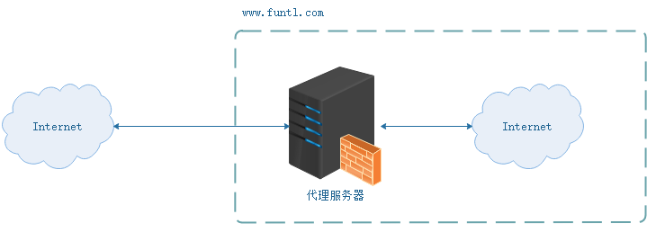

# Nginx

​	　Nginx 是一个**高性能的HTTP和反向代理web服务器**，同时也提供了IMAP/POP3/SMTP服务。Nginx 是用于**页面的软负载均衡**，能够支撑 5 万并发链接；Zuul是用于**API的软负载均衡**。若并发过大，建议使用**硬负载**，如`F5负载均衡服务器`。

​	　Nginx 可以实现**CDN静态资源分发网络**；可以实现在**一台服务器虚拟出多个网站**；也可以在服务器集群中实现**反向代理、负载均衡**。


**参考资料：**

- [Nginx官网](https://www.nginx.com/)

## 简介

​	　代理服务器，客户机在发送请求时，不会直接发送给目的主机，而是先发送给代理服务器，代理服务接受客户机请求之后，再向主机发出，并接收目的主机返回的数据，存放在代理服务器的硬盘中，再发送给客户机。


​	　代理服务器可以**提高访问速度**。由于目标主机返回的数据会存放在代理服务器的硬盘中，因此下一次客户再访问相同的站点数据时，会直接从代理服务器的硬盘中读取，起到了缓存的作用，尤其对于热门站点能明显提高请求速度。

​	　代理服务器可以起到**防火墙**的作用。由于所有的客户机请求都必须通过代理服务器访问远程站点，因此可在代理服务器上设限，过滤某些不安全信息。

​	　可以**通过代理服务器访问不能访问的目标站点**。互联网上有许多开放的代理服务器，客户机在访问受限时，可通过不受限的代理服务器访问目标站点（局域网、外网）。

（1）正向代理

​	　正向代理，**架设在客户机与目标主机之间**，只用于代理内部网络对 Internet 的连接请求，客户机必须指定代理服务器，并将本来要直接发送到 Web 服务器上的 Http 请求发送到代理服务器中。


（2）反向代理

​	　反向代理服务器**架设在服务器端**，通过缓冲经常被请求的页面来缓解服务器的工作量，将客户机请求转发给内部网络上的目标服务器；并将从服务器上得到的结果返回给 Internet 上请求连接的客户端，此时**代理服务器与目标主机一起对外表现为一个服务器**。



​	　现在许多大型 web 网站都用到反向代理。除了可以防止外网对内网服务器的恶性攻击、缓存以减少服务器的压力和访问安全控制之外，还可以进行负载均衡，将用户请求分配给多个服务器。


## 快速开始

​	　新增`docker-compose.yml` 配置文件，然后执行启动命令`docker-compose up -d`启动即可。

```yaml
version: '3.1'
services:
  nginx:
    image: nginx
    container_name: nginx
    restart: always
    ports:
      - 80:80
    environment:
      TZ: Asia/Shanghai
    volumes:
      - /etc/docker/nginx/config/nginx.conf:/etc/nginx/nginx.conf # nginx.conf 配置
      - /etc/docker/nginx/logs:/var/log/nginx # 日志
      - /etc/docker/nginx/html:/usr/share/nginx/html # 静态资源
```


## Nginx实践

### 虚拟主机

​	　虚拟主机是一种特殊的软硬件技术，它可以**将网络上的每一台计算机分成多个虚拟主机**，**每个虚拟主机可以独立对外提供 www 服务**，这样就可以**实现一台主机对外提供多个 web 服务**，每个虚拟主机之间是独立的，互不影响的。

​	　通过 Nginx 可以实现虚拟主机的配置，**每个 server 就是一个虚拟主机**。Nginx 支持三种类型的虚拟主机配置，基于 IP 的虚拟主机、基于域名的虚拟主机、基于端口的虚拟主机。

（1）基于域名的虚拟主机配置

```properties
# web服务1
server {
        listen       80;
        server_name  admin.web.itoken.funtl.com;
        location /admin {
        root   /usr/share/admin/wwwroot/;
        index  index.html index.htm;
    }
}

# web服务2
server {
        listen       80;
        server_name  customer.web.itoken.funtl.com;
        location /customer {
        root   /usr/share/customer/wwwroot/;
        index  index.html index.htm;
    }
}
```


（2）基于端口的虚拟主机配置

```properties
server {
    # 配置监听端口
    listen       80;
    server_name  192.168.75.145;
    location /system {
        # 使用 root 指令指定虚拟主机目录,即网页存放目录
        root   /usr/share/system/wwwroot/;
        # 指定欢迎页面，按从左到右顺序查找
        index  index.html index.htm;
    }
}
```


### 反向代理

```properties
# 配置一个代理即 tomcat1 服务器
# upstream 配置中的名称不可以有下划线("_")
upstream tomcatServer1 {
    # 可使用 IP:port 或者 域名 配置代理
	server 192.168.75.145:9090;
}

# 配置一个虚拟主机
server {
    listen 80;
    server_name admin.service.itoken.funtl.com;
    location / {
        # 域名 admin.service.itoken.funtl.com 的请求全部转发到tomcatServer1上
        proxy_pass http://tomcatServer1;
        # 欢迎页面，按照从左到右的顺序查找页面
        index index.jsp index.html index.htm;
    }
}
```


### 负载均衡

​	　Nginx 作为负载均衡服务器，用户请求先到达 Nginx ，再由 Nginx 根据负载配置将请求转发至 Tomcat 服务器。从而扩展网络设备和服务器的带宽、增加吞吐量、加强网络数据处理能力、提高网络的灵活性和可用性。

​	　Nginx支持同时设置多组的负载均衡，用来给不用的server来使用。

（1）轮询（默认）

​	　每个请求按时间顺序逐一分配到不同的后端服务器，如果后端服务器down掉，能自动剔除。

```properties
# upstream 定义负载均衡设备的 Ip及设备状态 
upstream myServer {
    server 192.168.75.145:9090;
    server 192.168.75.145:9091;
}
```

（2）weight

​	　指定轮询几率，weight和访问比率成正比。默认为 1 ,weight 越大，负载的权重就越大。用于后端服务器性能不均的情况。

```properties
# upstream 定义负载均衡设备的 Ip及设备状态 
upstream myServer {
    server 192.168.75.145:9090 weight=10;
    server 192.168.75.145:9091 weight=10;
    server 192.168.75.145:9092;
}

 # down：表示当前的 server 暂时不参与负载
		server 127.0.0.1:9090 down;
        # backup：其它所有的非backup机器,down或者忙的时候，才会请求backup机器
        server 127.0.0.1:7070 backup;
        # max_fails：允许请求失败的次数,默认为1,当超过最大次数时，返回 proxy_next_upstream 模块定义的错误
        # fail_timeout：max_fails次失败后，暂停的时间
        server 127.0.0.1:18080 max_fails=10 fail_timeout=60s;  
```

（3）ip_hash
	　**每个请求按访问ip的hash结果分配**，这样每个访客固定访问一个后端服务器，可以解决session的问题。

```properties
# upstream 定义负载均衡设备的 Ip及设备状态 
upstream myServer {
    ip_hash;
    server 192.168.75.145:9090;
    server 192.168.75.145:9091;
}
```


（4）fair（第三方）
	　按后端服务器的响应时间来分配请求，响应时间短的优先分配。

```properties
# upstream 定义负载均衡设备的 Ip及设备状态 
upstream myServer {
    server server1.linuxany.com;
    server server2.linuxany.com;
    fair;
}
```


**5、url_hash（第三方）
**
按访问url的hash结果来分配请求，使每个url定向到同一个后端服务器，后端服务器为缓存时比较有效。

例：在upstream中加入hash语句，server语句中不能写入weight等其他的参数，hash_method是使用的hash算法

复制代码代码如下:


upstream backend {
server squid1:3128;
server squid2:3128;
hash $request_uri;
hash_method crc32;
}
\#定义负载均衡设备的Ip及设备状态
upstream backend{
ip_hash;
server 127.0.0.1:9090 down;
server 127.0.0.1:8080 weight=2;
server 127.0.0.1:6060;
server 127.0.0.1:7070 backup;
}


```properties
user  nginx;
worker_processes  1;

events {
    worker_connections  1024;
}

http {
    include       mime.types;
    default_type  application/octet-stream;
    sendfile        on;
    keepalive_timeout  65;
	
	# 定义负载均衡设备的 Ip及设备状态 
	# upstream：每个设备的状态
	upstream myServer {
	    # down：表示当前的 server 暂时不参与负载
		server 127.0.0.1:9090 down;
		# weight：默认为 1 ,weight 越大，负载的权重就越大
        server 127.0.0.1:8080 weight=2;
        server 127.0.0.1:6060;
        # backup：其它所有的非backup机器,down或者忙的时候，才会请求backup机器
        server 127.0.0.1:7070 backup;
        # max_fails：允许请求失败的次数,默认为1,当超过最大次数时，返回 proxy_next_upstream 模块定义的错误
        # fail_timeout：max_fails次失败后，暂停的时间
        server 127.0.0.1:18080 max_fails=10 fail_timeout=60s;    
	}
	
	upstream backend {
ip_hash;
server 192.168.0.14:88;
server 192.168.0.15:80;
}
	
	upstream backend {
        server squid1:3128;
        server squid2:3128;
        hash $request_uri;
        hash_method crc32;
    }

	server {
		listen 80;
		server_name nginx.funtl.com;
		location / {
			proxy_pass http://myServer;
			index index.jsp index.html index.htm;
		}
	}
}
```


## 附录

### nginx.conf

```properties
user  nginx;
# CPU内核数量
worker_processes  auto;

error_log  /var/log/nginx/error.log notice;
pid        /var/run/nginx.pid;

events {
    # 一个子线程下的连接数
    worker_connections  1024;
}

http {
    include       /etc/nginx/mime.types;
    default_type  application/octet-stream;
    sendfile        on;
    keepalive_timeout  65;

    log_format  main  '$remote_addr - $remote_user [$time_local] "$request" '
                      '$status $body_bytes_sent "$http_referer" '
                      '"$http_user_agent" "$http_x_forwarded_for"';

    access_log  /var/log/nginx/access.log  main;

    server {
		listen       80;
		listen  [::]:80;
		server_name  localhost;

		location / {
			root   /usr/share/nginx/html;

			index  index.html index.htm;
			# 此处的 @router 实际上是引用下面的转发，否则在 Vue 路由刷新时可能会抛出 404
			try_files $uri $uri/ @router;
		}
			
		# 由于路由的资源不一定是真实的路径，无法找到具体文件
		# 所以需要将请求重写到 index.html 中，然后交给真正的 Vue 路由处理请求资源
		location @router {
			rewrite ^.*$ /index.html last;
		}

		location /api {
			proxy_pass http://127.0.0.1:8080/api;
			add_header Access-Control-Allow-Origin *;
			add_header Access-Control-Allow-Methods 'GET, POST, OPTIONS';
			add_header Access-Control-Allow-Headers 'DNT,X-Mx-ReqToken,Keep-Alive,User-Agent,X-Requested-With,If-Modified-Since,Cache-Control,Content-Type,Authorization';
			client_max_body_size 1024m;
			client_body_buffer_size 1024k;
			proxy_buffer_size 1024k;
			proxy_buffers 6 500k;
			proxy_busy_buffers_size 1024k;
			proxy_temp_file_write_size 1024k;

			if ($request_method = 'OPTIONS') {
			   return 204;
			}
	   }
	   error_page   500 502 503 504  /50x.html;
		location = /50x.html {
			root   /usr/share/nginx/html;
	   } 
	}
}
```

