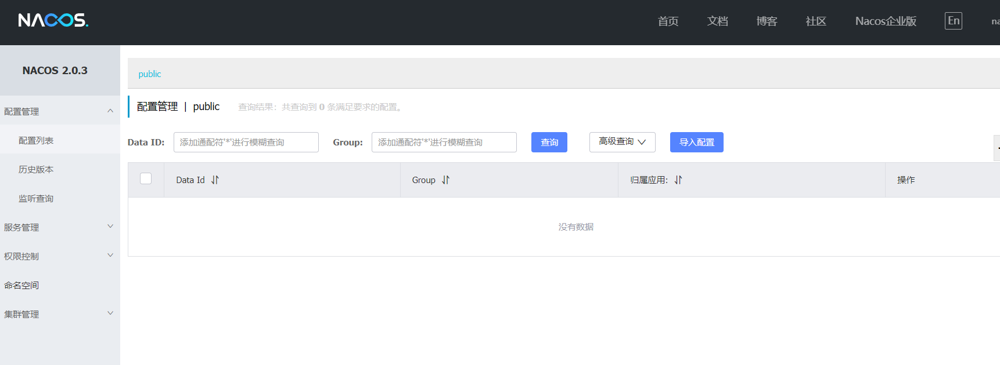
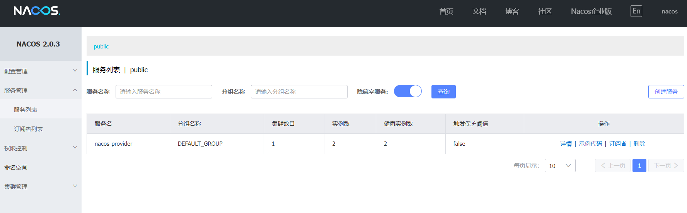
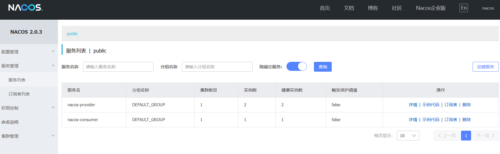
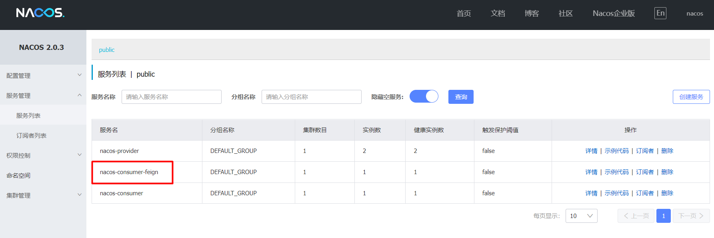
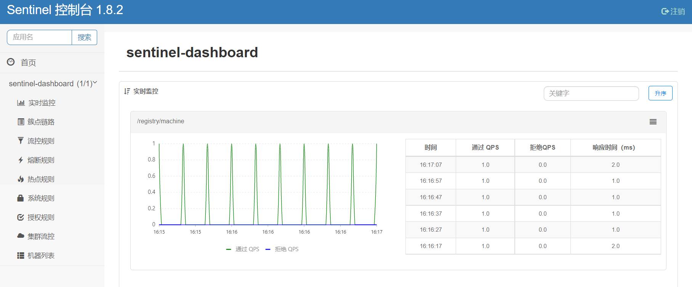
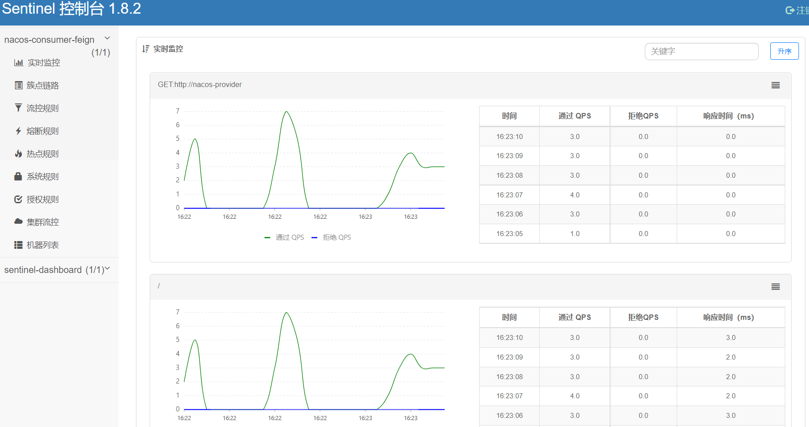

# Spring Cloud Alibaba


## 简介

​	　Spring Cloud Alibaba是微服务一站式开发的**全新生态解决方案**，方便开发者通过 Spring Cloud 编程模型轻松使用**阿里开源组件**来开发分布式应用服务。

​	　Spring Cloud Alibaba为我们提供了**服务限流降级**、**服务注册与发现**、**分布式配置管理**、**消息驱动能力**、**阿里云对象存储**、**分布式任务调度**等功能。版本说明参考[Spring Cloud 版本说明](https://github.com/alibaba/spring-cloud-alibaba/wiki/%E7%89%88%E6%9C%AC%E8%AF%B4%E6%98%8E#%E6%AF%95%E4%B8%9A%E7%89%88%E6%9C%AC%E4%BE%9D%E8%B5%96%E5%85%B3%E7%B3%BB%E6%8E%A8%E8%8D%90%E4%BD%BF%E7%94%A8)。


**参考资料：**

- [Spring Cloud Alibaba GitHub](https://github.com/alibaba/spring-cloud-alibaba/blob/master/README-zh.md)
- [Nacos官网](https://nacos.io/zh-cn/)


## 统一的依赖管理

​	　首先，新建统一的依赖管理`springcloud-alibaba-dependencies`。

```xml{9,25,26,30-45}
<?xml version="1.0" encoding="UTF-8"?>
<project xmlns="http://maven.apache.org/POM/4.0.0" xmlns:xsi="http://www.w3.org/2001/XMLSchema-instance"
         xsi:schemaLocation="http://maven.apache.org/POM/4.0.0 http://maven.apache.org/xsd/maven-4.0.0.xsd">
    <modelVersion>4.0.0</modelVersion>

    <parent>
        <groupId>org.springframework.boot</groupId>
        <artifactId>spring-boot-starter-parent</artifactId>
        <version>2.0.6.RELEASE</version>
    </parent>

    <groupId>com.shooter.funtl</groupId>
    <artifactId>springcloud-alibaba-dependencies</artifactId>
    <name>springcloud-alibaba-dependencies</name>
    <version>1.0.0-SNAPSHOT</version>
    <packaging>pom</packaging>

    <properties>
        <!-- Environment Settings -->
        <java.version>1.8</java.version>
        <project.build.sourceEncoding>UTF-8</project.build.sourceEncoding>
        <project.reporting.outputEncoding>UTF-8</project.reporting.outputEncoding>

        <!-- Spring Settings -->
        <spring-cloud.version>Finchley.SR2</spring-cloud.version>
        <spring-cloud-alibaba.version>0.2.1.RELEASE</spring-cloud-alibaba.version>
    </properties>

    <dependencyManagement>
        <dependencies>
            <dependency>
                <groupId>org.springframework.cloud</groupId>
                <artifactId>spring-cloud-dependencies</artifactId>
                <version>${spring-cloud.version}</version>
                <type>pom</type>
                <scope>import</scope>
            </dependency>
            <dependency>
                <groupId>org.springframework.cloud</groupId>
                <artifactId>spring-cloud-alibaba-dependencies</artifactId>
                <version>${spring-cloud-alibaba.version}</version>
                <type>pom</type>
                <scope>import</scope>
            </dependency>
        </dependencies>
    </dependencyManagement>

    <build>
        <plugins>
            <!-- Compiler 插件, 设定 JDK 版本 -->
            <plugin>
                <groupId>org.apache.maven.plugins</groupId>
                <artifactId>maven-compiler-plugin</artifactId>
                <configuration>
                    <showWarnings>true</showWarnings>
                </configuration>
            </plugin>

            <!-- 打包 jar 文件时，配置 manifest 文件，加入 lib 包的 jar 依赖 -->
            <plugin>
                <groupId>org.apache.maven.plugins</groupId>
                <artifactId>maven-jar-plugin</artifactId>
                <configuration>
                    <archive>
                        <addMavenDescriptor>false</addMavenDescriptor>
                    </archive>
                </configuration>
                <executions>
                    <execution>
                        <configuration>
                            <archive>
                                <manifest>
                                    <!-- Add directory entries -->
                                    <addDefaultImplementationEntries>true</addDefaultImplementationEntries>
                                    <addDefaultSpecificationEntries>true</addDefaultSpecificationEntries>
                                    <addClasspath>true</addClasspath>
                                </manifest>
                            </archive>
                        </configuration>
                    </execution>
                </executions>
            </plugin>

            <!-- resource -->
            <plugin>
                <groupId>org.apache.maven.plugins</groupId>
                <artifactId>maven-resources-plugin</artifactId>
            </plugin>

            <!-- install -->
            <plugin>
                <groupId>org.apache.maven.plugins</groupId>
                <artifactId>maven-install-plugin</artifactId>
            </plugin>

            <!-- clean -->
            <plugin>
                <groupId>org.apache.maven.plugins</groupId>
                <artifactId>maven-clean-plugin</artifactId>
            </plugin>

            <!-- ant -->
            <plugin>
                <groupId>org.apache.maven.plugins</groupId>
                <artifactId>maven-antrun-plugin</artifactId>
            </plugin>

            <!-- dependency -->
            <plugin>
                <groupId>org.apache.maven.plugins</groupId>
                <artifactId>maven-dependency-plugin</artifactId>
            </plugin>
        </plugins>

        <pluginManagement>
            <plugins>
                <!-- Java Document Generate -->
                <plugin>
                    <groupId>org.apache.maven.plugins</groupId>
                    <artifactId>maven-javadoc-plugin</artifactId>
                    <executions>
                        <execution>
                            <phase>prepare-package</phase>
                            <goals>
                                <goal>jar</goal>
                            </goals>
                        </execution>
                    </executions>
                </plugin>

                <!-- YUI Compressor (CSS/JS压缩) -->
                <plugin>
                    <groupId>net.alchim31.maven</groupId>
                    <artifactId>yuicompressor-maven-plugin</artifactId>
                    <version>1.5.1</version>
                    <executions>
                        <execution>
                            <phase>prepare-package</phase>
                            <goals>
                                <goal>compress</goal>
                            </goals>
                        </execution>
                    </executions>
                    <configuration>
                        <encoding>UTF-8</encoding>
                        <jswarn>false</jswarn>
                        <nosuffix>true</nosuffix>
                        <linebreakpos>30000</linebreakpos>
                        <force>true</force>
                        <includes>
                            <include>**/*.js</include>
                            <include>**/*.css</include>
                        </includes>
                        <excludes>
                            <exclude>**/*.min.js</exclude>
                            <exclude>**/*.min.css</exclude>
                        </excludes>
                    </configuration>
                </plugin>
            </plugins>
        </pluginManagement>

        <!-- 资源文件配置 -->
        <resources>
            <resource>
                <directory>src/main/java</directory>
                <excludes>
                    <exclude>**/*.java</exclude>
                </excludes>
            </resource>
            <resource>
                <directory>src/main/resources</directory>
            </resource>
        </resources>
    </build>

    <repositories>
        <repository>
            <id>aliyun-repos</id>
            <name>Aliyun Repository</name>
            <url>http://maven.aliyun.com/nexus/content/groups/public</url>
            <releases>
                <enabled>true</enabled>
            </releases>
            <snapshots>
                <enabled>false</enabled>
            </snapshots>
        </repository>

        <repository>
            <id>sonatype-repos</id>
            <name>Sonatype Repository</name>
            <url>https://oss.sonatype.org/content/groups/public</url>
            <releases>
                <enabled>true</enabled>
            </releases>
            <snapshots>
                <enabled>false</enabled>
            </snapshots>
        </repository>
        <repository>
            <id>sonatype-repos-s</id>
            <name>Sonatype Repository</name>
            <url>https://oss.sonatype.org/content/repositories/snapshots</url>
            <releases>
                <enabled>false</enabled>
            </releases>
            <snapshots>
                <enabled>true</enabled>
            </snapshots>
        </repository>

        <repository>
            <id>spring-snapshots</id>
            <name>Spring Snapshots</name>
            <url>https://repo.spring.io/snapshot</url>
            <snapshots>
                <enabled>true</enabled>
            </snapshots>
        </repository>
        <repository>
            <id>spring-milestones</id>
            <name>Spring Milestones</name>
            <url>https://repo.spring.io/milestone</url>
            <snapshots>
                <enabled>false</enabled>
            </snapshots>
        </repository>
    </repositories>

    <pluginRepositories>
        <pluginRepository>
            <id>aliyun-repos</id>
            <name>Aliyun Repository</name>
            <url>http://maven.aliyun.com/nexus/content/groups/public</url>
            <releases>
                <enabled>true</enabled>
            </releases>
            <snapshots>
                <enabled>false</enabled>
            </snapshots>
        </pluginRepository>
    </pluginRepositories>
</project>
```


## 服务注册与发现

​	　Spring Cloud Alibaba 使用 `Nacos` 作为**服务注册与发现**服务器，实现动态服务发现、服务配置、服务元数据及流量管理。

​	　Nacos是一个**独立的服务**，不由开发者开发和维护；通过**端点检查**来判断服务是否在线；消费者可以通过**服务名**向Nacos获取`服务提供者的IP`和`端口`；`Nacos`实现了**高可用**，而`Fegin`实现了负载均衡。


（1）使用官网推荐的方式安装

​	　首先，[下载](https://github.com/alibaba/nacos/releases)安装包，下载完成后，上传到部署目录，解压启动即可。

```shell
# 解压
unzip nacos-server-2.0.3.zip
cd nacos/bin 
# 启动服务
sh startup.sh -m standalone
```

（2）从代码开始构建并运行 Nacos

```shell
# 下载源码
git clone https://github.com/alibaba/nacos.git
# 安装到本地仓库
cd nacos/
# 使用 release-nacos 参数安装(-P 多环境配置)
mvn -Prelease-nacos clean install -U
# 进入启动目录
cd distribution/target/nacos-server-0.7.0/nacos/bin
# 启动服务
./startup.sh -m standalone
```

​	　打开 `http://101.43.15.250:8848/nacos`，输入默认账号密码为 `nacos/nacos` 即可访问。




## 服务提供者

​	　首先，创建一个工程名为 `springcloud-alibaba-provider` 的服务提供者项目。

```xml{35-38}
<?xml version="1.0" encoding="UTF-8"?>
<project xmlns="http://maven.apache.org/POM/4.0.0" xmlns:xsi="http://www.w3.org/2001/XMLSchema-instance"
         xsi:schemaLocation="http://maven.apache.org/POM/4.0.0 http://maven.apache.org/xsd/maven-4.0.0.xsd">
    <modelVersion>4.0.0</modelVersion>

    <parent>
        <groupId>com.shooter.funtl</groupId>
        <artifactId>springcloud-alibaba-dependencies</artifactId>
        <version>1.0.0-SNAPSHOT</version>
        <relativePath>../springcloud-alibaba-dependencies/pom.xml</relativePath>
    </parent>

    <artifactId>springcloud-alibaba-provider</artifactId>
    <name>springcloud-alibaba-provider</name>
    <packaging>jar</packaging>

    <dependencies>
        <!-- Spring Boot Begin -->
        <dependency>
            <groupId>org.springframework.boot</groupId>
            <artifactId>spring-boot-starter-web</artifactId>
        </dependency>
        <dependency>
            <groupId>org.springframework.boot</groupId>
            <artifactId>spring-boot-starter-actuator</artifactId>
        </dependency>
        <dependency>
            <groupId>org.springframework.boot</groupId>
            <artifactId>spring-boot-starter-test</artifactId>
            <scope>test</scope>
        </dependency>
        <!-- Spring Boot End -->

        <!-- Spring Cloud Begin -->
        <dependency>
            <groupId>org.springframework.cloud</groupId>
            <artifactId>spring-cloud-starter-alibaba-nacos-discovery</artifactId>
        </dependency>
        <!-- Spring Cloud End -->
    </dependencies>

    <build>
        <plugins>
            <plugin>
                <groupId>org.springframework.boot</groupId>
                <artifactId>spring-boot-maven-plugin</artifactId>
                <configuration>
                    <mainClass>
                        com.shooter.funtl.springcloud.alibaba.provider.NacosProviderApplication
                    </mainClass>
                </configuration>
            </plugin>
        </plugins>
    </build>
</project>
```

​	　通过 `@EnableDiscoveryClient` 注解表明是一个 `Nacos` 客户端，该注解是 `Spring Cloud` 提供的原生注解。

```java{8}
package com.shooter.funtl.springcloud.alibaba.provider;

import org.springframework.boot.SpringApplication;
import org.springframework.boot.autoconfigure.SpringBootApplication;
import org.springframework.cloud.client.discovery.EnableDiscoveryClient;

@SpringBootApplication
@EnableDiscoveryClient
public class NacosProviderApplication {
    public static void main(String[] args) {
        SpringApplication.run(NacosProviderApplication.class, args);
    }
}
```

​	　在`resources`目录下新建`bootstrap.yml`，并进行如下配置。

```yaml
spring:
  application:
    name: nacos-provider
  cloud:
    nacos:
      discovery:
        # Nacos Server 启动监听的ip地址和端口
        server-addr: 101.43.15.250:8848

server:
  port: 8081
```

​	　最后，新建`IndexController`控制器。

```java
package com.shooter.funtl.springcloud.alibaba.provider.controller;

import org.springframework.beans.factory.annotation.Value;
import org.springframework.web.bind.annotation.GetMapping;
import org.springframework.web.bind.annotation.PathVariable;
import org.springframework.web.bind.annotation.RestController;

@RestController
public class IndexController {

    @Value("${server.port}")
    private String port;

    @GetMapping(value = "/{message}")
    public String index(@PathVariable String message) {
        return String.format("Service Provider port is : %s from %s", port,message);
    }
}
```

​	　至此，服务提供者已经配置完成。[启动](http://localhost:8001/college/guide/course/funtl/framework/idea.html#jar部署)两个`springcloud-alibaba-provider`实例，再次刷新`Nacos`，即可看见服务已经注册成功了。



​	　浏览器中访问`8081`和`8082`端口，就可以获取请求结果了。

```shell
- http://localhost:8081/hi  访问服务实例1
- http://localhost:8082/hi  访问服务实例2
# EndPoint 显示subscribe（服务订阅者）和 NacosDiscoveryProperties（基础配置）信息
- http://localhost:8081/actuator/nacos-discovery
```


## 服务消费者

### Consumer

​	　首先，创建一个工程名为 `springcloud-alibaba-consumer ` 的服务提供者项目。服务消费者第一种实现方式，是通过 `LoadBalanceClient` 和 `RestTemplate` 实现的。

```xml
<?xml version="1.0" encoding="UTF-8"?>
<project xmlns="http://maven.apache.org/POM/4.0.0" xmlns:xsi="http://www.w3.org/2001/XMLSchema-instance"
         xsi:schemaLocation="http://maven.apache.org/POM/4.0.0 http://maven.apache.org/xsd/maven-4.0.0.xsd">
    <modelVersion>4.0.0</modelVersion>

    <parent>
        <groupId>com.shooter.funtl</groupId>
        <artifactId>springcloud-alibaba-dependencies</artifactId>
        <version>1.0.0-SNAPSHOT</version>
        <relativePath>../springcloud-alibaba-dependencies/pom.xml</relativePath>
    </parent>

    <artifactId>springcloud-alibaba-consumer</artifactId>
    <name>springcloud-alibaba-consumer</name>
    <packaging>jar</packaging>

    <dependencies>
        <!-- Spring Boot Begin -->
        <dependency>
            <groupId>org.springframework.boot</groupId>
            <artifactId>spring-boot-starter-web</artifactId>
        </dependency>
        <dependency>
            <groupId>org.springframework.boot</groupId>
            <artifactId>spring-boot-starter-actuator</artifactId>
        </dependency>
        <dependency>
            <groupId>org.springframework.boot</groupId>
            <artifactId>spring-boot-starter-test</artifactId>
            <scope>test</scope>
        </dependency>
        <!-- Spring Boot End -->

        <!-- Spring Cloud Begin -->
        <dependency>
            <groupId>org.springframework.cloud</groupId>
            <artifactId>spring-cloud-starter-alibaba-nacos-discovery</artifactId>
        </dependency>
        <!-- Spring Cloud End -->
    </dependencies>

    <build>
        <plugins>
            <plugin>
                <groupId>org.springframework.boot</groupId>
                <artifactId>spring-boot-maven-plugin</artifactId>
                <configuration>
                    <mainClass>
                        com.shooter.funtl.springcloud.alibaba.consumer.NacosConsumerApplication
                    </mainClass>
                </configuration>
            </plugin>
        </plugins>
    </build>
</project>
```

​	　然后，通过`@EnableDiscoveryClient`注解表明这是一个`Nacos`客户端。

```java{8}
package com.shooter.funtl.springcloud.alibaba.consumer;

import org.springframework.boot.SpringApplication;
import org.springframework.boot.autoconfigure.SpringBootApplication;
import org.springframework.cloud.client.discovery.EnableDiscoveryClient;

@SpringBootApplication
@EnableDiscoveryClient
public class NacosConsumerApplication {
    public static void main(String[] args) {
        SpringApplication.run(NacosConsumerApplication.class, args);
    }
}
```

​	　然后，在`resources`目录下新建`bootstrap.yml`，并进行如下配置。

```yaml
spring:
  application:
    name: nacos-consumer
  cloud:
    nacos:
      discovery:
        server-addr: 101.43.15.250:8848

server:
  port: 9091
```

​	　接下来，新建 `NacosConsumerConfiguration`配置类注入 `RestTemplate`。

```java
package com.shooter.funtl.springcloud.alibaba.consumer.config;

import org.springframework.context.annotation.Bean;
import org.springframework.context.annotation.Configuration;
import org.springframework.web.client.RestTemplate;

@Configuration
public class NacosConsumerConfiguration {
    @Bean
    public RestTemplate restTemplate() {
        return new RestTemplate();
    }
}
```

​	　最后，新建`IndexController`控制器。

```java
package com.shooter.funtl.springcloud.alibaba.consumer.controller;

import org.springframework.beans.factory.annotation.Autowired;
import org.springframework.cloud.client.ServiceInstance;
import org.springframework.cloud.client.loadbalancer.LoadBalancerClient;
import org.springframework.web.bind.annotation.GetMapping;
import org.springframework.web.bind.annotation.RestController;
import org.springframework.web.client.RestTemplate;

@RestController
public class IndexController {

    @Autowired
    private LoadBalancerClient loadBalancerClient;

    @Autowired
    private RestTemplate restTemplate;

    @GetMapping(value = "")
    public String echo() {
        //使用 LoadBalanceClient 和 RestTemplate 结合的方式来访问
        ServiceInstance serviceInstance = loadBalancerClient.choose("nacos-provider");
        String url = String.format("http://%s:%s/%s",
                  serviceInstance.getHost(), serviceInstance.getPort(),"Consumer");
        return restTemplate.getForObject(url, String.class);
    }
}
```

​	　至此，服务消费者已经配置完成了，启动项目，在浏览器上多次访问 `http://127.0.0.1:9091/`，请求成功则表示已经成功**实现了负载均衡功能，来访问不同端口的实例**。

```
This Service Provider port is : 8081 from Consumer
This Service Provider port is : 8082 from Consumer
```

​	　另外，也可在Nacos查看到`nacos-consumer`信息，或 访问 [这里](http://localhost:9091/actuator/nacos-discovery)查看服务消费者的**服务端点**信息。




### Feign

​	　首先，创建一个工程名为 `springcloud-alibaba-feign` 的服务提供者项目。

```xml{39-42}
<?xml version="1.0" encoding="UTF-8"?>
<project xmlns="http://maven.apache.org/POM/4.0.0" xmlns:xsi="http://www.w3.org/2001/XMLSchema-instance"
         xsi:schemaLocation="http://maven.apache.org/POM/4.0.0 http://maven.apache.org/xsd/maven-4.0.0.xsd">
    <modelVersion>4.0.0</modelVersion>

    <parent>
        <groupId>com.shooter.funtl</groupId>
        <artifactId>springcloud-alibaba-dependencies</artifactId>
        <version>1.0.0-SNAPSHOT</version>
        <relativePath>../springcloud-alibaba-dependencies/pom.xml</relativePath>
    </parent>

    <artifactId>springcloud-alibaba-feign</artifactId>
    <name>springcloud-alibaba-feign</name>
    <packaging>jar</packaging>

    <dependencies>
        <!-- Spring Boot Begin -->
        <dependency>
            <groupId>org.springframework.boot</groupId>
            <artifactId>spring-boot-starter-web</artifactId>
        </dependency>
        <dependency>
            <groupId>org.springframework.boot</groupId>
            <artifactId>spring-boot-starter-actuator</artifactId>
        </dependency>
        <dependency>
            <groupId>org.springframework.boot</groupId>
            <artifactId>spring-boot-starter-test</artifactId>
            <scope>test</scope>
        </dependency>
        <!-- Spring Boot End -->

        <!-- Spring Cloud Begin -->
        <dependency>
            <groupId>org.springframework.cloud</groupId>
            <artifactId>spring-cloud-starter-alibaba-nacos-discovery</artifactId>
        </dependency>
        <dependency>
            <groupId>org.springframework.cloud</groupId>
            <artifactId>spring-cloud-starter-openfeign</artifactId>
        </dependency>
        <!-- Spring Cloud End -->
    </dependencies>

    <build>
        <plugins>
            <plugin>
                <groupId>org.springframework.boot</groupId>
                <artifactId>spring-boot-maven-plugin</artifactId>
                <configuration>
                    <mainClass>
                        com.shooter.funtl.springcloud.alibaba.feign.NacosConsumerFeignApplication
                    </mainClass>
                </configuration>
            </plugin>
        </plugins>
    </build>
</project>
```

​	　通过 `@EnableFeignClients` 注解开启 `Feign` 功能

```java{10}
package com.shooter.funtl.springcloud.alibaba.feign;

import org.springframework.boot.SpringApplication;
import org.springframework.boot.autoconfigure.SpringBootApplication;
import org.springframework.cloud.client.discovery.EnableDiscoveryClient;
import org.springframework.cloud.openfeign.EnableFeignClients;

@SpringBootApplication
@EnableDiscoveryClient
@EnableFeignClients
public class NacosConsumerFeignApplication {
    public static void main(String[] args) {
        SpringApplication.run(NacosConsumerFeignApplication.class, args);
    }
}
```

​	　在`resources`目录下新建`bootstrap.yml`，并进行如下配置。

```yaml
spring:
  application:
    name: nacos-consumer-feign
  cloud:
    nacos:
      discovery:
        server-addr: 101.43.15.250:8848

server:
  port: 9092
```

​	　通过 `@FeignClient("服务名")` 注解来指定调用哪个服务。

```java{8}
package com.shooter.funtl.springcloud.alibaba.feign.service;

import com.shooter.funtl.springcloud.alibaba.feign.config.SentinelServiceFallback;
import org.springframework.cloud.openfeign.FeignClient;
import org.springframework.web.bind.annotation.GetMapping;
import org.springframework.web.bind.annotation.PathVariable;

@FeignClient(value = "nacos-provider")
public interface IndexService {

    @GetMapping("/{message}")
    String hi(@PathVariable("message")String message);
}
```

​	　在`IndexController`中测试负载均衡是否生效。

```java
package com.shooter.funtl.springcloud.alibaba.feign.controller;

import com.shooter.funtl.springcloud.alibaba.feign.service.IndexService;
import org.springframework.beans.factory.annotation.Autowired;
import org.springframework.web.bind.annotation.GetMapping;
import org.springframework.web.bind.annotation.RestController;

@RestController
public class IndexController {

    @Autowired
    private IndexService indexService;

    @GetMapping(value = "")
    public String echo() {
        return indexService.hi("Feign");
    }
}
```

​	　至此，`Feign`已经配置完成了，启动项目，在浏览器上多次访问 `http://127.0.0.1:9092/`，请求成功则表示已经成功**实现了负载均衡功能，来访问不同端口的实例**。

```
This Service Provider port is : 8081 from Feign
This Service Provider port is : 8082 from Feign
```

​	　另外，也可在Nacos查看到`nacos-consumer-feign`信息，或 访问 [这里](http://localhost:9092/actuator/nacos-discovery)查看服务消费者的服务端点信息。




## 路由网关

​	　Spring Cloud Gateway 是 Spring 官方基于 Spring 5.0等技术开发的网关，不仅提供统一的路由方式，并且基于 `Filter链`的方式提供了网关基本的功能，例如：安全，监控/埋点，和限流等。

​	　客户端向 `Spring Cloud Gateway` 发出请求。然后在 `Gateway Handler Mapping` 中找到与请求相匹配的路由，将其发送到 `Gateway Web Handler`。`Handler` 再通过指定的过滤器链来将请求发送到我们实际的服务执行业务逻辑，然后返回。

​	　Spring Cloud Gateway 不使用 Web 作为服务器，而是 **使用 WebFlux 作为服务器**，Gateway 项目已经依赖了 `starter-webflux`，所以这里 **千万不要依赖 `starter-web`**。另外，由于过滤器等功能依然需要 Servlet 支持，故这里还需要依赖 `javax.servlet:javax.servlet-api`。


### 统一访问接口

​	　首先，创建一个工程名为 `springcloud-gateway ` 的服务提供者项目。

```xml
<?xml version="1.0" encoding="UTF-8"?>
<project xmlns="http://maven.apache.org/POM/4.0.0" xmlns:xsi="http://www.w3.org/2001/XMLSchema-instance"
         xsi:schemaLocation="http://maven.apache.org/POM/4.0.0 http://maven.apache.org/xsd/maven-4.0.0.xsd">
    <modelVersion>4.0.0</modelVersion>

    <parent>
        <groupId>com.shooter.funtl</groupId>
        <artifactId>springcloud-alibaba-dependencies</artifactId>
        <version>1.0.0-SNAPSHOT</version>
        <relativePath>../springcloud-alibaba-dependencies/pom.xml</relativePath>
    </parent>

    <artifactId>springcloud-gateway</artifactId>
    <name>springcloud-gateway</name>
    <packaging>jar</packaging>

    <dependencies>
        <!-- Spring Boot Begin -->
        <dependency>
            <groupId>org.springframework.boot</groupId>
            <artifactId>spring-boot-starter-actuator</artifactId>
        </dependency>
        <dependency>
            <groupId>org.springframework.boot</groupId>
            <artifactId>spring-boot-starter-test</artifactId>
            <scope>test</scope>
        </dependency>
        <!-- Spring Boot End -->

        <!-- Spring Cloud Begin -->
        <dependency>
            <groupId>org.springframework.cloud</groupId>
            <artifactId>spring-cloud-starter-alibaba-nacos-discovery</artifactId>
        </dependency>
        <dependency>
            <groupId>org.springframework.cloud</groupId>
            <artifactId>spring-cloud-starter-alibaba-sentinel</artifactId>
        </dependency>
        <dependency>
            <groupId>org.springframework.cloud</groupId>
            <artifactId>spring-cloud-starter-openfeign</artifactId>
        </dependency>
        <dependency>
            <groupId>org.springframework.cloud</groupId>
            <artifactId>spring-cloud-starter-gateway</artifactId>
        </dependency>
        <!-- Spring Cloud End -->

        <!-- Commons Begin -->
        <dependency>
            <groupId>javax.servlet</groupId>
            <artifactId>javax.servlet-api</artifactId>
        </dependency>
        <!-- Commons Begin -->
    </dependencies>

    <build>
        <plugins>
            <plugin>
                <groupId>org.springframework.boot</groupId>
                <artifactId>spring-boot-maven-plugin</artifactId>
                <configuration>
                    <mainClass>
                        com.shooter.funtl.springcloud.gateway.GatewayApplication
                    </mainClass>
                </configuration>
            </plugin>
        </plugins>
    </build>
</project>
```

​	　新建`GatewayApplication`启动类。

```java
package com.shooter.funtl.springcloud.gateway;

import org.springframework.boot.SpringApplication;
import org.springframework.boot.autoconfigure.SpringBootApplication;
import org.springframework.cloud.client.discovery.EnableDiscoveryClient;
import org.springframework.cloud.openfeign.EnableFeignClients;

@SpringBootApplication
@EnableDiscoveryClient
@EnableFeignClients
public class GatewayApplication {
    public static void main(String[] args) {
        SpringApplication.run(GatewayApplication.class, args);
    }
}
```

​	　在`resources`目录下新建`bootstrap.yml`，并进行如下配置。

```yml{11-29}
spring:
  application:
    # 应用名称
    name: spring-gateway
  cloud:
    # 使用 Naoos 作为服务注册发现
    nacos:
      discovery:
        server-addr: 101.43.15.250:8848
    # 路由网关配置
    gateway:
      # 设置与服务注册发现组件结合，这样可以采用服务名的路由策略
      discovery:
        locator:
          enabled: true
      # 配置路由规则
      routes:
        # 采用自定义路由 ID（有固定用法，不同的 id 有不同的功能
        - id: NACOS-CONSUMER
          # 采用LoadBalanceClient方式请求，以 lb:// 开头，后面的是注册在Nacos上的服务名
          uri: lb://nacos-consumer
          # 主要作用是匹配用户的请求，有很多种用法
          predicates:
            # Method 方法谓词，这里是匹配 GET 和 POST 请求
            - Method=GET,POST
        - id: NACOS-CONSUMER-FEIGN
          uri: lb://nacos-consumer-feign
          predicates:
            - Method=GET,POST

server:
  port: 9000

# 配置日志级别，方别调试
logging:
  level:
    org.springframework.cloud.gateway: info
```

​	　至此，`Spring Cloud Gateway` 的路由功能已经配置完成，通过`http://路由网关IP:路由网关Port/服务名/方式`即可访问。

```shell
# 转发到consumer服务
- http://localhost:9000/nacos-consumer/ 
# 转发到feign服务
- http://localhost:9000/nacos-consumer-feign/
```


### 服务过滤功能

​	　全局过滤器作用于所有的路由，不需要单独配置，我们可以用它来实现很多统一化处理的业务需求，比如权限认证，IP 访问限制等等。

​	　实现全局过滤器，只需要实现 `GlobalFilter`, `Ordered` 接口，并在类上增加 `@Component` 注解，就可以使用过滤功能了。

```java{20,21,23}
package com.shooter.funtl.springcloud.gateway.filters;

import com.fasterxml.jackson.core.JsonProcessingException;
import com.fasterxml.jackson.databind.ObjectMapper;
import com.google.common.collect.Maps;
import org.springframework.cloud.gateway.filter.GatewayFilterChain;
import org.springframework.cloud.gateway.filter.GlobalFilter;
import org.springframework.core.Ordered;
import org.springframework.core.io.buffer.DataBuffer;
import org.springframework.http.HttpStatus;
import org.springframework.http.server.reactive.ServerHttpResponse;
import org.springframework.stereotype.Component;
import org.springframework.web.server.ServerWebExchange;
import reactor.core.publisher.Mono;
import java.util.Map;

/**
 * 鉴权过滤器
 */
@Component
public class AuthFilter implements GlobalFilter, Ordered {
    @Override
    public Mono<Void> filter(ServerWebExchange exchange, GatewayFilterChain chain) {
        String token = exchange.getRequest().getQueryParams().getFirst("token");

        if (token == null || token.isEmpty()) {
            ServerHttpResponse response = exchange.getResponse();

            // 封装错误信息
            Map<String, Object> responseData = Maps.newHashMap();
            responseData.put("code", HttpStatus.UNAUTHORIZED.value());
            responseData.put("message", "非法请求");
            responseData.put("cause", "Token is empty");

            try {
                // 将信息转换为 JSON
                ObjectMapper objectMapper = new ObjectMapper();
                byte[] data = objectMapper.writeValueAsBytes(responseData);

                // 输出错误信息到页面
                DataBuffer buffer = response.bufferFactory().wrap(data);
                response.setStatusCode(HttpStatus.UNAUTHORIZED);
                response.getHeaders().add(
                	"Content-Type", "application/json;charset=UTF-8");
                return response.writeWith(Mono.just(buffer));
            } catch (JsonProcessingException e) {
                e.printStackTrace();
            }
        }

        return chain.filter(exchange);
    }

    /**
     * 设置过滤器的执行顺序,数字越小，优先级越高
     */
    @Override
    public int getOrder() {
        return Ordered.LOWEST_PRECEDENCE;
    }
}
```

​	　重启`Spring Cloud Gateway` 服务，再次访问`http://localhost:9000/nacos-consumer/`，提示如下：

```json
{"code":401,"cause":"Token is empty","message":"非法请求"}
```

​	　加入`token`后，如，`http://localhost:9000/nacos-consumer/?token=token`，即可正常访问。


## 熔断器

​	　Sentinel是阿里提供的熔断器组件，以**流量**为切入点，从流量控制、熔断降级、系统负载保护等多个维度保护服务的稳定性。具有**丰富的应用场景** 、**完备的实时监控** 、**广泛的开源生态**、**完善的 SPI 扩展点**等特征。


### 使用熔断器防止服务雪崩

​	　在 `Feign` 中使用 `Sentinel` ，首先需要引入依赖。

```xml
<dependency>
    <groupId>org.springframework.cloud</groupId>
    <artifactId>spring-cloud-starter-alibaba-sentinel</artifactId>
</dependency>
```

​	　`Sentinel` 适配了 `Feign` 组件，但默认是关闭的，需要在配置文件中配置打开它。

```yaml
feign:
  sentinel:
    enabled: true
```

​	　然后，创建熔断器类`SentinelServiceFallback.java`，并实现对应的 `Feign` 接口。

```java
package com.shooter.funtl.springcloud.alibaba.feign.config;

import com.shooter.funtl.springcloud.alibaba.feign.service.IndexService;
import org.springframework.stereotype.Component;

@Component
public class SentinelServiceFallback implements IndexService {

    @Override
    public String hi(String message) {
        return "请检查网络,稍后再试!";
    }
}
```

​	　接着，在`Feign` 项目中的 `Service` ，增加 `fallback` 指定类。

```java{7}
package com.shooter.funtl.springcloud.alibaba.feign.service;

import com.shooter.funtl.springcloud.alibaba.feign.config.SentinelServiceFallback;
import org.springframework.cloud.openfeign.FeignClient;
import org.springframework.web.bind.annotation.GetMapping;
import org.springframework.web.bind.annotation.PathVariable;

@FeignClient(value = "nacos-provider", fallback = SentinelServiceFallback.class)
public interface IndexService {

    @GetMapping("/{message}")
    String hi(@PathVariable("message")String message);
}
```

​	　至此，熔断器已经配置完毕，关闭所有的服务提供者，访问`http://localhost:9092/`展示熔断提示。

```
请检查网络,稍后再试!
```


### 仪表盘监控

​	　`Sentinel 控制台`提供一个轻量级的控制台，它提供机器发现、单机资源实时监控、集群资源汇总，以及规则管理的功能。您只需要对应用进行简单的配置，就可以使用这些功能。特别的，集群资源汇总仅支持 `500 台`以下的应用集群，有大概 `1 - 2` 秒的延时。

​	　可以从[这里](https://github.com/alibaba/Sentinel/releases/tag/1.8.2)下载`Jar包` 或者直接拉取代码构建，然后运行 `Sentinel` 即可 。

```shell{8-11}
# 下载源码(建议下载已编译包)
git clone https://github.com/alibaba/Sentinel.git
# 编译打包
mvn clean package
# 进入部署目录
cd sentinel-dashboard\target
# 启动应用
nohup java -Dserver.port=8080 \
     -Dcsp.sentinel.dashboard.server=localhost:8080 \
     -Dproject.name=sentinel-dashboard \
     -jar sentinel-dashboard*.jar > log.file 2>&1 &
```

​	　访问`127.0.0.1:8080`进入页面，输入默认用户名密码`sentinel/sentinel`即可进入。若未能不展示监听自身的`sentinel-dashboard`面板，请检查`启动port`和`监听server端口`是否一致。



​	　至此，`Sentinel 控制台`已经部署成功了。其中，`QPS`指的是**每秒处理的事务数量**（并发量）。接下来，还需要在`feign`项目中，配置`Http Server 端口`和`Sentinel 控制台`地址。

```yaml
spring:
  cloud:
    # 使用 Sentinel 作为熔断器
    sentinel:
      transport:
        # 在应用对应的机器上启动一个 Http Server 与 Sentinel 控制台 做交互
        port: 8719
        # Sentinel 控制台地址
        dashboard: localhost:8080
```

​	　`Sentinel 控制台`是作为**客户端**，不断向 `Http Server`请求`feign`服务的信息。所以，需要在应用对应的机器上启动一个 `Http Server` 与 `Sentinel 控制台`做交互。如 `Sentinel控制台`添加了 1 个限流规则，会把规则数据 `push` 给这个 `Http Server` 接收，`Http Server` 再将规则注册到 `Sentinel` 中。

​	　关闭所有的服务提供者，访问`http://localhost:9092/`，不断刷新，触发多次熔断。然后，再次刷新`Sentinel`面板 ，即可看到`nacos-consumer-feign`服务已被`Sentinel` 监控。



​	　注意，`Sentinel 控制台`作为**客户端**，是必须要访问到应用上的 `Http Serve`r才能获取监控信息的。若将`Sentinel 控制台`部署到公网，`Http Server`部署到本地，这种`Sentinel` 是获取不到改用该应用的监控数据的。

​	　至此，`Sentinel`控制台已经部署完成了，但是`Sentinel控制台`的**实时监控数据**，默认仅存储 `5 分钟`以内的数据。


## 分布式服务配置

​	　配置 (Configuration)是指在系统开发过程中通常会将一些需要变更的参数、变量等从代码中分离出来独立管理，以独立的配置文件的形式存在。配置服务 (Configuration Service)是指在服务或者应用运行过程中，提供动态配置或者元数据以及配置管理的服务提供者。


### Nacos Config Server


### Nacos Config Client


## 服务链路追踪

### SkyWalking Server


### SkyWalking Client


## 异步通讯

RocketMQ是一款开源的分布式消息系统，基于高可用分布式集群技术，提供低延时的、高可靠的消息发布与订阅服务。

### 生产者

### 消费者

### RocketMQ实践

## 附录


