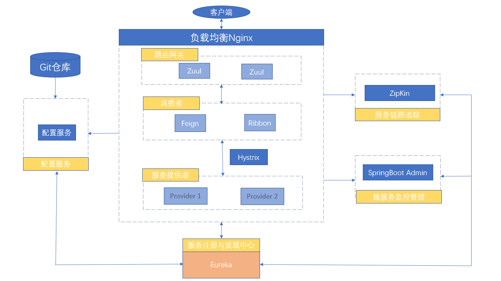
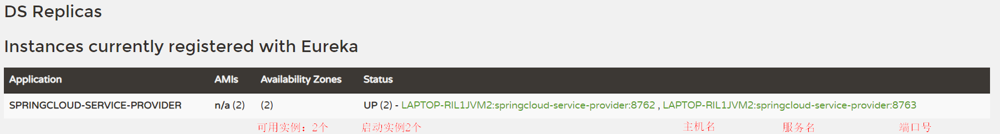
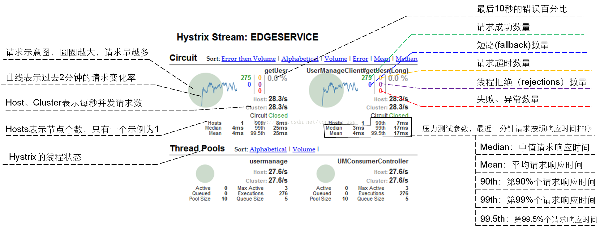
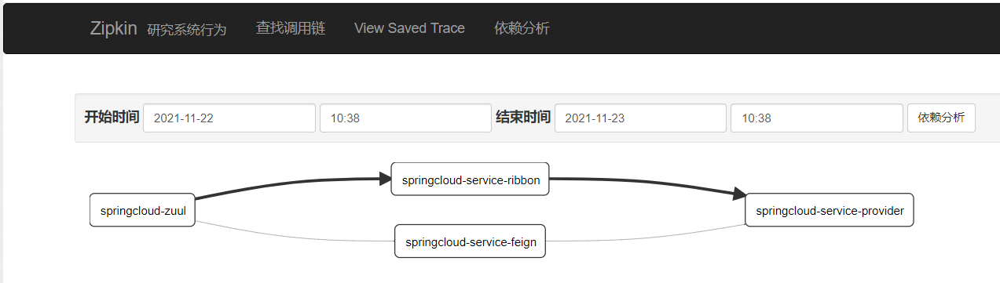
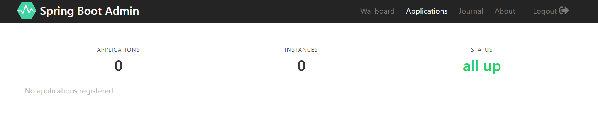
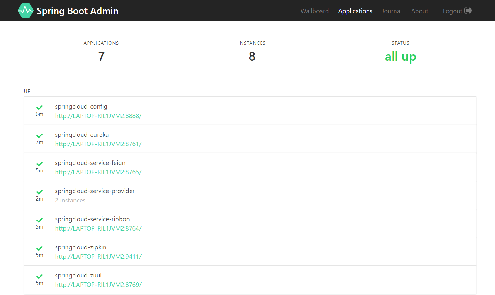

# Spring Cloud Netflix

​	　Spring Cloud 提供了**全套的分布式系统解决方案**，有服务注册与发现，服务提供者、服务消费者、服务熔断，路由网关、分布式配置中心、服务追踪、负载均衡等，可以快速的启动服务或构建应用、同时能够快速和云平台资源进行对接。

​	　目前业界对 Spring Cloud **使用最广**的就是 **Spring Cloud Netflix** 了。但是，在2018 年 12 月 12 日之后，**Spring Cloud Netflix 系列技术栈进入维护模式**（不再添加新特性）。


**参考资料：**

- [Spring Cloud版本](https://spring.io/projects/spring-cloud/)
- [Hystrix属性配置参数](https://github.com/Netflix/Hystrix/wiki/Configuration)
- [阿波罗配置中心](https://github.com/xwzpp/apollo-1)

  

## 简介

​	　客户端的请求首先经过负载均衡（Ngnix），再到达服务网关（Zuul 集群），然后再到具体的服务。服务统一注册到高可用的服务注册中心集群，服务的所有的配置文件由配置服务管理，配置服务的配置文件放在 GIT 仓库，方便开发人员随时改配置。



## 统一的依赖管理

​	　Spring Cloud 项目是基于 Spring Boot 进行开发，并且使用 Maven 做为项目管理工具。首先，新建统一依赖管理项目`springcloud-dependencies`，整个项目周期中的所有第三方依赖的 Jar 包版本都由该项目进行统一管理。

```xml
<?xml version="1.0" encoding="UTF-8"?>
<project xmlns="http://maven.apache.org/POM/4.0.0" xmlns:xsi="http://www.w3.org/2001/XMLSchema-instance"
         xsi:schemaLocation="http://maven.apache.org/POM/4.0.0 http://maven.apache.org/xsd/maven-4.0.0.xsd">
    <modelVersion>4.0.0</modelVersion>

    <!--表明 Spring Cloud 项目是基于 Spring Boot 进行开发-->
    <parent>
        <groupId>org.springframework.boot</groupId>
        <artifactId>spring-boot-starter-parent</artifactId>
        <version>2.0.2.RELEASE</version>
    </parent>

    <groupId>com.shooter.funtl</groupId>
    <artifactId>springcloud-dependencies</artifactId>
    <name>springcloud-dependencies</name>
    <version>1.0.0-SNAPSHOT</version>
    <!--表示该项目仅当做依赖项目，没有具体的实现代码-->
    <packaging>pom</packaging>

    <properties>
        <!-- Environment Settings -->
        <java.version>1.8</java.version>
        <project.build.sourceEncoding>UTF-8</project.build.sourceEncoding>
        <project.reporting.outputEncoding>UTF-8</project.reporting.outputEncoding>

        <!-- Spring Settings -->
        <spring-cloud.version>Finchley.RELEASE</spring-cloud.version>
    </properties>

    <dependencyManagement>
        <dependencies>
            <dependency>
                <groupId>org.springframework.cloud</groupId>
                <artifactId>spring-cloud-dependencies</artifactId>
                <version>${spring-cloud.version}</version>
                <type>pom</type>
                <scope>import</scope>
            </dependency>
        </dependencies>
    </dependencyManagement>

    <!--配置了项目所需的各种插件-->
    <build>
        <plugins>
            <!-- Compiler 插件, 设定 JDK 版本 -->
            <plugin>
                <groupId>org.apache.maven.plugins</groupId>
                <artifactId>maven-compiler-plugin</artifactId>
                <configuration>
                    <showWarnings>true</showWarnings>
                </configuration>
            </plugin>

            <!-- 打包 jar 文件时，配置 manifest 文件，加入 lib 包的 jar 依赖 -->
            <plugin>
                <groupId>org.apache.maven.plugins</groupId>
                <artifactId>maven-jar-plugin</artifactId>
                <configuration>
                    <archive>
                        <addMavenDescriptor>false</addMavenDescriptor>
                    </archive>
                </configuration>
                <executions>
                    <execution>
                        <configuration>
                            <archive>
                                <manifest>
                                    <!-- Add directory entries -->
                                    <addDefaultImplementationEntries>true</addDefaultImplementationEntries>
                                    <addDefaultSpecificationEntries>true</addDefaultSpecificationEntries>
                                    <addClasspath>true</addClasspath>
                                </manifest>
                            </archive>
                        </configuration>
                    </execution>
                </executions>
            </plugin>

            <!-- resource -->
            <plugin>
                <groupId>org.apache.maven.plugins</groupId>
                <artifactId>maven-resources-plugin</artifactId>
            </plugin>

            <!-- install -->
            <plugin>
                <groupId>org.apache.maven.plugins</groupId>
                <artifactId>maven-install-plugin</artifactId>
            </plugin>

            <!-- clean -->
            <plugin>
                <groupId>org.apache.maven.plugins</groupId>
                <artifactId>maven-clean-plugin</artifactId>
            </plugin>

            <!-- ant -->
            <plugin>
                <groupId>org.apache.maven.plugins</groupId>
                <artifactId>maven-antrun-plugin</artifactId>
            </plugin>

            <!-- dependency -->
            <plugin>
                <groupId>org.apache.maven.plugins</groupId>
                <artifactId>maven-dependency-plugin</artifactId>
            </plugin>
        </plugins>

        <pluginManagement>
            <plugins>
                <!-- Java Document Generate -->
                <plugin>
                    <groupId>org.apache.maven.plugins</groupId>
                    <artifactId>maven-javadoc-plugin</artifactId>
                    <executions>
                        <execution>
                            <phase>prepare-package</phase>
                            <goals>
                                <goal>jar</goal>
                            </goals>
                        </execution>
                    </executions>
                </plugin>

                <!-- YUI Compressor (CSS/JS压缩) -->
                <plugin>
                    <groupId>net.alchim31.maven</groupId>
                    <artifactId>yuicompressor-maven-plugin</artifactId>
                    <version>1.5.1</version>
                    <executions>
                        <execution>
                            <phase>prepare-package</phase>
                            <goals>
                                <goal>compress</goal>
                            </goals>
                        </execution>
                    </executions>
                    <configuration>
                        <encoding>UTF-8</encoding>
                        <jswarn>false</jswarn>
                        <nosuffix>true</nosuffix>
                        <linebreakpos>30000</linebreakpos>
                        <force>true</force>
                        <includes>
                            <include>**/*.js</include>
                            <include>**/*.css</include>
                        </includes>
                        <excludes>
                            <exclude>**/*.min.js</exclude>
                            <exclude>**/*.min.css</exclude>
                        </excludes>
                    </configuration>
                </plugin>
            </plugins>
        </pluginManagement>

        <!-- 资源文件配置 -->
        <resources>
            <resource>
                <directory>src/main/java</directory>
                <excludes>
                    <exclude>**/*.java</exclude>
                </excludes>
            </resource>
            <resource>
                <directory>src/main/resources</directory>
            </resource>
        </resources>
    </build>

    <!--配置项目下载依赖时的第三方库-->
    <repositories>

        <!-- 阿里云仓库 START-->
        <repository>
            <id>aliyun-repos</id>
            <name>Aliyun Repository</name>
            <url>http://maven.aliyun.com/nexus/content/groups/public</url>
            <releases>
                <enabled>true</enabled>
            </releases>
            <snapshots>
                <enabled>false</enabled>
            </snapshots>
        </repository>
        <!-- 阿里云仓库 END-->

        <!-- Maven官方仓库  START-->
        <repository>
            <id>sonatype-repos</id>
            <name>Sonatype Repository</name>
            <url>https://oss.sonatype.org/content/groups/public</url>
            <releases>
                <enabled>true</enabled>
            </releases>
            <snapshots>
                <enabled>false</enabled>
            </snapshots>
        </repository>
        <repository>
            <id>sonatype-repos-s</id>
            <name>Sonatype Repository</name>
            <url>https://oss.sonatype.org/content/repositories/snapshots</url>
            <releases>
                <enabled>false</enabled>
            </releases>
            <snapshots>
                <enabled>true</enabled>
            </snapshots>
        </repository>
        <!-- Maven官方仓库  END-->

        <!-- Spring官方仓库 START-->
        <repository>
            <id>spring-snapshots</id>
            <name>Spring Snapshots</name>
            <url>https://repo.spring.io/snapshot</url>
            <snapshots>
                <enabled>true</enabled>
            </snapshots>
        </repository>
        <repository>
            <id>spring-milestones</id>
            <name>Spring Milestones</name>
            <url>https://repo.spring.io/milestone</url>
            <snapshots>
                <enabled>false</enabled>
            </snapshots>
        </repository>
        <!-- Spring官方仓库 END-->
    </repositories>

    <pluginRepositories>
        <pluginRepository>
            <id>aliyun-repos</id>
            <name>Aliyun Repository</name>
            <url>http://maven.aliyun.com/nexus/content/groups/public</url>
            <releases>
                <enabled>true</enabled>
            </releases>
            <snapshots>
                <enabled>false</enabled>
            </snapshots>
        </pluginRepository>
    </pluginRepositories>
</project>
```


## 服务注册与发现

​	　`Eureka`是一个`Spring Cloud Netflix`实现**服务注册与发现**的**高可用组件**。为了提供响应效率，提供了数据存储层和缓存层两层的缓存结构，没有后端缓存。

​	　当 `Client` 向 `Eureka Server` 注册时，会提供一些元数据，例如主机和端口、URL、主页等（**服务注册**）。每一个实例注册之后需要向注册中心发送心跳（**服务续约**）；`Eureka Server` 从每个 `Client` 实例接收心跳消息， 如果心跳超时，则将该实例从注册 `Server` 中删除（**服务下线**）。

​	　首先，新建服务注册与发现项目`springcloud-eureka`。

```xml{21-24,36}
<?xml version="1.0" encoding="UTF-8"?>
<project xmlns="http://maven.apache.org/POM/4.0.0" 
		 xmlns:xsi="http://www.w3.org/2001/XMLSchema-instance"
         xsi:schemaLocation="http://maven.apache.org/POM/4.0.0 
         http://maven.apache.org/xsd/maven-4.0.0.xsd">
    <modelVersion>4.0.0</modelVersion>

    <parent>
        <groupId>com.shooter.funtl</groupId>
        <artifactId>springcloud-dependencies</artifactId>
        <version>1.0.0-SNAPSHOT</version>
        <relativePath>../springcloud-dependencies/pom.xml</relativePath>
    </parent>

    <artifactId>springcloud-eureka</artifactId>
    <packaging>jar</packaging>
    <name>springcloud-eureka</name>

    <dependencies>
        <!-- Spring Cloud Begin -->
        <dependency>
            <groupId>org.springframework.cloud</groupId>
            <artifactId>spring-cloud-starter-netflix-eureka-server</artifactId>
        </dependency>
        <!-- Spring Cloud End -->
    </dependencies>

    <build>
        <plugins>
            <plugin>
                <groupId>org.springframework.boot</groupId>
                <artifactId>spring-boot-maven-plugin</artifactId>
                <configuration>
                    <!-- 指明默认入口类 -->
                    <mainClass>
                    	com.shooter.funtl.springcloud.eureka.EurekaApplication
                    </mainClass>
                </configuration>
            </plugin>
        </plugins>
    </build>
</project>
```

​	　接着，通过`@EnableEurekaServer`注解表明这是一个`EurekaServer`服务端。

```java{8}
package com.shooter.funtl.springcloud.eureka;

import org.springframework.boot.SpringApplication;
import org.springframework.boot.autoconfigure.SpringBootApplication;
import org.springframework.cloud.netflix.eureka.server.EnableEurekaServer;

@SpringBootApplication
@EnableEurekaServer
public class EurekaApplication {
    public static void main(String[] args) {
        SpringApplication.run(EurekaApplication.class, args);
    }
}
```

​	　最后，在`resources`目录下新建`application.yml`，并进行如下配置。

```yaml
spring:
  application:
    name: springcloud-eureka

server:
  port: 8761

eureka:
  instance:
    hostname: localhost
  # 在默认情况下Erureka Server也是一个Eureka Client ，必须要指定一个Server
  client:
    registerWithEureka: false     # 启用eureka服务端模式，若没有则表明是客户端
    fetchRegistry: false          # 启用eureka服务端模式，若没有则表明是客户端
    serviceUrl:
      defaultZone: http://${eureka.instance.hostname}:${server.port}/eureka/
```

​	　至此，Eureka服务端注册中心已经部署完毕，打开页面`http://127.0.0.1:8761/`即可访问。


## 服务提供者

​	　首先，新建服务提供者`springcloud-service-provider`项目。

```xml{21-24,36}
<?xml version="1.0" encoding="UTF-8"?>
<project xmlns="http://maven.apache.org/POM/4.0.0" 
         xmlns:xsi="http://www.w3.org/2001/XMLSchema-instance"
         xsi:schemaLocation="http://maven.apache.org/POM/4.0.0 
         http://maven.apache.org/xsd/maven-4.0.0.xsd">
    <modelVersion>4.0.0</modelVersion>

    <parent>
        <groupId>com.shooter.funtl</groupId>
        <artifactId>springcloud-dependencies</artifactId>
        <version>1.0.0-SNAPSHOT</version>
        <relativePath>../springcloud-dependencies/pom.xml</relativePath>
    </parent>

    <artifactId>springcloud-service-provider</artifactId>
    <name>springcloud-service-provider</name>
    <packaging>jar</packaging>

    <dependencies>
        <!-- Spring Cloud Begin -->
        <dependency>
            <groupId>org.springframework.cloud</groupId>
            <artifactId>spring-cloud-starter-netflix-eureka-server</artifactId>
        </dependency>
        <!-- Spring Cloud End -->
    </dependencies>

    <build>
        <plugins>
            <plugin>
                <groupId>org.springframework.boot</groupId>
                <artifactId>spring-boot-maven-plugin</artifactId>
                <configuration>
                    <mainClass>
                    	<!-- 指明默认入口类 -->
                    	com.shooter.funtl.springcloud.service.provider.ServiceProviderApplication
                    </mainClass>
                </configuration>
            </plugin>
        </plugins>
    </build>
</project>
```

​	　接着，通过`@EnableEurekaClient`注解表明这是一个`EurekaClient`客户端。

```java{7}
package com.shooter.funtl.springcloud.service.provider;

import org.springframework.boot.SpringApplication;
import org.springframework.boot.autoconfigure.SpringBootApplication;
import org.springframework.cloud.netflix.eureka.EnableEurekaClient;

@EnableEurekaClient
@SpringBootApplication
public class ServiceProviderApplication {
    public static void main(String[] args) {
        SpringApplication.run(ServiceProviderApplication.class, args);
    }
}
```

​	　然后，在`resources`目录下新建`application.yml`，并进行如下配置。

```yaml
spring:
  application:
    # 服务与服务之间通过name相互调用
    name: springcloud-service-provider

server:
  port: 8762

eureka:
  client:
    serviceUrl:
      # 注册中心地址
      defaultZone: http://localhost:8761/eureka/
```

​	　最后，新建`IndexController`控制器。

```java
package com.shooter.funtl.springcloud.service.provider.controller;

import org.springframework.beans.factory.annotation.Value;
import org.springframework.web.bind.annotation.*;

@RestController
public class IndexController {

    @Value("${server.port}")
    private String port;

    @GetMapping(value = "")
    public String index() {
        return String.format("This Service Provider port is : %s", port);
    }
}
```

​	　至此，服务提供者已经配置完成。启动两个`springcloud-service-provider`实例，再次刷新[服务注册中心页面](http://127.0.0.1:8761/)，即可看见服务已经注册成功了。




## 服务消费者

​	　在微服务架构中，业务都会被拆分成一个独立的服务，服务与服务的通讯是基于 `Http Restful` 进行的。Spring Cloud 有两种服务调用方式，一种是 `Ribbon + RestTemplate`，另一种是 `Feign`（建议）。


### Feign客户端

​	　`Feign` 是一个声明式的伪 Http 客户端，具有可插拔的注解特性，支持`Feign注解`和 `JAX-RS注解`。`Feign` 默认集成了 `Ribbon`，并和 `Eureka` 结合，默认实现了负载均衡的效果，建议使用`Feign` 。

​	　首先，新建服务消费者`springcloud-service-feign`项目。

```xml{21-28,39}
<?xml version="1.0" encoding="UTF-8"?>
<project xmlns="http://maven.apache.org/POM/4.0.0" 
         xmlns:xsi="http://www.w3.org/2001/XMLSchema-instance"
         xsi:schemaLocation="http://maven.apache.org/POM/4.0.0 
         http://maven.apache.org/xsd/maven-4.0.0.xsd">
    <modelVersion>4.0.0</modelVersion>

    <parent>
        <groupId>com.shooter.funtl</groupId>
        <artifactId>springcloud-dependencies</artifactId>
        <version>1.0.0-SNAPSHOT</version>
        <relativePath>../springcloud-dependencies/pom.xml</relativePath>
    </parent>

    <artifactId>springcloud-service-feign</artifactId>
    <name>springcloud-service-feign</name>
    <packaging>jar</packaging>

    <dependencies>
        <!-- Spring Cloud Begin -->
        <dependency>
            <groupId>org.springframework.cloud</groupId>
            <artifactId>spring-cloud-starter-netflix-eureka-server</artifactId>
        </dependency>
        <dependency>
            <groupId>org.springframework.cloud</groupId>
            <artifactId>spring-cloud-starter-openfeign</artifactId>
        </dependency>
        <!-- Spring Cloud End -->
    </dependencies>

    <build>
        <plugins>
            <plugin>
                <groupId>org.springframework.boot</groupId>
                <artifactId>spring-boot-maven-plugin</artifactId>
                <configuration>
                    <mainClass>
                        com.shooter.funtl.springcloud.service.feign.FeignApplication
                    </mainClass>
                </configuration>
            </plugin>
        </plugins>
    </build>
</project>
```

​	　接着，通过`@EnableDiscoveryClient `注解注册到服务中心，并且，通过`@EnableFeignClients `注解开启 `Feign` 功能。

```java{9,10}
package com.shooter.funtl.springcloud.service.feign;

import org.springframework.boot.SpringApplication;
import org.springframework.boot.autoconfigure.SpringBootApplication;
import org.springframework.cloud.client.discovery.EnableDiscoveryClient;
import org.springframework.cloud.openfeign.EnableFeignClients;

@SpringBootApplication
@EnableDiscoveryClient
@EnableFeignClients
public class FeignApplication {
    public static void main(String[] args) {
        SpringApplication.run(FeignApplication.class, args);
    }
}
```

​	　然后，在`resources`目录下新建`application.yml`，并进行如下配置。

```yaml
spring:
  application:
    name: springcloud-service-feign
server:
  port: 8765

eureka:
  client:
    serviceUrl:
      defaultZone: http://localhost:8761/eureka/
```

​	　接下来，通过 `@FeignClient("服务名")` 注解来指定调用哪个服务。

```java{6}
package com.shooter.funtl.springcloud.service.feign.service;

import org.springframework.cloud.openfeign.FeignClient;
import org.springframework.web.bind.annotation.GetMapping;

@FeignClient(value = "SPRINGCLOUD-SERVICE-PROVIDER")
public interface IndexService {
	/**
	* 需要使用value来声明URI并且URI不能为空
	*/
    @GetMapping(value = "/")
    String sayHi();
}
```

​	　接着，新建`IndexController`控制器测试。

```java
package com.shooter.funtl.springcloud.service.feign.controller;

import com.shooter.funtl.springcloud.service.feign.service.IndexService;
import org.springframework.beans.factory.annotation.Autowired;
import org.springframework.web.bind.annotation.GetMapping;
import org.springframework.web.bind.annotation.RestController;

@RestController
public class IndexController {

    @Autowired
    private IndexService indexService;
    
    @GetMapping("")
    public String sayHi(){
        return indexService.sayHi();
    }
}
```

​	　最后，在浏览器上多次访问 `http://127.0.0.1:8765/`，请求成功则表示已经成功**实现了负载均衡功能来访问不同端口的实例**。

```shell
# 浏览器交替显示如下结果
This Service Provider port is : 8762
This Service Provider port is : 8763
```


### Ribbon客户端

​	　`Ribbon` 是一个负载均衡客户端，可以很好的控制 `http` 和 `tcp` 的一些行为。首先，新建服务消费者`springcloud-service-ribbon`项目。

```xml{19-26,38}
<?xml version="1.0" encoding="UTF-8"?>
<project xmlns="http://maven.apache.org/POM/4.0.0" xmlns:xsi="http://www.w3.org/2001/XMLSchema-instance"
         xsi:schemaLocation="http://maven.apache.org/POM/4.0.0 http://maven.apache.org/xsd/maven-4.0.0.xsd">
    <modelVersion>4.0.0</modelVersion>

    <parent>
        <groupId>com.shooter.funtl</groupId>
        <artifactId>springcloud-dependencies</artifactId>
        <version>1.0.0-SNAPSHOT</version>
        <relativePath>../springcloud-dependencies/pom.xml</relativePath>
    </parent>

    <artifactId>springcloud-service-ribbon</artifactId>
    <name>springcloud-service-ribbon</name>
    <packaging>jar</packaging>

    <dependencies>
        <!-- Spring Cloud Begin -->
        <dependency>
            <groupId>org.springframework.cloud</groupId>
            <artifactId>spring-cloud-starter-netflix-eureka-server</artifactId>
        </dependency>
        <dependency>
            <groupId>org.springframework.cloud</groupId>
            <artifactId>spring-cloud-starter-netflix-ribbon</artifactId>
        </dependency>
        <!-- Spring Cloud End -->

    </dependencies>

    <build>
        <plugins>
            <plugin>
                <groupId>org.springframework.boot</groupId>
                <artifactId>spring-boot-maven-plugin</artifactId>
                <configuration>
                    <mainClass>
                    	com.shooter.funtl.springcloud.service.ribbon.RibbonApplication
                    </mainClass>
                </configuration>
            </plugin>
        </plugins>
    </build>
</project>
```

​	　接着，通过`@EnableDiscoveryClient `注解注册到服务中心。

```java{8}
package com.shooter.funtl.springcloud.service.ribbon;

import org.springframework.boot.SpringApplication;
import org.springframework.boot.autoconfigure.SpringBootApplication;
import org.springframework.cloud.client.discovery.EnableDiscoveryClient;

@SpringBootApplication
@EnableDiscoveryClient
public class RibbonApplication {
    public static void main(String[] args) {
        SpringApplication.run(RibbonApplication.class, args);
    }
}
```

​	　然后，在`resources`目录下新建`application.yml`，并进行如下配置。

```yaml
spring:
  application:
    name: springcloud-service-ribbon

server:
  port: 8764

eureka:
  client:
    serviceUrl:
      defaultZone: http://localhost:8761/eureka/
```

​	　接下来，需要实现通过`Ribbon`客户端调用`服务提供者`提供的服务。首先，配置注入 `RestTemplate` 的 Bean，并通过 `@LoadBalanced` 注解表明开启负载均衡功能。

```java{11}
package com.shooter.funtl.springcloud.service.ribbon.config;

import org.springframework.cloud.client.loadbalancer.LoadBalanced;
import org.springframework.context.annotation.Bean;
import org.springframework.context.annotation.Configuration;
import org.springframework.web.client.RestTemplate;

@Configuration
public class RestTemplateConfiguration {
    @Bean
    @LoadBalanced
    public RestTemplate restTemplate() {
        return new RestTemplate();
    }
}
```

​	　然后，在`IndexService`中，直接使用**服务名替代具体的 URL 地址**去调用`服务提供者`提供的服务。在 Ribbon 中，**会根据服务名来选择具体的服务实例**，然后，**根据服务实例在请求的时候会用具体的 URL 替换掉服务名**。

```java{14}
package com.shooter.funtl.springcloud.service.ribbon.service;

import org.springframework.beans.factory.annotation.Autowired;
import org.springframework.stereotype.Service;
import org.springframework.web.client.RestTemplate;

@Service
public class IndexService {
    @Autowired
    private RestTemplate restTemplate;

	/**
	* 通过 RestTemplate 调用 springcloud-service-provider服务 接口时
	* 因为启用了负载均衡功能故会轮流调用它的 8762 和 8763 端口
	*/
    public String sayHi() {
        return restTemplate.getForObject(
            "http://SPRINGCLOUD-SERVICE-PROVIDER/",String.class);
    }
}
```

​	　接着，新建`IndexController`控制器测试。

```java
@RestController
public class IndexController {

    @Autowired
    private IndexService indexService;

    @GetMapping("")
    public String sayHi(){
        return indexService.sayHi();
    }
}
```

​	　最后，在浏览器上多次访问 `http://127.0.0.1:8764/`，请求成功则表示已经成功**实现了负载均衡功能来访问不同端口的实例**。

```shell
# 浏览器交替显示如下结果
This Service Provider port is : 8762
This Service Provider port is : 8763 
```


## 熔断器

​	　在微服务架构模式中，根据业务来拆分成一个个的服务。服务与服务之间可以通过 `RPC` 相互调用；在 Spring Cloud 中可以用 `RestTemplate + Ribbon` 和 `Feign` 来调用。

​	　为了保证其高可用，单个服务通常会**集群部署**。由于网络原因或者自身的原因，服务并不能保证 100% 可用，如果单个服务出现问题，调用这个服务就会出现**线程阻塞**，此时若有大量的请求涌入，`Servlet` 容器的线程资源会被消耗完毕，导致服务瘫痪。

​	　服务与服务之间的依赖性，故障会传播，会对整个微服务系统造成灾难性的严重后果，这就是服务故障的 **“雪崩”** 效应。为了解决这个问题，业界提出了**熔断器模型**。**`Hystrix`** 就是 `Spring Cloud  Netflix`提供的熔断器组件。

​	　在微服务架构中，一个请求需要调用多个服务是非常常见的，较底层的服务如果出现故障，会导致连锁故障。当对特定的服务的调用的不可用达到一个阀值（Hystrix 是 **5 秒 20 次**） 熔断器将会被打开。熔断器打开后，为了避免连锁故障，通过 `fallback` 方法可以直接返回一个固定值。

### 使用熔断器防止服务雪崩

（1）Feign中使用熔断器

​	　Feign 是自带熔断器的，但默认是关闭的，只需要在配置文件中配置打开它即可。

```yaml
feign:
  hystrix:
    enabled: true
```

​	　接着，在 `Service` 中增加 `fallback 指定类`。

```java
@FeignClient(value = "SPRINGCLOUD-SERVICE-PROVIDER",fallback = HystrixFallBack.class)
public interface IndexService {
    @GetMapping(value = "/")
    String sayHi();
}
```

​	　然后，创建熔断器类`HystrixFallBack.java`，并实现对应的 `Feign` 接口。

```java
@Component
public class HystrixFallBack implements IndexService {
    @Override
    public String sayHi() {
        return "Hi，your message is request error.";
    }
}
```

​	　接下来，我们关闭`8763服务提供者`，然后，再次请求 `http://127.0.0.1:8764/`， 浏览器先是会**交替显示**正确访问和错误访问的提示信息。过一会后，`8763`会被`Eurka注册中心`清除，再多次刷新，便只会显示正确访问信息了。最后，再次重启服务提供者，过一会就可正常访问了。

```shell
# 交替显示正确访问和错误访问的提示信息
This Service Provider port is : 8762
Hi，your message is request error.       # 下线8763
```


::: details fallback方法 说明

（1）什么情况下会触发 `fallback` 方法

| 名字                 | 描述                               | 触发fallback |
| -------------------- | ---------------------------------- | ------------ |
| EMIT                 | 值传递                             | NO           |
| SUCCESS              | 执行完成，没有错误                 | NO           |
| FAILURE              | 执行抛出异常                       | YES          |
| TIMEOUT              | 执行开始，但没有在允许的时间内完成 | YES          |
| BAD_REQUEST          | 执行抛出HystrixBadRequestException | NO           |
| SHORT_CIRCUITED      | 断路器打开，不尝试执行             | YES          |
| THREAD_POOL_REJECTED | 线程池拒绝，不尝试执行             | YES          |
| SEMAPHORE_REJECTED   | 信号量拒绝，不尝试执行             | YES          |

（2）`fallback` 方法在什么情况下会抛出异常

| 名字              | 描述                           | 抛异常 |
| ----------------- | ------------------------------ | ------ |
| FALLBACK_EMIT     | Fallback值传递                 | NO     |
| FALLBACK_SUCCESS  | Fallback执行完成，没有错误     | NO     |
| FALLBACK_FAILURE  | Fallback执行抛出出错           | YES    |
| FALLBACK_REJECTED | Fallback信号量拒绝，不尝试执行 | YES    |
| FALLBACK_MISSING  | 没有Fallback实例               | YES    |

:::


（2）Ribbon中使用熔断器

​	　首先，在`pom.xml`中新增依赖。

```xml
<dependency>
    <groupId>org.springframework.cloud</groupId>
    <artifactId>spring-cloud-starter-netflix-hystrix</artifactId>
</dependency>
```

​	　然后，在`RibbonApplication.java`中启用熔断器。

```java{3}
@SpringBootApplication
@EnableDiscoveryClient
@EnableHystrix
public class RibbonApplication {
    public static void main(String[] args) {
        SpringApplication.run(RibbonApplication.class, args);
    }
}
```

​	　接着，在 `Ribbon` 调用方法上增加 `@HystrixCommand` 注解，并指定 `fallbackMethod` 熔断方法。

```java{1}
@HystrixCommand(fallbackMethod = "hiError")
public String sayHi() {
    return restTemplate.getForObject(
        "http://SPRINGCLOUD-SERVICE-PROVIDER/",String.class);
}

public String hiError() {
    return "Hi，your message is request error.";
}
```

​	　最后，我们关闭`8763服务提供者`，再次请求 `http://127.0.0.1:8764/`，发现请求已可以被熔断，并显示错误提示。

```shell
This Service Provider port is : 8762
Hi，your message is request error.       # 下线8763
```


### 仪表盘监控

​	　在 `Ribbon` 和 `Feign` 项目增加 `Hystrix 仪表盘功能`，两个项目的改造方式相同。首先，在新增仪表盘依赖。

```xml
<dependency>
    <groupId>org.springframework.cloud</groupId>
    <artifactId>spring-cloud-starter-netflix-hystrix-dashboard</artifactId>
</dependency>
```

​	　然后，在 `Application` 中增加 `@EnableHystrixDashboard` 注解。

```java{4}
@SpringBootApplication
@EnableDiscoveryClient
@EnableFeignClients
@EnableHystrixDashboard
public class FeignApplication {
    public static void main(String[] args) {
        SpringApplication.run(FeignApplication.class, args);
    }
}
```

​	　接着，创建 `hystrix.stream` 的 `Servlet` 配置。

```java
package com.shooter.funtl.springcloud.service.feign.config;

import com.netflix.hystrix.contrib.metrics.eventstream.HystrixMetricsStreamServlet;
import org.springframework.boot.web.servlet.ServletRegistrationBean;
import org.springframework.context.annotation.Bean;
import org.springframework.context.annotation.Configuration;

@Configuration
public class HystrixDashboardConfiguration {
    @Bean
    public ServletRegistrationBean getServlet() {
        val streamServlet = new HystrixMetricsStreamServlet();
        val registrationBean = new ServletRegistrationBean(streamServlet);
        registrationBean.setLoadOnStartup(1);
        registrationBean.addUrlMappings("/hystrix.stream");
        registrationBean.setName("HystrixMetricsStreamServlet");
        return registrationBean;
    }
}
```

​	　至此，`Hystrix Dashboard`仪表盘已经配置完成了。先访问 `http://localhost:8765/hystrix` ，然后，在`cluster`输入`http://localhost:8765/hystrix.stream`，点击 `Monitor Stream`按钮，即可进入监控页面。`Hystrix Dashboard` 界面监控参数：




::: details Hystrix 常用配置信息

（1）超时时间（默认1000ms，单位：ms）

```properties
# 在调用方配置，被该调用方的所有方法的超时时间都是该值，优先级低于下边的指定配置
hystrix.command.default.execution.isolation.thread.timeoutInMilliseconds：
# 在调用方配置，被该调用方的指定方法（HystrixCommandKey 方法名）的超时时间是该值
hystrix.command.HystrixCommandKey.execution.isolation.thread.timeoutInMilliseconds：
```

（2）线程池核心线程数

```properties
# 线程池核心线程数,默认为 10
hystrix.threadpool.default.coreSize：
```

（3）Queue

```properties
# 最大排队长度。默认 -1，使用 SynchronousQueue。其他值则使用 LinkedBlockingQueue
# 如果要从 -1 换成其他值则需重启
hystrix.threadpool.default.maxQueueSize：

# 排队线程数量阈值，默认为 5，达到时拒绝，如果配置了该选项，队列的大小是该队列
# 注意： 如果 maxQueueSize=-1 的话，则该选项不起作用
hystrix.threadpool.default.queueSizeRejectionThreshold：
```

（4）断路器

```properties
# 当在配置时间窗口内达到此数量的失败后，进行短路
# 默认 20 个（10s 内请求失败数量达到 20 个，断路器开）
hystrix.command.default.circuitBreaker.requestVolumeThreshold：
# 短路多久以后开始尝试是否恢复，默认 5s
hystrix.command.default.circuitBreaker.sleepWindowInMilliseconds：
# 出错百分比阈值，当达到此阈值后，开始短路。默认 50%
hystrix.command.default.circuitBreaker.errorThresholdPercentage：
```

（5）fallback

```properties
# 调用线程允许请求 HystrixCommand.GetFallback() 的最大数量，默认 10
# 超出时将会有异常抛出，注意：该项配置对于 THREAD 隔离模式也起作用
hystrix.command.default.fallback.isolation.semaphore.maxConcurrentRequests：
```


:::


## 路由网关

### 统一访问接口

​	　首先，新建路由网关`springcloud-zuuls`项目。

```xml{21-28}
<?xml version="1.0" encoding="UTF-8"?>
<project xmlns="http://maven.apache.org/POM/4.0.0" 
         xmlns:xsi="http://www.w3.org/2001/XMLSchema-instance"
         xsi:schemaLocation="http://maven.apache.org/POM/4.0.0 
                             http://maven.apache.org/xsd/maven-4.0.0.xsd">
    <modelVersion>4.0.0</modelVersion>

    <parent>
        <groupId>com.shooter.funtl</groupId>
        <artifactId>springcloud-dependencies</artifactId>
        <version>1.0.0-SNAPSHOT</version>
        <relativePath>../springcloud-dependencies/pom.xml</relativePath>
    </parent>

    <artifactId>springcloud-zuul</artifactId>
    <name>springcloud-zuul</name>
    <packaging>jar</packaging>

    <dependencies>
        <!-- Spring Cloud Begin -->
        <dependency>
            <groupId>org.springframework.cloud</groupId>
            <artifactId>spring-cloud-starter-netflix-eureka-server</artifactId>
        </dependency>
        <dependency>
            <groupId>org.springframework.cloud</groupId>
            <artifactId>spring-cloud-starter-netflix-zuul</artifactId>
        </dependency>
        <!-- Spring Cloud End -->
    </dependencies>

    <build>
        <plugins>
            <plugin>
                <groupId>org.springframework.boot</groupId>
                <artifactId>spring-boot-maven-plugin</artifactId>
                <configuration>
                    <mainClass>
                        com.shooter.funtl.springcloud.zuul.ZuulApplication
                    </mainClass>
                </configuration>
            </plugin>
        </plugins>
    </build>
</project>
```

​	　接着，通过`@EnableZuulProxy`注解开启 `Zuul` 功能。

```java{9}
package com.shooter.funtl.springcloud.zuul;

import org.springframework.boot.SpringApplication;
import org.springframework.boot.autoconfigure.SpringBootApplication;
import org.springframework.cloud.netflix.eureka.EnableEurekaClient;
import org.springframework.cloud.netflix.zuul.EnableZuulProxy;

@SpringBootApplication
@EnableEurekaClient
@EnableZuulProxy
public class ZuulApplication {
    public static void main(String[] args) {
        SpringApplication.run(ZuulApplication.class, args);
    }
}
```

​	　然后，在`resources`目录下新建`application.yml`，并进行如下配置。

```yaml
spring:
  application:
    name: springcloud-zuul

server:
  port: 8769

eureka:
  client:
    serviceUrl:
      defaultZone: http://localhost:8761/eureka/

zuul:
  routes:
    # 以 /api/one 开头的请求都转发给 springcloud-service-ribbon 服务
    api-one:
      path: /api/one/**
      serviceId: springcloud-service-ribbon
    # 以 /api/two 开头的请求都转发给 springcloud-service-feign 服务
    api-two:
      path: /api/two/**
      serviceId: springcloud-service-feign
```

​	　最后，配置网关路由失败时的回调。网关向 `api 服务`请求失败了，但是消费者客户端向网关发起的请求是成功的，不应该把 api 的 `404`、`500` 等问题抛给客户端。网关和 `api 服务`集群对于客户端来说是黑盒。

```java
package com.shooter.funtl.springcloud.zuul.config;

import com.fasterxml.jackson.databind.ObjectMapper;
import org.springframework.cloud.netflix.zuul.filters.route.FallbackProvider;
import org.springframework.http.HttpHeaders;
import org.springframework.http.HttpStatus;
import org.springframework.http.MediaType;
import org.springframework.http.client.ClientHttpResponse;
import org.springframework.stereotype.Component;
import java.io.ByteArrayInputStream;
import java.io.IOException;
import java.io.InputStream;
import java.util.HashMap;
import java.util.Map;

/**
 * 路由失败时的回调
 */
@Component
public class FeignFallbackProvider implements FallbackProvider {

    @Override
    public String getRoute() {
        // ServiceId，如果需要所有调用都支持回退，则 return "*" 或 return null
        return "springcloud-service-feign";
    }

    /**
     * 如果请求服务失败，则返回指定的信息给调用者
     */
    @Override
    public ClientHttpResponse fallbackResponse(String route, Throwable cause) {
        return new ClientHttpResponse() {

            /**
             * 网关向 api 服务请求失败了，但是消费者客户端向网关发起的请求是成功的，
             * 不应该把 api 的 404,500 等问题抛给客户端
             * 网关和 api 服务集群对于客户端来说是黑盒
             */
            @Override
            public HttpStatus getStatusCode() throws IOException {
                return HttpStatus.OK;
            }

            @Override
            public int getRawStatusCode() throws IOException {
                return HttpStatus.OK.value();
            }

            @Override
            public String getStatusText() throws IOException {
                return HttpStatus.OK.getReasonPhrase();
            }

            @Override
            public void close() {

            }

            @Override
            public InputStream getBody() throws IOException {
                ObjectMapper objectMapper = new ObjectMapper();
                Map<String, Object> map = new HashMap<>();
                map.put("status", 200);
                map.put("message", "无法连接，请检查您的网络");
                return new ByteArrayInputStream(
                    objectMapper.writeValueAsString(map).getBytes("UTF-8"));
            }

            @Override
            public HttpHeaders getHeaders() {
                HttpHeaders headers = new HttpHeaders();
                // 和 getBody 中的内容编码一致
                headers.setContentType(MediaType.APPLICATION_JSON_UTF8);
                return headers;
            }
        };
    }
}
```

​	　至此，路由网关已经配置完成了。启动路由网关服务后，验证是否可以正常运行。

```shell
# 访问 http://127.0.0.1:8769/api/one/
This Service Provider port is : 8763
# 访问 http://127.0.0.1:8769/api/two/
This Service Provider port is : 8762
```

​	　然后，先停掉`springcloud-service-ribbon`服务，再次访问`http://127.0.0.1:8769/api/one/`，由于未给`springcloud-service-ribbon`服务配置访问失败时的回调，所以提示错误信息。

```html
There was an unexpected error (type=Internal Server Error, status=500).
TIMEOUT
```

​	　接下来，停掉`springcloud-service-feign`服务，再次访问`http://127.0.0.1:8769/api/two/`，发现配置的网关路由失败时的回调已生效。

```json
{"message":"无法连接，请检查您的网络","status":200}
```


### 服务过滤功能

​	　使用路由网关的服务过滤功能，验证TOKEN。首先新建服务过滤器`LoginFilter`。

```java
package com.shooter.funtl.springcloud.zuul.filter;

import com.netflix.zuul.ZuulFilter;
import com.netflix.zuul.context.RequestContext;
import com.netflix.zuul.exception.ZuulException;
import org.slf4j.Logger;
import org.slf4j.LoggerFactory;
import org.springframework.stereotype.Component;
import javax.servlet.http.HttpServletRequest;
import java.io.IOException;

/**
 * Zuul 的服务过滤演示
 */
@Component
public class LoginFilter extends ZuulFilter {

    private static final Logger logger = LoggerFactory.getLogger(LoginFilter.class);

    /**
     * 配置过滤类型，有四种不同生命周期的过滤器类型
     * 1. pre：路由之前
     * 2. routing：路由之时
     * 3. post：路由之后
     * 4. error：发送错误调用
     */
    @Override
    public String filterType() {
        return "pre";
    }

    /**
     * 配置过滤的顺序
     */
    @Override
    public int filterOrder() {
        return 0;
    }

    /**
     * 配置是否需要过滤：true/需要，false/不需要
     */
    @Override
    public boolean shouldFilter() {
        return true;
    }

    /**
     * 过滤器的具体业务代码
     */
    @Override
    public Object run() throws ZuulException {
        RequestContext context = RequestContext.getCurrentContext();
        HttpServletRequest request = context.getRequest();
        logger.info("{} >>> {}", request.getMethod(), request.getRequestURL());
        String token = request.getParameter("token");
        if (token == null) {
            logger.warn("Token is empty");
            context.setSendZuulResponse(false);
            context.setResponseStatusCode(401);
            try {
                context.getResponse().getWriter().write("Token is empty");
            } catch (IOException e) {
            }
        } else {
            logger.info("OK");
        }
        return null;
    }
}
```

​	　然后，测试Token验证是否生效。

```shell
# 访问 http://127.0.0.1:8769/api/one/
Token is empty
# 访问 http://127.0.0.1:8769/api/one/?token=token
This Service Provider port is : 8762
```


## 分布式配置中心

​	　在分布式系统中，由于**服务数量巨多**，为了方便**服务配置文件统一管理**，**实时更新**，所以需要分布式配置中心组件。

​	　**分布式配置中心组件** `Spring Cloud Config` ，支持配置服务放在**配置服务的内存中**（即本地），也支持放在**远程 Git 仓库**中。有`Config Server` 和 `Config Client`两个角色。


### Config Service

​	　首先，新建分布式配置中心服务端`springcloud-config`项目。

```xml{21-24}
<?xml version="1.0" encoding="UTF-8"?>
<project xmlns="http://maven.apache.org/POM/4.0.0" 
         xmlns:xsi="http://www.w3.org/2001/XMLSchema-instance"
         xsi:schemaLocation="http://maven.apache.org/POM/4.0.0 
                             http://maven.apache.org/xsd/maven-4.0.0.xsd">
    <modelVersion>4.0.0</modelVersion>

    <parent>
        <groupId>com.shooter.funtl</groupId>
        <artifactId>springcloud-dependencies</artifactId>
        <version>1.0.0-SNAPSHOT</version>
        <relativePath>../springcloud-dependencies/pom.xml</relativePath>
    </parent>

    <artifactId>springcloud-config</artifactId>
    <name>springcloud-config</name>
    <packaging>jar</packaging>

    <dependencies>
        <!-- Spring Cloud Begin -->
        <dependency>
            <groupId>org.springframework.cloud</groupId>
            <artifactId>spring-cloud-config-server</artifactId>
        </dependency>
        <dependency>
            <groupId>org.springframework.cloud</groupId>
            <artifactId>spring-cloud-starter-netflix-eureka-server</artifactId>
        </dependency>
        <!-- Spring Cloud End -->
    </dependencies>

    <build>
        <plugins>
            <plugin>
                <groupId>org.springframework.boot</groupId>
                <artifactId>spring-boot-maven-plugin</artifactId>
                <configuration>
                    <mainClass>
                        com.shooter.funtl.springcloud.config.ConfigApplication
                    </mainClass>
                </configuration>
            </plugin>
        </plugins>
    </build>
</project>
```

​	　然后，通过 `@EnableConfigServer` 注解，开启配置服务器功能。

```java{7}
import org.springframework.boot.SpringApplication;
import org.springframework.boot.autoconfigure.SpringBootApplication;
import org.springframework.cloud.config.server.EnableConfigServer;
import org.springframework.cloud.netflix.eureka.EnableEurekaClient;

@SpringBootApplication
@EnableConfigServer
@EnableEurekaClient
public class ConfigApplication {
    public static void main(String[] args) {
        SpringApplication.run(ConfigApplication.class, args);
    }
}
```

​	　然后，在`resources`目录下新建`application.yml`，并进行如下配置。

```yaml
spring:
  application:
    name: springcloud-config
  cloud:
    config:
      label: master # 配置仓库的分支,必须有master为主分支
      server:
        git:
          # 配置 Git 仓库地址
          # 如果使用 GitLab 作为仓库的话，git.uri 需要在结尾加上 .git，GitHub 则不用
          uri: https://github.com/用户名/spring-cloud-config
          # 配置仓库路径（存放配置文件的目录）
          search-paths: respo
          username: 访问 Git 仓库的账号
          password: 访问 Git 仓库的密码

server:
  # 修改SpringCloud Config的启动端口，只能在bootstrap.yml中修改
  # 因为bootstrap开头的配置文件会被优先加载
  port: 8888

eureka:
  client:
    serviceUrl:
      defaultZone: http://localhost:8761/eureka/
```

​	　配置服务器的默认端口为 `8888`，如果修改了默认端口，则`spring.cloud.config.uri`仓库地址必须在`bootstrap.yml`中配置，因为 `bootstrap` 开头的配置文件会被优先加载和配置。

​	　另外，还需要在`GitHub`中新建`spring-cloud-config`项目，然后，切换到`master`分支，新建`respo`目录，将`service-feign`项目中的配置文件按照如下名称上传到项目中。

```shell
service-feign-dev.yml  # feign测试环境配置，port 为 8765
service-feign-prod.yml # feign生产环境配置，port 为 9765
```

​	　启动`springcloud-config`项目，然后，测试通过配置服务中心从远程仓库获取配置信息。

```shell
# HTTP 请求地址和资源文件映射
# 语法格式
http://ip:port/{application}/{profile}[/{label}]
http://ip:port/{application}-{profile}.yml
http://ip:port/{label}/{application}-{profile}.yml
http://ip:port/{application}-{profile}.properties
http://ip:port/{label}/{application}-{profile}.properties

# 示例 
# 从master分支获取service-feign-dev配置
http://localhost:8888/service-feign/dev/master（建议）       # XML格式
# 其他访问示例
http://localhost:8888/service-feign-dev/master              # XML格式
http://localhost:8888/service-feign-dev.yml                 # YAML格式
http://localhost:8888/master/service-feign-dev.yml          # YAML格式
```


### Config Client

​	　以`springcloud-service-feign`为例，首先，在`springcloud-service-feign`中引入依赖。

```xml
<dependency>
    <groupId>org.springframework.cloud</groupId>
    <artifactId>spring-cloud-starter-config</artifactId>
</dependency>
```

​	　然后，修改`springcloud-service-feign`项目的`application.yml`。

```yaml
spring:
  cloud:
    # 访问 http://localhost:8888/service-feign/dev/master 路径下载配置
    config:
      # 配置服务中心的网址
      uri: http://localhost:8888
      # 配置文件名称的前缀
      name: service-feign
      # 配置仓库的分支
      label: master
      # 配置文件的环境标识
      profile: dev
```

​	　启动`springcloud-service-feign`项目，若运行的是`8765`端口，则表明配置成功；若运行的是`8080`端口，则表明配置失败。

```shell
# 访问 http://127.0.0.1:8765/ 展示信息
This Service Provider port is : 8763
```

​	　特别的，在项目开发时，生产环境和测试环境的一些配置可能会不一样。可以**为不同的环境编写专门的配置文件**，然后通过 `Spring Boot Profile`在**启动的时候激活部署环境所要用的 `Profile`** 。

```shell
# 为不同的环境编写专门的配置文件
application-dev.yml   # 开发环境
application-test.yml  # 测试环境
application-prod.yml  # 生产环境

# 启动项目时，使用生产环境配置
# 特别的，若不指定，则默认使用application.yml中的配置
java -jar project.jar --spring.profiles.active=prod
```


## 服务追踪

### 服务链路追踪

​	　微服务架对外暴露的一个接口，可能需要很多个服务协同才能完成这个接口功能，如果链路上任何一个服务出现问题或者网络超时，都会形成导致接口调用失败。随着业务的不断扩张，服务之间互相调用会越来越复杂。

​	　ZipKin 是分布式跟踪系统，用于收集服务的定时数据，包括数据的收集、存储、查找和展现，以解决微服务架构中的**延迟问题**、**监测系统中存在的瓶颈**  以及 **定位接口调用失败的服务**。

​	　每个服务向 `ZipKin` 报告计时数据，`ZipKin` 会根据调用关系通过 `ZipKin UI` 生成依赖关系图，显示了多少跟踪请求通过每个服务，该系统让开发者可通过一个 Web 前端轻松的收集和分析数据。


::: details ZipKin术语解释

（1）Span

​	　Span，基本工作单元，例如，在一个新建的 Span 中发送一个 RPC 等同于发送一个回应请求给 RPC，Span 通过一个 64 位 ID 唯一标识，Trace 以另一个 64 位 ID 表示。

（2）Trace

​	　Trace是一系列 Spans 组成的一个树状结构，例如，如果你正在运行一个分布式大数据工程，你可能需要创建一个 Trace。

（3）Annotation

​	　用来即使记录一个事件的存在，一些核心 Annotations 用来定义一个请求的开始和结束。

​	　**Client Sent**，客户端发起一个请求，这个 Annotation 描述了这个 Span 的开始；

​	　**Server Received**，服务端获得请求并准备开始处理它，如果将其 sr 减去 cs 时间戳便可得到网络延迟；

​	　**Server Sent**， 表明请求处理的完成(当请求返回客户端)，如果 ss 减去 sr 时间戳便可得到服务端需要的处理请求时间；

​	　**Client Received**， 表明 Span 的结束，客户端成功接收到服务端的回复，如果 cr 减去 cs 时间戳便可得到客户端从服务端获取回复的所有所需时间。

:::


​	　首先，新建服务链路追踪`springcloud-zipKin`项目。

```xml{29-32}
<?xml version="1.0" encoding="UTF-8"?>
<project xmlns="http://maven.apache.org/POM/4.0.0" 
         xmlns:xsi="http://www.w3.org/2001/XMLSchema-instance"
         xsi:schemaLocation="http://maven.apache.org/POM/4.0.0 
                             http://maven.apache.org/xsd/maven-4.0.0.xsd">
    <modelVersion>4.0.0</modelVersion>

    <parent>
        <groupId>com.shooter.funtl</groupId>
        <artifactId>springcloud-dependencies</artifactId>
        <version>1.0.0-SNAPSHOT</version>
        <relativePath>../springcloud-dependencies/pom.xml</relativePath>
    </parent>

    <artifactId>springcloud-zuul</artifactId>
    <name>springcloud-zuul</name>
    <packaging>jar</packaging>

    <dependencies>
        <!-- Spring Cloud Begin -->
        <dependency>
            <groupId>org.springframework.cloud</groupId>
            <artifactId>spring-cloud-starter-netflix-eureka-server</artifactId>
        </dependency>
        <dependency>
            <groupId>org.springframework.cloud</groupId>
            <artifactId>spring-cloud-starter-netflix-zuul</artifactId>
        </dependency>
        <dependency>
            <groupId>org.springframework.cloud</groupId>
            <artifactId>spring-cloud-starter-zipkin</artifactId>
        </dependency>
        <!-- Spring Cloud End -->
    </dependencies>

    <build>
        <plugins>
            <plugin>
                <groupId>org.springframework.boot</groupId>
                <artifactId>spring-boot-maven-plugin</artifactId>
                <configuration>
                    <mainClass>com.shooter.funtl.springcloud.zuul.ZuulApplication</mainClass>
                </configuration>
            </plugin>
        </plugins>
    </build>
</project>
```

​	　Zipkin相关依赖包需要托管到`dependencies` 项目中，再次刷新依赖。

```xml
<zipkin.version>2.10.1</zipkin.version>

<!-- Zipkin Begin -->
<dependency>
    <groupId>io.zipkin.java</groupId>
    <artifactId>zipkin</artifactId>
    <version>${zipkin.version}</version>
</dependency>
<dependency>
    <groupId>io.zipkin.java</groupId>
    <artifactId>zipkin-server</artifactId>
    <version>${zipkin.version}</version>
</dependency>
<dependency>
    <groupId>io.zipkin.java</groupId>
    <artifactId>zipkin-autoconfigure-ui</artifactId>
    <version>${zipkin.version}</version>
</dependency>
<!-- Zipkin Begin -->
```

​	　通过 `@EnableZipkinServer` 注解开启 `Zipkin Server` 功能。

```java{8}
import org.springframework.boot.SpringApplication;
import org.springframework.boot.autoconfigure.SpringBootApplication;
import org.springframework.cloud.netflix.eureka.EnableEurekaClient;
import zipkin.server.internal.EnableZipkinServer;

@SpringBootApplication
@EnableEurekaClient
@EnableZipkinServer
public class ZipKinApplication {
    public static void main(String[] args) {
        SpringApplication.run(ZipKinApplication.class, args);
    }
}
```

​	　在`application.yml`中设置端口号为`9411`，该端口号为 `Zipkin Server` 的默认端口号。

```yaml
spring:
  application:
    name: springcloud-zipkin
  zipkin:
    base-url: http://localhost:9411

server:
  port: 9411

eureka:
  client:
    serviceUrl:
      defaultZone: http://localhost:8761/eureka/

management:
  metrics:
    web:
      server:
        auto-time-requests: false
```

​	　至此，Zipkin服务端已经配置完成。接下来，需要在**所有需要被追踪的项目**（**除了 `dependencies` 项目外都需要被追踪，包括 Eureka Server**） 中增加 `spring-cloud-starter-zipkin` 依赖。

```xml
<dependency>
    <groupId>org.springframework.cloud</groupId>
    <artifactId>spring-cloud-starter-zipkin</artifactId>
</dependency>
```

​	　并在这些项目的 `application.yml` 配置文件中增加 `Zipkin Server` 的地址即可。

```yaml
spring:
  zipkin:
    base-url: http://localhost:9411
```

​	　测试追踪，启动全部项目，打开浏览器访问`http://localhost:9411/` 即可展示Zipkin页面，**刷新之前项目中的全部测试接口（刷多几次）**。

```
# 刷新之前项目中的全部测试接口（刷多几次）
http://127.0.0.1:8769/api/one/?token=token
http://127.0.0.1:8769/api/two/?token=token
```

​	　点击 `Find a trace`，可以看到具体**服务相互调用的数据**；点击 `Dependencies`，可以发现**服务的依赖关系**。




### Spring Boot Admin

​	　随着开发周期的推移，项目会不断变大，切分出的服务也会越来越多，这时一个个的微服务构成了错综复杂的系统。对于各个微服务系统的健康状态、会话数量、并发数、服务资源、延迟等度量信息的收集就成为了一个挑战。

​	　`Spring Boot Admin` 微服务是监控管理系统，具有 `Spring Boot Admin Server` 和 `Spring Boot Admin Client`两个角色。首先，新建微服务监控管理`springcloud-admin`项目。

```xml{21-28}
<?xml version="1.0" encoding="UTF-8"?>
<project xmlns="http://maven.apache.org/POM/4.0.0" 
         xmlns:xsi="http://www.w3.org/2001/XMLSchema-instance"
         xsi:schemaLocation="http://maven.apache.org/POM/4.0.0 
                             http://maven.apache.org/xsd/maven-4.0.0.xsd">
    <modelVersion>4.0.0</modelVersion>

    <parent>
        <groupId>com.shooter.funtl</groupId>
        <artifactId>springcloud-dependencies</artifactId>
        <version>1.0.0-SNAPSHOT</version>
        <relativePath>../springcloud-dependencies/pom.xml</relativePath>
    </parent>

    <artifactId>springcloud-admin</artifactId>
    <packaging>jar</packaging>
    <name>springcloud-admin</name>

    <dependencies>
        <!-- Spring Boot Begin -->
        <dependency>
            <groupId>org.jolokia</groupId>
            <artifactId>jolokia-core</artifactId>
        </dependency>
        <dependency>
            <groupId>de.codecentric</groupId>
            <artifactId>spring-boot-admin-starter-server</artifactId>
        </dependency>
        <!-- Spring Boot End -->

        <!-- Spring Cloud Begin -->
        <dependency>
            <groupId>org.springframework.cloud</groupId>
            <artifactId>spring-cloud-starter-netflix-eureka-server</artifactId>
        </dependency>
        <dependency>
            <groupId>org.springframework.cloud</groupId>
            <artifactId>spring-cloud-starter-zipkin</artifactId>
        </dependency>
        <!-- Spring Cloud End -->
    </dependencies>

    <build>
        <plugins>
            <plugin>
                <groupId>org.springframework.boot</groupId>
                <artifactId>spring-boot-maven-plugin</artifactId>
                <configuration>
                    <mainClass>
                        com.shooter.funtl.springcloud.admin.AdminApplication
                    </mainClass>
                </configuration>
            </plugin>
        </plugins>
    </build>
</project>
```

​	　`Spring Boot Admin Server` 相关依赖包需要托管到`dependencies` 项目中，再次刷新依赖。

```xml
<spring-boot-admin.version>2.0.0</spring-boot-admin.version>

<dependency>
    <groupId>de.codecentric</groupId>
    <artifactId>spring-boot-admin-starter-server</artifactId>
    <version>${spring-boot-admin.version}</version>
</dependency>
```

​	　通过 `@EnableAdminServer` 注解开启 Admin 功能

```java{8}
import de.codecentric.boot.admin.server.config.EnableAdminServer;
import org.springframework.boot.SpringApplication;
import org.springframework.boot.autoconfigure.SpringBootApplication;
import org.springframework.cloud.netflix.eureka.EnableEurekaClient;

@SpringBootApplication
@EnableEurekaClient
@EnableAdminServer
public class AdminApplication {
    public static void main(String[] args) {
        SpringApplication.run(AdminApplication.class, args);
    }
}
```

​	　在`application.yml`中设置端口号为`8084`，并新增`Spring Boot Admin Server` 的相关配置。

```yaml
spring:
  application:
    name: springcloud-admin
  zipkin:
    base-url: http://localhost:9411

server:
  port: 8084

#  Spring Boot Admin Server 的相关配置
management:
  endpoint:
    health:
      show-details: always
  endpoints:
    web:
      exposure:
        include: health,info

eureka:
  client:
    serviceUrl:
      defaultZone: http://localhost:8761/eureka/
```

​	　打开浏览器访问`http://localhost:8084` ，即可访问监控中心。



​	　至此， `Spring Boot Admin Server`已经配置完成了。接下来，需要在**所有需要被监控的项目**（**除了 `dependencies` 项目外都需要被监控，包括 Eureka Server**） 中增加 `Spring Boot Admin` 相关依赖。

​	　以`springcloud-service-feign`为例，首先，在`springcloud-service-feign`中引入依赖。

```xml
<dependency>
    <groupId>org.jolokia</groupId>
    <artifactId>jolokia-core</artifactId>
</dependency>
<dependency>
    <groupId>de.codecentric</groupId>
    <artifactId>spring-boot-admin-starter-client</artifactId>
</dependency>
```

​	　`Spring Boot Admin Client` 相关依赖包需要托管到`dependencies` 项目中，再次刷新依赖。

```xml
<spring-boot-admin.version>2.0.0</spring-boot-admin.version>

<dependency>
    <groupId>de.codecentric</groupId>
    <artifactId>spring-boot-admin-starter-client</artifactId>
    <version>${spring-boot-admin.version}</version>
</dependency>
```

​	　然后，在`application.yml`中新增配置。

```yaml
spring:
  boot:
    admin:
      client:
        url: http://localhost:8084
```

​	　先启动`springcloud-config`，然后依次启动`springcloud-eureka`、`springcloud-admin`等项目。打开浏览器访问 `http://localhost:8084` 界面显示如下，至此说明监控中心搭建成功。




## 附录

（1）`Spring Cloud Netflix`相关注解

```shell
@EnableEurekaServer      # 表明这是一个Eureka服务端
@EnableEurekaClient      # 消费者客户端注册到Eureka
@EnableDiscoveryClient   # 服务提供者客户端注册到Eureka
@EnableFeignClients      # 开启Feign功能
@EnableHystrix           # Ribbon启动熔断器
@EnableHystrixDashboard  # 开启 Hystrix 仪表盘功能
@EnableZuulProxy         # 开启Zuul路由网关
```

