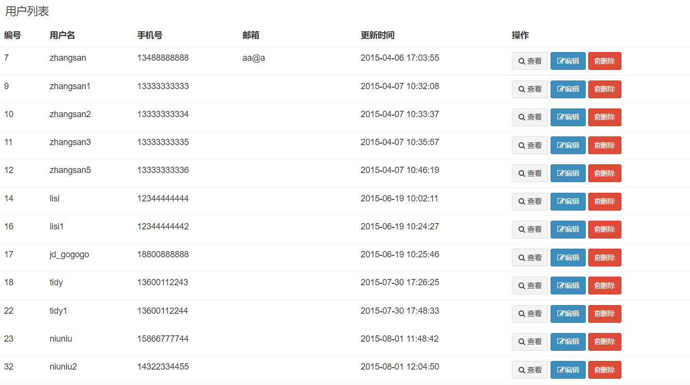
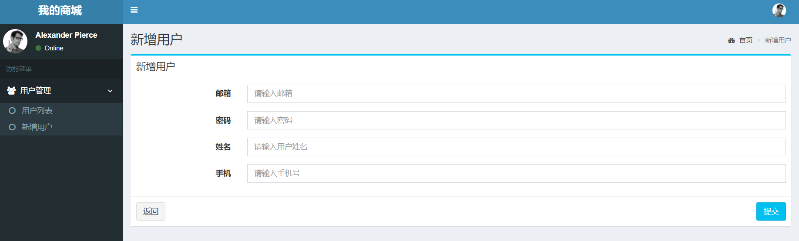
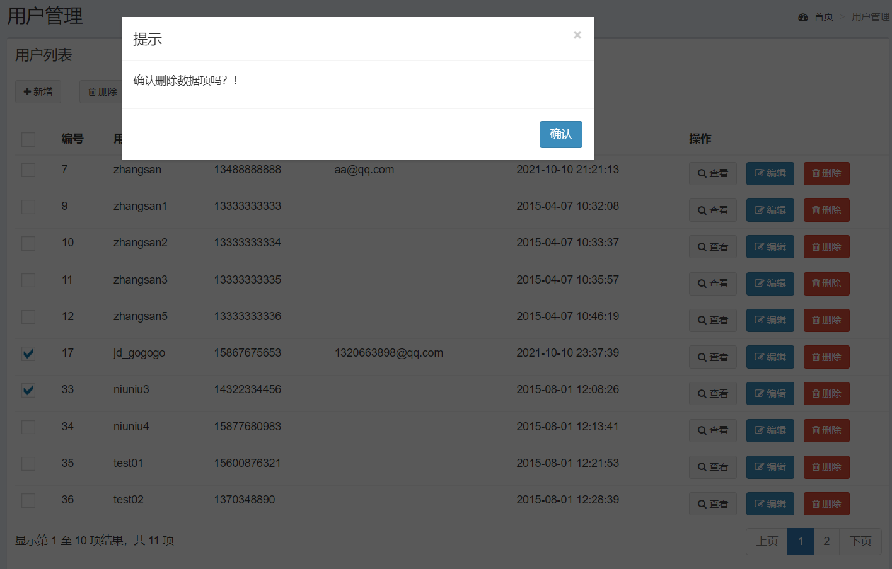

# 项目实战MyShop

## v1.1.1 用户列表查询

​	　在`menu.jsp`导航栏中新增`用户列表`下拉项，用户点击该下拉项即可跳转到用户列表页面。

```html{3}
 <ul class="treeview-menu">
    <li>
        <a href="/user/list"><i class="fa fa-circle-o"></i> 用户列表</a>
    </li>
</ul>
```


### 用户列表页面

​	　新建`user_list.jsp`页面，使用`<c:forEach>标签` 遍历`users`属性，将查询出来的全部的用户数据展示到页面上。

```html{39-65}
<%@ page contentType="text/html;charset=UTF-8" language="java" %>
<%@ taglib uri="http://java.sun.com/jsp/jstl/core" prefix="c" %>
<%@ taglib prefix="fmt" uri="http://java.sun.com/jsp/jstl/fmt" %>
<%@ taglib prefix="form" uri="http://www.springframework.org/tags/form" %>

<!DOCTYPE html>
<head>
    <title>我的商城 | 用户管理</title>
    <jsp:include page="../includes/header.jsp"/>
</head>
<body class="hold-transition skin-blue sidebar-mini">
<div class="wrapper">
    <jsp:include page="../includes/nav.jsp"/>
    <jsp:include page="../includes/menu.jsp"/>
    <!-- Content Wrapper. Contains page content -->
    <div class="content-wrapper">
        <!-- Content Header (Page header) -->
        <section class="content-header">
            <h1>
                用户管理
                <small></small>
            </h1>
            <ol class="breadcrumb">
                <li><a href="#"><i class="fa fa-dashboard"></i> 首页</a></li>
                <li class="active">用户管理</li>
            </ol>
        </section>
        <!-- Main content -->
        <section class="content">
            <!-- /.row -->
            <div class="row">
                <div class="col-xs-12">
                    <div class="box">
                        <div class="box-header">
                            <h3 class="box-title">用户列表</h3>
                        </div>
                        <!-- /.box-header -->
                        <div class="box-body table-responsive no-padding">
                            <table class="table table-hover">
                                <thead>
                                <tr>
                                    <th>编号</th>
                                    <th>用户名</th>
                                    <th>手机号</th>
                                    <th>邮箱</th>
                                    <th>更新时间</th>
                                    <th>操作</th>
                                </tr>
                                </thead>
                                <tbody>
                                <c:forEach items="${users}" var="user">
                                    <tr>
                                        <td>${user.id}</td>
                                        <td>${user.userName}</td>
                                        <td>${user.phone}</td>
                                        <td>${user.email}</td>
                                        <td><fmt:formatDate value="${user.createTime}" pattern="yyyy-MM-dd HH:mm:ss"/></td>
                                        <td>
                                            <a href="#" type="button" class="btn btn-sm btn-default"><i class="fa fa-search"></i> 查看</a>
                                            <a href="#" type="button" class="btn btn-sm btn-primary"><i class="fa fa-edit"></i>编辑</a>
                                            <a href="#" type="button" class="btn btn-sm btn-danger"><i class="fa fa-trash-o"></i>删除</a>
                                        </td>
                                    </tr>
                                </c:forEach>
                                </tbody>
                            </table>
                        </div>
                        <!-- /.box-body -->
                    </div>
                    <!-- /.box -->
                </div>
            </div>
        </section>
    </div>
    <jsp:include page="../includes/copyright.jsp"/>
</div>
<jsp:include page="../includes/foot.jsp"/>
</body>
</html>
```


### 编写业务代码

​	　新建`UserController`，并编写`list`方法，处理/`user/list`跳转用户列表页面的请求，将查询到的用户数据返回到`user_list`页面进行展示。

```java{14-19}
/**
 * 用户管理
 * */
@Controller
@RequestMapping("/user/")
public class UserController {

    @Autowired
    private UserService userService;

    /**
     * 跳转用户列表页面
     * */
    @RequestMapping(value = "list",method = RequestMethod.GET)
    public String list(User user,Model model){
        val userResult = userService.selectByUserLike(user);
        model.addAttribute("users",userResult);
        return "user_list";
    }
}
```

### 测试运行

​	　重新运行项目，可以看到`用户列表`页面，已经将数据库中的全部用户都查询出来，并可以在页面上展示用户列表信息了。




## v1.1.2 新增用户页面

​	　首先，在`menu.jsp`中添加`新增用户`下拉项，用户点击该下拉项即可跳转到新增用户页面。

```html{4}
 <ul class="treeview-menu">
    <li>
         <li><a href="/user/list"><i class="fa fa-circle-o"></i> 用户列表</a></li>
         <li><a href="/user/form"><i class="fa fa-circle-o"></i> 新增用户</a></li>
    </li>
</ul>
```

​	　然后，在`user_list.jsp`中添加`新增`用户按钮，请求路径为`/user/form`。

```html{2-4}
<div class="box-body">
     <a href="/user/form" type="button" class="btn btn-sm btn-default">
         <i class="fa fa-plus"></i> 新增
     </a> 
</div>
```

​	　最后，还需要在`列表操作项`中的`编辑`按钮中，设定`href`的跳转路径，使得每个用户明细都可以进行编辑操作。

```html{1}
<a href="/user/form?id=${user.id}" type="button" class="btn btn-sm btn-primary">
    <i class="fa fa-edit"></i>编辑
</a>
```


### 新增用户页面

​	　新建`user_form.jsp`页面，根据`user.id`是否为空，判断页面是作为`新增页面` 还是 `编辑页面`。在`<input>标签`中添加`name`属性和`value`属性，`name属性`设置**提交时的参数名**，若为空则无法上传用户填写的信息；`value属性`是用于**保存失败数据回显**；`id属性`用于设置**操作DOM的元素编号**。

```html{20,25,37,41-76}
<%@ page contentType="text/html;charset=UTF-8" language="java" %>

<!DOCTYPE html>
<head>
    <title>我的商城 | 用户管理</title>
    <jsp:include page="../includes/header.jsp"/>
</head>
<body class="hold-transition skin-blue sidebar-mini">
<div class="wrapper">

    <jsp:include page="../includes/nav.jsp"/>

    <jsp:include page="../includes/menu.jsp"/>

    <!-- Content Wrapper. Contains page content -->
    <div class="content-wrapper">
        <!-- Content Header (Page header) -->
        <section class="content-header">
            <h1>
                ${user.id == null ? "新增" : "编辑"}用户
                <small></small>
            </h1>
            <ol class="breadcrumb">
                <li><a href="#"><i class="fa fa-dashboard"></i> 首页</a></li>
                <li class="active">${user.id == null ? "新增" : "编辑"}用户</li>
            </ol>
        </section>

        <!-- Main content -->
        <section class="content">

            <div class="row">
                <div class="col-md-12">
                    <!-- Horizontal Form -->
                    <div class="box box-info">
                        <div class="box-header with-border">
                            <h3 class="box-title">${user.id == null ? "新增" : "编辑"}用户</h3>
                        </div>
                        <!-- /.box-header -->
                        <!-- form start -->
                        <form id="inputForm" class="form-horizontal" action="#" method="post">
                            <div class="box-body">
                                <div class="form-group">
                                    <label for="email" class="col-sm-2 control-label">邮箱</label>

                                    <div class="col-sm-10">
                                        <input type="email" class="form-control" id="email" name="email" value="${user.email}"  placeholder="请输入邮箱"/>
                                    </div>
                                </div>
                                <div class="form-group">
                                    <label for="passWord" class="col-sm-2 control-label">密码</label>

                                    <div class="col-sm-10">
                                        <input type="password" class="form-control" id="passWord"  name="passWord" value="${user.passWord}"  placeholder="请输入密码"/>
                                    </div>
                                </div>
                                <div class="form-group">
                                    <label for="userName" class="col-sm-2 control-label">姓名</label>

                                    <div class="col-sm-10">
                                        <input type="text" class="form-control" id="userName" name="userName" value="${user.userName}"  placeholder="请输入用户姓名"/>
                                    </div>
                                </div>
                                <div class="form-group">
                                    <label for="phone" class="col-sm-2 control-label">手机</label>

                                    <div class="col-sm-10">
                                        <input type="text" class="form-control" id="phone" name="phone" value="${user.phone}" placeholder="请输入手机号"/>
                                    </div>
                                </div>
                            </div>
                            <!-- /.box-body -->
                            <div class="box-footer">
                                <button type="button" class="btn btn-default" onclick="history.go(-1)">返回</button>
                                <button type="submit" class="btn btn-info pull-right">提交</button>
                            </div>
                            <!-- /.box-footer -->
                        </form>
                    </div>
                </div>
            </div>
        </section>
    </div>

    <jsp:include page="../includes/copyright.jsp"/>

</div>
<jsp:include page="../includes/foot.jsp"/>
</body>
</html>
```


### 编写业务代码

​	　由于，将`user_form.jsp`作为`新增或编辑`的页面，并通过 `${user.id == null ? "新增" : "编辑"}用户`进行区分。所以，在UserController中，必须保证在**页面跳转**前，将**非空的user对象**传到页面上。

```java
/**
* ① @ModelAttribute注解的方法会在@RequestMapping注解的方法之前执行
* ② @ModelAttribute注解的方法会自动将返回值user 自动放到Model中
* */
@ModelAttribute
public User getUser(Long id){
    User user = null;
    if(id != null){
        user = userService.selectUserById(id);
    }else {
        //必须在页面跳转中将非空的user对象传到user_form.jsp页面上
        user = new User();
    }
    return user;
}

/**
* 跳转用户表单页面
**/
@RequestMapping(value = "form",method = RequestMethod.GET)
public String form(){
    return "user_form";
}
```


### 测试运行

（1）点击菜单栏中的`新增用户` 、用户列表中的`新增按钮`，都可看到`新增用户页面`



（2）点击用户列表中的`编辑按钮`，可以显示编辑用户页面，并展示所选的用户信息


## v1.1.3 保存用户信息

### SpringMVC标签库

​	　首先，在`user_form.jsp`中修改`inputForm`的`action`提交路径为`/user/save`，然后使用`SpringMVC标签库`简化`form标签`、`input标签`的写法，通过设置`modelAttribute`属性，来获取`/user/save`请求操作失败后回传的`user`对象，并**自动回显**到各个控件中。

```html{2,6,7,12,18,24,30}
<!-- 第一步：添加springmvc标签库 -->
<%@ taglib prefix="form" uri="http://www.springframework.org/tags/form" %>

<!-- 第二步：新增保存失败时，错误信息的显示-->
<!-- form start -->
<form:form id="inputForm" class="form-horizontal" 
           action="/user/save" method="post" modelAttribute="user">
  <div class="box-body">
     <div class="form-group">
        <label for="email" class="col-sm-2 control-label">邮箱</label>
        <div class="col-sm-10">
            <form:input class="form-control" path="email"  placeholder="请输入邮箱"/>
        </div>
      </div>
   <div class="form-group">
       <label for="passWord" class="col-sm-2 control-label">密码</label>
        <div class="col-sm-10">
           <form:password class="form-control" path="passWord"  placeholder="请输入密码"/>
        </div>
    </div>
    <div class="form-group">
         <label for="userName" class="col-sm-2 control-label">姓名</label>
         <div class="col-sm-10">
            <form:input class="form-control" path="userName"  placeholder="请输入用户姓名"/>
         </div>
     </div>
     <div class="form-group">
         <label for="phone" class="col-sm-2 control-label">手机</label>
         <div class="col-sm-10">
             <form:input class="form-control" path="phone"  placeholder="请输入手机号"/>
         </div>
     </div>
   </div>
   <!-- /.box-body -->
   <div class="box-footer">
      <button type="button" class="btn btn-default" onclick="history.go(-1)">返回</button>
      <button type="submit" class="btn btn-info pull-right">提交</button>
    </div>
    <!-- /.box-footer -->
</form:form>
```

​	　特别的，SpringMVC标签库要求`modelAttribute` **属性名必须设置** （否则会使用默认值），以及 **属性值必须为非空对象**，否则无法加载页面。

​	　最后，需要在`user_form.jsp`和`user_list.jsp`中，新增`/user/save`接口保存失败或者保存成功后，操作信息的显示。

```xml
<!-- 第一步：添加jstl标签库 -->
<%@ taglib uri="http://java.sun.com/jsp/jstl/core" prefix="c" %>

<!-- 第二步：保存失败时显示错误信息-->
<!-- 添加位置： <div class="row"><div class="col-xs-12">-->
 <c:if test="${saveResult != null}">
     <div class="alert 
         alert-${saveResult.status ==  true ? "success" : "danger"} alert-dismissible">
        <button type="button" 
        	class="close" data-dismiss="alert" aria-hidden="true">&times;
        </button>
        ${saveResult.messages}
     </div>
</c:if> 
```


### jQuery Validation

​	　首先，[下载](https://www.jsdelivr.com/package/npm/jquery-validation?version=1.14.0)并复制`jQuery Validation`插件到项目中。然后，在`foot.jsp`页面中，引入`jQuery Validation`**前端表单验证**框架。

```xml
<!-- Jquery validation Plugin -v1.14.0 -->
<script src="/static/assets/plugins/jquery-validation/js/jquery.validate.min.js"></script>
<script src="/static/assets/plugins/jquery-validation/js/additional-methods.min.js"></script>
<script src="/static/assets/plugins/jquery-validation/js/localization/messages_zh.min.js"></script>
```

​	　然后，新建封装校验器`validation.js`文件，其不仅包含了`jQuery Validation`的**默认校验规则**，还包含了**自定义的检验规则**`mobile`。`jQuery Validation`默认校验规则如下：

```
required：true 必输字段
remote：check.php 使用 ajax 方法调用 check.php 验证输入值
email：true 必须输入正确格式的电子邮件
url：true 必须输入正确格式的网址
date：true 必须输入正确格式的日期
dateISO：true 必须输入正确格式的日期(ISO)，如：2009-06-23，1998/01/22 (不验证有效性)
number：true 必须输入合法的数字(负数，小数)
digits：true 必须输入整数
creditcard： 必须输入合法的信用卡号
equalTo：#field，输入值必须和 #field 相同
accept： 输入拥有合法后缀名的字符串（上传文件的后缀）
maxlength：5，输入长度最多是5的字符串(汉字算一个字符)
minlength：10，输入长度最小是10的字符串(汉字算一个字符)
rangelength：[5,10]，输入长度必须介于 5 和 10 之间的字符串")(汉字算一个字符)
range：[5,10]，输入值必须介于 5 和 10 之间
max：5，输入值不能大于 5
min：10，输入值不能小于 10
```

​	　`Validate`是一个**函数对象**，`return()`里面的是**公共方法**，可以**直接被外部调用**；`handlerInit`和`handlerValidate`都是**私有方法**，**私有方法只能被return里面的公共方法调用**。特别的：`$(function () {});`这种语句会在`validation.js`被页面引用的时候执行，多用于初始化操作。

```js
/**
 * jQuery 有效性验证
 * @constructor
 */
var Validate = function () {

    /**
     * 自定义校验规则
     */
    var handlerInit = function () {
        $.validator.addMethod("mobile", function (value, element) {
            var length = value.length;
            var mobile = /^(((13[0-9]{1})|(15[0-9]{1}))+\d{8})$/;
            return this.optional(element) || (length == 11 && mobile.test(value));
        }, "手机号码格式错误");
    };

    /**
     * 表单验证
     * @param formId
     */
    var handlerValidate = function (formId) {
        $("#" + formId).validate({
            errorElement: 'span',
            errorClass: 'help-block',
            errorPlacement: function (error, element) {
                element.parent().parent().attr("class", "form-group has-error");
                error.insertAfter(element);
            }
        });
    };

    return {
        /**
         * 初始化校验规则
         */
        init: function () {
            handlerInit();
        },

        /**
         * 表单验证
         * @param formId
         */
        validateForm: function (formId) {
            handlerValidate(formId);
        }
    }
}();

//JS引用时执行
$(function () {
    Validate.init();
});
```

​	　然后，在`foot.jsp`页面中，引入`validation.js`，至此`jQuery Validation`已经配置完成。

```xml
<script src="/static/assets/app/validation.js"></script>
```

​	　最后，在 `user_form.jsp` 页面中，添加`required（必填）`、`email和mobile（验证格式）`，即可验证`form表单`用户填写的内容。

```xml{15,19}
<!-- 第一步：在 user_form.jsp 页面中，验证inputForm中的内容 -->
<div class="form-group">
    <label for="phone" class="col-sm-2 control-label">手机</label>
    <div class="col-sm-10">
        <form:input class="form-control required mobile" path="phone"/>
    </div>
</div>

<!-- 第二步：在 user_form.jsp 页面中，验证inputForm表单中的内容 -->
<script>
    Validate.validateForm("inputForm");
</script>

<!-- 验证效果 -->
<div class="form-group has-error">
    <label for="phone" class="col-sm-2 control-label">手机</label>
    <div class="col-sm-10">
        <form:input class="form-control required mobile" path="phone"/>
        <span class="help-bloc">验证失败信息</span>
    </div>
</div>
```


### Spring Validation

​	　`JSR-303` 是 `JavaEE 6` 中的一项子规范，叫做 `Bean Validation`，用于对 `Java Bean` 中的字段的值进行验证。`Spring MVC 3.x` 之中也大力支持 `JSR-303`，可以在控制器中使用注解的方式对表单提交的数据方便地验证，`Spring 4.0` 开始支持 `Bean Validation` 功能。

::: details 基本的校验规则

（1）空检查

```xml
@Null 验证对象是否为 null
@NotNull 验证对象是否不为 null, 无法查检长度为 0 的字符串
@NotBlank 检查约束字符串是不是Null，以及 Trim 后 长度是否大于 0
@NotEmpty 检查约束元素是否为 NULL 或者是 EMPTY
```

（2）布尔检查

```
@AssertTrue 验证 Boolean 对象是否为 true
@AssertFalse 验证 Boolean 对象是否为 false
```

（3）长度检查

```
@Size(min=, max=) 验证对象（Array, Collection , Map, String）长度是否在给定的范围之内
@Length(min=, max=) 验证字符串长度介于 min 和 max 之间
```

（4）日期检查

```
@Past 验证 Date 和 Calendar 对象是否在当前时间之前，验证成立的话被注释的元素一定是一个过去的日期
@Future 验证 Date 和 Calendar 对象是否在当前时间之后 ，验证成立的话被注释的元素一定是一个将来的日期
```

（5）正则检查

```
@Pattern 验证 String 对象是否符合正则表达式的规则，被注释的元素符合制定的正则表达式
regexp：正则表达式
flags：指定 Pattern.Flag 的数组，表示正则表达式的相关选项
```

（5）数值检查

​	　建议使用在 `String` 、`Integer` 类型，不建议使用在 `int` 类型上，因为表单值为 `“”` 时无法转换为 `int`，但可以转换为 `String` 为 `“”`，`Integer` 为 `null`。

```
@Min 验证 Number 和 String 对象是否大等于指定的值
@Max 验证 Number 和 String 对象是否小等于指定的值
@DecimalMax 被标注的值必须不大于约束中指定的最大值. 这个约束的参数是一个通过 BigDecimal 定义的最大值的字符串表示 .小数 存在精度
@DecimalMin 被标注的值必须不小于约束中指定的最小值. 这个约束的参数是一个通过 BigDecimal 定义的最小值的字符串表示 .小数 存在精度
@Digits 验证 Number 和 String 的构成是否合法
@Digits(integer=,fraction=) 验证字符串是否是符合指定格式的数字，integer 指定整数精度，fraction 指定小数精度
@Range(min=, max=) 被指定的元素必须在合适的范围内
@Range(min=10000,max=50000,message=”range.bean.wage”)
@Valid 递归的对关联对象进行校验, 如果关联对象是个集合或者数组，那么对其中的元素进行递归校验，如果是一个 map，则对其中的值部分进行校验.(是否进行递归验证)
@CreditCardNumber 信用卡验证
@Email 验证是否是邮件地址，如果为 null，不进行验证，算通过验证
@ScriptAssert(lang= ,script=, alias=)
@URL(protocol=,host=, port=,regexp=, flags=)
```

:::

​	　使用 `Hibernate Validator 5.x` 来实现 `Spring Validation` 接口，首先，在`pom.xml` 添加依赖。

```xml
<dependency>
    <groupId>org.hibernate</groupId>
    <artifactId>hibernate-validator</artifactId>
    <version>5.3.4.Final</version>
</dependency>
```

​	　然后，在`utils`目录新建`BeanValidator`工具类，用于对请求参数进行校验。

```java
import org.springframework.beans.factory.annotation.Autowired;
import org.springframework.validation.beanvalidation.LocalValidatorFactoryBean;
import javax.validation.ConstraintViolation;
import javax.validation.ConstraintViolationException;
import javax.validation.Validator;
import java.util.ArrayList;
import java.util.HashMap;
import java.util.List;
import java.util.Map;
import java.util.Set;

/**
 * JSR303 Validator(Hibernate Validator)工具类.
 * <p>
 * ConstraintViolation 中包含 propertyPath, message 和 invalidValue 等信息.
 * 提供了各种 convert 方法，适合不同的 i18n 需求:
 * 1. List<String>, String 内容为 message
 * 2. List<String>, String 内容为 propertyPath + separator + message
 * 3. Map<propertyPath, message>
 * <p>
 * 详情见wiki: https://github.com/springside/springside4/wiki/HibernateValidator
 */
public class BeanValidator {

    private static Validator validator;

    public static void setValidator(Validator validator) {
        BeanValidator.validator = validator;
    }

    /**
     * 调用 JSR303 的 validate 方法, 验证失败时抛出 ConstraintViolationException.
     */
    private static void validateWithException(Validator validator, Object object, Class<?>... groups) throws ConstraintViolationException {
        Set constraintViolations = validator.validate(object, groups);
        if (!constraintViolations.isEmpty()) {
            throw new ConstraintViolationException(constraintViolations);
        }
    }

    /**
     * 辅助方法, 转换 ConstraintViolationException 中的 Set<ConstraintViolations> 中为 List<message>.
     */
    private static List<String> extractMessage(ConstraintViolationException e) {
        return extractMessage(e.getConstraintViolations());
    }

    /**
     * 辅助方法, 转换 Set<ConstraintViolation> 为 List<message>
     */
    private static List<String> extractMessage(Set<? extends ConstraintViolation> constraintViolations) {
        List<String> errorMessages = new ArrayList<String>();
        for (ConstraintViolation violation : constraintViolations) {
            errorMessages.add(violation.getMessage());
        }
        return errorMessages;
    }

    /**
     * 辅助方法, 转换 ConstraintViolationException 中的 Set<ConstraintViolations> 为 Map<property, message>.
     */
    private static Map<String, String> extractPropertyAndMessage(ConstraintViolationException e) {
        return extractPropertyAndMessage(e.getConstraintViolations());
    }

    /**
     * 辅助方法, 转换 Set<ConstraintViolation> 为 Map<property, message>.
     */
    private static Map<String, String> extractPropertyAndMessage(Set<? extends ConstraintViolation> constraintViolations) {
        Map<String, String> errorMessages = new HashMap<String, String>();
        for (ConstraintViolation violation : constraintViolations) {
            errorMessages.put(violation.getPropertyPath().toString(), violation.getMessage());
        }
        return errorMessages;
    }

    /**
     * 辅助方法, 转换 ConstraintViolationException 中的 Set<ConstraintViolations> 为 List<propertyPath message>.
     */
    private static List<String> extractPropertyAndMessageAsList(ConstraintViolationException e) {
        return extractPropertyAndMessageAsList(e.getConstraintViolations(), " ");
    }

    /**
     * 辅助方法, 转换 Set<ConstraintViolations> 为 List<propertyPath message>.
     */
    private static List<String> extractPropertyAndMessageAsList(Set<? extends ConstraintViolation> constraintViolations) {
        return extractPropertyAndMessageAsList(constraintViolations, " ");
    }

    /**
     * 辅助方法, 转换 ConstraintViolationException 中的 Set<ConstraintViolations> 为 List<propertyPath + separator + message>.
     */
    private static List<String> extractPropertyAndMessageAsList(ConstraintViolationException e, String separator) {
        return extractPropertyAndMessageAsList(e.getConstraintViolations(), separator);
    }

    /**
     * 辅助方法, 转换 Set<ConstraintViolation> 为 List<propertyPath + separator + message>.
     */
    private static List<String> extractPropertyAndMessageAsList(Set<? extends ConstraintViolation> constraintViolations, String separator) {
        List<String> errorMessages = new ArrayList<String>();
        for (ConstraintViolation violation : constraintViolations) {
            errorMessages.add(violation.getPropertyPath() + separator + violation.getMessage());
        }
        return errorMessages;
    }

    /**
     * 服务端参数有效性验证
     *
     * @param object 验证的实体对象
     * @param groups 验证组
     * @return 验证成功：返回 null；验证失败：返回错误信息
     */
    public static String validator(Object object, Class<?>... groups) {
        try {
            validateWithException(validator, object, groups);
        } catch (ConstraintViolationException ex) {
            List<String> list = extractMessage(ex);
            list.add(0, "数据验证失败：");

            // 封装错误消息为字符串
            StringBuilder sb = new StringBuilder();
            for (int i = 0; i < list.size(); i++) {
                String exMsg = list.get(i);
                if (i != 0 ){
                    sb.append(String.format("%s. %s", i, exMsg)).append(list.size() > 1 ? "<br/>" : "");
                } else {
                    sb.append(exMsg).append(list.size() > 1 ? "<br/>" : "");
                }
            }

            return sb.toString();
        }

        return null;
    }
}
```

​	　特别的，因为**Spring只能自动注入对象，但是不能自动注入`static`标注的属性**，所以，需要手动注入`BeanValidator`工具类中的`validator`属性值。特别的，此处的`beanValidator`配置，在`webapp`中可以实例化，但是在`JavaSE`中不能。

```xml
<!--配置组件扫描器，用于在指定的基本包中扫描注解-->
<context:component-scan base-package="com.shooter.funtl">
    <context:exclude-filter type="annotation" expression="org.springframework.stereotype.Controller"/>
</context:component-scan>

<!-- 配置 Bean Validator 定义 -->
<bean id="validator" class="org.springframework.validation.beanvalidation.LocalValidatorFactoryBean"/>
<bean id="beanValidator" class="com.shooter.funtl.common.utils.BeanValidator">
    <property name="validator" ref="validator" />
</bean>
```

​	　最后，在`user.java`中新增`Spring Validation`的验证方式。

```java
@Length(min = 6, max = 20, message = "用户名长度必须介于 6 和 20 之间")
private String username;

@Length(min = 6, max = 20, message = "密码长度必须介于 6 和 20 之间")
private String password;

@Pattern(regexp = RegexpUtils.PHONE, message = "手机号格式不正确")
private String phone;

@Pattern(regexp = RegexpUtils.EMAIL, message = "邮箱格式不正确")
private String email;
```


### RegexpUtils

​	　新建`RegexpUtils`工具类，用于后台数据验证。

```java
package com.shooter.funtl.common.utils;

/**
 * 正则表达式工具类
 */
public class RegexpUtils {
    /**
     * 验证手机号
     */
    public static final String PHONE = "^((13[0-9])|(15[^4,\\D])|(18[0,5-9]))\\d{8}$";

    /**
     * 验证邮箱地址
     */
    public static final String EMAIL = "\\w+(\\.\\w)*@\\w+(\\.\\w{2,3}){1,3}";

    /**
     * 验证手机号
     * @param phone
     * @return
     */
    public static boolean checkPhone(String phone) {
        return phone.matches(PHONE);
    }

    /**
     * 验证邮箱
     * @param email
     * @return
     */
    public static boolean checkEmail(String email) {
        return email.matches(EMAIL);
    }
}
```


### 编写业务代码

（1）UserController

​	　`/user/save`的`请求参数`会映射到`user`形参中，同时，**`user`也会自动添加到`model`属性中**，可以用于保存失败后回显。若保存成功，需要重定向到`user_list.jsp`页面，此时`model`中保存的属性不能带入到`user_list.jsp`页面中，需要通过`addFlashAttribute`设置调转属性才可以。

```java
/**
* 保存用户表单
* */
@RequestMapping(value = "save",method = RequestMethod.POST)
public String save(User user, Model model,RedirectAttributes redirectAttributes){
    //保存用户表单
    val saveResult = userService.save(user);

    //保存成功
    if(saveResult.getStatus()){
        //设置调转属性
        redirectAttributes.addFlashAttribute("saveResult",saveResult);
        return "redirect:/user/list";
    }
    //保存失败
    else {
        model.addAttribute("saveResult",saveResult);
        return "user_form";
    }
}
```


（2）UserService实现类

```java
@Override
public BaseResult save(User user) {
    //校验用户有效性
    val errorMsg = BeanValidator.validator(user);
    if(StringUtils.isNotBlank(errorMsg)){
        return BaseResult.fail(errorMsg);
    }
    val emailRecord = selectUserByEmail(user.getEmail());
    if(emailRecord != null && !emailRecord.getId().equals(user.getId())){
        return BaseResult.fail("该邮箱已经存在，请重新输入！");
    }
    val nameRecord = selectUserByName(user.getUserName());
    if(nameRecord != null && !nameRecord.getId().equals(user.getId())){
        return BaseResult.fail("该姓名已经存在，请重新输入！");
    }
    //加密密码
    String md5PassWd = DigestUtils.md5DigestAsHex(user.getPassWord().getBytes());
    user.setPassWord(md5PassWd);
    //保存用户信息
    if(user.getId() != null){
        userDao.updateById(user);
    }else {
        userDao.insert(user);
    }
    return BaseResult.success("用户信息保存成功！");
}
```


（3）BaseResult

```java
package com.shooter.funtl.common.dto;

import lombok.Data;
import lombok.val;
import java.io.Serializable;

@Data
public class BaseResult implements Serializable {

    private Boolean status;

    private String messages;

    private Object object;

    public static BaseResult success(String message){
        val result = new BaseResult();
        result.setStatus(true);
        result.setMessages(message);
        return result;
    }

    public static BaseResult fail(String message){
        val result = new BaseResult();
        result.setStatus(false);
        result.setMessages(message);
        return result;
    }
}
```


### 测试运行

（1）若输入错误格式的邮箱、错误的手机号，可以显示验证`jQuery Validation`提示的错误信息。


（2）若输入非空、长度不符合要求的用户信息，可以显示验证`Spring Validation`提示的错误信息。


（3）若保存失败，显示失败原因，并且填写的用户信息会回显，特别的，**密码是不会回显的**。


（4）保存成功后，重定向到用户列表页面，并提示保存成功。


## v1.1.4 分页搜索查询

​	　	用户列表中目前只能查询全部的用户数据，接下来需要对查询结果进行分页，并增加姓名、电话、邮箱等查询条件。

### jQuery Datatables

​	　	`jQuery Datatables`是`AdminLTE-2.4.18`自带`jQuery` 表格分页查询插件，无需单独下载，通过如下方式即可引用。

```html
<!-- header.jsp引入CSS部分 -->
<link rel="stylesheet" href="/static/assets/bower_components/datatables.net-bs/css/dataTables.bootstrap.min.css">

<!-- foot.jsp引入JS部分 -->
<script src="/static/assets/bower_components/datatables.net/js/jquery.dataTables.min.js"></script>
<script src="/static/assets/bower_components/datatables.net-bs/js/dataTables.bootstrap.min.js"></script>
```

​	　	首先，在`webapp/static/app/utils`目录下新建`dataTable.js`工具包，用于获取`id = dataTable`的表格元素，调用`DataTable方法`并初始化一些参数。

```js
var DataTableUtils = function () {

    var _dataTable;

    var handlerDataTableInit = function (tableId,url, columns) {
        return $("#" + tableId).DataTable({
            // 是否开启本地分页
            "paging": true,
            // 是否显示左下角信息
            "info": true,
            // 是否允许用户改变表格每页显示的记录数
            "lengthChange": false,
            // 是否开启本地排序
            "ordering": false,
            // 是否显示处理状态(排序的时候，数据很多耗费时间长的话，也会显示这个)
            "processing": true,
            // 是否允许 DataTables 开启本地搜索
            "searching": false,
             // 是否开启服务器模式
            "serverSide": true,
            // 控制 DataTables 的延迟渲染，可以提高初始化的速度
            "deferRender": true,
            // 增加或修改通过 Ajax 提交到服务端的请求数据
            "ajax": {
                "url": url
            },
            // 分页按钮显示选项
            "pagingType": "full_numbers",
            // 设置列的数据源
            "columns": columns,
            // 国际化
            "language": {
                "sProcessing": "处理中...",
                "sLengthMenu": "显示 _MENU_ 项结果",
                "sZeroRecords": "没有匹配结果",
                "sInfo": "显示第 _START_ 至 _END_ 项结果，共 _TOTAL_ 项",
                "sInfoEmpty": "显示第 0 至 0 项结果，共 0 项",
                "sInfoFiltered": "(由 _MAX_ 项结果过滤)",
                "sInfoPostFix": "",
                "sSearch": "搜索:",
                "sUrl": "",
                "sEmptyTable": "表中数据为空",
                "sLoadingRecords": "载入中...",
                "sInfoThousands": ",",
                "oPaginate": {
                    "sFirst": "首页",
                    "sPrevious": "上页",
                    "sNext": "下页",
                    "sLast": "末页"
                },
                "oAria": {
                    "sSortAscending": ": 以升序排列此列",
                    "sSortDescending": ": 以降序排列此列"
                },
            },
            // 表格重绘的回调函数
            "drawCallback": function (settings) {

            },
        });
    };

    var handlerDataTableSearch = function (param) {
        _dataTable.settings()[0].ajax.data = param;
        _dataTable.ajax.reload();
    }

    return {
         /**
         * 表格初始化
         */
        dataTableInit: function (tableId,url, columns) {
            _dataTable = handlerDataTableInit(tableId,url, columns);
            return _dataTable;
        },
        /**
         * 分页查询
         */
        dataTableSearch: function (param) {
            handlerDataTableSearch(param);
        }
    }
}();
```

​	　	最后，还需要再`foot.jsp`中引入新建的`dataTable.js`文件，至此`jQuery Datatables`已经配置完成。

```js
<script src="/static/app/utils/dataTable.js"></script>
```

### DateTime工具类

​	　	在`webapp/static/app/utils`目录下新建`dateTime.js`文件，用于将时间戳转换为标准时间格式。

```js
/**
 * 日期时间工具类
 * @type {{dateFormat}}
 */
var DateTime = function () {
    var patterns = {
        PATTERN_ERA: 'G', // Era 标志符 Era strings. For example: "AD" and "BC"
        PATTERN_YEAR: 'y', // 年
        PATTERN_MONTH: 'M', // 月份
        PATTERN_DAY_OF_MONTH: 'd', // 月份的天数
        PATTERN_HOUR_OF_DAY1: 'k', // 一天中的小时数（1-24）
        PATTERN_HOUR_OF_DAY0: 'H', // 24 小时制，一天中的小时数（0-23）
        PATTERN_MINUTE: 'm', // 小时中的分钟数
        PATTERN_SECOND: 's', // 秒
        PATTERN_MILLISECOND: 'S', // 毫秒
        PATTERN_DAY_OF_WEEK: 'E', // 一周中对应的星期，如星期一，周一
        PATTERN_DAY_OF_YEAR: 'D', // 一年中的第几天
        PATTERN_DAY_OF_WEEK_IN_MONTH: 'F', // 一月中的第几个星期(会把这个月总共过的天数除以7,不够准确，推荐用W)
        PATTERN_WEEK_OF_YEAR: 'w', // 一年中的第几个星期
        PATTERN_WEEK_OF_MONTH: 'W', // 一月中的第几星期(会根据实际情况来算)
        PATTERN_AM_PM: 'a', // 上下午标识
        PATTERN_HOUR1: 'h', // 12 小时制 ，am/pm 中的小时数（1-12）
        PATTERN_HOUR0: 'K', // 和 h 类型
        PATTERN_ZONE_NAME: 'z', // 时区名
        PATTERN_ZONE_VALUE: 'Z', // 时区值
        PATTERN_WEEK_YEAR: 'Y', // 和 y 类型
        PATTERN_ISO_DAY_OF_WEEK: 'u',
        PATTERN_ISO_ZONE: 'X'
    };

    var week = {
        'ch': {
            "0": "\u65e5",
            "1": "\u4e00",
            "2": "\u4e8c",
            "3": "\u4e09",
            "4": "\u56db",
            "5": "\u4e94",
            "6": "\u516d"
        },
        'en': {
            "0": "Sunday",
            "1": "Monday",
            "2": "Tuesday",
            "3": "Wednesday",
            "4": "Thursday",
            "5": "Friday",
            "6": "Saturday"
        }
    };

    /**
     * 获取当前时间
     * @returns {string}
     */
    var handlerGetCurrentTime = function () {
        var today = new Date();
        var year = today.getFullYear();
        var month = today.getMonth() + 1;
        var day = today.getDate();
        var hours = today.getHours();
        var minutes = today.getMinutes();
        var seconds = today.getSeconds();
        var timeString = year + "-" + month + "-" + day + " " + hours + ":" + minutes + ":" + seconds;
        return timeString;
    };

    /**
     * 比较时间大小
     * time1 > time2 return 1
     * time1 < time2 return -1
     * time1 == time2 return 0
     * @param time1
     * @param time2
     * @returns {number}
     */
    var handlerCompareTime = function (time1, time2) {
        if (Date.parse(time1.replace(/-/g, "/")) > Date.parse(time2.replace(/-/g, "/"))) {
            return 1;
        } else if (Date.parse(time1.replace(/-/g, "/")) < Date.parse(time2.replace(/-/g, "/"))) {
            return -1;
        } else if (Date.parse(time1.replace(/-/g, "/")) == Date.parse(time2.replace(/-/g, "/"))) {
            return 0;
        }
    };

    /**
     * 是否闰年
     * @param year
     * @returns {boolean}
     */
    var handlerIsLeapYear = function (year) {
        return ((year % 4 === 0 && year % 100 !== 0) || year % 400 === 0);
    };

    /**
     * 获取某个月的天数，从 0 开始
     * @param year
     * @param month
     * @returns {*}
     */
    var handlerGetDaysOfMonth = function (year, month) {
        return [31, (this.isLeapYear(year) ? 29 : 28), 31, 30, 31, 30, 31, 31, 30, 31, 30, 31][month];
    };

    /**
     * 获取某个月的天数，从 0 开始
     * @param year
     * @param month
     * @returns {number}
     */
    var handlerGetDaysOfMonth2 = function (year, month) {
        // 将天置为 0，会获取其上个月的最后一天
        month = parseInt(month) + 1;
        var date = new Date(year, month, 0);
        return date.getDate();
    };

    /**
     * 距离现在几天的日期：负数表示今天之前的日期，0 表示今天，整数表示未来的日期
     * 如 -1 表示昨天的日期，0 表示今天，2 表示后天
     * @param days
     * @returns {string}
     */
    var handlerFromToday = function (days) {
        var today = new Date();
        today.setDate(today.getDate() + days);
        var date = today.getFullYear() + "-" + (today.getMonth() + 1) + "-" + today.getDate();
        return date;
    };

    /**
     * 格式化日期时间
     * @param dateTime 需要格式化的日期时间
     * @param pattern 格式化的模式，如 yyyy-MM-dd hh(HH):mm:ss.S a k K E D F w W z Z
     * @returns {*}
     */
    var handlerFormat = function (dateTime, pattern) {
        var date = new Date(dateTime);
        if (pattern == null || pattern.length == 0) {
            return date.toLocaleString();
        }
        return pattern.replace(/([a-z])\1*/ig, function (matchStr, group1) {
            var replacement = "";
            switch (group1) {
                case patterns.PATTERN_ERA: //G
                    break;
                case patterns.PATTERN_WEEK_YEAR: //Y
                case patterns.PATTERN_YEAR: //y
                    replacement = date.getFullYear();
                    break;
                case patterns.PATTERN_MONTH: //M
                    var month = date.getMonth() + 1;
                    replacement = (month < 10 && matchStr.length >= 2) ? "0" + month : month;
                    break;
                case patterns.PATTERN_DAY_OF_MONTH: //d
                    var days = date.getDate();
                    replacement = (days < 10 && matchStr.length >= 2) ? "0" + days : days;
                    break;
                case patterns.PATTERN_HOUR_OF_DAY1: //k(1~24)
                    var hours24 = date.getHours();
                    replacement = hours24;
                    break;
                case patterns.PATTERN_HOUR_OF_DAY0: //H(0~23)
                    var hours24 = date.getHours();
                    replacement = (hours24 < 10 && matchStr.length >= 2) ? "0" + hours24 : hours24;
                    break;
                case patterns.PATTERN_MINUTE: //m
                    var minutes = date.getMinutes();
                    replacement = (minutes < 10 && matchStr.length >= 2) ? "0" + minutes : minutes;
                    break;
                case patterns.PATTERN_SECOND: //s
                    var seconds = date.getSeconds();
                    replacement = (seconds < 10 && matchStr.length >= 2) ? "0" + seconds : seconds;
                    break;
                case patterns.PATTERN_MILLISECOND: //S
                    var milliSeconds = date.getMilliseconds();
                    replacement = milliSeconds;
                    break;
                case patterns.PATTERN_DAY_OF_WEEK: //E
                    var day = date.getDay();
                    replacement = week['ch'][day];
                    break;
                case patterns.PATTERN_DAY_OF_YEAR: //D
                    replacement = dayOfTheYear(date);
                    break;
                case patterns.PATTERN_DAY_OF_WEEK_IN_MONTH: //F
                    var days = date.getDate();
                    replacement = Math.floor(days / 7);
                    break;
                case patterns.PATTERN_WEEK_OF_YEAR: //w
                    var days = dayOfTheYear(date);
                    replacement = Math.ceil(days / 7);
                    break;
                case patterns.PATTERN_WEEK_OF_MONTH: //W
                    var days = date.getDate();
                    replacement = Math.ceil(days / 7);
                    break;
                case patterns.PATTERN_AM_PM: //a
                    var hours24 = date.getHours();
                    replacement = hours24 < 12 ? "\u4e0a\u5348" : "\u4e0b\u5348";
                    break;
                case patterns.PATTERN_HOUR1: //h(1~12)
                    var hours12 = date.getHours() % 12 || 12; //0转为12
                    replacement = (hours12 < 10 && matchStr.length >= 2) ? "0" + hours12 : hours12;
                    break;
                case patterns.PATTERN_HOUR0: //K(0~11)
                    var hours12 = date.getHours() % 12;
                    replacement = hours12;
                    break;
                case patterns.PATTERN_ZONE_NAME: //z
                    replacement = handlerGetZoneNameValue(date)['name'];
                    break;
                case patterns.PATTERN_ZONE_VALUE: //Z
                    replacement = handlerGetZoneNameValue(date)['value'];
                    break;
                case patterns.PATTERN_ISO_DAY_OF_WEEK: //u
                    break;
                case patterns.PATTERN_ISO_ZONE: //X
                    break;
                default:
                    break;
            }
            return replacement;
        });
    };

    /**
     * 计算一个日期是当年的第几天
     * @param date
     * @returns {number}
     */
    var handlerDayOfTheYear = function (date) {
        var obj = new Date(date);
        var year = obj.getFullYear();
        var month = obj.getMonth(); //从0开始
        var days = obj.getDate();
        var daysArr = [31, (this.isLeapYear(year) ? 29 : 28), 31, 30, 31, 30, 31, 31, 30, 31, 30, 31];
        for (var i = 0; i < month; i++) {
            days += daysArr[i];
        }
        return days;
    };

    /**
     * 获得时区名和值
     * @param dateObj
     * @returns {{name: string, value: string}}
     */
    var handlerGetZoneNameValue = function (dateObj) {
        var date = new Date(dateObj);
        date = new Date(Date.UTC(date.getFullYear(), date.getMonth(), date.getDate()));
        var arr = date.toString().match(/([A-Z]+)([-+]\d+:?\d+)/);
        var obj = {
            'name': arr[1],
            'value': arr[2]
        };
        return obj;
    };

    return {
        getCurrentTime: function () {
            return handlerGetCurrentTime();
        },

        compareTime: function (time1, time2) {
            return handlerCompareTime(time1, time2);
        },

        isLeapYear: function (year) {
            return handlerIsLeapYear(year);
        },

        getDaysOfMonth: function (year, month) {
            return handlerGetDaysOfMonth(year, month);
        },

        getDaysOfMonth2: function (year, month) {
            return handlerGetDaysOfMonth2(year, month);
        },

        fromToday: function (days) {
            return handlerFromToday(days);
        },

        format: function (dateTime, pattern) {
            return handlerFormat(dateTime, pattern);
        },

        dayOfTheYear: function (date) {
            return handlerDayOfTheYear(date);
        },

        getZoneNameValue: function (dateObj) {
            return handlerGetZoneNameValue(dateObj);
        }
    }
}();
```


### JavaScript

​	　	首先，在`webapp/static/app/constant`目录下新建`api.js`文件，用于保存API常量。

```js
var Api = function () {
    return {
        /** 分页查询 */
        page: '/user/page',
    }
}();
```

​	　	接下来，在`webapp/static/app/services`目录下新建`user.js`文件，用于编写用户相关服务。

```js
var User = function () {

    /**
     * 表格分页
     */
    var handlerPageInit = function (tableId) {
        var _columns = [
            {"data": "id"},
            {"data": "userName"},
            {"data": "phone"},
            {"data": "email"},
            {"data": function (row, type, val, meta) {
                    return DateTime.format(row.updateTime,"yyyy-MM-dd HH:mm:ss");
                }
            },
            {
                "data": function (row, type, val, meta) {
                    return '<a href="#" type="button" class="btn btn-sm btn-default"><i class="fa fa-search"></i> 查看</a>&nbsp;&nbsp;&nbsp;' +
                        '<a type="button" href="/user/form?id='+row.id+'" class="btn btn-sm btn-primary"><i class="fa fa-edit"></i> 编辑</a>&nbsp;&nbsp;&nbsp;' +
                        '<a href="#" type="button"  class="btn btn-sm btn-danger"><i class="fa fa-trash-o"></i> 删除</a>';
                }
            }
        ];
        DataTableUtils.dataTableInit(tableId,Api.page, _columns)
    };

    /**
     * 分页查询
     */
    var handlerPageSearch = function () {
        var userName = $("#userName").val();
        var phone = $("#phone").val();
        var email = $("#email").val();
        var param = {
            "userName": userName,
            "phone": phone,
            "email": email
        };
       DataTableUtils.dataTableSearch(param);
    }

    /**
     * 重置查询参数
     */
    var handlerRestSearch = function () {
        $("#userName").val("");
        $("#phone").val();
        $("#email").val();
    };

    return {

       /** 表格初始化 */
        handlerPageInit: function (tableId) {
            handlerPageInit(tableId);
        },

        /** 分页查询 */
        handlerPageSearch: function () {
            handlerPageSearch();
        },
        
        /** 重置查询参数 */
        handlerRestSearch: function () {
            handlerRestSearch();
        },
    }
}();
```

​	　	最后，还需要再`foot.jsp`中引入新建的`user.js`、`api.js`文件。

```js
<script src="/static/app/services/user.js"></script>
<script src="/static/app/constant/api.js"></script>
<script src="/static/app/utils/dateTime.js"></script>
```


### 分页查询页面

​	　	首先，在`user_list.jsp`中新增高级搜索栏，且默认样式是隐藏。

```html
<div class="box box-info box-info-search" style="display: none">
   <div class="box-header">
       <h3 class="box-title">高级搜索</h3>
   </div>
   <div class="box-body">
       <div class="row form-horizontal" >
          <div class="col-xs-12 col-sm-3">
               <div class="form-group">
                    <label for="userName" class="col-sm-4 control-label">姓名</label>
                    <div class="col-sm-8">
                       <input class="form-control" id="userName"  placeholder="请输入用户姓名"/>
                    </div>
               </div>
          </div>
          <div class="col-xs-12 col-sm-3">
             <div class="form-group">
                <label for="phone" class="col-sm-4 control-label">电话</label>
                 <div class="col-sm-8">
                     <input class="form-control" id="phone"  placeholder="请输入电话"/>
                 </div>
             </div>
          </div>
          <div class="col-xs-12 col-sm-3">
              <div class="form-group">
                   <label for="email" class="col-sm-4 control-label">邮箱</label>
                   <div class="col-sm-8">
                        <input class="form-control" id="email"  placeholder="请输入邮箱"/>
                   </div>
              </div>
          </div>
       </div>
       <div class="box-footer">
             <button onclick="User.handlerPageSearch()" class="btn btn-info pull-right">搜索</button>
             <button onclick="User.handlerRestSearch()"  class="btn btn-default pull-right">重置</button>
       </div>
    </div>
</div>
```

​	　	接下来，在功能栏中新增`搜索`按钮，并新增单击事件来控制`高级搜索栏`的隐藏和显示。

```html{6-10}
<div class="box-body">
   <a href="/user/form" type="button" class="btn btn-sm btn-default"><i class="fa fa-plus"></i> 新增</a> 
   <a href="#" type="button" class="btn btn-sm btn-default"><i class="fa fa-trash-o"></i> 删除</a>
   <a href="#" type="button" class="btn btn-sm btn-default"><i class="fa fa-download"></i> 导入</a>
   <a href="#" type="button" class="btn btn-sm btn-default"><i class="fa fa-upload"></i> 导出</a>
   <button type="button" class="btn btn-sm btn-primary"
           onclick="$('.box-info-search').css('display') == 'none' ?
                    $('.box-info-search').show('fast') :$('.box-info-search').hide('fast')">
      <i class="fa fa-search"></i> 搜索
   </button>
</div>
```

​	　	然后，设置`table`标签`id`为`dataTable`，以便于被`jQuery Datatables`插件查找到，原先用于生成用户列表的`<c:forEach>标签`需要被删除，统一交于`jQuery Datatables`插件动态生成。

```html
<!-- /.box-header -->
<div class="box-body table-responsive">
    <table id = "dataTable" class="table table-hover">
        <thead>
            <tr>
                <th>编号</th>
                <th>用户名</th>
                <th>手机号</th>
                <th>邮箱</th>
                <th>更新时间</th>
                <th>操作</th>
            </tr>
        </thead>
    </table>
</div>
<!-- /.box-body -->
```

​	　	最后，在`<jsp:include page="../includes/foot.jsp"/>`后，执行`表格初始化`语句即可。

```js{5}
<jsp:include page="../includes/foot.jsp"/>

<script>
    //表格初始化
    User.handlerPageInit("dataTable");
</script>
```


### 编写业务代码

（1）UserController

​	　	原先是在`跳转用户列表页面`时就查询全部用户信息进行展示，现在需要去除该查询操作，改成通过`Datatables`插件调用`page方法`进行分页查询。

```java
/**
* 分页查询用户信息
* */
@RequestMapping(value = "page",method = RequestMethod.GET)
@ResponseBody
public PageInfo<User> page(UserSearchModal modal){
    return userService.page(modal);
}

/**
* 跳转用户列表页面
* */
@RequestMapping(value = "list",method = RequestMethod.GET)
public String list(){
    //去除查询全部用户信息操作
    return "user_list";
}
```

（2）UserServiceImpl

```java
public PageInfo<User> page(UserSearchModal modal) {
    //设置查询参数
    val user = new User();
    user.setPhone(modal.getPhone());
    user.setEmail(modal.getEmail());
    user.setUserName(modal.getUserName());
    //设置分页查询参数
    val map = new HashMap<String,Object>();
    map.put("length",modal.getLength());
    map.put("start",modal.getStart());
    map.put("user",user);
    //查询
    val data = userDao.page(map);
    val count = userDao.countUserLike(user);
    val page = new PageInfo<User>();
    //Page对象
    page.setData(data);
    page.setRecordsFiltered(count);
    page.setRecordsTotal(count);
    //请求序号要求原样返回
    page.setDraw(modal.getDraw());
    return page;
}
```

（3）UserDao

```java
/**分页查询**/
List<User> page(Map<String,Object> params);

/**统计总数**/
Integer countUserLike(User user);
```

（4）UserMapper.xml

```xml
<select id="page" resultType="User" parameterType="java.util.Map">
        SELECT
            <include refid="userSelect" />
        FROM
           tb_user AS user
        <where>
            <if test="user.userName != null and user.userName != ''">
                AND user.username LIKE CONCAT ('%', #{user.userName}, '%')
            </if>
            <if test="user.email != null and user.email != ''">
                AND user.email LIKE CONCAT ('%', #{user.email}, '%')
            </if>
            <if test="user.phone != null and user.phone != ''">
                AND user.phone LIKE CONCAT ('%', #{user.phone}, '%')
            </if>
        </where>
        LIMIT #{start},#{length}
</select>

<select id="countUserLike" resultType="java.lang.Integer">
        SELECT
          count(1)
        FROM
          tb_user AS user
        <where>
            <if test="userName != null and userName != ''">
                AND user.username LIKE CONCAT ('%', #{userName}, '%')
            </if>
            <if test="email != null and email != ''">
                AND user.email LIKE CONCAT ('%', #{email}, '%')
            </if>
            <if test="phone != null and phone != ''">
                AND user.phone LIKE CONCAT ('%', #{phone}, '%')
            </if>
        </where>
</select>
```

（5）PageInfo

```java
import lombok.Data;
import java.util.List;

@Data
public class PageInfo<T> {
    /**请求序号*/
    private Integer draw;
    /**当前页号，从0开始*/
    private Integer start;
    /**每页大小*/
    private Integer length;
    /**记录总数*/
    private Integer recordsTotal;
    /**记录总数*/
    private Integer recordsFiltered;
    /**查询结果*/
    private List<T> data;
    /**错误信息*/
    private String error;
}
```


### 测试运行

​	　	进入用户列表，即可看到用户信息已经分页显示了；点击`搜索`按钮，即可展示`高级搜索`栏，然后输入姓名 `z` ，即可对姓名进行模糊查询。


## v1.1.5 删除用户信息

### jQuery iCheck

​	　`jQuery iCheck`是表单复选框、单选框控件美化插件，主要用于渲染并美化当前页面的复选框或单选框、响应复选框或单选框的点击事件。特别的，`iCheck`插件是`AdminLTE-2.4.18`自带的，无需另外下载，在页面按照如下方式，即可引入`jQuery iCheck`插件。

```xml
<!-- 在header.js中引入CSS部分 -->
<link rel="stylesheet" href="/static/assets/plugins/iCheck/all.css">
<!-- 在foot.js中引入js部分 -->
<script src="/static/assets/plugins/iCheck/icheck.min.js"></script>
```


::: details iCheck回调事件

​	　iCheck 提供了大量回调事件，都可以用来监听 change 事件；也提供了不同的方法来改变iCheck 的状态，具体事件和方法如下：

| 事件名称    | 使用时机                               | 方法名称 | 作用               |
| ----------- | -------------------------------------- | -------- | ------------------ |
| ifClicked   | 点击自定义的输入框或与其相关联的 label | check    | 设置 checked状态   |
| ifChanged   | 输入框的 checked 或 disabled 状态改变  | uncheck  | 移除 checked 状态  |
| ifChecked   | 输入框的状态变为 checked               | disable  | 设置 disabled状态  |
| ifUnchecked | checked 状态被移除                     | enable   | 移除 disabled 状态 |
| ifDisabled  | 输入框状态变为 disabled                | destroy  | 移除 iCheck 样式   |
| ifEnabled   | disabled 状态被移除                    | on       | 绑定事件           |
| ifCreated   | 输入框被应用了 iCheck 样式             | update   |                    |
| ifDestroyed | iCheck 样式被移除                      | toggle   |                    |

​	　`input`元素绑定iCheck `回调事件` 或 `方法` 的示例如下：

```js
// 使用 on() 方法绑定事件
$('input').on('ifChecked', function(event){
  alert(event.type + ' callback');
});
// 改变输入框状态
$('input').iCheck('方法名称')
```

:::

​	　接着，在`asserts`目录下新建`app`目录，并在`app`目录下新建`icheck.js`文件。默认情况下 `iCheck` 是不生效的，需要使用 JS 代码激活，此过程可以指定 `iCheck` 的皮肤。

```js
var Icheck = function (){

    var _checkbox;
    var _masterCheckbox;

    /**
     * 激活 iCheck
     * */
    var handlerInitCheckbox = function () {
        // 激活 iCheck
        $('input[type="checkbox"].minimal, input[type="radio"].minimal').iCheck({
            checkboxClass: 'icheckbox_minimal-blue',
            radioClass   : 'iradio_minimal-blue'
        });

        //加载使用checkbox-master标记的主icheck 和 checkbox列表
        _masterCheckbox = $('input[type = "checkbox"].minimal.checkbox-master');
        _checkbox =  $('input[type = "checkbox"].minimal').not("[disabled]");
    };

    /**
     * 全选
     * */
    var handleCheckboxAll = function(){
        _masterCheckbox.on("ifClicked", function (e) {
            // true当前状态已选中，点击后应取消选择
            if (e.target.checked) {
                _checkbox.iCheck("uncheck");
            }

            // 当前状态未选中，点击后应全选
            else {
                _checkbox.iCheck("check");
            }
        });
    }

    /**
     * 获取被选中的ID
     * */
    var handleCheckId = function(){
        var _idArray = new Array();
        _checkbox.each(function () {
            var _id = $(this).attr("id");
            if(_id != null && _id !== "undefine" && $(this).is(":checked")){
                _idArray.push(_id);
            }
        })
        return _idArray;
    }

    return{
        init: function () {
            //激活列表中的icheck按钮
            handlerInitCheckbox();
            //激活全选icheck按钮
            handleCheckboxAll();
        },
        handleCheckId : function () {
            return handleCheckId();
        }
    }

}();

//JS引用时执行，激活iCheck
$(document).ready(function (){
    Icheck.init();
})
```

​	　最后，需要在`foot.jsp`页面中，引入`icheck.js`，至此，`jQuery iCheck`已经配置完成。

```xml
<script src="/static/app/utils/icheck.js"></script>
```


### 删除用户页面

​	　首先，在`user_list.jsp`添加`主checkbox选择器`，可以使用`checkbox-master`获取主选择器。

```html{6}
<div class="box-body table-responsive">
    <table id = "dataTable" class="table table-hover">
        <thead>
            <tr>
                 <!-- 设置主checkbox选择器，可以使用checkbox-master获取主选择器 -->
                <th><input type="checkbox" class="minimal checkbox-master" /></th>
                <th>编号</th>
                <!-- 以下部分省略 -->
            </tr>
        </thead>
    </table>
</div>
```

​	　然后，在`user.js`中添加`列表checkbox选择器`，通过`Icheck.handleCheckId()`方法即可获取被选中控件的编号数组。

```js{7-9}
/**
* 表格分页
*/
var handlerPageInit = function () {
    var _columns = [
        {
            "data": function (row, type, val, meta) {
                return '<input id="' + row.id + '" type="checkbox" class="minimal" />';
            }
        },
        {"data": "id"},
        <!-- 以下部分省略 -->
     ];
 };
```

​	　特别的，`icheck`按钮需要激活才能使用，所以，必须在`dataTable.js`中表格重绘事件完成后，再次调用`Icheck.init();`进行激活。

```JS
// 表格重绘的回调函数
"drawCallback": function(settings) {
 	Icheck.init();
 }
```

​	　至此，刷新用户列表页面，`icheck`已经可以正常显示了。接下来，需要为批量删除和单个删除功能增加JS交互代码。


### Modal操作提示窗

​	　	首先，在`WEB-INF`下新建`tags`目录，然后，新建`modal.jsp`用于将接口同步返回的操作信息展示到页面上。

```html
<%@ tag pageEncoding="UTF-8" language="java" %>
<%@ taglib uri="http://java.sun.com/jsp/jstl/core" prefix="c" %>
<%@ attribute name="title" type="java.lang.String" required="false" description="模态框的标题" %>
<%@ attribute name="message" type="java.lang.String" required="false" description="模态框的消息" %>

<script>
    var Modal = function (){
        return{
            showFail: function (message){
                $("#modal-title").html("操作失败");
                $("#btnModalOk").unbind("click")
                $("#btnModalOk").bind("click",function (){
                    $("#modal-default").modal("hide")
                })
                $("#modal-message").html(message)
                $("#modal-default").modal("show")
            },
            showSuccess: function (message){
                $("#modal-title").html("操作成功");
                $("#btnModalOk").unbind("click")
                $("#btnModalOk").bind("click",function (){
                    $("#modal-default").modal("hide");
                    window.location.reload();
                })
                $("#modal-message").html(message)
                $("#modal-default").modal("show")

            },
            bindCancel: function (message){
                $("#modal-title").html("提示");
                $("#modal-message").html(message);
                $("#btnModalOk").unbind("click");
                $("#btnModalOk").bind("click",function (){
                    $("#modal-default").modal("hide")
                });
                $("#modal-default").modal("show");
            },
            bindOk: function (url,json,message){
                $("#modal-title").html("提示");
                $("#modal-message").html(message);
                $("#btnModalOk").bind("click",function (){
                    setTimeout(function () {
                        Request.post(url,json);
                    },500);
                });
                $("#modal-default").modal("show");
            },
        }
    }();
</script>

<div class="modal fade" id="modal-default">
    <div class="modal-dialog">
        <div class="modal-content">
            <div class="modal-header">
                <button type="button" class="close" data-dismiss="modal" aria-label="Close">
                    <span aria-hidden="true">&times;</span></button>
                <h4 id="modal-title" class="modal-title">${title}</h4>
            </div>
            <div class="modal-body">
                <p id="modal-message">${message}</p>
            </div>
            <div class="modal-footer">
                <button id="btnModalOk" type="button" class="btn btn-primary">确认</button>
            </div>
        </div>
        <!-- /.modal-content -->
    </div>
    <!-- /.modal-dialog -->
</div>
```

​	　然后，在`user_list.jsp`页面中引入`tags`，然后再通过`<tags:modal/>`即可引入`modal`页面，具体如下：

```html{2,6}
 <!-- 首先，在user_list.jsp头部引用自定义的tags -->
<%@ taglib prefix="tags" tagdir="/WEB-INF/tags" %>

 <!-- 然后，在user_list.jsp尾部引入modal -->
<jsp:include page="../includes/copyright.jsp"/>
<tags:modal/>
```


### Ajax异步请求

​	　需要通过`Ajax`来实现删除用户时的异步请求操作，首先，在`webapp/static/app/utils`目录下新建`request.js`文件。

```js
var Request = function () {
    return {
        post: function (url,json) {
            $.ajax({
                "url" : url,
                "type" : "POST",
                "data" : json,
                //设置同步执行，默认是异步（true）
                //"async" :false,
                "dataType" : "JSON",
                "success" : function (data) {
                    if(data.status === true){
                       Modal.showSuccess(data.messages);
                    }else {
                       Modal.showFail(data.messages);
                    }
                }
            })
        }
    }
}();
```

​	　	然后，还需要再`foot.jsp`中引入新建的`request.js`文件。

```js
<script src="/static/app/utils/request.js"></script>
```


### JavaScript

​	　首先，在`app.js`中添加删除用户的请求路径。

```js{6}
var Api = function () {
    return {
        /** 分页查询 */
        page: '/user/page',
        /** 删除用户 */
        delete: '/user/delete',
    }
}();
```

​	　然后，在`user.js`中添加批量删除用户和单个删除用户的方法。

```js
var User = function () {

    /**
     * 单个删除
     */
    var handlerDelete = function (id) {
        var _idArray = [];
        _idArray.push(id);
        if(_idArray.length === 0){
            Modal.bindCancel("请选择需要删除的信息！");
        }else {
            Modal.bindOk(Api.delete,{"ids": _idArray.toString()},"确认删除数据项吗？！")
        }
    };

    /**
     * 批量删除
     */
    var handlerDeleteMulti = function () {
        //将选中的元素的ID放入到数组中
        var checkbox = Icheck.handleCheckId();
        if(checkbox.length === 0){
            Modal.bindCancel("请选择需要删除的信息！");
        }else {
            Modal.bindOk(Api.delete,{"ids": checkbox.toString()},"确认删除数据项吗？！")
        }
    };

    return {
        /** 单个删除 */
        handlerDelete: function (id) {
            handlerDelete(id);
        },

        /** 批量删除 */
        handlerDeleteMulti: function () {
            handlerDeleteMulti();
        }
    }
}();
```

​	　最后，在`user_list.jsp`页面中修改`删除`按钮的`onclick`事件响应的方法，批量删除用户数据。

```html{1}
<button onclick="User.handlerDeleteMulti()" type="button" class="btn btn-sm btn-default">
 	<i class="fa fa-trash-o"></i> 删除
</button>
```

​	　接着，在`user.js -> handlerPageInit `中修改`删除`按钮的`onclick`事件响应的方法，删除选中的单个用户。

```js{11}
/**
 * 表格分页
*/
var handlerPageInit = function () {
    var _columns = [
        <!-- 以上部分省略 -->
        {
            "data": function (row, type, val, meta) {
                return '<a href="#" type="button" class="btn btn-sm btn-default"><i class="fa fa-search"></i> 查看</a>&nbsp;&nbsp;&nbsp;' +
                    '<a type="button" href="/user/form?id='+row.id+'" class="btn btn-sm btn-primary"><i class="fa fa-edit"></i> 编辑</a>&nbsp;&nbsp;&nbsp;' +
                    '<button onclick="User.handlerDelete('+row.id+')" class="btn btn-sm btn-danger"><i class="fa fa-trash-o"></i> 删除</a>';
            }
        }
    ];
    DataTableUtils.page(Api.page, _columns)
};
```


### 编写业务代码

（1）引入jackson包

​	　因为，需要返回 `JSON` 数据类型的对象，所以，需要增加 `jackson` 依赖，`pom.xml` 配置文件如下：

```xml
<!-- Json Begin -->
<dependency>
    <groupId>com.fasterxml.jackson.core</groupId>
    <artifactId>jackson-core</artifactId>
    <version>2.9.5</version>
</dependency>
<dependency>
    <groupId>com.fasterxml.jackson.core</groupId>
    <artifactId>jackson-databind</artifactId>
    <version>2.9.5</version>
</dependency>
<dependency>
    <groupId>com.fasterxml.jackson.core</groupId>
    <artifactId>jackson-annotations</artifactId>
    <version>2.9.5</version>
</dependency>
<!-- Json End -->
```


（2）UserController

```java
/**
 * 删除用户信息
 * */
@RequestMapping(value = "delete",method = RequestMethod.POST)
@ResponseBody
public BaseResult deleteMulti(String ids) {
    if(StringUtils.isBlank(ids)){
        return BaseResult.fail("编号不能为空");
    }
    val idArray = ids.split(",");
    userService.deleteByIds(idArray);

    return BaseResult.success("删除数据成功");
}
```


### 测试运行

（1）选中`全选icheck`，列表中`icheck`全部都会被选中，再次点击就会取消全选


（2）勾选两个数据，点击删除按钮，弹出提示框，点击确认，提示框显示信息改为：删除数据成功




## v1.1.6 查询用户明细

### 用户明细页面

​	　首先，在`views`目录下，新建`user_detail.jsp`页面，用于展示用户明细。注意，这个明细页面尾部不能再次引入`foot.jsp`，否则会导致`Icheck`重影。

```html
<%@ page contentType="text/html;charset=UTF-8" language="java" %>
<%@ taglib prefix="fmt" uri="http://java.sun.com/jsp/jstl/fmt" %>
<html>
<head>
    <title>我的商城 | 用户详情</title>
    <jsp:include page="../includes/header.jsp"/>
</head>
<body class="box-body">
    <div class="form-horizontal">
        <div class="row">
            <div class="form-group">
                <label class="col-sm-2 control-label">邮箱</label>

                <div class="col-sm-10">
                    ${user.email}
                </div>
            </div>
        </div>
        <div class="row">
            <div class="form-group">
                <label class="col-sm-2 control-label">用户名</label>

                <div class="col-sm-10">
                    ${user.userName}
                </div>
            </div>
        </div>
        <div class="row">
            <div class="form-group">
                <label class="col-sm-2 control-label">手机</label>

                <div class="col-sm-10">
                    ${user.phone}
                </div>
            </div>
        </div>
        <div class="row">
            <div class="form-group">
                <label class="col-sm-2 control-label">创建时间</label>

                <div class="col-sm-10">
                    <fmt:formatDate value="${user.createTime}" pattern="yyyy-MM-dd HH:mm:ss"/>
                </div>
            </div>
        </div>
        <div class="row">
            <div class="form-group">
                <label class="col-sm-2 control-label">更新时间</label>

                <div class="col-sm-10">
                    <fmt:formatDate value="${user.updateTime}" pattern="yyyy-MM-dd HH:mm:ss"/>
                </div>
            </div>
        </div>
    </div>
</body>
</html>
```


### Detail明细弹窗

​	　首先，在`WEB-INF/tags`目录下新建`detail.jsp`，通过弹窗的方式展示用户明细。

```html
<%@ tag pageEncoding="UTF-8" language="java" %>
<%@ taglib uri="http://java.sun.com/jsp/jstl/core" prefix="c" %>
<%@ attribute name="title" type="java.lang.String" required="false" description="模态框的标题" %>
<%@ attribute name="message" type="java.lang.String" required="false" description="模态框的消息" %>

<script>
    var Modal = function (){
        return{
            showFail: function (message){
                $("#modal-title").html("操作失败");
                $("#btnModalOk").unbind("click")
                $("#btnModalOk").bind("click",function (){
                    $("#modal-default").modal("hide")
                })
                $("#modal-message").html(message)
                $("#modal-default").modal("show")
            },
            showSuccess: function (message){
                $("#modal-title").html("操作成功");
                $("#btnModalOk").unbind("click")
                $("#btnModalOk").bind("click",function (){
                    $("#modal-default").modal("hide");
                    window.location.reload();
                })
                $("#modal-message").html(message)
                $("#modal-default").modal("show")

            },
            bindCancel: function (message){
                $("#modal-title").html("提示");
                $("#modal-message").html(message);
                $("#btnModalOk").unbind("click");
                $("#btnModalOk").bind("click",function (){
                    $("#modal-default").modal("hide")
                });
                $("#modal-default").modal("show");
            },
            bindOk: function (url,json,message){
                $("#modal-title").html("提示");
                $("#modal-message").html(message);
                $("#btnModalOk").bind("click",function (){
                    setTimeout(function () {
                        Request.post(url,json);
                    },500);
                });
                $("#modal-default").modal("show");
            },
        }
    }();
</script>

<div class="modal fade" id="modal-default">
    <div class="modal-dialog">
        <div class="modal-content">
            <div class="modal-header">
                <button type="button" class="close" data-dismiss="modal" aria-label="Close">
                    <span aria-hidden="true">&times;</span></button>
                <h4 id="modal-title" class="modal-title">${title}</h4>
            </div>
            <div class="modal-body">
                <p id="modal-message">${message}</p>
            </div>
            <div class="modal-footer">
                <button id="btnModalOk" type="button" class="btn btn-primary">确认</button>
            </div>
        </div>
        <!-- /.modal-content -->
    </div>
    <!-- /.modal-dialog -->
</div>
```

​	　然后，在`user_list.jsp`页面中，通过`<tags:detail/>`即可引入`detail`页面，具体如下：

```html{7}
<!-- 先确保在user_list.jsp头部引用自定义的tags -->
<%@ taglib prefix="tags" tagdir="/WEB-INF/tags" %>

<!-- 然后，在user_list.jsp尾部引入modal -->
<jsp:include page="../includes/copyright.jsp"/>
<tags:modal/>
<tags:detail/>
```


### Ajax异步请求

​	　需要通过`Ajax`来实现请求用户明细页面`user_detail.jsp`，并将其显示在`detail.jsp`中。

```js
var Request = function () {
    return {
        showDetailPage: function (url,title) {
            $.ajax({
                "url" : url,
                "type" : "get",
                "dataType" : "html",
                "success" : function (data) {
                    Detail.showDetailPage(title,data);
                }
            })
        },
    }
}();
```


### JavaScript

​	　首先，需要在`api.js`中新增查询用户信息的请求路径。

```js{8}
var Api = function () {
    return {
        /** 分页查询 */
        page: '/user/page',
        /** 批量删除 */
        delete: '/user/delete',
        /** 查询用户信息 */
        userDetail: '/user/detail',
    }
}();
```

​	　然后，在`user.js`中新增查看用户明细方法。

```js
/**
 * 查看用户明细
 */
var handlerShowDetail = function (id) {
    Request.showDetailPage(Api.userDetail + "?id=" + id,'用户详情');
};
```

​	　最后，在`user.js -> handlerPageInit `中修改`查看`按钮的`onclick`事件响应的方法，去查询选中用户的详细信息。

```js{10}
/**
 * 表格分页
*/
var handlerPageInit = function () {
    var _columns = [
        <!-- 以上部分省略 -->
        {"data": "updateTime"},
        {
                "data": function (row, type, val, meta) {
                    return '<button onclick="User.handlerShowDetail('+row.id+')" class="btn btn-sm btn-default"><i class="fa fa-search"></i> 查看</button>&nbsp;&nbsp;&nbsp;' +
                        '<a type="button" href="/user/form?id='+row.id+'" class="btn btn-sm btn-primary"><i class="fa fa-edit"></i> 编辑</a>&nbsp;&nbsp;&nbsp;' +
                        '<button onclick="User.handlerDelete('+row.id+')" class="btn btn-sm btn-danger"><i class="fa fa-trash-o"></i> 删除</a>';
                }
            }
    ];
    DataTableUtils.page(Api.page, _columns)
};
```


### 编写业务代码

​	　在`UserController`新增`跳转用户明细表单页面`方法，传入`id`，即可在`getUser`中注入`user`信息，然后，填充到`user_detail.jsp`后，再返回到页面的弹窗中进行展示。

```java
@ModelAttribute
public User getUser(Long id){
    User user = null;
    if(id != null){
        user = userService.selectUserById(id);
    }else {
        user = new User();
    }
    return user;
}

/**
* 跳转用户明细表单页面
* */
@RequestMapping(value = "detail",method = RequestMethod.GET)
public String detail(User user){
    return "user_detail";
}
```


### 测试运行

​	　点击`查看`按钮，即可在弹窗中展示用户详细信息。


## v1.2.1 树形表格展示

### jquery TreeTable

​	　首先，[下载](https://github.com/ludo/jquery-treetable/tags)并引入 `jquery TreeTable v1.4.2`树形表格插件。

```xml
<!-- 在header.js中引入CSS部分 -->
<link rel="stylesheet" href="/static/assets/plugins/treeTable/themes/vsStyle/treeTable.css">
<!-- 在foot.js中引入js部分 -->
<script src="/static/assets/plugins/treeTable/jquery.treeTable.js" type="text/javascript"> </script>
```

​	　然后，在`app\utils`目录下新建`treeTable.js`文件。

```js
var TreeTableUtils = function () {

    var handlerTreeTable = function (tableId,column, expandLevel) {
        var option = {
            column: column,
            expandLevel : expandLevel,
        };
        return $("#" + tableId).treeTable(option);
    };

    return {
        /**
         * 树形表格
         * tableId：树形表格id名称
         * column：展开字段，从0开始计
         * expandLevel：展开级别
         */
        handlerTreeTable: function (tableId,column, expandLevel) {
            return handlerTreeTable(tableId,column, expandLevel);
        },
    }
}();
```

::: details jquery TreeTable配置说明

（1）配置参数

- theme: string 主题，有两个选项：default、vsStyle. 默认:default
- expandLevel: int 树表的展开层次. 默认:1
- column: int 可控制列的序号. 默认:0，即第一列
- onSelect: function 拥有 controller 自定义属性的元素的点击事件，return false 则中止展开
- beforeExpand: 展开子节点前触发的事件

（2）说明

- id: string 行的 id
- pId: string 父行的 id
- controller: bool 指定某一个元素是否可以控制行的展开
- hasChild: bool 指定某一个 tr 元素是否有孩子（动态加载需用到）
- isFirstOne: bool 指定某一个 tr 元素是否是第一个孩子（自动生成属性，只读）
- isLastOne: bool 指定某一个 tr 元素是否是最后一个孩子（自动生成属性，只读）
- prevId: string 前一个兄弟节点的 id（自动生成属性，只读）
- depth: string 当前行的深度（自动生成属性，只读）

:::

​	　最后，需要在`foot.jsp`页面中，引入`treeTable.js`，至此，`jquery TreeTable`已经配置完成。

```xml
<script src="/static/app/utils/treeTable.js"></script>
```

​	　特别的，`jquery TreeTable`展示树形表格时，需要接口返回类似如下的`有序`的数据。

```
类目 1
    类目 1-1
    类目 1-2
    ...
类目 2
    类目 2-1
类目 3
类目 4
```


### 内容分类页面

​	　首先，新建`content_category_list.jsp`页面，并定义`<table>标签`的`id`为`treeTable`，`jquery TreeTable`插件可以通过`pId`展示树形表格。

```html{1,12}
<table id = "treeTable" class="table table-hover">
    <thead>
        <tr>
            <th>ID</th>
            <th>名称</th>
            <th>排序</th>
            <th>操作</th>
        </tr>
    </thead>
    <tbody>
        <c:forEach items="${contentCategories}" var="record">
            <tr id="${record.id}" pId="${record.parentId}">
                <td>${record.id}</td>
                <td>${record.name}</td>
                <td>${record.sortOrder}</td>
                <td>
                    <button herf="#" type="button" class="btn btn-sm btn-primary">
                        <i class="fa fa-edit">编辑</i>
                    </button>
                    <button type="button" class="btn btn-sm btn-danger">
                        <i class="fa fa-trash-o">删除</i>
                    </button>
                    <button herf="#" type="button" class="btn btn-sm btn-default">
                        <i class="fa fa-plus">新增下级菜单</i>
                    </button>
                </td>
            </tr>
        </c:forEach>
    </tbody>
</table>
```

​	　然后，在`content_category_list.jsp`页面对`treeTable`初始化。

```js
<script>
    //treeTable初始化
    //在第2列展开，展开级别为2
    TreeTableUtils.handlerTreeTable("treeTable",1,2);
</script>
```


### 编写业务代码

（1）ContentCategory

```java
@Data
public class ContentCategory implements Serializable {

    private Long id;
    
    /**
     * 上级类目
     * */
    private Long parentId;
    
    /**
     * 类目名称
     * */
    private String name;
    
    /**
     * 是否可用
     * */
    private Integer status;
    
    /**
     * 排序级别
     * */
    private Integer sortOrder;
    
    /**
     * 是否是父级目录
     * */
    private Boolean isParent;
    
    private Date createTime;
    
    private Date updateTime;
}
```


（2）ContentCategoryController

```java
/**
* 跳转列表页面
* */
@RequestMapping(value = "list",method = RequestMethod.GET)
public String list(Model model){
    //查询全部的目录信息
    val sourceList = contentCategoryService.selectAll();
    val targetList = new ArrayList<ContentCategory>();
    //将查询出的有序类目列表，在根据类目级别递归排序
    contentCategoryService.sortList(sourceList,targetList,0L);
    model.addAttribute("contentCategories",targetList);
    return "content_category_list";
}
```


（3）ContentCategoryServiceImpl

```java
@Override
public List<ContentCategory> selectAll() {
    return contentCategoryDao.selectAll();
}

@Override
public void sortList(List<ContentCategory> sourceList, List<ContentCategory> targetList, Long parentId) {
    for(val record : sourceList){
        if(record.getParentId().equals(parentId)){
            targetList.add(record);
            //判断有没有字节的，若有则继续追加
            if(record.getIsParent()){
                for (val temp : sourceList){
                    if(temp.getParentId().equals(record.getId())){
                        sortList(sourceList,targetList,record.getId());
                        break;
                    }
                }
            }
        }
    }
}
```


（4）ContentCategoryDao

```java
public interface ContentCategoryDao {

    /**
     * 查询全部内容分类信息
     * **/
    List<ContentCategory> selectAll();
}
```


（5）ContentCategoryMapper.xml

```xml
<mapper namespace="com.shooter.funtl.module.dao.ContentCategoryDao">

    <sql id="contentCategorySelect">
        contentCategory.id,
        contentCategory.parent_id as parentId,
        contentCategory.name,
        contentCategory.status,
        contentCategory.sort_order as sortOrder,
        contentCategory.is_parent as isParent,
        contentCategory.created as createTime,
        contentCategory.updated as updateTime

    </sql>

    <select id="selectAll" resultType="ContentCategory">
        SELECT
            <include refid="contentCategorySelect" />
        FROM
            tb_content_category AS contentCategory
            ORDER BY contentCategory.parent_id ASC,
        			 contentCategory.sort_order ASC,
         			 contentCategory.is_parent DESC
    </select>
</mapper>
```


### 测试运行

​	　重新运行程序，即可看到内容分类已经可以使用树形表格进行展示了。


## v1.2.2 级联选择

### jquery zTree

​	　首先，需要先下载`jquery zTree v3.5.12`级联选择插件，然后将下载好的插件复制到`plugins/jquery-ztree`目录下，接着，通过如下方式即可引用。

```xml
<!-- 在header.js中引入CSS部分 -->
<link rel="stylesheet" href="/static/assets/plugins/jquery-ztree/css/zTreeStyle/zTreeStyle.min.css" />
<!-- 在foot.js中引入js部分 -->
<script src="/static/assets/plugins/jquery-ztree/js/jquery.ztree.core-3.5.min.js"></script>
```

​	　然后，在`app\utils`目录下新建`zTree.js`文件。

```js
var ZTreeUtils = function () {

    var initZTree = function (zTreeId,url,autoParam) {
        var setting = {
            view: {
                // 禁止多选
                selectedMulti: false
            },
            async: {
                // 开启异步加载功能
                enable: true,
                // 远程访问地址
                url: url,
                // 选择父节点时会自动将节点中的参数传回服务器再重新取结果
                autoParam: autoParam
            }
        };
        // 初始化 zTree 控件
        $.fn.zTree.init($("#"+zTreeId), setting);
    };

    var getZTreeNode = function (zTreeId) {
        // 获取 zTree 控件
        var zTree = $.fn.zTree.getZTreeObj(zTreeId);
        // 获取已选中的节点
        return  zTree.getSelectedNodes();
    }

    return {
        /**
         * zTree级联选择
         * tableId：zTree控件id名称
         * autoParam：请求参数
         */
        initZTree: function (zTreeId,url,autoParam) {
            return initZTree(zTreeId,url,autoParam);
        },

        /**
         * 获取选中的zTree节点
         */
        getZTreeNode: function (zTreeId) {
            return getZTreeNode(zTreeId);
        },
    }
}();
```

​	　最后，需要在`foot.jsp`页面中，引入`zTree.js`，至此，`jquery zTree`已经配置完成。

```xml
<script src="/static/app/utils/zTree.js"></script>
```

​	　特别的，`jquery zTree`级联选择时，需要接口返回如下格式数据。

```json
[
    {
        "id":12,//用于传入接口查找下级文件
        "name":"显示的名称",
        "isParent":true //true文件夹图标 false文件图标
    }
]
```


### 新增内容页面

​	　首先，新建`content_category_form.jsp`文件，并新增父级目录的级联选择框。其中`data-toggle`表示点击触发弹窗，`data-target`表示弹窗名称，

```html{8-10}
<form:form class="form-horizontal" action="#" method="post" modelAttribute="content">
    <div class="box-body">
        <form:hidden path="id"/>
        <div class="form-group">
            <label for="categoryId" class="col-sm-2 control-label">父级类目</label>

            <div class="col-sm-10">
                <form:hidden path="parentId"/>
                <input class="form-control required" id="parentName"  placeholder="请选择" readonly="true"
                       data-toggle="modal" data-target="#modal-default" />
            </div>
        </div>
    </div>
    <!-- /.box-body -->
    <div class="box-footer">
        <button type="button" class="btn btn-default" onclick="history.go(-1)">返回</button>
        <button type="submit" class="btn btn-info pull-right">提交</button>
    </div>
    <!-- /.box-footer -->
</form:form>
```

​	　接着，在`content_form.jsp`中引入级联选择弹窗。

```html
<tags:modal title="请选择" message="<ul id = 'myTree' class='ztree'></ul>"/>
```


### JavaScript

​	　首先，`api.js`中加入级联查询的请求路径。

```js
/** 级联查询 */
categoryTree: '/content/category/treeData',
```

​	　然后，新建`app/services`目录下新建`contentCategory.js`。

```js
var ContentCategory = function (){

    var handlerZTree = function (zTreeId,autoParam) {
        ZTreeUtils.initZTree(zTreeId,Api.categoryTree,autoParam);
        $("#btnModalOk").bind("click", function () {
            // 获取已选中的节点
            var nodes = ZTreeUtils.getZTreeNode(zTreeId)
            if (nodes.length === 0) {
                alert("请先选择一个父节点");
            } else {
                var node = nodes[0];
                $("#parentId").val(node.id);
                $("#parentName").val(node.name);
                $("#modal-default").modal("hide")
            }
        });
    }

    return{
        /** 级联选择 */
        handlerZTree: function (zTreeId,autoParam) {
            handlerZTree(zTreeId,autoParam);
        },
    }

}();
```

​	　接着，需要在`foot.jsp`页面中，引入`contentCategory.js`。

```js
<script src="/static/app/services/contentCategory.js"></script>
```

​	　最后，即可在`content_form.jsp`中进行`zTree`初始化了。

```js
<script>
    //zTree初始化
    ContentCategory.handlerZTree("myTree",["id"]);
</script>
```


### 编写业务代码

（1）ContentCategory

​	　因为`isParent`在`JSON`序列化的时候，会被解析成`parent`，但是`jquery zTree`需要`isParent`来表示是否由下级，所以需要指定`JSON`序列化名称。

```java
/**
* 是否是父级目录
* */
@JsonProperty("isParent")
private Boolean isParent;
```


（2）ContentCategoryController

```java
/**
* 级联查询
* */
@RequestMapping(value = "treeData",method = RequestMethod.POST)
@ResponseBody
public List<ContentCategory> treeData(Long id){
    if (id == null) {
        id = 0L;
    }
    //查询idParent = id 的目录
    return contentCategoryService.selectByPid(id);
}
```


### 测试运行

（1）在`新增内容`页面上，点击`父类类目`，然后，就会弹出级联选择窗，如下所示


（2）随意选择一个类目后，点击确认按钮，即可将选择类目名称传递到父类类目上


## v1.2.3 图片异步上传

​	　默认的文件上传控件编写方式如下，为了更好的用户体验，我们采用`Dropzone`来进行图片上传。

```html
<input type="file"/>
```

展示效果如下：


### Dropzone

​	　[DropzoneJS](https://www.dropzone.dev/js/)是一个开源的 `JavaScript` 库，提供文件的异步上传功能，并支持拖拽上传功能。首先，需要将下载好的插件复制到`plugins/dropzone`目录下，接着，通过如下方式即可引用。

```html
<!-- 在header.js中引入CSS部分 -->
<link rel="stylesheet" href="/static/assets/plugins/dropzone/min/dropzone.min.css" />
<link rel="stylesheet" href="/static/assets/plugins/dropzone/min/basic.min.css" />
<!-- 在foot.js中引入js部分 -->
<script src="/static/assets/plugins/dropzone/min/dropzone.min.js"></script>
```

​	　然后，在`app\utils`目录下新建`dropzone.js`文件。

```js
var DropzoneUtils = function () {

    //默认的Dropzone参数
    var defaultDropzoneOpt = {
        url: "", // 文件提交地址
        method: "post",  // 默认是post,也可用put
        paramName: "file", // 默认为file
        maxFiles: 1,// 一次性上传的文件数量上限
        maxFilesize: 2, // 文件大小，单位：MB
        acceptedFiles: ".jpg,.gif,.png,.jpeg", // 上传的类型
        addRemoveLinks: true,
        parallelUploads: 1,// 一次上传的文件数量
        //previewsContainer:"#preview", // 上传图片的预览窗口
        dictDefaultMessage: '拖动文件至此或者点击上传',
        dictMaxFilesExceeded: "您最多只能上传1个文件！",
        dictResponseError: '文件上传失败!',
        dictInvalidFileType: "文件类型只能是*.jpg,*.gif,*.png,*.jpeg。",
        dictFallbackMessage: "浏览器不受支持",
        dictFileTooBig: "文件过大上传文件最大支持.",
        dictRemoveLinks: "删除",
        dictCancelUpload: "取消",
    }

    var initDropzone = function (dropzoneId,opt){
        //defaultDropzoneOpt继承自定义参数
        $.extend(defaultDropzoneOpt,opt);
        //关闭自动发现功能
        Dropzone.autoDiscover = false;
        //初始化Dropzone
        new Dropzone("#"+ dropzoneId,defaultDropzoneOpt);
    }

    return {
        initDropzone : function (dropzoneId,opt) {
            initDropzone(dropzoneId,opt);
        }
    }

}();
```

::: details Dropzone配置说明

1、功能选项

```
- `url`：最重要的参数，指明了文件提交到哪个页面
- `method`：默认为 `post`，如果需要，可以改为 `put`
- `paramName`：相当于 `<input>` 元素的 `name` 属性，默认为 `file`
- `maxFilesize`：最大文件大小，单位是 MB
- `maxFiles`：默认为 null，可以指定为一个数值，限制最多文件数量
- `addRemoveLinks`：默认 false。如果设为 true，则会给文件添加一个删除链接
- `acceptedFiles`：指明允许上传的文件类型，格式是逗号分隔的 MIME type 或者扩展名。例如：`image/*, application/pdf, .psd, .obj`
- `uploadMultiple`：指明是否允许 Dropzone 一次提交多个文件。默认为 false。如果设为 true，则相当于 HTML 表单添加 multiple 属性
- `headers`：如果设定，则会作为额外的 header 信息发送到服务器。例如：`{"custom-header": "value"}`
- `init`：一个函数，在 Dropzone 初始化的时候调用，可以用来添加自己的事件监听器
- `forceFallback`：Fallback 是一种机制，当浏览器不支持此插件时，提供一个备选方案。默认为 false。如果设为 true，则强制 fallback
- `fallback`：一个函数，如果浏览器不支持此插件则调用
```


2、 翻译选项

```
- `dictDefaultMessage`：没有任何文件被添加的时候的提示文本
- `dictFallbackMessage`：Fallback 情况下的提示文本
- `dictInvalidInputType`：文件类型被拒绝时的提示文本
- `dictFileTooBig`：文件大小过大时的提示文本
- `dictCancelUpload`：取消上传链接的文本
- `dictCancelUploadConfirmation`：取消上传确认信息的文本
- `dictRemoveFile`：移除文件链接的文本
- `dictMaxFilesExceeded`：超过最大文件数量的提示文本
```


2、常用事件

（1）以下事件接收 `file` 为第一个参数

```
- `addedfile`：添加了一个文件时发生
- `removedfile`：一个文件被移除时发生。你可以监听这个事件并手动从服务器删除这个文件
- `uploadprogress`：上传时按一定间隔发生这个事件。第二个参数为一个整数，表示进度，从 0 到 100。第三个参数是一个整数，表示发送到服务器的字节数。当一个上传结束时，Dropzone 保证会把进度设为 100。注意：这个函数可能被以同一个进度调用多次
- `success`：文件成功上传之后发生，第二个参数为服务器响应
- `complete`：当文件上传成功或失败之后发生
- `canceled`：当文件在上传时被取消的时候发生
- `maxfilesreached`：当文件数量达到最大时发生
- `maxfilesexceeded`：当文件数量超过限制时发生
```


（2）以下事件接收一个 `file list` 作为第一个参数（仅当 `uploadMultiple` 被设为 `true` 时才会发生）

```
- `successmultiple`
- `completemultiple`
- `cancelmultiple`
```


（3）特殊事件

```
`totaluploadprogress`：第一个参数为总上传进度，第二个参数为总字节数，第三个参数为总上传字节数
```

:::


​	　最后，需要在`foot.jsp`页面中，引入`dropzone.js`，至此，`Dropzone`已经配置完成。

```xml
<script src="/static/app/utils/dropzone.js"></script>
```

​	　特别的，若需要自定义`Dropzone`样式，可以在引入`CSS`时改为引入`dropzone.css`文件。如修改`.dropzone`中`border`来改变图片上传框的样式。

```css
/*
* 第一步：在header.js改为引入dropzone.css文件
*/
<link rel="stylesheet" href="/static/assets/plugins/dropzone/dropzone.css" />

/*
* 第二步：修改dropzone.css文件中.dropzone的border来改变图片上传框的样式
*/
.dropzone {
  border: 2px dashed #00c0ef;
}
```


### 图片上传页面

​	　在`content_form.jsp`中新增`Dropzone`的`HTML` 结。

```html{5,12}
<div class="form-group">
    <label for="pic" class="col-sm-2 control-label">图片1</label>
    <div class="col-sm-10">
        <form:hidden class="form-control required" path="pic"/>
        <div id="dropzone1" class="dropzone"></div>
    </div>
</div>
<div class="form-group">
    <label for="pic2" class="col-sm-2 control-label">图片2</label>
    <div class="col-sm-10">
        <form:hidden class="form-control required" path="pic2"/>
        <div id="dropzone2" class="dropzone"></div>
    </div>
</div>
```


### JavaScript

​	　首先，`api.js`中加入级联查询的请求路径。

```js
 /** 上传文件 */
uploadFile: '/file/upload',
```

​	　然后，在`content.js`中新增图片上传JS。

```js
var Content = function () {

    /**
     * 图片上传
     */
    var handlerInitDropzone = function (dropzoneId,fileNameId) {
        //传入自定义参数
        DropzoneUtils.initDropzone(dropzoneId,{
            "url" : Api.uploadFile,
            init:function (){
                this.on("success",function (file,data){
                    $("#"+fileNameId).val(data.fileName);
                });
            }
        });
    }

    return {
		/** 图片上传 */
        handlerInitDropzone: function (dropzoneId,fileNameId) {
            handlerInitDropzone(dropzoneId,fileNameId);
        },
    }

}();
```

​	　最后，即可在`content_form.jsp`中进行`Dropzone`初始化了。

```js
<script>
    //正确写法
    Content.handlerInitDropzone("dropzone1","pic")
    Content.handlerInitDropzone("dropzone2","pic2")
</script>

<script>
    //错误写法，Dropzone与Jquery冲突
    $(function(){
       Content.handlerInitDropzone("dropzone1","pic")
    });
</script>
```


### 编写业务代码

​	　首先，Spring MVC 上传文件需要 `commons-fileupload:commons-fileupload` 依赖支持，`pom.xml` 文件如下：

```xml
<dependency>
    <groupId>commons-fileupload</groupId>
    <artifactId>commons-fileupload</artifactId>
    <version>1.3.2</version>
</dependency>
```

​	　然后，需要 Spring 注入 `multipartResolver` 实例，`spring-mvc.xml` 增加如下配置：

```xml
<!-- 上传文件拦截，设置最大上传文件大小 10M = 10*1024*1024(B) = 10485760 bytes -->
<bean id="multipartResolver" class="org.springframework.web.multipart.commons.CommonsMultipartResolver">
    <property name="maxUploadSize" value="10485760"/>
</bean>
```

​	　最后，新建`FileController`用于文件上传。

```java
@Controller
@RequestMapping("/file/")
public class FileController {

    private static final String UPLOAD_PATH = "/static/upload/";

    @ResponseBody
    @RequestMapping(value = "upload", method = RequestMethod.POST)
    public Map<String, Object> upload(MultipartFile file, HttpServletRequest request) {
        Map<String, Object> result = new HashMap<String, Object>();

        // 获取上传的原始文件名
        String fileName = file.getOriginalFilename();
        // 设置文件上传路径
        String filePath = request.getSession().getServletContext().getRealPath(UPLOAD_PATH);
        // 获取文件后缀
        String fileSuffix = fileName.substring(fileName.lastIndexOf("."), fileName.length());

        // 判断并创建上传用的文件夹
        File upLoadFile = new File(filePath);
        if (!upLoadFile.exists()) {
            upLoadFile.mkdir();
        }
        // 重新设置文件名为 UUID，以确保唯一
        upLoadFile = new File(filePath, UUID.randomUUID() + fileSuffix);

        try {
            // 写入文件
            file.transferTo(upLoadFile);
        } catch (IOException e) {
            e.printStackTrace();
        }

        // 返回 JSON 数据，这里只带入了文件名
        result.put("fileName", UPLOAD_PATH + upLoadFile.getName());

        return result;
    }

}
```


### 测试运行

​	　首先，在新增内容页面，上传图片1、图片2文件。然后，点击提交，新增成功后，在内容列表页面，点击`图片1`、`图片2`链接可在线查看刚才上传的图片。


## v1.2.4 富文本编辑器

### WangEditor

​	　首先，需要先下载`wangEditor-3.0.16`富文本插件，并将已编译文件复制到`plugins/wangEditor`目录下，接着，通过如下方式即可引用。

```html
<!-- 在header.js中引入CSS部分 -->
<link rel="stylesheet" href="/static/assets/plugins/wangEditor/wangEditor.min.css" />
<!-- 在foot.js中引入js部分 -->
<script src="/static/assets/plugins/wangEditor/wangEditor.min.js"></script>
```

​	　然后，在`app\utils`目录下新建`wangEditor.js`文件。

```js
var WangEditorUtils = function () {

    var _editor;

    var initEditor = function (editorId,fileUrl,fileName) {
        var E = window.wangEditor;
        _editor = new E('#' + editorId);
        _editor.customConfig.uploadImgServer = fileUrl;
        _editor.customConfig.uploadFileName = fileName;
        _editor.create();
        return _editor;
    };

    var getEditorHtml = function () {
        return _editor.txt.html();;
    };

    return {

        initEditor: function (editorId,fileUrl,fileName) {
            initEditor(editorId,fileUrl,fileName);
        },

        getEditorHtml: function () {
            return getEditorHtml();
        },
    }
}();
```

​	　最后，需要在`foot.jsp`页面中，引入`wangEditor.js`，至此，`WangEditor`已经配置完成。

```js
<script src="/static/app/utils/wangEditor.js"></script>
```


### 富文本页面

​	　在`content_form.jsp`中新增`WangEditor`的`HTML`结构。

```html{6,8}
<!--第一步：新增WangEditor的HTML结构-->
<div class="form-group">
    <label for="content" class="col-sm-2 control-label">详情</label>
    <div class="col-sm-10">
    	<!--设定为隐藏域，点击提交按钮后，将WangEditor的内容复制到content上-->
        <form:hidden class="form-control required" path="content"/>
        <!--新增WangEditor的HTML结构，${content.content}用于回显-->
        <div id="editor">${content.content}</div>
    </div>
</div>

<!--第二步：设置提交按钮的id，用于自定义按钮单击事件-->
<button id = "btnSubmit" type="submit" class="btn btn-info pull-right">提交</button>
```


### JavaScript

​	　在`content.js`中新增富文本编辑器初始化JS。

```js
var Content = function () {

    var handlerInitEditor = function (editorId,contentId,buttonId) {
        WangEditorUtils.initEditor(editorId, Api.uploadFile, "file");
        $("#" + buttonId).bind("click", function () {
            var contentHtml = WangEditorUtils.getEditorHtml();
            $("#" + contentId).val(contentHtml);
        });
    }

    return {
		/** 富文本编辑器 */
        handlerInitEditor: function (editorId,contentId,buttonId) {
            handlerInitEditor(editorId,contentId,buttonId);
        },
    }

}();
```

​	　最后，即可在`content_form.jsp`中进行`WangEditor`初始化了。

```js
Content.handlerInitEditor("editor","content","btnSubmit")
```


### 编写业务代码

​	　若要在`WangEditor`中支持图片上传，则需要`/upload`返回如下格式的数据。

```json
{
    // errno 即错误代码，0 表示没有错误。
    //       若有错误，可通过下文中的监听函数 fail 拿到该错误码进行自定义处理
    "errno": 0,

    // data 是一个数组，返回若干图片的线上地址
    "data": [
        "图片1地址",
        "图片2地址",
        "……"
    ]
}
```

​	　所以，需要在`FileController`中新加如下代码。

```java
 // 获取服务端路径
String serverPath = String.format("%s://%s:%s%s%s", request.getScheme(), request.getServerName(), request.getServerPort(), request.getContextPath(), UPLOAD_PATH);
// 返回给 wangEditor 的数据格式
result.put("errno", 0);
result.put("data", new String[]{serverPath + upLoadFile.getName()});
```


### 测试运行

​	　在详情中上传图片、编辑富文本，运行效果如下。保存后，再点击编辑按钮，即可看到刚才编辑的富文本。


## v1.2.5 Kaptcha

​	　验证码通常使用一些线条和一些不规则的字符组成，主要作用是为了防止一些黑客把密码数据化盗取。`Kaptcha` 是一个可高度配置的实用验证码生成工具。

::: details Kaptcha可配置参数

| Constant                         | 描述                                                         | 默认值                                                |
| -------------------------------- | ------------------------------------------------------------ | ----------------------------------------------------- |
| kaptcha.border                   | 图片边框，合法值：yes , no                                   | yes                                                   |
| kaptcha.border.color             | 边框颜色，合法值： r,g,b (and optional alpha) 或者 white,black,blue. | black                                                 |
| kaptcha.image.width              | 图片宽                                                       | 200                                                   |
| kaptcha.image.height             | 图片高                                                       | 50                                                    |
| kaptcha.producer.impl            | 图片实现类                                                   | com.google.code.kaptcha.impl.DefaultKaptcha           |
| kaptcha.textproducer.impl        | 文本实现类                                                   | com.google.code.kaptcha.text.impl.DefaultTextCreator  |
| kaptcha.textproducer.char.string | 文本集合，验证码值从此集合中获取                             | abcde2345678gfynmnpwx                                 |
| kaptcha.textproducer.char.length | 验证码长度                                                   | 5                                                     |
| kaptcha.textproducer.font.names  | 字体                                                         | Arial, Courier                                        |
| kaptcha.textproducer.font.size   | 字体大小                                                     | 40px.                                                 |
| kaptcha.textproducer.font.color  | 字体颜色，合法值： r,g,b 或者 white,black,blue.              | black                                                 |
| kaptcha.textproducer.char.space  | 文字间隔                                                     | 2                                                     |
| kaptcha.noise.impl               | 干扰实现类                                                   | com.google.code.kaptcha.impl.DefaultNoise             |
| kaptcha.noise.color              | 干扰 颜色，合法值： r,g,b 或者 white,black,blue.             | black                                                 |
| kaptcha.obscurificator.impl      | 图片样式： 水纹 com.google.code.kaptcha.impl.WaterRipple 鱼眼 com.google.code.kaptcha.impl.FishEyeGimpy 阴影 com.google.code.kaptcha.impl.ShadowGimpy | com.google.code.kaptcha.impl.WaterRipple              |
| kaptcha.background.impl          | 背景实现类                                                   | com.google.code.kaptcha.impl.DefaultBackground        |
| kaptcha.background.clear.from    | 背景颜色渐变，开始颜色                                       | light grey                                            |
| kaptcha.background.clear.to      | 背景颜色渐变， 结束颜色                                      | white                                                 |
| kaptcha.word.impl                | 文字渲染器                                                   | com.google.code.kaptcha.text.impl.DefaultWordRenderer |
| kaptcha.session.key              | session key                                                  | KAPTCHA_SESSION_KEY                                   |
| kaptcha.session.date             | session date                                                 | KAPTCHA_SESSION_DATE                                  |

:::

### 手动依赖管理

​	　首先，在`pom`文件中引入`google`的`kaptcha`依赖，但是由于这个依赖在Maven中央仓库中没有，只能通过`google`官网下载，所以需要手动进行依赖管理。

```xml
<dependency>
    <groupId>com.google.code.kaptcha</groupId>
    <artifactId>kaptcha</artifactId>
    <version>2.3</version>
</dependency>
```

​	　首先，[下载](https://code.google.com/archive/p/kaptcha/downloads) 并复制`com.google.code.kaptcha`包到`libs`目录下，然后，在`pom`配置中新增`maven-install-plugin`插件，通过该插件，我们可以在执行 `mvn clean` 命令时将项目所需要的依赖自动安装进本地仓库。

```xml
<build>
    <plugins>
        <plugin>
            <groupId>org.apache.maven.plugins</groupId>
            <artifactId>maven-install-plugin</artifactId>
            <version>2.5.2</version>
            <executions>
                <execution>
                    <id>install-external-kaptcha</id>
                    <!-- 触发时机：执行 mvn clean 命令时自动触发插件 -->
                    <phase>clean</phase>
                    <configuration>
                        <!-- 存放依赖文件的位置 -->
                        <!-- <file>${project.basedir}/libs/kaptcha-2.3.jar</file> -->
                        <file>./libs/kaptcha-2.3.jar</file>
                        <repositoryLayout>default</repositoryLayout>
                        <!-- 自定义 groupId -->
                        <groupId>com.google.code.kaptcha</groupId>
                        <!-- 自定义 artifactId -->
                        <artifactId>kaptcha</artifactId>
                        <!-- 自定义版本号 -->
                        <version>2.3</version>
                        <!-- 打包方式 -->
                        <packaging>jar</packaging>
                        <!-- 是否自动生成 POM -->
                        <generatePom>true</generatePom>
                    </configuration>
                    <goals>
                        <goal>install-file</goal>
                    </goals>
                </execution>
            </executions>
        </plugin>
    </plugins>
</build>
```


### 整合 Kaptcha

​	　新建`spring-context-kaptcha.xml`配置文件。

```xml
<?xml version="1.0" encoding="UTF-8"?>
<beans xmlns="http://www.springframework.org/schema/beans"
       xmlns:xsi="http://www.w3.org/2001/XMLSchema-instance"
       xsi:schemaLocation="http://www.springframework.org/schema/beans http://www.springframework.org/schema/beans/spring-beans.xsd">

    <bean id="captchaProducer" class="com.google.code.kaptcha.impl.DefaultKaptcha">
        <property name="config">
            <bean class="com.google.code.kaptcha.util.Config">
                <constructor-arg>
                    <props>
                        <prop key="kaptcha.border">yes</prop>
                        <prop key="kaptcha.border.color">105,179,90</prop>
                        <prop key="kaptcha.textproducer.font.color">blue</prop>
                        <prop key="kaptcha.image.width">125</prop>
                        <prop key="kaptcha.image.height">45</prop>
                        <prop key="kaptcha.textproducer.font.size">45</prop>
                        <prop key="kaptcha.session.key">code</prop>
                        <prop key="kaptcha.textproducer.char.length">4</prop>
                        <prop key="kaptcha.textproducer.font.names">宋体,楷体,微软雅黑</prop>
                    </props>
                </constructor-arg>
            </bean>
        </property>
    </bean>
</beans>
```


### 编写业务代码

（1）KaptchaController

​	　新建`KaptchaController`，主要作用为将生成的验证码放入 `Session` 并输出到页面。

```java
import com.google.code.kaptcha.Constants;
import com.google.code.kaptcha.Producer;
import org.springframework.beans.factory.annotation.Autowired;
import org.springframework.stereotype.Controller;
import org.springframework.web.bind.annotation.RequestMapping;
import org.springframework.web.bind.annotation.RequestMethod;
import org.springframework.web.servlet.ModelAndView;
import javax.imageio.ImageIO;
import javax.servlet.ServletOutputStream;
import javax.servlet.http.HttpServletRequest;
import javax.servlet.http.HttpServletResponse;
import java.awt.image.BufferedImage;
import java.io.IOException;

@Controller
public class KaptchaController {

    @Autowired
    private Producer captchaProducer;

    @RequestMapping(value = "verification", method = RequestMethod.GET)
    public ModelAndView verification(HttpServletRequest request, HttpServletResponse response) throws IOException {
        response.setDateHeader("Expires", 0);
        // Set standard HTTP/1.1 no-cache headers.
        response.setHeader("Cache-Control", "no-store, no-cache, must-revalidate");
        // Set IE extended HTTP/1.1 no-cache headers (use addHeader).
        response.addHeader("Cache-Control", "post-check=0, pre-check=0");
        // Set standard HTTP/1.0 no-cache header.
        response.setHeader("Pragma", "no-cache");
        // return a jpeg
        response.setContentType("image/jpeg");
        // create the text for the image
        String capText = captchaProducer.createText();
        // store the text in the session
        request.getSession().setAttribute(Constants.KAPTCHA_SESSION_KEY, capText);
        // create the image with the text
        BufferedImage bi = captchaProducer.createImage(capText);
        ServletOutputStream out = response.getOutputStream();
        // write the data out
        ImageIO.write(bi, "jpg", out);
        try {
            out.flush();
        } finally {
            out.close();
        }
        return null;
    }
}
```


（2）在`spring-mvc.xml`中对`/verification`请求不在拦截

```xml{6}
<!-- 登录拦截器-->
<mvc:interceptor>
    <mvc:mapping path="/**"/>
    <mvc:exclude-mapping path="/static/**"/>
    <mvc:exclude-mapping path="/login"/>
    <mvc:exclude-mapping path="/verification"/>
    <bean class="com.myshop.web.admin.web.interceptor.LoginInterceptor"/>
</mvc:interceptor>
```


（3）在`LoginController`中的`login`方法中新增验证码验证逻辑

```java
//验证码验证
String sessionVerifyCode =req.getSession().getAttribute(Constants.KAPTCHA_SESSION_KEY).toString();
if(!sessionVerifyCode.equals(verifyCode)){
    model.addAttribute("message","验证码输入错误，请重新输入！");
    return login(req);
}
```


### 验证码页面

```html
<!--第一步：新增验证码输入框-->
<div class="form-group row">
    <div class="col-xs-8">
        <input type="text" class="form-control" name="verifyCode" placeholder="验证码">
    </div>
    <div class="col-xs-4 style">
        <!--使用  标签去请求验证码图片-->
        
    </div>
</div>

<!--第二步：链式编程，为图片绑定一个点击事件用于无刷新更换验证码-->
<script>
    //刷新验证码
    $(function () {
        $("#verification").bind("click", function () {
            $(this).hide().attr('src', '/verification?random=' + Math.random()).fadeIn();
        });
    });
</script>
```


### 测试运行


## v1.3.1 抽象公共方法

​	　在`common`目录下新建`template`目录，用于抽取`Entity`、`Mapper`、`Service`、`Controller`层的公共代码。特别的，泛型中 `T` 表示实体类，`S`表示服务， `D` 表示`DAO`。

### Entity实体类

​	　首先，抽取`Entity`公共的字段。

```java
@Data
public class BaseEntity  implements Serializable {

    private Long id;

    private Date createTime;

    private Date updateTime;

}
```

​	　`User`类可以通过继承`BaseEntity`来使用公共字段。

```java
public class User extends BaseEntity {
	//其他字段省略
}
```


### 数据持久层

（1）BaseMapper

```java
public interface BaseMapper<T> {

    /**
     * 根据参数查询
     */
    List<T> selectByParams(Map<String, Object> columnMap);

    /**
     * 查询统计
     **/
    Integer selectCount(Map<String,Object> maps);

    /**
     * 根据 ID 修改
     */
    void updateById( T entity);

    /**
     * 新增
     */
    void insert(T entity);

    /**
     * 根据 ID 删除
     */
    void deleteById(@Param("id") Serializable id);

    /**
     * 根据id批量删除
     */
    void deleteByIds(String[] ids);

}
```


（2）UserDao

​	　`UserDao`继承`BaseMapper`后，已无需添加其他方法了。

```java
public interface UserDao extends BaseMapper<User> {

}
```


（3）UserMapper.xml

​	　对用户管理目前正在使用的`selectByParams`、`selectCount`、`insert`、`deleteById`、`updateById`、`deleteByIds`进行实现，其他未使用的的定义无需实现。

```xml
<?xml version="1.0" encoding="UTF-8" ?>
<!DOCTYPE mapper PUBLIC "-//mybatis.org//DTD Mapper 3.0//EN" "http://mybatis.org/dtd/mybatis-3-mapper.dtd">
<mapper namespace="com.shooter.funtl.module.dao.UserDao">

    <sql id="userSelect">
        user.id,
        user.username as userName,
        user.password as passWord,
        user.phone,
        user.email,
        user.created as createTime,
        user.updated as updateTime
    </sql>

    <select id="selectByParams" resultType="User">
        SELECT
            <include refid="userSelect" />
        FROM
            tb_user AS user
        <where>
            <if test="id != null">
                AND user.id =  #{id}
            </if>
            <if test="userName != null and userName != ''">
                AND user.username = #{userName}
            </if>
            <if test="email != null and email != ''">
                AND user.email = #{email}
            </if>
            <if test="phone != null and phone != ''">
                AND user.phone =  #{phone}
            </if>
            <if test="userNameLike != null and userNameLike != ''">
                AND user.username LIKE CONCAT ('%', #{userNameLike}, '%')
            </if>
            <if test="emailLike != null and emailLike != ''">
                AND user.email LIKE CONCAT ('%', #{emailLike}, '%')
            </if>
            <if test="phoneLike != null and phoneLike != ''">
                AND user.phone LIKE CONCAT ('%', #{phoneLike}, '%')
            </if>
        </where>
        <if test="start != null and length != ''">
            LIMIT #{start},#{length}
        </if>
    </select>


    <select id="selectCount" resultType="java.lang.Integer">
        SELECT
          count(1)
        FROM
          tb_user AS user
        <where>
            <if test="userNameLike != null and userNameLike != ''">
                AND user.username LIKE CONCAT ('%', #{userNameLike}, '%')
            </if>
            <if test="emailLike != null and emailLike != ''">
                AND user.email LIKE CONCAT ('%', #{emailLike}, '%')
            </if>
            <if test="phoneLike != null and phoneLike != ''">
                AND user.phone LIKE CONCAT ('%', #{phoneLike}, '%')
            </if>
        </where>
    </select>

    <insert id="insert">
        INSERT INTO tb_user  (
            id,
            username,
            password,
            phone,
            email,
            created,
            updated
        )
        VALUES (
            #{id},
            #{userName},
            #{passWord},
            #{phone},
            #{email},
            now(),
            now()
        )
    </insert>


    <delete id="deleteById">
       <if test="id != null">
          DELETE FROM tb_user WHERE id = #{id}
       </if>
    </delete>

    <update id="updateById">
        UPDATE
            tb_user
        SET
            username = #{userName},
            password = #{passWord},
            phone = #{phone},
            email = #{email},
            updated = now()
        WHERE id = #{id}
    </update>

    <delete id="deleteByIds">
        <if test="array != null and array.length > 0">
            DELETE FROM tb_user WHERE id IN
            <foreach collection="array" open="(" close=")" separator="," item="id">
                #{id}
            </foreach>
        </if>
    </delete>

</mapper>
```


### Service服务层

（1）IService

```java
public interface IService <T>{

    /**
     * 根据 ID 查询
     */
    T selectById(Serializable id);

    /**
     * 根据 entity 条件，查询一条记录
     */
    T selectOne(T entity);

    /**
     * 根据 entity 条件，查询列表
     * **/
    List<T> selectList(T entity);

    /**
     * 根据 entity 条件，统计个数
     * **/
    Integer selectCount(T entity);

    /**
     * 分页查询
     **/
    PageInfo<T> page(PageInfo<T> page);

    /**
     * 查询全部信息
     * **/
    List<T> selectAll();

    /**
     * 保存
     * **/
    BaseResult save(T entity);

    /**
     * 新增
     */
    void insert(T entity);

    /**
     * 根据 ID 删除
     */
    void deleteById(Serializable id);

    /**
     * 根据id批量删除
     */
    void deleteByIds(String[] ids);

    /**
     * 根据 ID 修改
     */
    void updateById( T entity);
}
```


（2）ServiceImpl

​	　由于项目中不同模块对`save方法`的实现方式不一样，所以，`save方法`不能在`ServiceImpl`中实现，只能交由`ServiceImpl`的子类实现，所以，`ServiceImpl`是`abstract`类型的。其次，对于新增、删除、更新都需要使用 `@Transactional` 进行事务管理。

​	　特别的，`baseMapper`不是通过 `@Autowired`自动注入的，而是由`ServiceImpl`的子类注入的。另外，`baseMapper`是`protected`的，只能被`ServiceImpl`子类调用。

```java
public abstract class ServiceImpl<M extends BaseMapper<T>, T> implements IService<T> {

    @Autowired
    protected M baseMapper;

    @Override
    @Transactional(rollbackFor = Exception.class)
    public void insert(T entity) {
        baseMapper.insert(entity);
    }

    @Override
    @Transactional(rollbackFor = Exception.class)
    public void deleteById(Serializable id) {
        baseMapper.deleteById(id);
    }

    @Override
    @Transactional(rollbackFor = Exception.class)
    public void deleteByIds(String[] ids) {
        if(ids != null && ids.length > 0){
            baseMapper.deleteByIds(ids);
        }
    }

    @Override
    @Transactional(rollbackFor = Exception.class)
    public void updateById(T entity) {
        baseMapper.updateById(entity);
    }

    @Override
    public T selectById(Serializable id) {
        Map<String, Object> columnMap = new HashMap<String, Object>();
        columnMap.put("id",id);
        List<T> result = baseMapper.selectByParams(columnMap);
        if(result != null && result.size() > 0){
            return result.get(0);
        }
        return null;
    }

    @Override
    public List<T> selectAll() {
        return baseMapper.selectByParams(new HashMap<>());
    }

    @Override
    public List<T> selectList(T entity) {
        val params = BeanUtils.objectToMap(entity);
        return baseMapper.selectByParams(params);
    }

    @Override
    public Integer selectCount(T entity) {
        val params = BeanUtils.objectToMap(entity);
        return baseMapper.selectCount(params);
    }

    @Override
    public T selectOne(T entity) {
        List<T> result = selectList(entity);
        if(result != null && result.size() > 0){
            return result.get(0);
        }
        return null;
    }

    @Override
    public PageInfo<T> page(PageInfo<T> page) {
        //查询
        val pageParams = BeanUtils.objectToMap(page);
        if(page.getCondition() != null){
            pageParams.putAll(page.getCondition());
        }
        val data = baseMapper.selectByParams(pageParams);
        val count = baseMapper.selectCount(page.getCondition());
        //Page对象
        page.setData(data);
        page.setRecordsFiltered(count);
        page.setRecordsTotal(count);
        return page;
    }
}
```


（3）重构UserService

​	　在`UserService`只需定义`IService`未定义的特殊方法即可；在`UserServiceImpl`中只需实现`ServiceImpl`未实现的方法， 或者重写`ServiceImpl`已实现的通用方法。

```java
public interface UserService extends IService<User> {

    User selectUserByName(String userName);

    User selectUserByEmail(String email);

    User login(String email, String passWord);

}

public class UserServiceImpl
        extends ServiceImpl<UserDao,User> implements UserService {
	//实现略
}
```


### 前端控制器

（1）AbstractController

​	　`AbstractController`可以对`业务Controller`中跳转列表页面、表单页面、明细页面的方法名、请求参数做出统一规范，防止不同模块方法定义混乱的问题。

```java
public abstract class AbstractController<T>{

    /**
     * 跳转列表页面
     * */
    public abstract String list(Model model);

    /**
     * 跳转表单页面
     * */
    public abstract String form(T entity);

    /**
     * 跳转明细页面
     * */
    public abstract String detail(T entity);

    /**
     * 分页查询
     * */
    public abstract PageInfo<T> page(PageInfo<T> pageInfo );

    /**
     * 保存分类表单
     * */
    public abstract String save(T entity, Model model, RedirectAttributes redirectAttributes);

    /**
     * 批量删除信息
     * */
    public abstract BaseResult deleteMulti(String ids);

    /**
     * 删除信息
     * */
    public abstract BaseResult deleteById(String id);

}
```


（2）BaseController

​	　`BaseController`采用`AbstractController`标准实现通用的`业务Controller`。

```java
public class BaseController <S extends IService<T>, T> extends AbstractController<T>{

    @Autowired
    protected S baseService;

    /**
     * T 页面名称
     * */
    private final String entityName;

    /**
     * T 请求路径
     * */
    private final String entityUrl;

    public BaseController(){
        entityName = BeanUtils.getTypeName(getClass(),1);
        entityUrl = entityName.replace("_","/");
    }

    @ModelAttribute
    protected T getEntity(Long id){
        T entity = null;
        if(id != null){
            entity = baseService.selectById(id);
        }else {
            entity = BeanUtils.newTypeInstance(getClass(),1);
        }
        return entity;
    }

    /**
     * 跳转列表页面
     * */
    @RequestMapping(value = "list",method = RequestMethod.GET)
    @Override
    public String list(Model model){
        return String.format("%s_list",entityName);
    }

    /**
     * 跳转新增页面
     * */
    @RequestMapping(value = "form",method = RequestMethod.GET)
    @Override
    public String form(T entity){
        return String.format("%s_form",entityName);
    }

    /**
     * 跳转明细表单页面
     * */
    @RequestMapping(value = "detail",method = RequestMethod.GET)
    @Override
    public String detail(T entity){
        return String.format("%s_detail",entityName);
    }

    /**
     * 保存分类表单
     * */
    @RequestMapping(value = "save",method = RequestMethod.POST)
    @Override
    public String save(T entity, Model model, RedirectAttributes redirectAttributes){

        BaseResult saveResult;
        val errorMsg = BeanValidator.validator(entity);
        if(StringUtils.isNotBlank(errorMsg)){
            //校验用户有效性
            saveResult =  BaseResult.fail(errorMsg);
        }else {
            //保存用户表单
            saveResult = baseService.save(entity);
        }

        //保存成功
        if(saveResult.getStatus()){
            //设置调转属性
            redirectAttributes.addFlashAttribute("saveResult",saveResult);
            return String.format("redirect:/%s/list",entityUrl);
        }
        //保存失败
        else {
            model.addAttribute("saveResult",saveResult);
            return String.format("%s_form",entityName);
        }
    }

    /**
     * 分页查询
     * */
    @RequestMapping(value = "page",method = RequestMethod.GET)
    @ResponseBody
    @Override
    public PageInfo<T> page(PageInfo<T> pageInfo ){
        return baseService.page(pageInfo);
    }

    /**
     * 批量删除信息
     * */
    @RequestMapping(value = "delete",method = RequestMethod.POST)
    @ResponseBody
    @Override
    public BaseResult deleteMulti(String ids) {
        if(StringUtils.isBlank(ids)){
            return BaseResult.fail("编号不能为空");
        }
        val idArray = ids.split(",");
        baseService.deleteByIds(idArray);

        return BaseResult.success("删除数据成功");
    }

    /**
     * 删除信息
     * */
    @RequestMapping(value = "deleteById",method = RequestMethod.POST)
    @ResponseBody
    @Override
    public BaseResult deleteById(String id) {
        if(StringUtils.isBlank(id)){
            return BaseResult.fail("编号不能为空");
        }
        baseService.deleteById(id);
        return BaseResult.success("删除数据成功");
    }
}
```


（3）UserController

​	　`UserController`只需继承通用的业务`BaseController`即可。

```java
@Controller
@RequestMapping("/user/")
public class UserController extends BaseController<UserService,User> {

}
```


### 工具类

（1）BeanUtils

```java
@Slf4j
public class BeanUtils {

    /**
     * map转java对象
     * */
    public static Object mapToObject(Map<String, Object> map, Class beanClass) throws Exception {
        if (map == null){
            return null;
        }
        Object obj = beanClass.newInstance();
        BeanInfo beanInfo = Introspector.getBeanInfo(obj.getClass());
        PropertyDescriptor[] propertyDescriptors = beanInfo.getPropertyDescriptors();
        for (PropertyDescriptor property : propertyDescriptors) {
            Method setter = property.getWriteMethod();
            if (setter != null) {
                setter.invoke(obj, map.get(property.getName()));
            }
        }
        return obj;
    }

    /**
     * java对象转map
     * */
    public static Map<String, Object> objectToMap(Object obj){
        if (obj == null) {
            return null;
        }
        Map<String, Object> map = new HashMap<String, Object>();
        try {
            BeanInfo beanInfo = Introspector.getBeanInfo(obj.getClass());
            PropertyDescriptor[] propertyDescriptors = beanInfo
                    .getPropertyDescriptors();
            for (PropertyDescriptor property : propertyDescriptors) {
                String key = property.getName();
                if (key.compareToIgnoreCase("class") == 0) {
                    continue;
                }
                Method getter = property.getReadMethod();
                Object value = getter != null ? getter.invoke(obj) : null;
                map.put(key, value);
            }
        }catch (Exception e){
            log.error("BeanUtils -> objectToMap失败，请求参数 {},错误说明 {}",obj,e);
            return null;
        }
        return map;
    }

    /**
     * 返回T实例
     * */
    @SneakyThrows
    public static <T> T newTypeInstance(Class entity,int index) {
        ParameterizedType type = (ParameterizedType) entity.getGenericSuperclass();
        Class clazz = (Class<T>) type.getActualTypeArguments()[index];
        return  (T) clazz.newInstance();
    }

    /**
     * 返回T名称
     * */
    @SneakyThrows
    public static String getTypeName(Class entity,int index) {
        ParameterizedType type = (ParameterizedType) entity.getGenericSuperclass();
        String clazzName = type.getActualTypeArguments()[index].getTypeName();
        if(StringUtils.isNotBlank(clazzName)){
            String[] split =  clazzName.split("\\.");
            return StringHelper.camel2Underline(split[split.length-1]).toLowerCase();
        }
        return null;
    }

    /**
     * 返回Object某属性名对应的属性值
     * */
    @SneakyThrows
    public static Object getFieldValue(Object object,String fieldName) {
        val originals = object.getClass().getDeclaredFields();
        for (Field originalField : originals) {
            originalField.setAccessible(true);
            try {
                Object value = originalField.get(object);
                String name = originalField.getName();
                if(fieldName.equals(name)){
                    return value;
                }
            } catch (IllegalAccessException e) {
                e.printStackTrace();
            }
        }
        return null;
    }
}
```


（2）StringHelper

```java
/**
 * 字符串工具类
 */
public class StringHelper {


    public static final String TO_CAMEL = "([A-Za-z\\d]+)(_)?";

    public static final String TO_UNDERLINE = "[A-Z]([a-z\\d]+)?";

    /**
     * 下划线转驼峰法
     * @param line 源字符串
     * @param smallCamel 大小驼峰,是否为小驼峰
     * @return 转换后的字符串
     */
    public static String underline2Camel(String line,boolean smallCamel){
        if(line==null||"".equals(line)){
            return "";
        }
        StringBuffer sb=new StringBuffer();
        Pattern pattern = Pattern.compile(TO_CAMEL);
        Matcher matcher=pattern.matcher(line);
        while(matcher.find()){
            String word=matcher.group();
            sb.append(smallCamel&&matcher.start()==0?Character.toLowerCase(word.charAt(0)):Character.toUpperCase(word.charAt(0)));
            int index=word.lastIndexOf('_');
            if(index>0){
                sb.append(word.substring(1, index).toLowerCase());
            }else{
                sb.append(word.substring(1).toLowerCase());
            }
        }
        return sb.toString();
    }

    /**
     * 驼峰法转下划线
     * @param line 源字符串
     * @return 转换后的字符串
     */
    public static String camel2Underline(String line){
        if(line==null||"".equals(line)){
            return "";
        }
        line=String.valueOf(line.charAt(0)).toUpperCase().concat(line.substring(1));
        StringBuffer sb=new StringBuffer();
        Pattern pattern = Pattern.compile(TO_UNDERLINE);
        Matcher matcher=pattern.matcher(line);
        while(matcher.find()){
            String word=matcher.group();
            sb.append(word.toUpperCase());
            sb.append(matcher.end()==line.length()?"":"_");
        }
        return sb.toString();
    }
}
```


## v1.3.2 Maven模块化

​	　接下来，将`MyShop`项目根据如下架构`模块化`。


### 统一的依赖管理

​	　创建一个名为 `myshop-dependencies` 的模块，`pom.xml` 文件如下， `myshop-dependencies`管理了项目中所有的依赖，其他模块若想引入依赖只需要从 `myshop-dependencies`中获取即可。

```xml
<?xml version="1.0" encoding="UTF-8"?>
<project xmlns="http://maven.apache.org/POM/4.0.0"
         xmlns:xsi="http://www.w3.org/2001/XMLSchema-instance"
         xsi:schemaLocation="http://maven.apache.org/POM/4.0.0 http://maven.apache.org/xsd/maven-4.0.0.xsd">

    <parent>
        <groupId>com.shooter.funtl</groupId>
        <artifactId>myshop-ssm</artifactId>
        <version>1.0.0-SNAPSHOT</version>
        <relativePath>../pom.xml</relativePath>
    </parent>

    <modelVersion>4.0.0</modelVersion>
    <artifactId>myshop-dependencies</artifactId>
    <name>myshop-dependencies</name>
    <packaging>pom</packaging>
    <description>MyShop Dependencies</description>

    <properties>
        <!-- 环境配置 -->
        <project.build.sourceEncoding>UTF-8</project.build.sourceEncoding>
        <project.reporting.outputEncoding>UTF-8</project.reporting.outputEncoding>
        <java.version>1.8</java.version>

        <!-- 统一的依赖管理 -->
        <commons-lang3.version>3.5</commons-lang3.version>
        <jstl.version>1.2</jstl.version>
        <log4j.version>1.2.17</log4j.version>
        <servlet-api.version>3.1.0</servlet-api.version>
        <slf4j.version>1.7.25</slf4j.version>
        <spring.version>4.3.17.RELEASE</spring.version>
        <lombok.version>1.16.18</lombok.version>
        <junit.version>4.12</junit.version>
        <jackson.version>2.9.5</jackson.version>
        <fastjson.version>1.2.62</fastjson.version>
        <hibernate-validator.version>5.3.4.Final</hibernate-validator.version>
        <fileupload.version>1.3.2</fileupload.version>
        <druid.version>1.1.6</druid.version>
        <mysql.version>5.1.46</mysql.version>
        <mybatis-spring.version>1.3.1</mybatis-spring.version>
        <mybatis.version>3.2.8</mybatis.version>

    </properties>

    <dependencyManagement>
        <dependencies>
            <!-- Spring Begin -->
            <dependency>
                <groupId>org.springframework</groupId>
                <artifactId>spring-context</artifactId>
                <version>${spring.version}</version>
            </dependency>
            <dependency>
                <groupId>org.springframework</groupId>
                <artifactId>spring-webmvc</artifactId>
                <version>${spring.version}</version>
            </dependency>
            <dependency>
                <groupId>org.springframework</groupId>
                <artifactId>spring-web</artifactId>
                <version>${spring.version}</version>
            </dependency>
            <!-- Spring End -->

            <!-- junit Begin -->
            <dependency>
                <groupId>org.springframework</groupId>
                <artifactId>spring-test</artifactId>
                <version>${spring.version}</version>
            </dependency>
            <dependency>
                <groupId>junit</groupId>
                <artifactId>junit</artifactId>
                <version>${junit.version}</version>
            </dependency>
            <!-- junit Begin -->

            <!-- Servlet Begin -->
            <dependency>
                <groupId>javax.servlet</groupId>
                <artifactId>javax.servlet-api</artifactId>
                <version>${servlet-api.version}</version>
                <scope>provided</scope>
            </dependency>
            <dependency>
                <groupId>javax.servlet</groupId>
                <artifactId>jstl</artifactId>
                <version>${jstl.version}</version>
            </dependency>
            <!-- Servlet End -->

            <!-- Log Begin -->
            <dependency>
                <groupId>org.slf4j</groupId>
                <artifactId>slf4j-api</artifactId>
                <version>${slf4j.version}</version>
            </dependency>
            <dependency>
                <groupId>org.slf4j</groupId>
                <artifactId>slf4j-log4j12</artifactId>
                <version>${slf4j.version}</version>
            </dependency>
            <dependency>
                <groupId>org.slf4j</groupId>
                <artifactId>jcl-over-slf4j</artifactId>
                <version>${slf4j.version}</version>
            </dependency>
            <dependency>
                <groupId>org.slf4j</groupId>
                <artifactId>jul-to-slf4j</artifactId>
                <version>${slf4j.version}</version>
            </dependency>
            <dependency>
                <groupId>log4j</groupId>
                <artifactId>log4j</artifactId>
                <version>${log4j.version}</version>
            </dependency>
            <!-- Log End -->

            <!-- Commons Begin -->
            <dependency>
                <groupId>org.apache.commons</groupId>
                <artifactId>commons-lang3</artifactId>
                <version>${commons-lang3.version}</version>
            </dependency>
            <dependency>
                <groupId>org.projectlombok</groupId>
                <artifactId>lombok</artifactId>
                <scope>provided</scope>
                <version>${lombok.version}</version>
            </dependency>
            <!-- Commons End -->

            <!-- Json Begin -->
            <dependency>
                <groupId>com.fasterxml.jackson.core</groupId>
                <artifactId>jackson-core</artifactId>
                <version>${jackson.version}</version>
            </dependency>
            <dependency>
                <groupId>com.fasterxml.jackson.core</groupId>
                <artifactId>jackson-databind</artifactId>
                <version>${jackson.version}</version>
            </dependency>
            <dependency>
                <groupId>com.fasterxml.jackson.core</groupId>
                <artifactId>jackson-annotations</artifactId>
                <version>${jackson.version}</version>
            </dependency>
            <dependency>
                <groupId>com.alibaba</groupId>
                <artifactId>fastjson</artifactId>
                <version>${fastjson.version}</version>
            </dependency>
            <!-- Json End -->

            <!-- hibernate-validator Begin -->
            <dependency>
                <groupId>org.hibernate</groupId>
                <artifactId>hibernate-validator</artifactId>
                <version>${hibernate-validator.version}</version>
            </dependency>
            <!-- hibernate-validator End-->

            <!-- fileUpload Begin-->
            <dependency>
                <groupId>commons-fileupload</groupId>
                <artifactId>commons-fileupload</artifactId>
                <version>${fileupload.version}</version>
            </dependency>
            <!-- fileUpload End-->

            <!--引入DataBase Start-->
            <dependency>
                <groupId>com.alibaba</groupId>
                <artifactId>druid</artifactId>
                <version>${druid.version}</version>
            </dependency>
            <dependency>
                <groupId>mysql</groupId>
                <artifactId>mysql-connector-java</artifactId>
                <version>${mysql.version}</version>
            </dependency>
            <dependency>
                <groupId>org.mybatis</groupId>
                <artifactId>mybatis</artifactId>
                <version>${mybatis.version}</version>
            </dependency>
            <dependency>
                <groupId>org.mybatis</groupId>
                <artifactId>mybatis-spring</artifactId>
                <version>${mybatis-spring.version}</version>
            </dependency>
            <dependency>
                <groupId>org.springframework</groupId>
                <artifactId>spring-jdbc</artifactId>
                <version>${spring.version}</version>
            </dependency>
            <!--引入DataBase End-->

        </dependencies>
    </dependencyManagement>

    <build>
        <plugins>
            <!-- Compiler 插件, 设定 JDK 版本 -->
            <plugin>
                <groupId>org.apache.maven.plugins</groupId>
                <artifactId>maven-compiler-plugin</artifactId>
                <version>3.7.0</version>
                <configuration>
                    <source>${java.version}</source>
                    <target>${java.version}</target>
                    <encoding>${project.build.sourceEncoding}</encoding>
                    <showWarnings>true</showWarnings>
                </configuration>
            </plugin>
        </plugins>

        <!-- 资源文件配置 -->
        <resources>
            <resource>
                <directory>src/main/java</directory>
                <excludes>
                    <exclude>**/*.java</exclude>
                </excludes>
            </resource>
            <resource>
                <directory>src/main/resources</directory>
            </resource>
        </resources>
    </build>

</project>
```


### 领域模型

​	　创建一个名为 `myshop-domain` 的模块，`pom.xml` 文件如下：

```xml
<?xml version="1.0" encoding="UTF-8"?>
<project xmlns="http://maven.apache.org/POM/4.0.0" xmlns:xsi="http://www.w3.org/2001/XMLSchema-instance"
         xsi:schemaLocation="http://maven.apache.org/POM/4.0.0 http://maven.apache.org/xsd/maven-4.0.0.xsd">

    <parent>
        <groupId>com.shooter.funtl</groupId>
        <artifactId>myshop-dependencies</artifactId>
        <version>1.0.0-SNAPSHOT</version>
        <relativePath>../myshop-dependencies/pom.xml</relativePath>
    </parent>

    <modelVersion>4.0.0</modelVersion>
    <artifactId>myshop-domain</artifactId>
    <packaging>jar</packaging>
    <name>myshop-domain</name>

    <dependencies>

    </dependencies>

</project>
```


### 通用工具类

​	　创建一个名为 `myshop-commons` 的模块，`pom.xml` 文件如下：

```xml
<?xml version="1.0" encoding="UTF-8"?>
<project xmlns="http://maven.apache.org/POM/4.0.0" xmlns:xsi="http://www.w3.org/2001/XMLSchema-instance"
         xsi:schemaLocation="http://maven.apache.org/POM/4.0.0 http://maven.apache.org/xsd/maven-4.0.0.xsd">

    <parent>
        <groupId>com.shooter.funtl</groupId>
        <artifactId>myshop-dependencies</artifactId>
        <version>1.0.0-SNAPSHOT</version>
        <relativePath>../myshop-dependencies/pom.xml</relativePath>
    </parent>

    <modelVersion>4.0.0</modelVersion>
    <artifactId>myshop-commons</artifactId>
    <packaging>jar</packaging>
    <name>myshop-commons</name>

    <dependencies>

    </dependencies>

</project>
```


### 管理后台

​	　创建一个名为 `myshop-web-admin` 的模块，`pom.xml` 文件如下， `myshop-web-admin` 模块已经引入了`myshop-commons`模块和`myshop-domain`模块，所以在这两个模块中已经引入的依赖 `myshop-web-admin` 模块无需重复引入。

```xml
<?xml version="1.0" encoding="UTF-8"?>
<project xmlns="http://maven.apache.org/POM/4.0.0" xmlns:xsi="http://www.w3.org/2001/XMLSchema-instance"
         xsi:schemaLocation="http://maven.apache.org/POM/4.0.0 http://maven.apache.org/xsd/maven-4.0.0.xsd">

    <parent>
        <groupId>com.shooter.funtl</groupId>
        <artifactId>myshop-dependencies</artifactId>
        <version>1.0.0-SNAPSHOT</version>
        <relativePath>../myshop-dependencies/pom.xml</relativePath>
    </parent>

    <modelVersion>4.0.0</modelVersion>
    <artifactId>myshop-web-admin</artifactId>
    <packaging>war</packaging>
    <name>my-shop-web-admin</name>

    <dependencies>
		<dependency>
            <groupId>com.shooter.funtl</groupId>
            <artifactId>myshop-commons</artifactId>
            <version>${project.parent.version}</version>
        </dependency>

        <dependency>
            <groupId>com.shooter.funtl</groupId>
            <artifactId>myshop-domain</artifactId>
            <version>${project.parent.version}</version>
        </dependency>
    </dependencies>

</project>
```


### 接口模块

​	　创建一个名为 `myshop-web-api` 的模块，`pom.xml` 文件如下：

```xml
<?xml version="1.0" encoding="UTF-8"?>
<project xmlns="http://maven.apache.org/POM/4.0.0" xmlns:xsi="http://www.w3.org/2001/XMLSchema-instance"
         xsi:schemaLocation="http://maven.apache.org/POM/4.0.0 http://maven.apache.org/xsd/maven-4.0.0.xsd">

    <parent>
        <groupId>com.shooter.funtl</groupId>
        <artifactId>myshop-dependencies</artifactId>
        <version>1.0.0-SNAPSHOT</version>
        <relativePath>../myshop-dependencies/pom.xml</relativePath>
    </parent>

    <modelVersion>4.0.0</modelVersion>
    <artifactId>myshop-web-api</artifactId>
    <packaging>war</packaging>
    <name>my-shop-web-api</name>

    <dependencies>
        <dependency>
            <groupId>com.shooter.funtl</groupId>
            <artifactId>myshop-commons</artifactId>
            <version>${project.parent.version}</version>
        </dependency>
    </dependencies>

</project>
```


### 商城前端

​	　创建一个名为 `myshop-web-ui` 的模块，`pom.xml` 文件如下：

```xml
<?xml version="1.0" encoding="UTF-8"?>
<project xmlns="http://maven.apache.org/POM/4.0.0" xmlns:xsi="http://www.w3.org/2001/XMLSchema-instance"
         xsi:schemaLocation="http://maven.apache.org/POM/4.0.0 http://maven.apache.org/xsd/maven-4.0.0.xsd">

    <parent>
        <groupId>com.shooter.funtl</groupId>
        <artifactId>myshop-dependencies</artifactId>
        <version>1.0.0-SNAPSHOT</version>
        <relativePath>../myshop-dependencies/pom.xml</relativePath>
    </parent>

    <modelVersion>4.0.0</modelVersion>
    <name>myshop-web-ui</name>
    <artifactId>myshop-web-ui</artifactId>
    <packaging>war</packaging>

    <dependencies>
        
    </dependencies>

</project>
```


### 根项目（工程）

​	　在根项目的`pom.xml` 文件中引入上面的模块，然后，在根项目中使用  `mvn clean` 命令测试，若成功则表明Maven模块化成功。最后，只需将原来的代码移植到新的Maven模块中即可。

```xml
<?xml version="1.0" encoding="UTF-8"?>
<project xmlns="http://maven.apache.org/POM/4.0.0"
         xmlns:xsi="http://www.w3.org/2001/XMLSchema-instance"
         xsi:schemaLocation="http://maven.apache.org/POM/4.0.0 http://maven.apache.org/xsd/maven-4.0.0.xsd">

    <modelVersion>4.0.0</modelVersion>
    <groupId>com.shooter.funtl</groupId>
    <artifactId>myshop-ssm</artifactId>
    <version>1.0.0-SNAPSHOT</version>
    <packaging>pom</packaging>

    <modules>
        <module>myshop-dependencies</module>
        <module>myshop-commons</module>
        <module>myshop-domain</module>
        <module>myshop-web-ui</module>
        <module>myshop-web-api</module>
        <module>myshop-web-admin</module>
    </modules>

</project>
```

