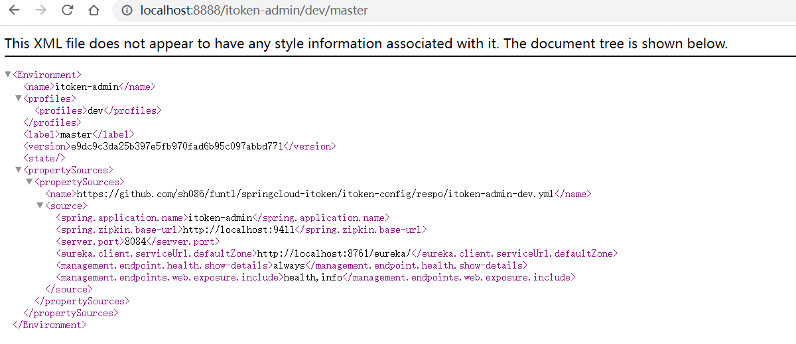
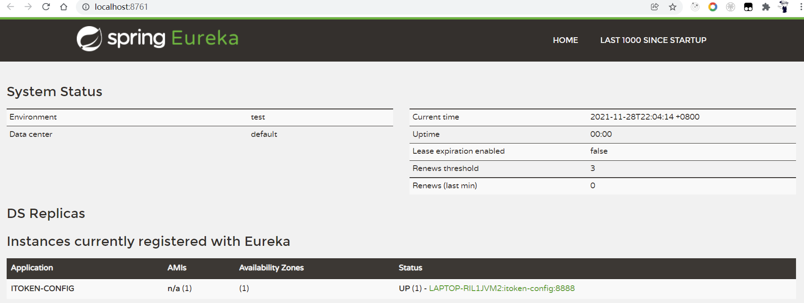
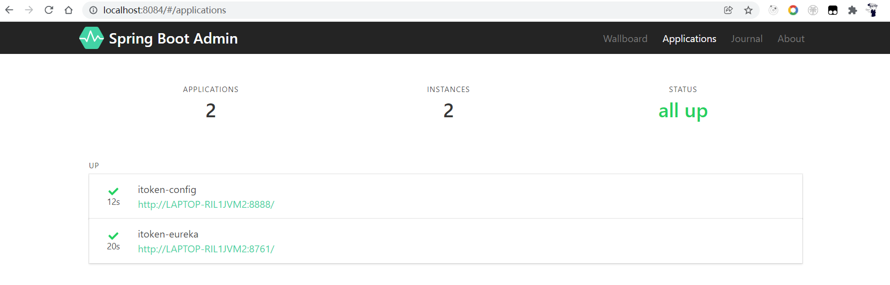
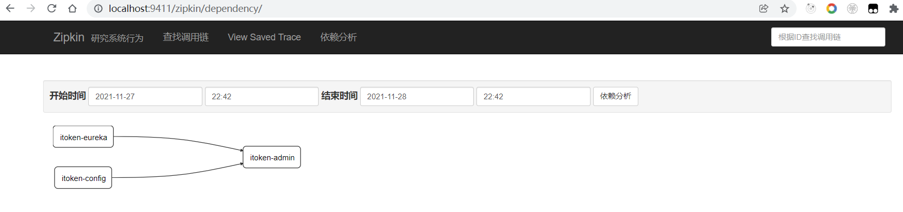

# 项目初始化配置

## YML配置中心

​	　首先，在`itoken-config`项目下新建`respo`文件夹，用于存放项目配置。完成后，需立即将配置提交到`GitLab`代码仓库中`itoken-config`项目的的`master`分支上。

（1）新建`itoken-admin-dev.yml`配置

```yaml
spring:
  application:
    name: itoken-admin
  zipkin:
    base-url: http://localhost:9411

server:
  port: 8084

eureka:
  client:
    serviceUrl:
      defaultZone: http://localhost:8761/eureka/

management:
  endpoint:
    health:
      show-details: always
  endpoints:
    web:
      exposure:
        include: health,info
```

（2）新建`itoken-eureka-dev.yml`配置

```yaml
spring:
  application:
    name: itoken-eureka
  boot:
    admin:
      client:
        url: http://localhost:8084
  zipkin:
    base-url: http://localhost:9411

server:
  port: 8761

eureka:
  instance:
    hostname: localhost
  client:
    registerWithEureka: false
    fetchRegistry: false
    serviceUrl:
      defaultZone: http://${eureka.instance.hostname}:${server.port}/eureka/

management:
  endpoint:
    health:
      show-details: always
  endpoints:
    web:
      exposure:
        include: health,info
```

（3）新建`itoken-zipkin-dev.yml`配置

```yaml
spring:
  application:
    name: itoken-zipkin
  boot:
    admin:
      client:
        url: http://localhost:8084
  zipkin:
    base-url: http://localhost:9411

server:
  port: 9411

eureka:
  client:
    serviceUrl:
      defaultZone: http://localhost:8761/eureka/

management:
  endpoint:
    health:
      show-details: always
  endpoints:
    web:
      exposure:
        include: health,info
  metrics:
    web:
      server:
        auto-time-requests: false
```

（4）新建`itoken-zuul-dev.yml`配置

```yaml
spring:
  application:
    name: itoken-zuul
  boot:
    admin:
      client:
        url: http://localhost:8084
  zipkin:
    base-url: http://localhost:9411

server:
  port: 8769

eureka:
  client:
    serviceUrl:
      defaultZone: http://localhost:8761/eureka/

management:
  endpoint:
    health:
      show-details: always
  endpoints:
    web:
      exposure:
        include: health,info
```


## 统一的依赖管理

​	　统一依赖管理项目`itoken-dependencies`，对整个项目周期中的所有第三方依赖的 Jar 包版本都由该项目进行统一管理。

```xml
<?xml version="1.0" encoding="UTF-8"?>
<project xmlns="http://maven.apache.org/POM/4.0.0" xmlns:xsi="http://www.w3.org/2001/XMLSchema-instance"
         xsi:schemaLocation="http://maven.apache.org/POM/4.0.0 http://maven.apache.org/xsd/maven-4.0.0.xsd">
    <modelVersion>4.0.0</modelVersion>

    <parent>
        <groupId>org.springframework.boot</groupId>
        <artifactId>spring-boot-starter-parent</artifactId>
        <version>2.0.3.RELEASE</version>
    </parent>

    <groupId>com.shooter.funtl</groupId>
    <artifactId>itoken-dependencies</artifactId>
    <version>1.0.0-SNAPSHOT</version>
    <packaging>pom</packaging>
    <name>itoken-dependencies</name>

    <properties>
        <!-- Environment Settings -->
        <java.version>1.8</java.version>
        <project.build.sourceEncoding>UTF-8</project.build.sourceEncoding>
        <project.reporting.outputEncoding>UTF-8</project.reporting.outputEncoding>

        <!-- Spring Settings -->
        <spring-cloud.version>Finchley.RELEASE</spring-cloud.version>
        <spring-boot-admin.version>2.0.1</spring-boot-admin.version>
        <zipkin.version>2.10.1</zipkin.version>
    </properties>

    <dependencyManagement>
        <dependencies>
            <!-- Spring Cloud Begin -->
            <dependency>
                <groupId>org.springframework.cloud</groupId>
                <artifactId>spring-cloud-dependencies</artifactId>
                <version>${spring-cloud.version}</version>
                <type>pom</type>
                <scope>import</scope>
            </dependency>
            <!-- Spring Cloud End -->

            <!-- Spring Boot Admin Begin -->
            <dependency>
                <groupId>de.codecentric</groupId>
                <artifactId>spring-boot-admin-starter-server</artifactId>
                <version>${spring-boot-admin.version}</version>
            </dependency>
            <dependency>
                <groupId>de.codecentric</groupId>
                <artifactId>spring-boot-admin-starter-client</artifactId>
                <version>${spring-boot-admin.version}</version>
            </dependency>
            <!-- Spring Boot Admin End -->

            <!-- ZipKin Begin -->
            <dependency>
                <groupId>io.zipkin.java</groupId>
                <artifactId>zipkin</artifactId>
                <version>${zipkin.version}</version>
            </dependency>
            <dependency>
                <groupId>io.zipkin.java</groupId>
                <artifactId>zipkin-server</artifactId>
                <version>${zipkin.version}</version>
            </dependency>
            <dependency>
                <groupId>io.zipkin.java</groupId>
                <artifactId>zipkin-autoconfigure-ui</artifactId>
                <version>${zipkin.version}</version>
            </dependency>
            <!-- ZipKin End -->
        </dependencies>
    </dependencyManagement>

    <build>
        <plugins>
            <!-- Compiler 插件, 设定 JDK 版本 -->
            <plugin>
                <groupId>org.apache.maven.plugins</groupId>
                <artifactId>maven-compiler-plugin</artifactId>
                <configuration>
                    <showWarnings>true</showWarnings>
                </configuration>
            </plugin>

            <!-- 打包 jar 文件时，配置 manifest 文件，加入 lib 包的 jar 依赖 -->
            <plugin>
                <groupId>org.apache.maven.plugins</groupId>
                <artifactId>maven-jar-plugin</artifactId>
                <configuration>
                    <archive>
                        <addMavenDescriptor>false</addMavenDescriptor>
                    </archive>
                </configuration>
                <executions>
                    <execution>
                        <configuration>
                            <archive>
                                <manifest>
                                    <!-- Add directory entries -->
                                    <addDefaultImplementationEntries>true</addDefaultImplementationEntries>
                                    <addDefaultSpecificationEntries>true</addDefaultSpecificationEntries>
                                    <addClasspath>true</addClasspath>
                                </manifest>
                            </archive>
                        </configuration>
                    </execution>
                </executions>
            </plugin>

            <!-- resource -->
            <plugin>
                <groupId>org.apache.maven.plugins</groupId>
                <artifactId>maven-resources-plugin</artifactId>
            </plugin>

            <!-- install -->
            <plugin>
                <groupId>org.apache.maven.plugins</groupId>
                <artifactId>maven-install-plugin</artifactId>
            </plugin>

            <!-- clean -->
            <plugin>
                <groupId>org.apache.maven.plugins</groupId>
                <artifactId>maven-clean-plugin</artifactId>
            </plugin>

            <!-- ant -->
            <plugin>
                <groupId>org.apache.maven.plugins</groupId>
                <artifactId>maven-antrun-plugin</artifactId>
            </plugin>

            <!-- dependency -->
            <plugin>
                <groupId>org.apache.maven.plugins</groupId>
                <artifactId>maven-dependency-plugin</artifactId>
            </plugin>
        </plugins>

        <pluginManagement>
            <plugins>
                <!-- Java Document Generate -->
                <plugin>
                    <groupId>org.apache.maven.plugins</groupId>
                    <artifactId>maven-javadoc-plugin</artifactId>
                    <executions>
                        <execution>
                            <phase>prepare-package</phase>
                            <goals>
                                <goal>jar</goal>
                            </goals>
                        </execution>
                    </executions>
                </plugin>

                <!-- YUI Compressor (CSS/JS压缩) -->
                <plugin>
                    <groupId>net.alchim31.maven</groupId>
                    <artifactId>yuicompressor-maven-plugin</artifactId>
                    <version>1.5.1</version>
                    <executions>
                        <execution>
                            <phase>prepare-package</phase>
                            <goals>
                                <goal>compress</goal>
                            </goals>
                        </execution>
                    </executions>
                    <configuration>
                        <encoding>UTF-8</encoding>
                        <jswarn>false</jswarn>
                        <nosuffix>true</nosuffix>
                        <linebreakpos>30000</linebreakpos>
                        <force>true</force>
                        <includes>
                            <include>**/*.js</include>
                            <include>**/*.css</include>
                        </includes>
                        <excludes>
                            <exclude>**/*.min.js</exclude>
                            <exclude>**/*.min.css</exclude>
                        </excludes>
                    </configuration>
                </plugin>
            </plugins>
        </pluginManagement>

        <!-- 资源文件配置 -->
        <resources>
            <resource>
                <directory>src/main/java</directory>
                <excludes>
                    <exclude>**/*.java</exclude>
                </excludes>
            </resource>
            <resource>
                <directory>src/main/resources</directory>
            </resource>
        </resources>
    </build>

    <repositories>
        <repository>
            <id>aliyun-repos</id>
            <name>Aliyun Repository</name>
            <url>http://maven.aliyun.com/nexus/content/groups/public</url>
            <releases>
                <enabled>true</enabled>
            </releases>
            <snapshots>
                <enabled>false</enabled>
            </snapshots>
        </repository>

        <repository>
            <id>sonatype-repos</id>
            <name>Sonatype Repository</name>
            <url>https://oss.sonatype.org/content/groups/public</url>
            <releases>
                <enabled>true</enabled>
            </releases>
            <snapshots>
                <enabled>false</enabled>
            </snapshots>
        </repository>
        <repository>
            <id>sonatype-repos-s</id>
            <name>Sonatype Repository</name>
            <url>https://oss.sonatype.org/content/repositories/snapshots</url>
            <releases>
                <enabled>false</enabled>
            </releases>
            <snapshots>
                <enabled>true</enabled>
            </snapshots>
        </repository>

        <repository>
            <id>spring-snapshots</id>
            <name>Spring Snapshots</name>
            <url>https://repo.spring.io/snapshot</url>
            <snapshots>
                <enabled>true</enabled>
            </snapshots>
        </repository>
        <repository>
            <id>spring-milestones</id>
            <name>Spring Milestones</name>
            <url>https://repo.spring.io/milestone</url>
            <snapshots>
                <enabled>false</enabled>
            </snapshots>
        </repository>
    </repositories>

    <pluginRepositories>
        <pluginRepository>
            <id>aliyun-repos</id>
            <name>Aliyun Repository</name>
            <url>http://maven.aliyun.com/nexus/content/groups/public</url>
            <releases>
                <enabled>true</enabled>
            </releases>
            <snapshots>
                <enabled>false</enabled>
            </snapshots>
        </pluginRepository>
    </pluginRepositories>
</project>
```


## 分布式配置中心

### pom.xml

```xml
<?xml version="1.0" encoding="UTF-8"?>
<project xmlns="http://maven.apache.org/POM/4.0.0" xmlns:xsi="http://www.w3.org/2001/XMLSchema-instance"
         xsi:schemaLocation="http://maven.apache.org/POM/4.0.0 http://maven.apache.org/xsd/maven-4.0.0.xsd">
    <modelVersion>4.0.0</modelVersion>

    <parent>
        <groupId>com.shooter.funtl</groupId>
        <artifactId>itoken-dependencies</artifactId>
        <version>1.0.0-SNAPSHOT</version>
        <relativePath>../itoken-dependencies/pom.xml</relativePath>
    </parent>

    <artifactId>itoken-config</artifactId>
    <packaging>jar</packaging>
    <name>itoken-config</name>

    <dependencies>
        <!-- Spring Cloud Begin -->
        <dependency>
            <groupId>org.springframework.cloud</groupId>
            <artifactId>spring-cloud-starter-zipkin</artifactId>
        </dependency>
        <dependency>
            <groupId>org.springframework.cloud</groupId>
            <artifactId>spring-cloud-config-server</artifactId>
        </dependency>
        <dependency>
            <groupId>org.springframework.cloud</groupId>
            <artifactId>spring-cloud-starter-netflix-eureka-server</artifactId>
        </dependency>
        <!-- Spring Cloud End -->

        <!-- Spring Boot Admin Begin -->
        <dependency>
            <groupId>org.jolokia</groupId>
            <artifactId>jolokia-core</artifactId>
        </dependency>
        <dependency>
            <groupId>de.codecentric</groupId>
            <artifactId>spring-boot-admin-starter-client</artifactId>
        </dependency>
        <!-- Spring Boot Admin End -->
    </dependencies>

    <build>
        <plugins>
            <plugin>
                <groupId>org.springframework.boot</groupId>
                <artifactId>spring-boot-maven-plugin</artifactId>
                <configuration>
                    <mainClass>com.shooter.funtl.itoken.config.ConfigApplication</mainClass>
                </configuration>
            </plugin>
        </plugins>
    </build>
</project>
```


### Application

```java
package com.shooter.funtl.itoken.config;

import org.springframework.boot.SpringApplication;
import org.springframework.boot.autoconfigure.SpringBootApplication;
import org.springframework.cloud.config.server.EnableConfigServer;
import org.springframework.cloud.netflix.eureka.EnableEurekaClient;

@SpringBootApplication
@EnableConfigServer
@EnableEurekaClient
public class ConfigApplication {
    public static void main(String[] args) {
        SpringApplication.run(ConfigApplication.class, args);
    }
}
```


### bootstrap.yml

```yaml
spring:
  application:
    name: itoken-config
  boot:
    admin:
      client:
        url: http://localhost:8084
  cloud:
    config:
      label: main
      server:
        git:
          # 如果使用 GitLab 作为仓库的话，git.uri 需要在结尾加上 .git，GitHub 则不用
          uri: https://gitlab.com/用户名/springcloud-itoken/itoken-config.git
          search-paths: respo
          username: 访问 Git 仓库的账号
          password: 访问 Git 仓库的密码

  zipkin:
    base-url: http://localhost:9411

server:
  port: 8888

eureka:
  client:
    serviceUrl:
      defaultZone: http://localhost:8761/eureka/

management:
  endpoint:
    health:
      show-details: always
  endpoints:
    web:
      exposure:
        include: health,info
```


### 测试运行

​	　运行`itoken-config`项目，访问`http://localhost:8888/itoken-admin/dev/main`，若可以获得配置，则表明启动成功。



## 服务注册与发现

### pom.xml

```xml
<?xml version="1.0" encoding="UTF-8"?>
<project xmlns="http://maven.apache.org/POM/4.0.0" xmlns:xsi="http://www.w3.org/2001/XMLSchema-instance"
         xsi:schemaLocation="http://maven.apache.org/POM/4.0.0 http://maven.apache.org/xsd/maven-4.0.0.xsd">
    <modelVersion>4.0.0</modelVersion>

    <parent>
        <groupId>com.shooter.funtl</groupId>
        <artifactId>itoken-dependencies</artifactId>
        <version>1.0.0-SNAPSHOT</version>
        <relativePath>../itoken-dependencies/pom.xml</relativePath>
    </parent>

    <artifactId>itoken-eureka</artifactId>
    <packaging>jar</packaging>
    <name>itoken-eureka</name>

    <dependencies>
        <!-- Spring Cloud Begin -->
        <dependency>
            <groupId>org.springframework.cloud</groupId>
            <artifactId>spring-cloud-starter-zipkin</artifactId>
        </dependency>
        <dependency>
            <groupId>org.springframework.cloud</groupId>
            <artifactId>spring-cloud-starter-config</artifactId>
        </dependency>
        <dependency>
            <groupId>org.springframework.cloud</groupId>
            <artifactId>spring-cloud-starter-netflix-eureka-server</artifactId>
        </dependency>
        <!-- Spring Cloud End -->

        <!-- Spring Boot Admin Begin -->
        <dependency>
            <groupId>org.jolokia</groupId>
            <artifactId>jolokia-core</artifactId>
        </dependency>
        <dependency>
            <groupId>de.codecentric</groupId>
            <artifactId>spring-boot-admin-starter-client</artifactId>
        </dependency>
        <!-- Spring Boot Admin End -->
    </dependencies>

    <build>
        <plugins>
            <plugin>
                <groupId>org.springframework.boot</groupId>
                <artifactId>spring-boot-maven-plugin</artifactId>
                <configuration>
                    <mainClass>com.funtl.itoken.eureka.EurekaApplication</mainClass>
                </configuration>
            </plugin>
        </plugins>
    </build>
</project>
```


### Application

```java
package com.funtl.itoken.eureka;

import org.springframework.boot.SpringApplication;
import org.springframework.boot.autoconfigure.SpringBootApplication;
import org.springframework.cloud.netflix.eureka.server.EnableEurekaServer;

@EnableEurekaServer
@SpringBootApplication
public class EurekaApplication {
    public static void main(String[] args) {
        SpringApplication.run(EurekaApplication.class, args);
    }
}
```


### bootstrap.yml

```yaml
spring:
  cloud:
    config:
      uri: http://localhost:8888
      name: itoken-eureka
      label: main
      profile: dev
```


### 测试运行

​	　运行`itoken-euraka`项目，访问`http://localhost:8761/`，若可以进入Euraka控制台，则表明启动成功。




## 分布式服务监控

### pom.xml

```xml
<?xml version="1.0" encoding="UTF-8"?>
<project xmlns="http://maven.apache.org/POM/4.0.0" xmlns:xsi="http://www.w3.org/2001/XMLSchema-instance"
         xsi:schemaLocation="http://maven.apache.org/POM/4.0.0 http://maven.apache.org/xsd/maven-4.0.0.xsd">
    <modelVersion>4.0.0</modelVersion>

    <parent>
        <groupId>com.shooter.funtl</groupId>
        <artifactId>itoken-dependencies</artifactId>
        <version>1.0.0-SNAPSHOT</version>
        <relativePath>../itoken-dependencies/pom.xml</relativePath>
    </parent>

    <artifactId>itoken-admin</artifactId>
    <packaging>jar</packaging>
    <name>itoken-admin</name>

    <dependencies>
        <!-- Spring Cloud Begin -->
        <dependency>
            <groupId>org.springframework.cloud</groupId>
            <artifactId>spring-cloud-starter-zipkin</artifactId>
        </dependency>
        <dependency>
            <groupId>org.springframework.cloud</groupId>
            <artifactId>spring-cloud-starter-config</artifactId>
        </dependency>
        <dependency>
            <groupId>org.springframework.cloud</groupId>
            <artifactId>spring-cloud-starter-netflix-eureka-server</artifactId>
        </dependency>
        <!-- Spring Cloud End -->

        <!-- Spring Boot Admin Begin -->
        <dependency>
            <groupId>org.jolokia</groupId>
            <artifactId>jolokia-core</artifactId>
        </dependency>
        <dependency>
            <groupId>de.codecentric</groupId>
            <artifactId>spring-boot-admin-starter-server</artifactId>
        </dependency>
        <!-- Spring Boot Admin End -->
    </dependencies>

    <build>
        <plugins>
            <plugin>
                <groupId>org.springframework.boot</groupId>
                <artifactId>spring-boot-maven-plugin</artifactId>
                <configuration>
                    <mainClass>com.funtl.itoken.admin.AdminApplication</mainClass>
                </configuration>
            </plugin>
        </plugins>
    </build>
</project>
```


### Application

```java
package com.funtl.itoken.admin;

import de.codecentric.boot.admin.server.config.EnableAdminServer;
import org.springframework.boot.SpringApplication;
import org.springframework.boot.autoconfigure.SpringBootApplication;
import org.springframework.cloud.netflix.eureka.EnableEurekaClient;

@SpringBootApplication
@EnableEurekaClient
@EnableAdminServer
public class AdminApplication {
    public static void main(String[] args) {
        SpringApplication.run(AdminApplication.class, args);
    }
}
```


### bootstrap.yml

```yaml
spring:
  cloud:
    config:
      uri: http://localhost:8888
      name: itoken-admin
      label: main
      profile: dev
```


### 测试运行

​	　运行`itoken-admin`项目，访问`http://localhost:8084/`，可以看到`itoken-config`和`itoken-eureka`已经被监控了。



## 分布式链路追踪

### pom.xml

```xml
<?xml version="1.0" encoding="UTF-8"?>
<project xmlns="http://maven.apache.org/POM/4.0.0" xmlns:xsi="http://www.w3.org/2001/XMLSchema-instance"
         xsi:schemaLocation="http://maven.apache.org/POM/4.0.0 http://maven.apache.org/xsd/maven-4.0.0.xsd">
    <modelVersion>4.0.0</modelVersion>

    <parent>
        <groupId>com.shooter.funtl</groupId>
        <artifactId>itoken-dependencies</artifactId>
        <version>1.0.0-SNAPSHOT</version>
        <relativePath>../itoken-dependencies/pom.xml</relativePath>
    </parent>

    <artifactId>itoken-zipkin</artifactId>
    <packaging>jar</packaging>
    <name>itoken-zipkin</name>

    <dependencies>
        <!-- Spring Cloud Begin -->
        <dependency>
            <groupId>org.springframework.cloud</groupId>
            <artifactId>spring-cloud-starter-zipkin</artifactId>
        </dependency>
        <dependency>
            <groupId>org.springframework.cloud</groupId>
            <artifactId>spring-cloud-starter-config</artifactId>
        </dependency>
        <dependency>
            <groupId>org.springframework.cloud</groupId>
            <artifactId>spring-cloud-starter-netflix-eureka-server</artifactId>
        </dependency>
        <!-- Spring Cloud End -->

        <!-- Spring Boot Admin Begin -->
        <dependency>
            <groupId>org.jolokia</groupId>
            <artifactId>jolokia-core</artifactId>
        </dependency>
        <dependency>
            <groupId>de.codecentric</groupId>
            <artifactId>spring-boot-admin-starter-client</artifactId>
        </dependency>
        <!-- Spring Boot Admin End -->

        <!-- ZipKin Begin -->
        <dependency>
            <groupId>io.zipkin.java</groupId>
            <artifactId>zipkin</artifactId>
        </dependency>
        <dependency>
            <groupId>io.zipkin.java</groupId>
            <artifactId>zipkin-server</artifactId>
            <exclusions>
                <!-- 去除log4j2依赖，项目中使用slf4j -->
                <exclusion>
                    <groupId>org.springframework.boot</groupId>
                    <artifactId>spring-boot-starter-log4j2</artifactId>
                </exclusion>
            </exclusions>
        </dependency>
        <dependency>
            <groupId>io.zipkin.java</groupId>
            <artifactId>zipkin-autoconfigure-ui</artifactId>
        </dependency>
        <!-- ZipKin End -->
    </dependencies>

    <build>
        <plugins>
            <plugin>
                <groupId>org.springframework.boot</groupId>
                <artifactId>spring-boot-maven-plugin</artifactId>
                <configuration>
                    <mainClass>com.funtl.itoken.zipkin.ZipKinApplication</mainClass>
                </configuration>
            </plugin>
        </plugins>
    </build>
</project>
```


### Application

```java
package com.funtl.itoken.zipkin;

import org.springframework.boot.SpringApplication;
import org.springframework.boot.autoconfigure.SpringBootApplication;
import org.springframework.cloud.netflix.eureka.EnableEurekaClient;
import zipkin.server.internal.EnableZipkinServer;

@SpringBootApplication
@EnableEurekaClient
@EnableZipkinServer
public class ZipkinApplication {
    public static void main(String[] args) {
        SpringApplication.run(ZipkinApplication.class, args);
    }
}
```


### bootstrap.yml

```yaml
spring:
  cloud:
    config:
      uri: http://localhost:8888
      name: itoken-zipkin
      label: main
      profile: dev
```


### 测试运行

​	　运行`itoken-zipkin`项目，访问`http://localhost:9411/`，点击`依赖分析`，过一会，即可展示如下关系。



## 分布式路由网关

### pom.xml

```xml
<?xml version="1.0" encoding="UTF-8"?>
<project xmlns="http://maven.apache.org/POM/4.0.0" xmlns:xsi="http://www.w3.org/2001/XMLSchema-instance"
         xsi:schemaLocation="http://maven.apache.org/POM/4.0.0 http://maven.apache.org/xsd/maven-4.0.0.xsd">
    <modelVersion>4.0.0</modelVersion>

    <parent>
        <groupId>com.shooter.funtl</groupId>
        <artifactId>itoken-dependencies</artifactId>
        <version>1.0.0-SNAPSHOT</version>
        <relativePath>../itoken-dependencies/pom.xml</relativePath>
    </parent>

    <artifactId>itoken-zuul</artifactId>
    <packaging>jar</packaging>
    <name>itoken-zuul</name>

    <dependencies>
        <!-- Spring Cloud Begin -->
        <dependency>
            <groupId>org.springframework.cloud</groupId>
            <artifactId>spring-cloud-starter-zipkin</artifactId>
        </dependency>
        <dependency>
            <groupId>org.springframework.cloud</groupId>
            <artifactId>spring-cloud-starter-config</artifactId>
        </dependency>
        <dependency>
            <groupId>org.springframework.cloud</groupId>
            <artifactId>spring-cloud-starter-netflix-eureka-server</artifactId>
        </dependency>
        <dependency>
            <groupId>org.springframework.cloud</groupId>
            <artifactId>spring-cloud-starter-netflix-zuul</artifactId>
        </dependency>
        <!-- Spring Cloud End -->

        <!-- Spring Boot Admin Begin -->
        <dependency>
            <groupId>org.jolokia</groupId>
            <artifactId>jolokia-core</artifactId>
        </dependency>
        <dependency>
            <groupId>de.codecentric</groupId>
            <artifactId>spring-boot-admin-starter-client</artifactId>
        </dependency>
        <!-- Spring Boot Admin End -->
    </dependencies>

    <build>
        <plugins>
            <plugin>
                <groupId>org.springframework.boot</groupId>
                <artifactId>spring-boot-maven-plugin</artifactId>
                <configuration>
                    <mainClass>com.funtl.itoken.zuul.ZuulApplication</mainClass>
                </configuration>
            </plugin>
        </plugins>
    </build>
</project>
```


### Application

```java
package com.funtl.itoken.zuul;

import org.springframework.boot.SpringApplication;
import org.springframework.boot.autoconfigure.SpringBootApplication;
import org.springframework.cloud.netflix.eureka.EnableEurekaClient;
import org.springframework.cloud.netflix.zuul.EnableZuulProxy;

@SpringBootApplication
@EnableEurekaClient
@EnableZuulProxy
public class ZuulApplication {
    public static void main(String[] args) {
        SpringApplication.run(ZuulApplication.class, args);
    }
}
```


### bootstrap.yml

```yaml
spring:
  cloud:
    config:
      uri: http://localhost:8888
      name: itoken-zuul
      label: main
      profile: dev
```

