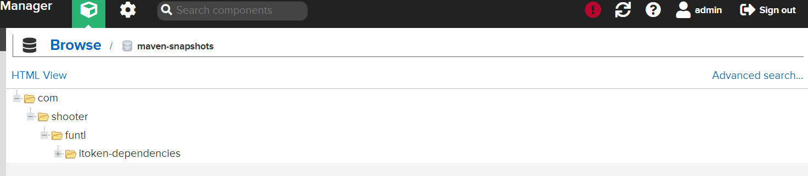
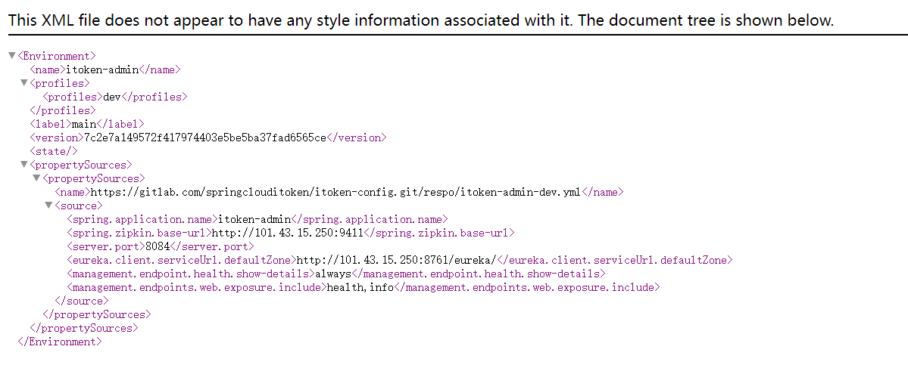
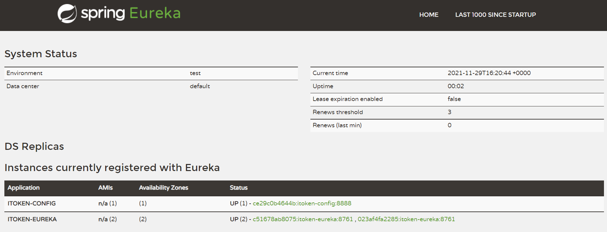

# 项目手动部署

## itoken-dependencies

​	　首先，需要将`itoken-dependencies`项目**打包到Nexus私服**，在`pom.xml`中新增如下配置，参考<a href="../microservice/nexus.html#打包项目到私服" target="_blank">这里</a>进行配置。

```xml
<!--打包项目到私服-->
<distributionManagement>
     <repository>
         <id>nexus-releases</id>
         <name>Nexus Release Repository</name>
         <url>http://101.43.15.250:8081/repository/maven-releases/</url>
     </repository>
     <snapshotRepository>
         <id>nexus-snapshots</id>
         <name>Nexus Snapshot Repository</name>
         <url>http://101.43.15.250:8081/repository/maven-snapshots/</url>
     </snapshotRepository>
</distributionManagement>
```

​	　然后，**本地**先执行`cd itoken-dependencies`，再使用`mvn deploy`打包，即可将`itoken-dependencies`项目打包到远程仓库中。




（2）itoken-config

​	　首先，在`itoken-config`项目中的`pom.xml`中新增如下配置，用于从`Nexus Repository`下载`itoken-dependencies`等依赖，参考<a href="../microservice/nexus.html#配置代理仓库" target="_blank">这里</a>进行配置，修改完成后将变更提交到Git仓库。特别的，**`itoken`所有的项目都需要这样改动，后面的项目不在赘述**。

```xml
<!--依赖管理-->
<repositories>
    <repository>
        <id>nexus</id>
        <name>Nexus Repository</name>
        <url>http://101.43.15.250:8081/repository/maven-public/</url>
        <snapshots>
            <enabled>true</enabled>
        </snapshots>
        <releases>
            <enabled>true</enabled>
        </releases>
    </repository>
</repositories>
```

​	　接下来，在远程服务器上运行如下命令，并将生成的秘钥增加到GitLab中的`用户头像`->`设置`->`SSH 密钥`中即可。

```shell
# 生成密钥
ssh-keygen -t rsa -C "your_email@example.com"
# 查看密钥
cat /root/.ssh/id_rsa.pub
```


## itoken-config

​	　然后，参考<a href="../framework/maven.html#linux安装" target="_blank">这里</a>安装`JDK`和`Maven`环境。接着将`itoken-config`项目都`clone`到远程服务器上，并打包、运行`itoken-config`项目。

```shell
# 新建itoken项目目录
mkdir -p /usr/local/docker/itoken
# 进入itoken项目
cd /usr/local/docker/itoken

# 安装Git命令
yum -y install git
# 克隆itoken-config目录
git clone git@gitlab.com:springclouditoken/itoken-config.git

# 打包itoken-config项目
mvn clean package 

# 进入target目录
cd target
# 新建部署目录
mkdir docker
# 移动jar包到部署目录
mv itoken-config-1.0.0-SNAPSHOT.jar docker
# 进入部署目录
cd docker

# 在docker目录下，编写Dockerfile
vi Dockerfile

FROM openjdk:8-jre
WORKDIR /app
COPY itoken-config-1.0.0-SNAPSHOT.jar .
CMD java -jar itoken-config-1.0.0-SNAPSHOT.jar
EXPOSE 8888

# 构建镜像
docker build -t sh086/itoken-config .
```

​	　编写`itoken-config`项目的`docker-compose.yml`文件，再运行`docker-compose up -d`命令启动项目。

```yaml
version: '3.1'
services:
  itoken-config:
    image: sh086/itoken-config
    restart: always
    container_name: itoken_config
    ports:
      - 8888:8888
```

​	　访问`http://101.43.15.250:8888/itoken-admin/dev/main`，若可以获取配置，则表明`itoken-config`项目已经成功部署了。




## itoken-eureka

​	　由于Eureka采用**集群**部署，所以要先增加`itoken-eureka-dev.yml`配置文件的`defaultZone`节点，完成后提交变更到GitLab。

```yaml{14}
server:
  port: 8761

eureka:
  instance:
    hostname: host
  client:
    # 表示是否将自己注册到Eureka，因为要构建集群环境，需要将自己注册到集群，所以应该开启
    registerWithEureka: true
    # 表示是否从Eureka获取注册信息，如果是单一节点，不需要同步其他Eureka节点，则可以设置为false
    # 但如是Eureka集群，则应该设置为 true
    fetchRegistry: true
    serviceUrl:
      defaultZone: http://${eureka.instance.hostname}:8761/eureka/,http://${eureka.instance.hostname}:8762/eureka/
```

​	　然后，先在`itoken-eureka`项目的`pom.xml`新增`Nexus Repository`配置并提交Git，再根据如下步骤完成`eureka`镜像定制。

```shell
# 进入itoken目录
cd /usr/local/docker/itoken
# 拉取代码
git clone git@gitlab.com:springclouditoken/itoken-eureka.git
# 进入itoken-eureka项目
cd itoken-eureka
# 打包
mvn clean package

# 进入打包目录
cd target
# 新建部署目录
mkdir docker
# 移动jar包到部署目录
mv itoken-eureka-1.0.0-SNAPSHOT.jar docker
# 进入部署目录
cd docker

# 在docker目录下，编写Dockerfile
vi Dockerfile

FROM openjdk:8-jre
WORKDIR /app
COPY itoken-eureka-1.0.0-SNAPSHOT.jar .
CMD java -jar itoken-eureka-1.0.0-SNAPSHOT.jar
EXPOSE 8761

# 构建镜像
docker build -t sh086/itoken-eureka .
```

​	　接下来，编写`itoken-eureka`项目的`docker-compose.yml`文件。

```yaml
version: '3.1'
services:
  itoken-eureka-1:
    image: sh086/itoken-eureka
    restart: always
    container_name: itoken-eureka-1
    ports:
      - 8761:8761  
      
  itoken-eureka-2:
    image: sh086/itoken-eureka
    restart: always
    container_name: itoken-eureka-2
    ports:
      - 8762:8761
```

​	　最后，启动`itoken-eureka`项目，启动成功后，访问`8761`端口或者`8762`端口，都可正常访问Eureka。特别的，由于Eureka是集群模式，故端口展示的都是`8761`。



