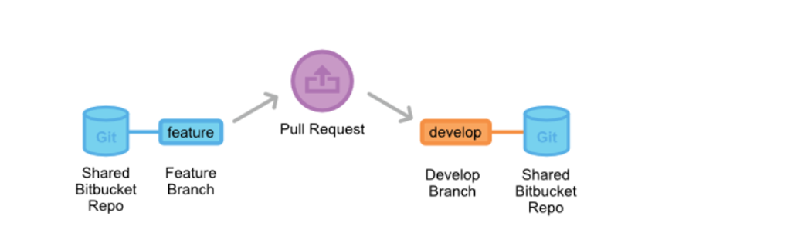
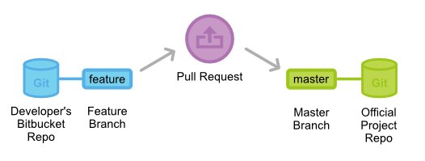

# Git工作流

​	　Git 是一个开源的**分布式版本控制**系统，Git工作流分为**集中式工作流**、**功能分支工作流**、**GitFlow工作流**、**Forking工作流**，前三种都是以中央仓库作为所有开发者的交互中心，而Forking工作流具有私有仓库（开发者拥有）和正式仓库（项目维护者拥有）两种。

​	　集中式工作流，只用到 master 这一个分支，所有修改都提交到master分支上，仅设用于1 ~ 2人的开发团队，否则极易导致代码冲突。

​	　功能分支工作流，开发者需要**为各个新功能新建一个专门的功能分支来开发**，而不是都提交到 master 分支上。这个隔离不仅可以使得开发者在各自的功能上开发而不互相影响，还保证了master 主分支代码的可靠性，另外，也便于在新功能集成到master 主分支前，用 `Pull Requests` 的方式讨论变更。


## GitFlow工作流

​	　Git工作流为不同角色提供了不同分支，并定义了分支之间如何和什么时候进行交互；GitFlow 工作流有**历史分支**（master和develop ）、**功能分支**（feature）、**发布分支**（release）、**热修复分支**（hotfix）等分支角色。


### 历史分支

​	　develop 分支作为功能的集成分支，记录了项目的**全部历史**，master 分支存储了**正式发布**的历史，仅记录了项目的部分历史，master 分支的每个节点都应该用新的版本号打好 Tag。


```shell
# 项目拥有者创建开发分支，并推送到origin
git branch develop
git push -u origin develop

# 项目开发者克隆中央仓库，建好 develop 分支的跟踪分支
git clone ssh://user@host/path/to/repo.git
git checkout -b develop origin/develop
```


### 功能分支

​	　功能分支feature使用 develop 分支作为父分支，当新功能完成后，再合并回 develop 分支，新功能分支不直接与 master 分支交互；另外，功能分支都是临时分支，合并完成后需要删除功能分支。


​	　一个功能分支多人协同开发时，在开发者提交自己功能修改到中央仓库前，需要先 `fetch` 在中央仓库的新增提交，然后，再将自己本地提交的历史通过`--rebase` 移到同步了中央仓库修改后的分支的顶部，最终的结果是一个**完美的线性历史**。

​	　如果你忘加了这个选项，pull 操作仍然可以完成，但每次 pull 操作要同步中央仓库中别人修改时，提交历史会以一个多余的『合并提交』结尾。

```shell
# 基于develop新建功能分支
# -b 选项表示如果分支不存在则新建分支
git checkout -b feature/some-feature develop

# 推送功能分支到中央仓库（origin）
git push -u origin feature/some-feature

# 功能开发
git status # 查看本地仓库的修改状态
git add # 暂存文件
git fetch origin develop # 协同开发时，提交前先获取中央仓库的新增提交
git pull --rebase origin develop # 同一分支远端若有更新，则以远端最新代码为基本线性合并
git commit -m 注释 # 提交文件
git push # 推送b
```

​	　功能分支开发完成后，需要在 Web 界面发起Pull Requests，通知团队中涉及这个功能的成员，功能开发已经完成，需要在集成提交的变更到正式项目前，对变更进行Code Review。

​	　当要发起一个 Pull Request，你所要做的就是请求（Request）另一个开发者（比如项目的维护者），来 pull 你仓库中一个分支到他的仓库中。这意味着你要提供 4 个信息（源仓库、源分支、目的仓库、目的分支），以发起 Pull Request。

​	　收到 Pull Request 后，项目维护者要决定如何做，如果功能没问题，就简单地合并到 develop分支，关闭 Pull Request。但如果提交的变更有问题，他可以在 Pull Request 中反馈，之后新加的提交也会评论之后接着显示出来。



​	　Pull Requests也可以是为讨论提交的功能的一个专门论坛，比如，开发者在实现某个需求时碰到了麻烦，他可以发一个包含正在进行中工作的 Pull Request，其它的开发者可以在 Pull Request 提供建议，或者甚至直接添加提交来解决问题。


```shell
# Pull Requests完成，合并功能分支到develop
git checkout develop # 切换到develop分支
# --fast-forward 简单地把指针右移，默认
# --no-ff 生成一个新的提交对象
# --squash：使用squash方式合并，把多次分支commit历史压缩为一次
git merge --no-ff feature/some-feature #合并feature/some-feature到develop分支

#若发现问题，并可以解决
git add
git rebase --continue
#若发现问题，不能解决，则回到你执行 git pull --rebase 命令前的样子
git rebase --abort

# 推送合并后的develop分支到远端
git push origin develop

# 删除功能分支
git branch -d feature/some-feature
```


### 部署分支

​	　一旦 develop 分支上的功能可以发布时，就从 develop 分支上 fork 一个专门用于做发布准备的`release`**发布分支**，这个新建的发布分支是冻结的，**只应该做 Bug 修复、文档生成和其它面向发布任务**，任何不在 develop 分支中的新功能都推到下个发布循环中。

​	　一旦对外发布的工作都完成了，即可将发布分支合并到 master 分支并分配一个版本号打好 Tag。另外，这些从新建发布分支以来的做的修改要合并回 develop 分支。另外，部署分支都是临时分支，合并完成后需要删除部署分支。

​	　使用一个用于发布准备的专门分支，使得一个团队可以在完善当前的发布版本的同时，另一个团队可以继续开发下个版本的功能。


```shell
# 基于develop新建发布分支
git checkout -b release-0.1 develop

# 合并发布分支到master
git checkout master
git merge --no-ff release-0.1
git push

# 合并发布分支到develop
git checkout develop
git merge --no-ff release-0.1
git push

# 删除发布分支
git branch -d release-0.1

# 为master打上tag
git tag -a 0.1 -m "Initial public release" master
git push --tags
```

​	　Git 有提供各种勾子（hook），即仓库有事件发生时触发执行的脚本。可以配置一个勾子，在你 push 中央仓库的 master 分支时，自动构建好对外发布。


### 热修复分支

​	　热修复`hotfix`分支，用于生成快速给产品发布版本打补丁，这是唯一可以直接从 master 分支 fork 出来的分支。修复完成，修改应该马上合并回 master 分支和 develop 分支（当前的发布分支），master 分支应该用新的版本号打好 Tag。

​	　为 Bug 修复使用专门分支，让团队可以处理掉问题而不用打断其它工作或是等待下一个发布循环。另外，热修复分支都是临时分支，合并完成后需要删除热修复分支。


```shell
# 基于master新建热修复分支
git checkout -b issue-001 master

# 修复完成后，合并到master上
git checkout master
git merge --no-ff issue-001
git push

# 修复完成后，合并到develop上
git checkout develop
git merge --no-ff issue-001
git push

# 删除热修复分支
git branch -d issue-001
```


## Forking 工作流

​	　Forking 工作流是开源项目的理想工作流，没有使用单个服务端仓库作为『中央』代码基线，而让各个开发者都有一个**私有的服务端仓库**，开发者 push 到自己私有的服务端仓库，而只有项目维护者才能 push 到**正式仓库**。这样项目维护者可以接受任何开发者的提交，但无需给他正式代码库的写权限。

​	　若贡献者要集成功能到正式仓库，则需要给正式仓库发起一个 pull request，让项目维护者知道有更新已经准备好可以集成了。项目维护者 pull 贡献者的变更到自己的本地仓库中，检查变更以确保不会让项目出错，合并变更到自己本地的 master 分支，然后 push master 分支到服务器的正式仓库中。



```shell
# 项目维护者初始化正式仓库
ssh user@host
git init --bare /path/to/repo.git

# 开发者 fork 正式仓库（页面操作）

# 开发者克隆自己 fork 出来的仓库，origin 作为远程克隆的仓库的别名
git clone https://user@bitbucket.org/user/repo.git
# 设定upstream（上游）作为正式仓库的别名
git remote add upstream https://bitbucket.org/maintainer/repo

# 开发者开发自己的功能
git checkout -b feature-branch
git commit -a -m "Add first draft of some feature"

# 获取正式项目中最新的提交
git pull upstream master
# 开发者发布自己的功能
git push origin feature-branch

# 点击Pull Request 按钮，选择分支要合并到正式仓库（页面操作）

# 项目维护者集成开发者的功能
git fetch https://bitbucket.org/user/repo feature-branch
git checkout master
# FETCH_HEAD是指从远端最新fetch的分支
git merge FETCH_HEAD
# push 变更到服务器上的正式仓库
git push origin master
```


## 常用Git命令

```shell
git init          # 创建新的 Git 仓库
git clone [url]   # 拷贝一个 Git 仓库到本地
git add           # 将该文件添加到缓存
git status        # 查看在你上次提交之后是否有修改

git diff          # 查看已缓存的改动
git diff --cached # 查看已缓存的改动
git diff HEAD     # 查看已缓存的与未缓存的所有改动
git diff --stat   # 显示摘要

# 设置用户名密码
git config --global user.name 'yourname'
git config --global user.email youremail

git commit -m 'update message'  # 将缓存区内容添加到仓库中
git reset HEAD -- <filename>    # 取消已缓存的内容

# 将远程存储库中的更改合并到当前分支中
# 等效于 git fetch + git merge
git pull <远程主机名> <远程分支名>:<本地分支名>
# 将本地分支的修改，推送到远程主机
git push <远程主机名> <本地分支名>:<远程分支名>

git tag -a v1.0.0    # 给最新一次提交打上v1.0.0的标签
git tag              # 查看所有标签
```

