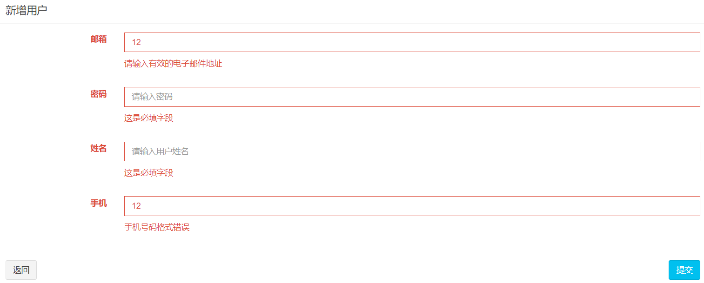

# 用户管理功能

## v1.1.0 用户列表查询

​	　在`menu.jsp`导航栏中新增`用户列表`下拉项，用户点击该下拉项即可跳转到用户列表页面。

```html{3}
 <ul class="treeview-menu">
    <li>
        <a href="/user/list"><i class="fa fa-circle-o"></i> 用户列表</a>
    </li>
</ul>
```


### 用户列表页面

​	　新建`user_list.jsp`页面，使用`<c:forEach>标签` 遍历`users`属性，展示查询出来的全部的用户数据。

```html{39-65}
<%@ page contentType="text/html;charset=UTF-8" language="java" %>
<%@ taglib uri="http://java.sun.com/jsp/jstl/core" prefix="c" %>
<%@ taglib prefix="fmt" uri="http://java.sun.com/jsp/jstl/fmt" %>
<%@ taglib prefix="form" uri="http://www.springframework.org/tags/form" %>

<!DOCTYPE html>
<head>
    <title>我的商城 | 用户管理</title>
    <jsp:include page="../includes/header.jsp"/>
</head>
<body class="hold-transition skin-blue sidebar-mini">
<div class="wrapper">
    <jsp:include page="../includes/nav.jsp"/>
    <jsp:include page="../includes/menu.jsp"/>
    <!-- Content Wrapper. Contains page content -->
    <div class="content-wrapper">
        <!-- Content Header (Page header) -->
        <section class="content-header">
            <h1>
                用户管理
                <small></small>
            </h1>
            <ol class="breadcrumb">
                <li><a href="#"><i class="fa fa-dashboard"></i> 首页</a></li>
                <li class="active">用户管理</li>
            </ol>
        </section>
        <!-- Main content -->
        <section class="content">
            <!-- /.row -->
            <div class="row">
                <div class="col-xs-12">
                    <div class="box">
                        <div class="box-header">
                            <h3 class="box-title">用户列表</h3>
                        </div>
                        <!-- /.box-header -->
                        <div class="box-body table-responsive no-padding">
                            <table class="table table-hover">
                                <thead>
                                <tr>
                                    <th>编号</th>
                                    <th>用户名</th>
                                    <th>手机号</th>
                                    <th>邮箱</th>
                                    <th>更新时间</th>
                                    <th>操作</th>
                                </tr>
                                </thead>
                                <tbody>
                                <c:forEach items="${users}" var="user">
                                    <tr>
                                        <td>${user.id}</td>
                                        <td>${user.userName}</td>
                                        <td>${user.phone}</td>
                                        <td>${user.email}</td>
                                        <td><fmt:formatDate value="${user.createTime}" pattern="yyyy-MM-dd HH:mm:ss"/></td>
                                        <td>
                                            <a href="#" type="button" class="btn btn-sm btn-default"><i class="fa fa-search"></i> 查看</a>
                                            <a href="#" type="button" class="btn btn-sm btn-primary"><i class="fa fa-edit"></i>编辑</a>
                                            <a href="#" type="button" class="btn btn-sm btn-danger"><i class="fa fa-trash-o"></i>删除</a>
                                        </td>
                                    </tr>
                                </c:forEach>
                                </tbody>
                            </table>
                        </div>
                        <!-- /.box-body -->
                    </div>
                    <!-- /.box -->
                </div>
            </div>
        </section>
    </div>
    <jsp:include page="../includes/copyright.jsp"/>
</div>
<jsp:include page="../includes/foot.jsp"/>
</body>
</html>
```


### 编写业务代码

​	　新建`UserController`，并编写`list`方法，处理/`user/list`跳转用户列表页面的请求，将查询到的用户数据返回到`user_list`页面进行展示。

```java{14-19}
/**
 * 用户管理
 * */
@Controller
@RequestMapping("/user/")
public class UserController {

    @Autowired
    private UserService userService;

    /**
     * 跳转用户列表页面
     * */
    @RequestMapping(value = "list",method = RequestMethod.GET)
    public String list(User user,Model model){
        val userResult = userService.selectByUserLike(user);
        model.addAttribute("users",userResult);
        return "user_list";
    }
}
```

### 测试运行

​	　重新运行项目，可以看到`用户列表`页面，已经将数据库中的全部用户都查询出来，并可以在页面上展示用户列表信息了。


## v1.1.1 新增用户页面

​	　首先，在`menu.jsp`中添加`新增用户`下拉项，用户点击该下拉项即可跳转到新增用户页面。

```html{4}
 <ul class="treeview-menu">
    <li>
         <li><a href="/user/list"><i class="fa fa-circle-o"></i> 用户列表</a></li>
         <li><a href="/user/form"><i class="fa fa-circle-o"></i> 新增用户</a></li>
    </li>
</ul>
```

​	　然后，在`user_list.jsp`中添加`新增`用户按钮，请求路径为`/user/form`。

```html{2-4}
<div class="box-body">
     <a href="/user/form" type="button" class="btn btn-sm btn-default">
         <i class="fa fa-plus"></i> 新增
     </a> 
</div>
```

​	　最后，还需要在`列表操作项`中的`编辑`按钮中，设定`href`的跳转路径，使得每个用户明细都可以进行编辑操作。

```html{1}
<a href="/user/form?id=${user.id}" type="button" class="btn btn-sm btn-primary">
    <i class="fa fa-edit"></i>编辑
</a>
```


### 新增用户页面

​	　新建`user_form.jsp`页面，根据`user.id`是否为空，判断页面是作为`新增页面` 还是 `编辑页面`。在`<input>标签`中添加`name`属性和`value`属性，`name属性`设置**提交时的参数名**，若为空则无法上传用户填写的信息；`value属性`是用于**保存失败数据回显**；`id属性`用于设置**操作DOM的元素编号**。

```html{20,25,37,41-76}
<%@ page contentType="text/html;charset=UTF-8" language="java" %>

<!DOCTYPE html>
<head>
    <title>我的商城 | 用户管理</title>
    <jsp:include page="../includes/header.jsp"/>
</head>
<body class="hold-transition skin-blue sidebar-mini">
<div class="wrapper">

    <jsp:include page="../includes/nav.jsp"/>

    <jsp:include page="../includes/menu.jsp"/>

    <!-- Content Wrapper. Contains page content -->
    <div class="content-wrapper">
        <!-- Content Header (Page header) -->
        <section class="content-header">
            <h1>
                ${user.id == null ? "新增" : "编辑"}用户
                <small></small>
            </h1>
            <ol class="breadcrumb">
                <li><a href="#"><i class="fa fa-dashboard"></i> 首页</a></li>
                <li class="active">${user.id == null ? "新增" : "编辑"}用户</li>
            </ol>
        </section>

        <!-- Main content -->
        <section class="content">

            <div class="row">
                <div class="col-md-12">
                    <!-- Horizontal Form -->
                    <div class="box box-info">
                        <div class="box-header with-border">
                            <h3 class="box-title">${user.id == null ? "新增" : "编辑"}用户</h3>
                        </div>
                        <!-- /.box-header -->
                        <!-- form start -->
                        <form id="inputForm" class="form-horizontal" action="#" method="post">
                            <div class="box-body">
                                <div class="form-group">
                                    <label for="email" class="col-sm-2 control-label">邮箱</label>

                                    <div class="col-sm-10">
                                        <input type="email" class="form-control" id="email" name="email" value="${user.email}"  placeholder="请输入邮箱"/>
                                    </div>
                                </div>
                                <div class="form-group">
                                    <label for="passWord" class="col-sm-2 control-label">密码</label>

                                    <div class="col-sm-10">
                                        <input type="password" class="form-control" id="passWord"  name="passWord" value="${user.passWord}"  placeholder="请输入密码"/>
                                    </div>
                                </div>
                                <div class="form-group">
                                    <label for="userName" class="col-sm-2 control-label">姓名</label>

                                    <div class="col-sm-10">
                                        <input type="text" class="form-control" id="userName" name="userName" value="${user.userName}"  placeholder="请输入用户姓名"/>
                                    </div>
                                </div>
                                <div class="form-group">
                                    <label for="phone" class="col-sm-2 control-label">手机</label>

                                    <div class="col-sm-10">
                                        <input type="text" class="form-control" id="phone" name="phone" value="${user.phone}" placeholder="请输入手机号"/>
                                    </div>
                                </div>
                            </div>
                            <!-- /.box-body -->
                            <div class="box-footer">
                                <button type="button" class="btn btn-default" onclick="history.go(-1)">返回</button>
                                <button type="submit" class="btn btn-info pull-right">提交</button>
                            </div>
                            <!-- /.box-footer -->
                        </form>
                    </div>
                </div>
            </div>
        </section>
    </div>

    <jsp:include page="../includes/copyright.jsp"/>

</div>
<jsp:include page="../includes/foot.jsp"/>
</body>
</html>
```


### 编写业务代码

​	　由于，将`user_form.jsp`作为`新增或编辑`的页面，并通过 `${user.id == null ? "新增" : "编辑"}用户`进行区分。所以，在UserController中，必须保证在**页面跳转**前，将**非空的user对象**传到页面上。

```java
/**
* ① @ModelAttribute注解的方法会在@RequestMapping注解的方法之前执行
* ② @ModelAttribute注解的方法会自动将返回值user 自动放到Model中
* */
@ModelAttribute
public User getUser(Long id){
    User user = null;
    if(id != null){
        user = userService.selectUserById(id);
    }else {
        //必须在页面跳转中将非空的user对象传到user_form.jsp页面上
        user = new User();
    }
    return user;
}

/**
* 跳转用户表单页面
**/
@RequestMapping(value = "form",method = RequestMethod.GET)
public String form(){
    return "user_form";
}
```


### 测试运行

（1）点击菜单栏中的`新增用户` 、用户列表中的`新增按钮`，都可看到`新增用户页面`


（2）点击用户列表中的`编辑按钮`，可以显示编辑用户页面，并展示所选的用户信息


## v1.1.2 保存用户信息

### SpringMVC标签库

​	　首先，在`user_form.jsp`中修改`inputForm`的`action`提交路径为`/user/save`，然后使用`SpringMVC标签库`简化`form标签`、`input标签`的写法，通过设置`modelAttribute`属性，来获取`/user/save`请求操作失败后回传的`user`对象，并**自动回显**到各个控件中。

```html{2,6,7,12,18,24,30}
<!-- 第一步：添加springmvc标签库 -->
<%@ taglib prefix="form" uri="http://www.springframework.org/tags/form" %>

<!-- 第二步：新增保存失败时，错误信息的显示-->
<!-- form start -->
<form:form id="inputForm" class="form-horizontal" 
           action="/user/save" method="post" modelAttribute="user">
  <div class="box-body">
     <div class="form-group">
        <label for="email" class="col-sm-2 control-label">邮箱</label>
        <div class="col-sm-10">
            <form:input class="form-control" path="email"  placeholder="请输入邮箱"/>
        </div>
      </div>
   <div class="form-group">
       <label for="passWord" class="col-sm-2 control-label">密码</label>
        <div class="col-sm-10">
           <form:password class="form-control" path="passWord"  placeholder="请输入密码"/>
        </div>
    </div>
    <div class="form-group">
         <label for="userName" class="col-sm-2 control-label">姓名</label>
         <div class="col-sm-10">
            <form:input class="form-control" path="userName"  placeholder="请输入用户姓名"/>
         </div>
     </div>
     <div class="form-group">
         <label for="phone" class="col-sm-2 control-label">手机</label>
         <div class="col-sm-10">
             <form:input class="form-control" path="phone"  placeholder="请输入手机号"/>
         </div>
     </div>
   </div>
   <!-- /.box-body -->
   <div class="box-footer">
      <button type="button" class="btn btn-default" onclick="history.go(-1)">返回</button>
      <button type="submit" class="btn btn-info pull-right">提交</button>
    </div>
    <!-- /.box-footer -->
</form:form>
```

​	　特别的，SpringMVC标签库要求`modelAttribute` **属性名必须设置** （否则会使用默认值），以及 **属性值必须为非空对象**，否则无法加载页面。若 跳转用户表单页面 时没有在`model`中设置`modelAttribute`属性值，则加载`user_form`页面时页面就会报错。

​	　最后，需要在`user_form.jsp`和`user_list.jsp`中，新增`/user/save`接口保存失败或者保存成功后，操作信息的显示。

```xml
<!-- 第一步：添加jstl标签库 -->
<%@ taglib uri="http://java.sun.com/jsp/jstl/core" prefix="c" %>

<!-- 第二步：保存失败时显示错误信息-->
<!-- 添加位置： <div class="row"><div class="col-xs-12">-->
 <c:if test="${saveResult != null}">
     <div class="alert 
         alert-${saveResult.status ==  true ? "success" : "danger"} alert-dismissible">
        <button type="button" 
        	class="close" data-dismiss="alert" aria-hidden="true">&times;
        </button>
        ${saveResult.messages}
     </div>
</c:if> 
```


### jQuery Validation

​	　首先，点击[这里](https://www.jsdelivr.com/package/npm/jquery-validation?version=1.14.0)，下载`jQuery Validation`，然后解压，并将解压后的`dist目录`下的内容，放入到`webapp/static/assets/plugins/jquery-validation/js/`目录下。然后，在`foot.jsp`页面中，按照如下方式，即可引入`jQuery Validation`**前端表单验证**框架。

```xml
<!-- Jquery validation Plugin -v1.14.0 -->
<script src="/static/assets/plugins/jquery-validation/js/jquery.validate.min.js"></script>
<script src="/static/assets/plugins/jquery-validation/js/additional-methods.min.js"></script>
<script src="/static/assets/plugins/jquery-validation/js/localization/messages_zh.min.js"></script>
```

​	　然后，在`asserts`目录下新建`app`目录，并在`app`目录下新建`utils`目录，新建`validation.js`文件保存在`utils`目录中。

```js
/**
 * jQuery 有效性验证
 * @constructor
 */
var Validate = function () {

    /**
     * 初始化校验规则
     */
    var handlerInit = function () {
        $.validator.addMethod("mobile", function (value, element) {
            var length = value.length;
            var mobile = /^(((13[0-9]{1})|(15[0-9]{1}))+\d{8})$/;
            return this.optional(element) || (length == 11 && mobile.test(value));
        }, "手机号码格式错误");
    };

    /**
     * 表单验证
     * @param formId
     */
    var handlerValidate = function (formId) {
        $("#" + formId).validate({
            errorElement: 'span',
            errorClass: 'help-block',
            errorPlacement: function (error, element) {
                element.parent().parent().attr("class", "form-group has-error");
                error.insertAfter(element);
            }
        });
    };

    return {
        /**
         * 初始化校验规则
         */
        init: function () {
            handlerInit();
        },

        /**
         * 表单验证
         * @param formId
         */
        validateForm: function (formId) {
            handlerValidate(formId);
        }
    }
}();

//JS引用时执行
$(function () {
    Validate.init();
});
```

​	　然后，在`foot.jsp`页面中，引入`validation.js`，至此`jQuery Validation`已经配置完成。

```xml
<script src="/static/assets/app/validation.js"></script>
```

​	　最后，在 `user_form.jsp` 页面中，添加`required（必填）`、`email和mobile（验证格式）`，即可验证`form表单`用户填写的内容。

```xml
<!-- 第一步：在 user_form.jsp 页面中，验证inputForm中的内容 -->
<form:input class="form-control required email" path="email"  placeholder="请输入邮箱"/>
<form:password class="form-control required" path="passWord"  placeholder="请输入密码"/>
<form:input class="form-control required" path="userName"  placeholder="请输入用户姓名"/>
<form:input class="form-control required mobile" path="phone"  placeholder="请输入手机号"/>

<!-- 第二步：在 user_form.jsp 页面中，验证inputForm表单中的内容 -->
<script>
    Validate.validateForm("inputForm");
</script>
```


### 编写业务代码

（1）UserController

​	　`/user/save`的`请求参数`会映射到`user`形参中，同时，**`user`也会自动添加到`model`属性中**，可以用于保存失败后回显。若保存成功，需要重定向到`user_list.jsp`页面，此时`model`中保存的属性不能带入到`user_list.jsp`页面中，需要通过`addFlashAttribute`设置调转属性才可以。

```java
/**
* 保存用户表单
* */
@RequestMapping(value = "save",method = RequestMethod.POST)
public String save(User user, Model model,RedirectAttributes redirectAttributes){
    //保存用户表单
    val saveResult = userService.save(user);

    //保存成功
    if(saveResult.getStatus()){
        //设置调转属性
        redirectAttributes.addFlashAttribute("saveResult",saveResult);
        return "redirect:/user/list";
    }
    //保存失败
    else {
        model.addAttribute("saveResult",saveResult);
        return "user_form";
    }
}
```


（2）UserService实现类

```java
@Override
public BaseResult save(User user) {
    //校验用户有效性
    val checkResult = checkUser(user);
    if(checkResult != null){
        return checkResult;
    }
    //加密密码
    String md5PassWd = DigestUtils.md5DigestAsHex(user.getPassWord().getBytes());
    user.setPassWord(md5PassWd);
    //保存用户信息
    if(user.getId() != null){
        userDao.updateById(user);
    }else {
        userDao.insert(user);
    }
    return BaseResult.success("用户信息保存成功！");
}

/**
* 校验用户有效性
* */
private BaseResult checkUser(User user){
    //校验邮箱
    if(StringUtils.isBlank(user.getEmail())){
        return BaseResult.fail("邮箱不能为空，请重新输入！");
    }
    if(!RegexpUtils.checkEmail(user.getEmail())){
        return BaseResult.fail("邮箱格式不正确，请重新输入！");
    }
    val emailRecord = selectUserByEmail(user.getEmail());
    if(emailRecord != null){
        return BaseResult.fail("该邮箱已经存在，请重新输入！");
    }

    //校验密码
    if(StringUtils.isBlank(user.getPassWord())){
        return BaseResult.fail("密码不能为空，请重新输入！");
    }

    //校验姓名
    if(StringUtils.isBlank(user.getUserName())){
        return BaseResult.fail("姓名不能为空，请重新输入！");
    }
    val nameRecord = selectUserByName(user.getUserName());
    if(nameRecord != null){
        return BaseResult.fail("该姓名已经存在，请重新输入！");
    }

    if(user.getPhone() == null){
        return BaseResult.fail("手机不能为空，请重新输入！");
    }
    if(!RegexpUtils.checkPhone(String.valueOf(user.getPhone()))){
        return BaseResult.fail("手机格式不正确，请重新输入！");
    }
    return null;
}
```


（3）RegexpUtils

```java
package com.shooter.funtl.common.utils;

/**
 * 正则表达式工具类
 */
public class RegexpUtils {
    /**
     * 验证手机号
     */
    public static final String PHONE = "^((13[0-9])|(15[^4,\\D])|(18[0,5-9]))\\d{8}$";

    /**
     * 验证邮箱地址
     */
    public static final String EMAIL = "\\w+(\\.\\w)*@\\w+(\\.\\w{2,3}){1,3}";

    /**
     * 验证手机号
     * @param phone
     * @return
     */
    public static boolean checkPhone(String phone) {
        return phone.matches(PHONE);
    }

    /**
     * 验证邮箱
     * @param email
     * @return
     */
    public static boolean checkEmail(String email) {
        return email.matches(EMAIL);
    }
}
```


（4）BaseResult

```java
package com.shooter.funtl.common.dto;

import lombok.Data;
import lombok.val;
import java.io.Serializable;

@Data
public class BaseResult implements Serializable {

    private Boolean status;

    private String messages;

    private Object object;

    public static BaseResult success(String message){
        val result = new BaseResult();
        result.setStatus(true);
        result.setMessages(message);
        return result;
    }

    public static BaseResult fail(String message){
        val result = new BaseResult();
        result.setStatus(false);
        result.setMessages(message);
        return result;
    }
}
```


### 测试运行

（1）输入错误的邮箱、错误的手机、不输入密码和姓名，点击提交，可以显示验证提示错误信息。



（2）若保存失败，显示失败原因，并且填写的用户信息会回显，特别的，**密码是不会回显的**。


（3）保存成功后，重定向到用户列表页面，并提示保存成功。


## v1.1.3 分页搜索查询

​	　	用户列表中目前只能查询全部的用户数据，接下来需要对查询结果进行分页，并增加姓名、电话、邮箱等查询条件。

### jQuery Datatables

​	　	`jQuery Datatables`是`AdminLTE-2.4.18`自带`jQuery` 表格分页查询插件，无需单独下载，通过如下方式即可引用。

```html
<!-- header.jsp引入CSS部分 -->
<link rel="stylesheet" href="/static/assets/bower_components/datatables.net-bs/css/dataTables.bootstrap.min.css">

<!-- foot.jsp引入JS部分 -->
<script src="/static/assets/bower_components/datatables.net/js/jquery.dataTables.min.js"></script>
<script src="/static/assets/bower_components/datatables.net-bs/js/dataTables.bootstrap.min.js"></script>
```

​	　	首先，在`webapp/static/app/utils`目录下新建`dataTable.js`工具包，用于获取`id = dataTable`的表格元素，调用`DataTable方法`并初始化一些参数。

```js
var DataTableUtils = function () {

    var _dataTable;

    var handlerDataTableInit = function (tableId,url, columns) {
        return $("#" + tableId).DataTable({
            // 是否开启本地分页
            "paging": true,
            // 是否显示左下角信息
            "info": true,
            // 是否允许用户改变表格每页显示的记录数
            "lengthChange": false,
            // 是否开启本地排序
            "ordering": false,
            // 是否显示处理状态(排序的时候，数据很多耗费时间长的话，也会显示这个)
            "processing": true,
            // 是否允许 DataTables 开启本地搜索
            "searching": false,
             // 是否开启服务器模式
            "serverSide": true,
            // 控制 DataTables 的延迟渲染，可以提高初始化的速度
            "deferRender": true,
            // 增加或修改通过 Ajax 提交到服务端的请求数据
            "ajax": {
                "url": url
            },
            // 分页按钮显示选项
            "pagingType": "full_numbers",
            // 设置列的数据源
            "columns": columns,
            // 国际化
            "language": {
                "sProcessing": "处理中...",
                "sLengthMenu": "显示 _MENU_ 项结果",
                "sZeroRecords": "没有匹配结果",
                "sInfo": "显示第 _START_ 至 _END_ 项结果，共 _TOTAL_ 项",
                "sInfoEmpty": "显示第 0 至 0 项结果，共 0 项",
                "sInfoFiltered": "(由 _MAX_ 项结果过滤)",
                "sInfoPostFix": "",
                "sSearch": "搜索:",
                "sUrl": "",
                "sEmptyTable": "表中数据为空",
                "sLoadingRecords": "载入中...",
                "sInfoThousands": ",",
                "oPaginate": {
                    "sFirst": "首页",
                    "sPrevious": "上页",
                    "sNext": "下页",
                    "sLast": "末页"
                },
                "oAria": {
                    "sSortAscending": ": 以升序排列此列",
                    "sSortDescending": ": 以降序排列此列"
                },
            },
            // 表格重绘的回调函数
            "drawCallback": function (settings) {

            },
        });
    };

    var handlerDataTableSearch = function (param) {
        _dataTable.settings()[0].ajax.data = param;
        _dataTable.ajax.reload();
    }

    return {
         /**
         * 表格初始化
         */
        dataTableInit: function (tableId,url, columns) {
            _dataTable = handlerDataTableInit(tableId,url, columns);
            return _dataTable;
        },
        /**
         * 分页查询
         */
        dataTableSearch: function (param) {
            handlerDataTableSearch(param);
        }
    }
}();
```

​	　	最后，还需要再`foot.jsp`中引入新建的`dataTable.js`文件，至此`jQuery Datatables`已经配置完成。

```js
<script src="/static/app/utils/dataTable.js"></script>
```

### DateTime工具类

​	　	在`webapp/static/app/utils`目录下新建`dateTime.js`文件，用于将时间戳转换为标准时间格式。

```js
/**
 * 日期时间工具类
 * @type {{dateFormat}}
 */
var DateTime = function () {
    var patterns = {
        PATTERN_ERA: 'G', // Era 标志符 Era strings. For example: "AD" and "BC"
        PATTERN_YEAR: 'y', // 年
        PATTERN_MONTH: 'M', // 月份
        PATTERN_DAY_OF_MONTH: 'd', // 月份的天数
        PATTERN_HOUR_OF_DAY1: 'k', // 一天中的小时数（1-24）
        PATTERN_HOUR_OF_DAY0: 'H', // 24 小时制，一天中的小时数（0-23）
        PATTERN_MINUTE: 'm', // 小时中的分钟数
        PATTERN_SECOND: 's', // 秒
        PATTERN_MILLISECOND: 'S', // 毫秒
        PATTERN_DAY_OF_WEEK: 'E', // 一周中对应的星期，如星期一，周一
        PATTERN_DAY_OF_YEAR: 'D', // 一年中的第几天
        PATTERN_DAY_OF_WEEK_IN_MONTH: 'F', // 一月中的第几个星期(会把这个月总共过的天数除以7,不够准确，推荐用W)
        PATTERN_WEEK_OF_YEAR: 'w', // 一年中的第几个星期
        PATTERN_WEEK_OF_MONTH: 'W', // 一月中的第几星期(会根据实际情况来算)
        PATTERN_AM_PM: 'a', // 上下午标识
        PATTERN_HOUR1: 'h', // 12 小时制 ，am/pm 中的小时数（1-12）
        PATTERN_HOUR0: 'K', // 和 h 类型
        PATTERN_ZONE_NAME: 'z', // 时区名
        PATTERN_ZONE_VALUE: 'Z', // 时区值
        PATTERN_WEEK_YEAR: 'Y', // 和 y 类型
        PATTERN_ISO_DAY_OF_WEEK: 'u',
        PATTERN_ISO_ZONE: 'X'
    };

    var week = {
        'ch': {
            "0": "\u65e5",
            "1": "\u4e00",
            "2": "\u4e8c",
            "3": "\u4e09",
            "4": "\u56db",
            "5": "\u4e94",
            "6": "\u516d"
        },
        'en': {
            "0": "Sunday",
            "1": "Monday",
            "2": "Tuesday",
            "3": "Wednesday",
            "4": "Thursday",
            "5": "Friday",
            "6": "Saturday"
        }
    };

    /**
     * 获取当前时间
     * @returns {string}
     */
    var handlerGetCurrentTime = function () {
        var today = new Date();
        var year = today.getFullYear();
        var month = today.getMonth() + 1;
        var day = today.getDate();
        var hours = today.getHours();
        var minutes = today.getMinutes();
        var seconds = today.getSeconds();
        var timeString = year + "-" + month + "-" + day + " " + hours + ":" + minutes + ":" + seconds;
        return timeString;
    };

    /**
     * 比较时间大小
     * time1 > time2 return 1
     * time1 < time2 return -1
     * time1 == time2 return 0
     * @param time1
     * @param time2
     * @returns {number}
     */
    var handlerCompareTime = function (time1, time2) {
        if (Date.parse(time1.replace(/-/g, "/")) > Date.parse(time2.replace(/-/g, "/"))) {
            return 1;
        } else if (Date.parse(time1.replace(/-/g, "/")) < Date.parse(time2.replace(/-/g, "/"))) {
            return -1;
        } else if (Date.parse(time1.replace(/-/g, "/")) == Date.parse(time2.replace(/-/g, "/"))) {
            return 0;
        }
    };

    /**
     * 是否闰年
     * @param year
     * @returns {boolean}
     */
    var handlerIsLeapYear = function (year) {
        return ((year % 4 === 0 && year % 100 !== 0) || year % 400 === 0);
    };

    /**
     * 获取某个月的天数，从 0 开始
     * @param year
     * @param month
     * @returns {*}
     */
    var handlerGetDaysOfMonth = function (year, month) {
        return [31, (this.isLeapYear(year) ? 29 : 28), 31, 30, 31, 30, 31, 31, 30, 31, 30, 31][month];
    };

    /**
     * 获取某个月的天数，从 0 开始
     * @param year
     * @param month
     * @returns {number}
     */
    var handlerGetDaysOfMonth2 = function (year, month) {
        // 将天置为 0，会获取其上个月的最后一天
        month = parseInt(month) + 1;
        var date = new Date(year, month, 0);
        return date.getDate();
    };

    /**
     * 距离现在几天的日期：负数表示今天之前的日期，0 表示今天，整数表示未来的日期
     * 如 -1 表示昨天的日期，0 表示今天，2 表示后天
     * @param days
     * @returns {string}
     */
    var handlerFromToday = function (days) {
        var today = new Date();
        today.setDate(today.getDate() + days);
        var date = today.getFullYear() + "-" + (today.getMonth() + 1) + "-" + today.getDate();
        return date;
    };

    /**
     * 格式化日期时间
     * @param dateTime 需要格式化的日期时间
     * @param pattern 格式化的模式，如 yyyy-MM-dd hh(HH):mm:ss.S a k K E D F w W z Z
     * @returns {*}
     */
    var handlerFormat = function (dateTime, pattern) {
        var date = new Date(dateTime);
        if (pattern == null || pattern.length == 0) {
            return date.toLocaleString();
        }
        return pattern.replace(/([a-z])\1*/ig, function (matchStr, group1) {
            var replacement = "";
            switch (group1) {
                case patterns.PATTERN_ERA: //G
                    break;
                case patterns.PATTERN_WEEK_YEAR: //Y
                case patterns.PATTERN_YEAR: //y
                    replacement = date.getFullYear();
                    break;
                case patterns.PATTERN_MONTH: //M
                    var month = date.getMonth() + 1;
                    replacement = (month < 10 && matchStr.length >= 2) ? "0" + month : month;
                    break;
                case patterns.PATTERN_DAY_OF_MONTH: //d
                    var days = date.getDate();
                    replacement = (days < 10 && matchStr.length >= 2) ? "0" + days : days;
                    break;
                case patterns.PATTERN_HOUR_OF_DAY1: //k(1~24)
                    var hours24 = date.getHours();
                    replacement = hours24;
                    break;
                case patterns.PATTERN_HOUR_OF_DAY0: //H(0~23)
                    var hours24 = date.getHours();
                    replacement = (hours24 < 10 && matchStr.length >= 2) ? "0" + hours24 : hours24;
                    break;
                case patterns.PATTERN_MINUTE: //m
                    var minutes = date.getMinutes();
                    replacement = (minutes < 10 && matchStr.length >= 2) ? "0" + minutes : minutes;
                    break;
                case patterns.PATTERN_SECOND: //s
                    var seconds = date.getSeconds();
                    replacement = (seconds < 10 && matchStr.length >= 2) ? "0" + seconds : seconds;
                    break;
                case patterns.PATTERN_MILLISECOND: //S
                    var milliSeconds = date.getMilliseconds();
                    replacement = milliSeconds;
                    break;
                case patterns.PATTERN_DAY_OF_WEEK: //E
                    var day = date.getDay();
                    replacement = week['ch'][day];
                    break;
                case patterns.PATTERN_DAY_OF_YEAR: //D
                    replacement = dayOfTheYear(date);
                    break;
                case patterns.PATTERN_DAY_OF_WEEK_IN_MONTH: //F
                    var days = date.getDate();
                    replacement = Math.floor(days / 7);
                    break;
                case patterns.PATTERN_WEEK_OF_YEAR: //w
                    var days = dayOfTheYear(date);
                    replacement = Math.ceil(days / 7);
                    break;
                case patterns.PATTERN_WEEK_OF_MONTH: //W
                    var days = date.getDate();
                    replacement = Math.ceil(days / 7);
                    break;
                case patterns.PATTERN_AM_PM: //a
                    var hours24 = date.getHours();
                    replacement = hours24 < 12 ? "\u4e0a\u5348" : "\u4e0b\u5348";
                    break;
                case patterns.PATTERN_HOUR1: //h(1~12)
                    var hours12 = date.getHours() % 12 || 12; //0转为12
                    replacement = (hours12 < 10 && matchStr.length >= 2) ? "0" + hours12 : hours12;
                    break;
                case patterns.PATTERN_HOUR0: //K(0~11)
                    var hours12 = date.getHours() % 12;
                    replacement = hours12;
                    break;
                case patterns.PATTERN_ZONE_NAME: //z
                    replacement = handlerGetZoneNameValue(date)['name'];
                    break;
                case patterns.PATTERN_ZONE_VALUE: //Z
                    replacement = handlerGetZoneNameValue(date)['value'];
                    break;
                case patterns.PATTERN_ISO_DAY_OF_WEEK: //u
                    break;
                case patterns.PATTERN_ISO_ZONE: //X
                    break;
                default:
                    break;
            }
            return replacement;
        });
    };

    /**
     * 计算一个日期是当年的第几天
     * @param date
     * @returns {number}
     */
    var handlerDayOfTheYear = function (date) {
        var obj = new Date(date);
        var year = obj.getFullYear();
        var month = obj.getMonth(); //从0开始
        var days = obj.getDate();
        var daysArr = [31, (this.isLeapYear(year) ? 29 : 28), 31, 30, 31, 30, 31, 31, 30, 31, 30, 31];
        for (var i = 0; i < month; i++) {
            days += daysArr[i];
        }
        return days;
    };

    /**
     * 获得时区名和值
     * @param dateObj
     * @returns {{name: string, value: string}}
     */
    var handlerGetZoneNameValue = function (dateObj) {
        var date = new Date(dateObj);
        date = new Date(Date.UTC(date.getFullYear(), date.getMonth(), date.getDate()));
        var arr = date.toString().match(/([A-Z]+)([-+]\d+:?\d+)/);
        var obj = {
            'name': arr[1],
            'value': arr[2]
        };
        return obj;
    };

    return {
        getCurrentTime: function () {
            return handlerGetCurrentTime();
        },

        compareTime: function (time1, time2) {
            return handlerCompareTime(time1, time2);
        },

        isLeapYear: function (year) {
            return handlerIsLeapYear(year);
        },

        getDaysOfMonth: function (year, month) {
            return handlerGetDaysOfMonth(year, month);
        },

        getDaysOfMonth2: function (year, month) {
            return handlerGetDaysOfMonth2(year, month);
        },

        fromToday: function (days) {
            return handlerFromToday(days);
        },

        format: function (dateTime, pattern) {
            return handlerFormat(dateTime, pattern);
        },

        dayOfTheYear: function (date) {
            return handlerDayOfTheYear(date);
        },

        getZoneNameValue: function (dateObj) {
            return handlerGetZoneNameValue(dateObj);
        }
    }
}();
```


### JavaScript

​	　	首先，在`webapp/static/app/constant`目录下新建`api.js`文件，用于保存API常量。

```js
var Api = function () {
    return {
        /** 分页查询 */
        page: '/user/page',
    }
}();
```

​	　	接下来，在`webapp/static/app/services`目录下新建`user.js`文件，用于编写用户相关服务。

```js
var User = function () {

    /**
     * 表格分页
     */
    var handlerPageInit = function (tableId) {
        var _columns = [
            {"data": "id"},
            {"data": "userName"},
            {"data": "phone"},
            {"data": "email"},
            {"data": function (row, type, val, meta) {
                    return DateTime.format(row.updateTime,"yyyy-MM-dd HH:mm:ss");
                }
            },
            {
                "data": function (row, type, val, meta) {
                    return '<a href="#" type="button" class="btn btn-sm btn-default"><i class="fa fa-search"></i> 查看</a>&nbsp;&nbsp;&nbsp;' +
                        '<a type="button" href="/user/form?id='+row.id+'" class="btn btn-sm btn-primary"><i class="fa fa-edit"></i> 编辑</a>&nbsp;&nbsp;&nbsp;' +
                        '<a href="#" type="button"  class="btn btn-sm btn-danger"><i class="fa fa-trash-o"></i> 删除</a>';
                }
            }
        ];
        DataTableUtils.dataTableInit(tableId,Api.page, _columns)
    };

    /**
     * 分页查询
     */
    var handlerPageSearch = function () {
        var userName = $("#userName").val();
        var phone = $("#phone").val();
        var email = $("#email").val();
        var param = {
            "userName": userName,
            "phone": phone,
            "email": email
        };
       DataTableUtils.dataTableSearch(param);
    }

    /**
     * 重置查询参数
     */
    var handlerRestSearch = function () {
        $("#userName").val("");
        $("#phone").val();
        $("#email").val();
    };

    return {

       /** 表格初始化 */
        handlerPageInit: function (tableId) {
            handlerPageInit(tableId);
        },

        /** 分页查询 */
        handlerPageSearch: function () {
            handlerPageSearch();
        },
        
        /** 重置查询参数 */
        handlerRestSearch: function () {
            handlerRestSearch();
        },
    }
}();
```

​	　	最后，还需要再`foot.jsp`中引入新建的`user.js`、`api.js`文件。

```js
<script src="/static/app/services/user.js"></script>
<script src="/static/app/constant/api.js"></script>
<script src="/static/app/utils/dateTime.js"></script>
```


### 分页查询页面

​	　	首先，在`user_list.jsp`中新增高级搜索栏，且默认样式是隐藏。

```html
<div class="box box-info box-info-search" style="display: none">
   <div class="box-header">
       <h3 class="box-title">高级搜索</h3>
   </div>
   <div class="box-body">
       <div class="row form-horizontal" >
          <div class="col-xs-12 col-sm-3">
               <div class="form-group">
                    <label for="userName" class="col-sm-4 control-label">姓名</label>
                    <div class="col-sm-8">
                       <input class="form-control" id="userName"  placeholder="请输入用户姓名"/>
                    </div>
               </div>
          </div>
          <div class="col-xs-12 col-sm-3">
             <div class="form-group">
                <label for="phone" class="col-sm-4 control-label">电话</label>
                 <div class="col-sm-8">
                     <input class="form-control" id="phone"  placeholder="请输入电话"/>
                 </div>
             </div>
          </div>
          <div class="col-xs-12 col-sm-3">
              <div class="form-group">
                   <label for="email" class="col-sm-4 control-label">邮箱</label>
                   <div class="col-sm-8">
                        <input class="form-control" id="email"  placeholder="请输入邮箱"/>
                   </div>
              </div>
          </div>
       </div>
       <div class="box-footer">
             <button onclick="User.handlerPageSearch()" class="btn btn-info pull-right">搜索</button>
             <button onclick="User.handlerRestSearch()"  class="btn btn-default pull-right">重置</button>
       </div>
    </div>
</div>
```

​	　	接下来，在功能栏中新增`搜索`按钮，并新增单击事件来控制`高级搜索栏`的隐藏和显示。

```html{6-10}
<div class="box-body">
   <a href="/user/form" type="button" class="btn btn-sm btn-default"><i class="fa fa-plus"></i> 新增</a> 
   <a href="#" type="button" class="btn btn-sm btn-default"><i class="fa fa-trash-o"></i> 删除</a>
   <a href="#" type="button" class="btn btn-sm btn-default"><i class="fa fa-download"></i> 导入</a>
   <a href="#" type="button" class="btn btn-sm btn-default"><i class="fa fa-upload"></i> 导出</a>
   <button type="button" class="btn btn-sm btn-primary"
           onclick="$('.box-info-search').css('display') == 'none' ?
                    $('.box-info-search').show('fast') :$('.box-info-search').hide('fast')">
      <i class="fa fa-search"></i> 搜索
   </button>
</div>
```

​	　	然后，设置`table`标签`id`为`dataTable`，以便于被`jQuery Datatables`插件查找到，原先用于生成用户列表的`<c:forEach>标签`需要被删除，统一交于`jQuery Datatables`插件动态生成的。

```html
<!-- /.box-header -->
<div class="box-body table-responsive">
    <table id = "dataTable" class="table table-hover">
        <thead>
            <tr>
                <th>编号</th>
                <th>用户名</th>
                <th>手机号</th>
                <th>邮箱</th>
                <th>更新时间</th>
                <th>操作</th>
            </tr>
        </thead>
    </table>
</div>
<!-- /.box-body -->
```

​	　	最后，在`<jsp:include page="../includes/foot.jsp"/>`后，执行`表格初始化`语句即可。

```js{5}
<jsp:include page="../includes/foot.jsp"/>

<script>
    //表格初始化
    User.handlerPageInit("dataTable");
</script>
```


### 编写业务代码

（1）UserController

​	　	原先是在`跳转用户列表页面`时就查询全部用户信息进行展示，现在需要去除该查询操作，改成通过`Datatables`插件调用`page方法`进行分页查询。

```java
/**
* 分页查询用户信息
* */
@RequestMapping(value = "page",method = RequestMethod.GET)
@ResponseBody
public PageInfo<User> page(UserSearchModal modal){
    return userService.page(modal);
}

/**
* 跳转用户列表页面
* */
@RequestMapping(value = "list",method = RequestMethod.GET)
public String list(){
    //去除查询全部用户信息操作
    return "user_list";
}
```

（2）UserServiceImpl

```java
public PageInfo<User> page(UserSearchModal modal) {
    //设置查询参数
    val user = new User();
    user.setPhone(modal.getPhone());
    user.setEmail(modal.getEmail());
    user.setUserName(modal.getUserName());
    //设置分页查询参数
    val map = new HashMap<String,Object>();
    map.put("length",modal.getLength());
    map.put("start",modal.getStart());
    map.put("user",user);
    //查询
    val data = userDao.page(map);
    val count = userDao.countUserLike(user);
    val page = new PageInfo<User>();
    //Page对象
    page.setData(data);
    page.setRecordsFiltered(count);
    page.setRecordsTotal(count);
    page.setDraw(modal.getDraw());
    return page;
}
```

（3）UserDao

```java
/**分页查询**/
List<User> page(Map<String,Object> params);

/**统计总数**/
Integer countUserLike(User user);
```

（4）UserMapper.xml

```xml
<select id="page" resultType="User" parameterType="java.util.Map">
        SELECT
            <include refid="userSelect" />
        FROM
           tb_user AS user
        <where>
            <if test="user.userName != null and user.userName != ''">
                AND user.username LIKE CONCAT ('%', #{user.userName}, '%')
            </if>
            <if test="user.email != null and user.email != ''">
                AND user.email LIKE CONCAT ('%', #{user.email}, '%')
            </if>
            <if test="user.phone != null and user.phone != ''">
                AND user.phone LIKE CONCAT ('%', #{user.phone}, '%')
            </if>
        </where>
        LIMIT #{start},#{length}
</select>

<select id="countUserLike" resultType="java.lang.Integer">
        SELECT
          count(1)
        FROM
          tb_user AS user
        <where>
            <if test="userName != null and userName != ''">
                AND user.username LIKE CONCAT ('%', #{userName}, '%')
            </if>
            <if test="email != null and email != ''">
                AND user.email LIKE CONCAT ('%', #{email}, '%')
            </if>
            <if test="phone != null and phone != ''">
                AND user.phone LIKE CONCAT ('%', #{phone}, '%')
            </if>
        </where>
</select>
```

（5）PageInfo

```java
import lombok.Data;
import java.util.List;

@Data
public class PageInfo<T> {
    /**请求序号*/
    private Integer draw;
    /**当前页号，从0开始*/
    private Integer start;
    /**每页大小*/
    private Integer length;
    /**记录总数*/
    private Integer recordsTotal;
    /**记录总数*/
    private Integer recordsFiltered;
    /**查询结果*/
    private List<T> data;
    /**错误信息*/
    private String error;
}
```


### 测试运行

​	　	进入用户列表，即可看到用户信息已经分页显示了；点击`搜索`按钮，即可展示`高级搜索`栏，然后输入姓名 `z` ，即可对姓名进行模糊查询。


## v1.1.4 删除用户信息

### jQuery iCheck

​	　`jQuery iCheck`是`AdminLTE-2.4.18`自带的，无需单独下载，通过如下方式即可引用。

```xml
<!-- 在header.js中引入CSS部分 -->
<link rel="stylesheet" href="/static/assets/plugins/iCheck/all.css">
<!-- 在foot.js中引入js部分 -->
<script src="/static/assets/plugins/iCheck/icheck.min.js"></script>
```

​	　接着，在`asserts`目录下新建`app`目录，并在`app`目录下新建`icheck.js`文件。

```js
var Icheck = function (){

    var _checkbox;
    var _masterCheckbox;

    /**
     * 激活 iCheck
     * */
    var handlerInitCheckbox = function () {
        // 激活 iCheck
        $('input[type="checkbox"].minimal, input[type="radio"].minimal').iCheck({
            checkboxClass: 'icheckbox_minimal-blue',
            radioClass   : 'iradio_minimal-blue'
        });

        //加载使用checkbox-master标记的主icheck 和 checkbox列表
        _masterCheckbox = $('input[type = "checkbox"].minimal.checkbox-master');
        _checkbox =  $('input[type = "checkbox"].minimal').not("[disabled]");
    };

    /**
     * 全选
     * */
    var handleCheckboxAll = function(){
        _masterCheckbox.on("ifClicked", function (e) {
            // true当前状态已选中，点击后应取消选择
            if (e.target.checked) {
                _checkbox.iCheck("uncheck");
            }

            // 当前状态未选中，点击后应全选
            else {
                _checkbox.iCheck("check");
            }
        });
    }

    /**
     * 获取被选中的ID
     * */
    var handleCheckId = function(){
        var _idArray = new Array();
        _checkbox.each(function () {
            var _id = $(this).attr("id");
            if(_id != null && _id !== "undefine" && $(this).is(":checked")){
                _idArray.push(_id);
            }
        })
        return _idArray;
    }

    return{
        init: function () {
            //激活列表中的icheck按钮
            handlerInitCheckbox();
            //激活全选icheck按钮
            handleCheckboxAll();
        },
        handleCheckId : function () {
            return handleCheckId();
        }
    }

}();

//JS引用时执行
$(document).ready(function (){
    Icheck.init();
})
```

​	　最后，需要在`foot.jsp`页面中，引入`icheck.js`，至此，`jQuery iCheck`已经配置完成。

```xml
<script src="/static/assets/app/icheck.js"></script>
```


### 删除用户页面

​	　首先，在`user_list.jsp`添加`主checkbox选择器`，可以使用`checkbox-master`获取主选择器。

```html{6}
<div class="box-body table-responsive">
    <table id = "dataTable" class="table table-hover">
        <thead>
            <tr>
                 <!-- 设置主checkbox选择器，可以使用checkbox-master获取主选择器 -->
                <th><input type="checkbox" class="minimal checkbox-master" /></th>
                <th>编号</th>
                <!-- 以下部分省略 -->
            </tr>
        </thead>
    </table>
</div>
```

​	　然后，在`user.js`中添加`列表checkbox选择器`，通过`Icheck.handleCheckId()`方法即可获取被选中控件的编号数组。

```js{7-9}
/**
* 表格分页
*/
var handlerPageInit = function () {
    var _columns = [
        {
            "data": function (row, type, val, meta) {
                return '<input id="' + row.id + '" type="checkbox" class="minimal" />';
            }
        },
        {"data": "id"},
        <!-- 以下部分省略 -->
     ];
 };
```

​	　特别的，`icheck`按钮需要激活才能使用，所以，必须在`dataTable.js`中表格重绘事件完成后，再次调用`Icheck.init();`进行激活。

```JS
// 表格重绘的回调函数
"drawCallback": function(settings) {
 	Icheck.init();
 }
```

​	　至此，刷新用户列表页面，`icheck`已经可以正常显示了。接下来，需要为批量删除和单个删除功能增加JS交互代码。


### Modal操作提示窗

​	　	首先，在`WEB-INF`下新建`tags`目录，然后，新建`modal.jsp`用于将接口同步返回的操作信息展示到页面上。

```html
<%@ tag pageEncoding="UTF-8" language="java" %>
<%@ taglib uri="http://java.sun.com/jsp/jstl/core" prefix="c" %>
<%@ attribute name="title" type="java.lang.String" required="false" description="模态框的标题" %>
<%@ attribute name="message" type="java.lang.String" required="false" description="模态框的消息" %>

<script>
    var Modal = function (){
        return{
            showFail: function (message){
                $("#modal-title").html("操作失败");
                $("#btnModalOk").unbind("click")
                $("#btnModalOk").bind("click",function (){
                    $("#modal-default").modal("hide")
                })
                $("#modal-message").html(message)
                $("#modal-default").modal("show")
            },
            showSuccess: function (message){
                $("#modal-title").html("操作成功");
                $("#btnModalOk").unbind("click")
                $("#btnModalOk").bind("click",function (){
                    $("#modal-default").modal("hide");
                    window.location.reload();
                })
                $("#modal-message").html(message)
                $("#modal-default").modal("show")

            },
            bindCancel: function (message){
                $("#modal-title").html("提示");
                $("#modal-message").html(message);
                $("#btnModalOk").unbind("click");
                $("#btnModalOk").bind("click",function (){
                    $("#modal-default").modal("hide")
                });
                $("#modal-default").modal("show");
            },
            bindOk: function (url,json,message){
                $("#modal-title").html("提示");
                $("#modal-message").html(message);
                $("#btnModalOk").bind("click",function (){
                    setTimeout(function () {
                        Request.post(url,json);
                    },500);
                });
                $("#modal-default").modal("show");
            },
        }
    }();
</script>

<div class="modal fade" id="modal-default">
    <div class="modal-dialog">
        <div class="modal-content">
            <div class="modal-header">
                <button type="button" class="close" data-dismiss="modal" aria-label="Close">
                    <span aria-hidden="true">&times;</span></button>
                <h4 id="modal-title" class="modal-title">${title}</h4>
            </div>
            <div class="modal-body">
                <p id="modal-message">${message}</p>
            </div>
            <div class="modal-footer">
                <button id="btnModalOk" type="button" class="btn btn-primary">确认</button>
            </div>
        </div>
        <!-- /.modal-content -->
    </div>
    <!-- /.modal-dialog -->
</div>
```

​	　然后，在`user_list.jsp`页面中引入`tags`，然后再通过`<tags:modal/>`即可引入`modal`页面，具体如下：

```html{2,5}
 <!-- 首先，在user_list.jsp头部引用自定义的tags -->
<%@ taglib prefix="tags" tagdir="/WEB-INF/tags" %>

 <!-- 然后，在user_list.jsp尾部引入modal -->
<jsp:include page="../includes/copyright.jsp"/>
<tags:modal/>
```


### Ajax异步请求

​	　需要通过`Ajax`来实现删除用户时的异步请求操作，首先，在`webapp/static/app/utils`目录下新建`request.js`文件。

```js
var Request = function () {
    return {
        post: function (url,json) {
            $.ajax({
                "url" : url,
                "type" : "POST",
                "data" : json,
                //设置同步执行，默认是异步（true）
                //"async" :false,
                "dataType" : "JSON",
                "success" : function (data) {
                    if(data.status === true){
                       Modal.showSuccess(data.messages);
                    }else {
                       Modal.showFail(data.messages);
                    }
                }
            })
        }
    }
}();
```

​	　	然后，还需要再`foot.jsp`中引入新建的`request.js`文件。

```js
<script src="/static/app/utils/request.js"></script>
```


### JavaScript

​	　首先，在`app.js`中添加删除用户的请求路径。

```js{6}
var Api = function () {
    return {
        /** 分页查询 */
        page: '/user/page',
        /** 删除用户 */
        delete: '/user/delete',
    }
}();
```

​	　然后，在`user.js`中添加批量删除用户和单个删除用户的方法。

```js
var User = function () {

    /**
     * 单个删除
     */
    var handlerDelete = function (id) {
        var _idArray = [];
        _idArray.push(id);
        if(_idArray.length === 0){
            Modal.bindCancel("请选择需要删除的信息！");
        }else {
            Modal.bindOk(Api.delete,{"ids": _idArray.toString()},"确认删除数据项吗？！")
        }
    };

    /**
     * 批量删除
     */
    var handlerDeleteMulti = function () {
        //将选中的元素的ID放入到数组中
        var checkbox = Icheck.handleCheckId();
        if(checkbox.length === 0){
            Modal.bindCancel("请选择需要删除的信息！");
        }else {
            Modal.bindOk(Api.delete,{"ids": checkbox.toString()},"确认删除数据项吗？！")
        }
    };

    return {
        /** 单个删除 */
        handlerDelete: function (id) {
            handlerDelete(id);
        },

        /** 批量删除 */
        handlerDeleteMulti: function () {
            handlerDeleteMulti();
        }
    }
}();
```

​	　最后，在`user_list.jsp`页面中修改`删除`按钮的`onclick`事件响应的方法，批量删除用户数据。

```html{1}
<button onclick="User.handlerDeleteMulti()" type="button" class="btn btn-sm btn-default">
 	<i class="fa fa-trash-o"></i> 删除
</button>
```

​	　接着，在`user.js -> handlerPageInit `中修改`删除`按钮的`onclick`事件响应的方法，删除选中的单个用户。

```js{12}
/**
 * 表格分页
*/
var handlerPageInit = function () {
    var _columns = [
        <!-- 以上部分省略 -->
        {
            "data": function (row, type, val, meta) {
                return '<a href="#" type="button" class="btn btn-sm btn-default"><i class="fa fa-search"></i> 查看</a>&nbsp;&nbsp;&nbsp;' +
                    '<a type="button" href="/user/form?id='+row.id+'" class="btn btn-sm btn-primary"><i class="fa fa-edit"></i> 编辑</a>&nbsp;&nbsp;&nbsp;' +
                    '<button onclick="User.handlerDelete('+row.id+')" class="btn btn-sm btn-danger"><i class="fa fa-trash-o"></i> 删除</a>';
            }
        }
    ];
    DataTableUtils.page(Api.page, _columns)
};
```


### 编写业务代码

（1）引入jackson包

​	　因为，需要返回 `JSON` 数据类型的对象，所以，需要增加 `jackson` 依赖，`pom.xml` 配置文件如下：

```xml
<!-- Json Begin -->
<dependency>
    <groupId>com.fasterxml.jackson.core</groupId>
    <artifactId>jackson-core</artifactId>
    <version>2.9.5</version>
</dependency>
<dependency>
    <groupId>com.fasterxml.jackson.core</groupId>
    <artifactId>jackson-databind</artifactId>
    <version>2.9.5</version>
</dependency>
<dependency>
    <groupId>com.fasterxml.jackson.core</groupId>
    <artifactId>jackson-annotations</artifactId>
    <version>2.9.5</version>
</dependency>
<!-- Json End -->
```


（2）UserController

```java
/**
 * 删除用户信息
 * */
@RequestMapping(value = "delete",method = RequestMethod.POST)
@ResponseBody
public BaseResult deleteMulti(String ids) {
    if(StringUtils.isBlank(ids)){
        return BaseResult.fail("编号不能为空");
    }
    val idArray = ids.split(",");
    userService.deleteByIds(idArray);

    return BaseResult.success("删除数据成功");
}
```


### 测试运行

（1）选中`全选icheck`，列表中`icheck`全部都会被选中，再次点击就会取消全选


（2）勾选两个数据，点击删除按钮，弹出提示框，点击确认，提示框显示信息改为：删除数据成功


## v1.1.5 查询用户明细

### 用户明细页面

​	　首先，在`views`目录下，新建`user_detail.jsp`页面，用于展示用户明细。

```html
<%@ page contentType="text/html;charset=UTF-8" language="java" %>
<%@ taglib prefix="fmt" uri="http://java.sun.com/jsp/jstl/fmt" %>
<html>
<head>
    <title>我的商城 | 用户详情</title>
    <jsp:include page="../includes/header.jsp"/>
</head>
<body class="box-body">
    <div class="form-horizontal">
        <div class="row">
            <div class="form-group">
                <label class="col-sm-2 control-label">邮箱</label>

                <div class="col-sm-10">
                    ${user.email}
                </div>
            </div>
        </div>
        <div class="row">
            <div class="form-group">
                <label class="col-sm-2 control-label">用户名</label>

                <div class="col-sm-10">
                    ${user.userName}
                </div>
            </div>
        </div>
        <div class="row">
            <div class="form-group">
                <label class="col-sm-2 control-label">手机</label>

                <div class="col-sm-10">
                    ${user.phone}
                </div>
            </div>
        </div>
        <div class="row">
            <div class="form-group">
                <label class="col-sm-2 control-label">创建时间</label>

                <div class="col-sm-10">
                    <fmt:formatDate value="${user.createTime}" pattern="yyyy-MM-dd HH:mm:ss"/>
                </div>
            </div>
        </div>
        <div class="row">
            <div class="form-group">
                <label class="col-sm-2 control-label">更新时间</label>

                <div class="col-sm-10">
                    <fmt:formatDate value="${user.updateTime}" pattern="yyyy-MM-dd HH:mm:ss"/>
                </div>
            </div>
        </div>
    </div>
    <jsp:include page="../includes/foot.jsp"/>
</body>
</html>
```


### Detail明细弹窗

​	　首先，在`WEB-INF/tags`目录下新建`detail.jsp`，通过弹窗的方式展示用户明细。

```html
<%@ tag pageEncoding="UTF-8" language="java" %>
<%@ taglib uri="http://java.sun.com/jsp/jstl/core" prefix="c" %>
<%@ attribute name="title" type="java.lang.String" required="false" description="模态框的标题" %>
<%@ attribute name="message" type="java.lang.String" required="false" description="模态框的消息" %>

<script>
    var Modal = function (){
        return{
            showFail: function (message){
                $("#modal-title").html("操作失败");
                $("#btnModalOk").unbind("click")
                $("#btnModalOk").bind("click",function (){
                    $("#modal-default").modal("hide")
                })
                $("#modal-message").html(message)
                $("#modal-default").modal("show")
            },
            showSuccess: function (message){
                $("#modal-title").html("操作成功");
                $("#btnModalOk").unbind("click")
                $("#btnModalOk").bind("click",function (){
                    $("#modal-default").modal("hide");
                    window.location.reload();
                })
                $("#modal-message").html(message)
                $("#modal-default").modal("show")

            },
            bindCancel: function (message){
                $("#modal-title").html("提示");
                $("#modal-message").html(message);
                $("#btnModalOk").unbind("click");
                $("#btnModalOk").bind("click",function (){
                    $("#modal-default").modal("hide")
                });
                $("#modal-default").modal("show");
            },
            bindOk: function (url,json,message){
                $("#modal-title").html("提示");
                $("#modal-message").html(message);
                $("#btnModalOk").bind("click",function (){
                    setTimeout(function () {
                        Request.post(url,json);
                    },500);
                });
                $("#modal-default").modal("show");
            },
        }
    }();
</script>

<div class="modal fade" id="modal-default">
    <div class="modal-dialog">
        <div class="modal-content">
            <div class="modal-header">
                <button type="button" class="close" data-dismiss="modal" aria-label="Close">
                    <span aria-hidden="true">&times;</span></button>
                <h4 id="modal-title" class="modal-title">${title}</h4>
            </div>
            <div class="modal-body">
                <p id="modal-message">${message}</p>
            </div>
            <div class="modal-footer">
                <button id="btnModalOk" type="button" class="btn btn-primary">确认</button>
            </div>
        </div>
        <!-- /.modal-content -->
    </div>
    <!-- /.modal-dialog -->
</div>
```

​	　然后，在`user_list.jsp`页面中，通过`<tags:detail/>`即可引入`detail`页面，具体如下：

```html{7}
<!-- 先确保在user_list.jsp头部引用自定义的tags -->
<%@ taglib prefix="tags" tagdir="/WEB-INF/tags" %>

<!-- 然后，在user_list.jsp尾部引入modal -->
<jsp:include page="../includes/copyright.jsp"/>
<tags:modal/>
<tags:detail/>
```


### Ajax异步请求

​	　需要通过`Ajax`来实现请求用户明细页面`user_detail.jsp`，并将其显示在`detail.jsp`中。

```js
var Request = function () {
    return {
        showDetailPage: function (url,title) {
            $.ajax({
                "url" : url,
                "type" : "get",
                "dataType" : "html",
                "success" : function (data) {
                    Detail.showDetailPage(title,data);
                }
            })
        },
    }
}();
```


### JavaScript

​	　首先，需要在`api.js`中新增查询用户信息的请求路径。

```js{8}
var Api = function () {
    return {
        /** 分页查询 */
        page: '/user/page',
        /** 批量删除 */
        delete: '/user/delete',
        /** 查询用户信息 */
        userDetail: '/user/detail',
    }
}();
```

​	　然后，在`user.js`中新增查看用户明细方法。

```js
/**
 * 查看用户明细
 */
var handlerShowDetail = function (id) {
    Request.showDetailPage(Api.userDetail + "?id=" + id,'用户详情');
};
```

​	　最后，在`user.js -> handlerPageInit `中修改`查看`按钮的`onclick`事件响应的方法，去查询选中用户的详细信息。

```js{10}
/**
 * 表格分页
*/
var handlerPageInit = function () {
    var _columns = [
        <!-- 以上部分省略 -->
        {"data": "updateTime"},
        {
                "data": function (row, type, val, meta) {
                    return '<button onclick="User.handlerShowDetail('+row.id+')" class="btn btn-sm btn-default"><i class="fa fa-search"></i> 查看</button>&nbsp;&nbsp;&nbsp;' +
                        '<a type="button" href="/user/form?id='+row.id+'" class="btn btn-sm btn-primary"><i class="fa fa-edit"></i> 编辑</a>&nbsp;&nbsp;&nbsp;' +
                        '<button onclick="User.handlerDelete('+row.id+')" class="btn btn-sm btn-danger"><i class="fa fa-trash-o"></i> 删除</a>';
                }
            }
    ];
    DataTableUtils.page(Api.page, _columns)
};
```


### 编写业务代码

​	　在`UserController`新增`跳转用户明细表单页面`方法，传入id，即可在`getUser`中注入`user`信息，然后，填充到`user_detail.jsp`后，再返回到页面的弹窗中进行展示。

```java
@ModelAttribute
public User getUser(Long id){
    User user = null;
    if(id != null){
        user = userService.selectUserById(id);
    }else {
        user = new User();
    }
    return user;
}

/**
* 跳转用户明细表单页面
* */
@RequestMapping(value = "detail",method = RequestMethod.GET)
public String detail(User user){
    return "user_detail";
}
```


### 测试运行

​	　点击`查看`按钮，即可在弹窗中展示用户详细信息。


